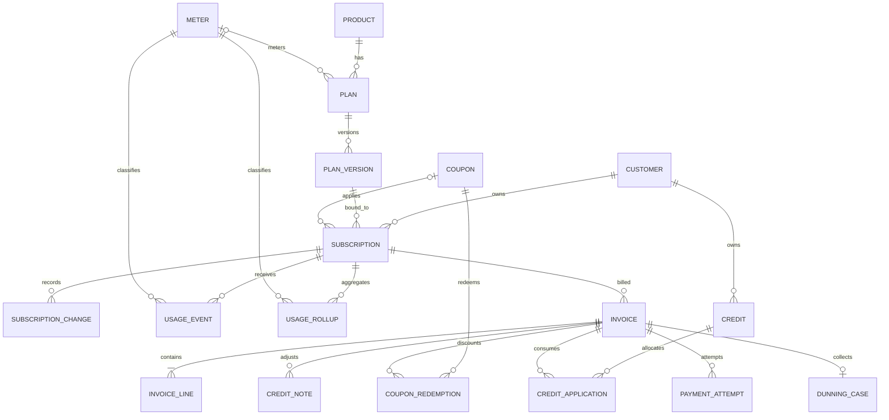

# Database Schema

SQLite is the default provider. `DateTimeOffset` properties are persisted as UTC ticks (`INTEGER`) so ordering and period comparisons execute correctly in SQLite. Money uses signed `INTEGER` minor units plus a three-letter currency.

## Entity relationship diagram

## Core tables

| Table | Primary key | Important columns |
|---|---|---|
| `products` | `id` | name, description, active, created |
| `plans` | `id` | product, interval unit/count, optional meter |
| `plan_versions` | `id` | plan, version, effective time, currency, serialized pricing, tax-inclusive |
| `meters` | `id` | aggregation mode, unit, rounding increment/mode |
| `customers` | `id` | fictional/customer name, currency, country, exempt/reverse-charge flags |
| `subscriptions` | `id` | exact plan-version ID, quantity, state, period, anchor, trial/cancel/suspension, coupon, concurrency version |
| `subscription_changes` | `id` | old/new version and quantity, change time, proration net/behavior |
| `pending_charges` | `id` | signed proration/one-off line waiting for invoice |
| `usage_events` | caller event ID | immutable quantity, occurrence, unique key, adjustment link, rollup period, disposition |
| `usage_rollups` | `id` | period, aggregate components, billable units, closed flag |
| `usage_unique_keys` | `id` | period-scoped unique-count membership |
| `invoices` | `id` | immutable number/period/financial totals, status, billing reason |
| `invoice_lines` | `id` | description, type, service span, signed minor amount, tax/revenue flags |
| `coupons` | `id` | type/value/duration/caps/redemption count |
| `coupon_redemptions` | `id` | coupon/subscription/invoice amount |
| `credits` | `id` | original/remaining balance, customer, currency, creation order |
| `credit_applications` | `id` | FIFO allocation to invoice |
| `credit_notes` | `id` | immutable adjustment number/amount/reason |
| `payment_attempts` | `id` | attempt number, classification, provider reference, time |
| `dunning_cases` | `id` | initial failure, attempt count, recovered/escalated, retry token |

## Reliability and security tables

| Table | Purpose |
|---|---|
| `webhook_nonces` | Inbound replay protection with expiry |
| `outbound_webhooks` | Persisted signed-delivery queue, retry count, next attempt, dead-letter state |
| `idempotency_records` | Method/path-scoped key, request hash, stored response, expiry |
| `audit_records` | Append-only actor/action/resource/time/correlation/source/state hash |
| `sequences` | Transactional sequential invoice and credit-note counters |
| `__EFMigrationsHistory` | Applied EF Core migrations |

## Unique constraints and indexes

| Constraint/index | Reason |
|---|---|
| `products(name)` unique | Catalogue identity |
| `plans(product_id, name)` unique | No ambiguous plan names per product |
| `plan_versions(plan_id, version)` unique | Monotonic version identity |
| `plan_versions(plan_id, effective_from)` unique | One effective change per instant |
| `meters(name)` unique | Stable meter lookup |
| `usage_events(event_id)` primary/unique | Ingestion idempotency |
| `usage_rollups(subscription_id, meter_id, period_start, period_end)` unique | One hot aggregate per meter period |
| `usage_unique_keys(subscription_id, meter_id, period_start, unique_key)` unique | Correct unique-count aggregation |
| `invoices(number)` unique | Immutable sequential public identifier |
| `invoices(subscription_id, period_start, period_end, billing_reason)` unique | Invoice-run idempotency |
| `coupons(code)` unique | Redemption identity |
| `coupon_redemptions(coupon_id, invoice_id)` unique | No duplicate invoice redemption |
| `credit_applications(credit_id, invoice_id)` unique | No repeated allocation |
| `payment_attempts(invoice_id, attempt_number)` unique | Retry evidence |
| `dunning_cases(invoice_id)` unique | One collection workflow per invoice |
| `webhook_nonces(nonce)` primary/unique | Replay rejection |
| `idempotency_records(key, route)` unique | Request replay winner |
| `outbound_webhooks(status, next_attempt_at)` | Due-work scan |
| `subscriptions(current_period_end)` | Invoice-run due scan |
| `subscriptions(customer_id, state)` | Customer lifecycle query |
| `usage_events(subscription_id, meter_id, occurred_at)` | Backfill/audit range query |

## Immutability

Application save guards reject modification/deletion of plan versions, usage events, audit rows, and credit notes. Invoice lines cannot be updated/deleted. Once an invoice leaves Draft, financial fields and number cannot change; lifecycle status may progress.

## Migration

`src\SubscriptionBilling.Infrastructure\Migrations` contains the generated initial migration and model snapshot. The API calls `MigrateAsync()` at startup. Tests keep an in-memory SQLite connection open for the host lifetime.
