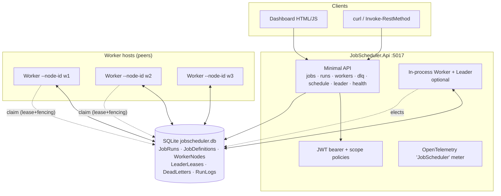
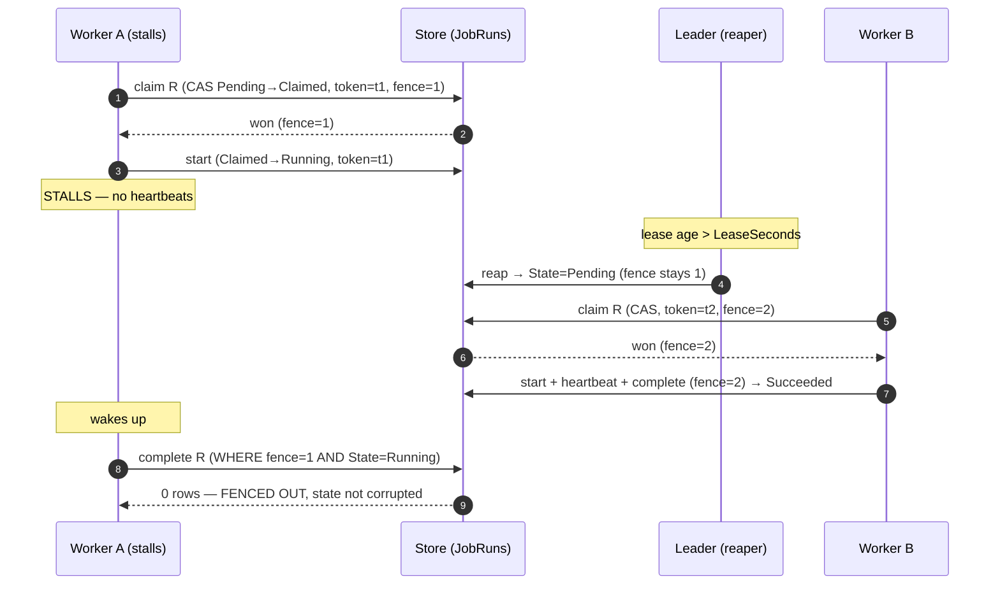
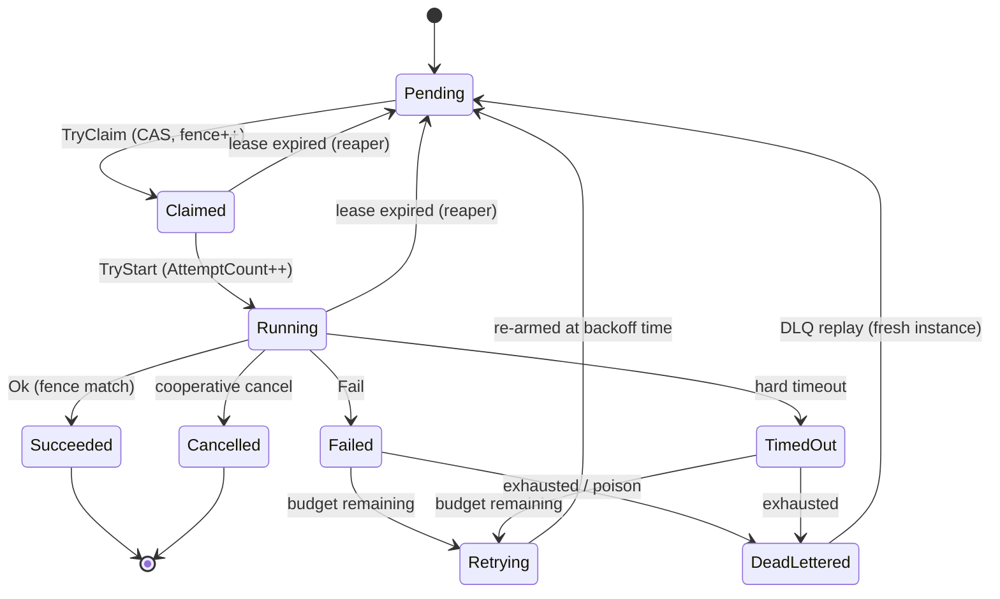
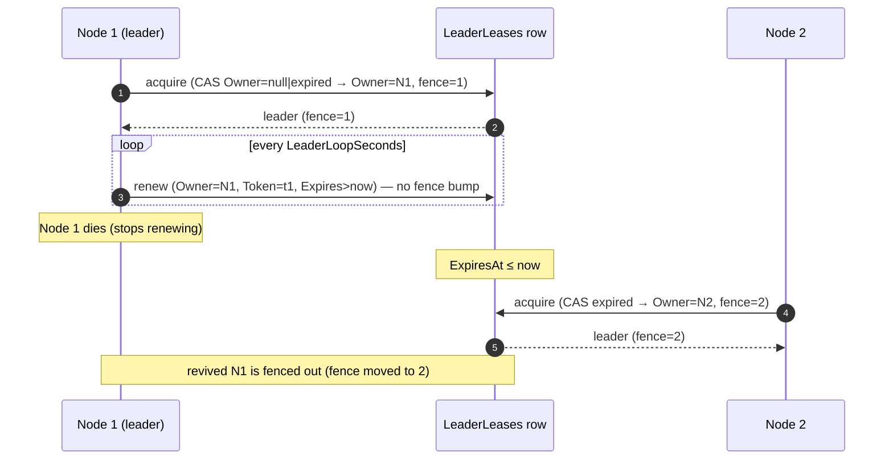

# Distributed Job Scheduler & Orchestrator

A multi-node job scheduler whose headline is **distributed coordination via lease + fencing tokens**
and **lease-based leader election** — built on .NET 10 and EF Core with **SQLite as the default
store and zero external infrastructure**. Multiple worker processes race to claim due jobs; exactly
one wins each claim; stalled workers are reclaimed and fenced out so they cannot corrupt state.

> Fictional operator: **Northstar Platform Team (fictional)** — running nightly ETL, report
> generation, data exports and cleanup jobs across several worker nodes. All demo data is fictional.

---

## Portfolio Classification

**Self-directed engineering case study.** This is a personal, portfolio-grade project built to
demonstrate senior/principal-level engineering on a genuinely hard problem — distributed work
coordination — under a strict *zero-infrastructure* constraint (it builds and its full test suite
passes with only the .NET SDK installed). It has no real users, clients, or production traffic; the
operator and data are fictional.

## Executive Summary

The system schedules and executes background jobs across multiple worker nodes with **at-least-once**
delivery and crash recovery, without relying on Redis/etcd/ZooKeeper or a message broker. The
correctness of "exactly one node runs this job right now, and a stalled node can never overwrite a
newer node's result" comes from an explicit **lease + monotonic fencing-token protocol** implemented
as atomic compare-and-set updates, not from database row locks. It includes a real hand-written cron
parser with timezone/DST handling, misfire policies, retries with backoff and dead-lettering, a
per-job circuit breaker, hard timeouts with cooperative cancellation, concurrency and singleton
controls, DAG dependencies, priority scheduling with aging, a worker registry with drain/dead-node
detection, a JWT-secured HTTP API with OpenTelemetry, and a utilitarian dashboard.

**Build & test status (real):** `dotnet build -c Release` → 0 warnings / 0 errors;
`dotnet test -c Release` → **186 passed, 0 failed, 0 skipped** (155 unit + 31 integration). See
[`docs/test-results.md`](docs/test-results.md).

## Business Problem

Operations teams run recurring and on-demand background work — ETL, report generation, exports,
retention cleanup — that must be **reliable** (a crashed worker must not lose or duplicate a job),
**timely** (respect cron schedules across timezones and DST), and **fair** (one noisy job type must
not starve everything else). Off-the-shelf answers (Quartz clusters, Hangfire, cloud schedulers,
Airflow) each bring operational weight or vendor lock-in. This project explores how far you can get
with a **database as the source of truth** and a rigorously-correct coordination protocol — the same
pattern that underpins production systems using Postgres `SKIP LOCKED` or etcd leases — while keeping
local development and CI free of any external service.

## Functional Requirements

- **Job definitions:** name, handler type (allow-listed), typed JSON payload, queue/priority,
  concurrency limit, max attempts, retry policy, timeout, deadline, tags, enabled flag, owner.
- **Triggers:** one-off (`runAt`), recurring **cron** (5/6-field, ranges, steps, lists, names,
  `L`/`#`, Vixie OR rule), fixed-interval, and manual; full **timezone + DST** handling; **misfire
  policies** (`FireNow`, `SkipToNext`, `RunAllMissed` with cap) + catch-up window.
- **Runs (instances):** state machine `Pending → Claimed → Running → Succeeded | Failed | Retrying |
  TimedOut | Cancelled | DeadLettered`; attempt counter; scheduled/started/finished times; node id;
  lease token; fencing token; output/error; structured logs.
- **Lease-based ownership:** atomic claim, heartbeat to extend, reclaim on expiry, **fencing-token
  rejection** of stale writes; at-least-once + idempotency keys.
- **Leader election:** lease-based single leader for singleton duties (materialisation, reaping,
  retention); failover within TTL; split-brain avoided by fencing.
- **Retries & backoff:** fixed / exponential / exponential-jitter / capped; poison detection;
  dead-letter queue with **replay**; per-definition circuit breaker / retry budget.
- **Timeouts & cancellation:** hard per-run timeout via `CancellationToken`; cooperative cancel API.
- **Concurrency:** global, per-definition, per-queue slots; **singleton** jobs; **DAG** dependency
  chains with cycle detection and fan-in/fan-out.
- **Priority + fairness:** priority queues with **aging** to prevent starvation.
- **Worker registry:** registration, heartbeat, tags/capabilities matching, graceful drain, dead-node
  detection.
- **History & API:** per-run logs, attempt history, retention/pruning, searchable API; dashboard.

## Non-Functional Requirements

- **Zero-infra:** builds and tests with only the .NET SDK; SQLite default; API on port **5017**.
- **Correctness under contention:** proven with concurrent claim-race, reclaim, and fencing tests
  against real file-backed SQLite, all bounded by hard `CancellationTokenSource` timeouts so the
  suite always terminates.
- **Determinism:** all time via `IClock`; a `FakeClock` drives lease/retention/DST tests.
- **Portability:** the coordination protocol maps 1:1 onto Postgres `SKIP LOCKED` / Redis / etcd.
- **Security:** JWT + least-privilege scopes; no arbitrary code execution from payloads.
- **Observability:** OpenTelemetry metrics + tracing; correlation ids threaded into run logs.

## Architecture

A **modular monolith** with clean/hexagonal layering plus a separate worker host. `Domain` has no
infrastructure dependencies; `Application` defines the port interfaces and time-independent policy;
`Infrastructure` implements the ports with EF Core and hosts the engine; `Api` and `Worker` are thin
hosts over one composition root (`AddSchedulerCore`). Nodes share **no** in-memory state — they
coordinate only through the store. Full detail in
[`docs/architecture/architecture.md`](docs/architecture/architecture.md).

```
Domain  ◀─  Application  ◀─  Infrastructure  ◀─  Api
                                    ▲
                                    └────────────  Worker
```

## Architecture Diagram

Scheduler architecture with multiple workers (container view):



Claim / lease sequence **with fencing** (the failure case — a stalled worker is fenced out):



Run state diagram:



Leader election sequence (failover + fencing bump on takeover):



## Technology Stack

| Concern | Choice |
|---|---|
| Runtime / language | .NET 10 (`net10.0`), C# |
| Web | ASP.NET Core Minimal APIs |
| Persistence | EF Core 10 + **SQLite** (default); Postgres-ready |
| AuthN/Z | JWT bearer + scope-based authorization policies |
| Observability | OpenTelemetry (metrics + tracing), custom `JobScheduler` meter |
| Scheduling | Hand-written cron parser + `TimeZoneInfo` DST engine |
| Testing | xUnit (plain `Assert`), `WebApplicationFactory`, file-SQLite contention, `FakeClock` |
| Hosts | `JobScheduler.Api` (HTTP) + `JobScheduler.Worker` (headless) |

## Domain Model

Entities (all state transitions guarded by `RunStateMachine`; all times UTC via `IClock`):

- **`JobDefinition`** — the template: handler type, payload, trigger config, retry/timeout/concurrency
  policy, tags, DAG edges (`DependsOn`), enabled flag.
- **`JobRun`** — one execution instance: state, attempt count, schedule/lease fields, **fencing
  token**, idempotency key, correlation id, output/error.
- **`WorkerNode`** — a registered worker: status (`Active`/`Draining`/`Dead`), tags, heartbeat.
- **`LeaderLease`** — the single election row: owner, token, fencing token, TTL.
- **`DeadLetterEntry`** — a parked, exhausted run + replay bookkeeping.
- **`RunLog`** — append-only structured log line stamped with correlation id + node id.

See [`docs/database-schema.md`](docs/database-schema.md) for the ER diagram and indexes.

## Core Workflows

1. **Materialise → claim → execute → complete.** The leader materialises due occurrences
   (idempotency-keyed); workers poll the due-scan, atomically claim, start, heartbeat, run the
   handler under a hard timeout, then write back guarded by the fencing token. Diagrammed above and
   in [`docs/coordination-protocol.md`](docs/coordination-protocol.md).
2. **Stall & reclaim.** A stalled worker's lease expires; the reaper returns the run to `Pending`;
   another worker reclaims and completes it; the original's late write is fenced out.
3. **Retry → dead-letter → replay.** A failed run is re-armed with backoff until the attempt budget
   is exhausted, then dead-lettered; an operator replays it as a fresh instance.
4. **DAG progression.** On success, `DagOrchestrator` enqueues now-eligible dependents (fan-out);
   fan-in waits until all predecessors succeeded in the workflow instance.

## Security Model

- **JWT bearer** with four least-privilege scopes: `jobs:read`, `jobs:trigger`, `jobs:manage`,
  `jobs:admin`. Each endpoint pins the minimum policy; 401 unauthenticated, 403 insufficient scope.
- **No arbitrary code execution from payloads.** Handlers are a fixed **allow-list**
  (`report-generator`, `csv-transform`, `cleanup`, `flaky`, `slow`); an unregistered handler type is
  rejected at create time. Payloads are inert JSON data.
- **Startup guard:** refuses to run in `Production` with the default signing key; the dev token
  endpoint is disabled in `Production`.
- Rate limiting, ProblemDetails, security headers, and correlation ids on every request.

Full threat model (STRIDE + explicit non-claims) in
[`docs/security/security-review.md`](docs/security/security-review.md).

## Reliability & Failure Handling

- **At-least-once** execution with idempotency keys (ADR-004); crash/stall recovery via lease expiry
  + reclaim; **fencing tokens** prevent stale writes (ADR-001).
- **Retries** (fixed/exponential/jitter/capped) with **poison detection**, **dead-letter + replay**,
  and a **per-definition circuit breaker** so one failing job type cannot consume the fleet.
- **Hard timeouts** per run + **cooperative cancellation**; documented behaviour for uncooperative
  handlers (lease expiry → reclaim → fence).
- **Leader failover** within the TTL; **split-brain** avoided by fencing on takeover.
- **Graceful drain** and **dead-node detection** in the worker registry.

## Observability

OpenTelemetry meter **`JobScheduler`** exposes: `scheduler.claim.latency` (histogram, ms),
`scheduler.run.duration` (histogram, s, tagged by job + success), `scheduler.runs.claimed` (counter),
`scheduler.lease.expiries` (counter), `scheduler.leadership.changes` (counter),
`scheduler.queue.depth` and `scheduler.dlq.depth` (observable gauges). ASP.NET Core instrumentation
for traces; a console exporter can be toggled via `OpenTelemetry:ConsoleExporter`. **Correlation
ids** flow from the HTTP request into every `RunLog` for a triggered run.

## Testing Strategy

**186 tests, all passing** (155 unit + 31 integration), plain xUnit `Assert` (no FluentAssertions).

- **Unit (155):** cron parser exhaustively (fields, ranges, steps, lists, names, `L`/`#`, invalid
  expressions, next-N vs hand-computed UTC instants); DST spring-forward skip + fall-back repeat
  (`America/New_York`); misfire policies + catch-up; retry backoff sequences; run state machine; DAG
  validation + cycle detection; priority aging; fencing invariants; leader lease; worker node; retry
  decider; concurrency gate; circuit breaker; timezone resolver.
- **Integration (31)**, against **real file-backed SQLite** with WAL + busy-timeout so concurrent
  claims genuinely contend: N-worker **claim race → exactly one winner**; **singleton never doubles**;
  per-definition **concurrency cap** under load; heartbeat extends lease; **expired lease reclaimed +
  stale write fenced out**; reaper ignores valid leases; **hard timeout → dead-letter**; **cooperative
  cancel propagation**; retry→success and retry-budget→DLQ→**replay**; retention pruning with
  `FakeClock`; worker registry (register/heartbeat/reap/drain/tag-matching); **leader election**
  (single-leader, failover within TTL, fence bump); and API tests (401/403/400/409, health, token,
  create→trigger→list) via `WebApplicationFactory`.

Every concurrency test uses a hard `CancellationTokenSource` deadline so the suite always terminates.

## Local Development

Prerequisites: **.NET SDK 10** only.

```powershell
# from the repo root
dotnet build -c Release
dotnet test  -c Release          # 186 tests

# run the API (http://localhost:5017), Development environment
dotnet run --project src\JobScheduler.Api

# open the dashboard
start http://localhost:5017/
```

Run standalone worker nodes (each is a peer that claims through the shared DB):

```powershell
dotnet run --project src\JobScheduler.Worker -- --node-id w1 --tags etl,reports
dotnet run --project src\JobScheduler.Worker -- --node-id w2 --tags exports
```

Or run the whole reclaim demo (API + two workers + kill one + show reclaim):

```powershell
pwsh scripts\demo.ps1
```

Configuration lives in `src\JobScheduler.Api\appsettings.json` and can be overridden by environment
variables (see `.env.example`). Key knobs are under `Engine:` (lease/heartbeat/TTL/retention/circuit)
and `Node:` (`RunWorker`, `RunLeader`, `NodeId`, `Tags`).

## Running with Docker

A `Dockerfile` and `docker-compose.yml` (API + 3 workers, all sharing one SQLite volume) are provided
for illustration.

> **Docker configuration created but Docker is unavailable on the build host; the compose stack has
> not been started or verified.**

The intended usage (once on a Docker-capable host) would be:

```bash
docker compose up --build      # UNVERIFIED
```

## API Documentation

Base URL `http://localhost:5017`. OpenAPI document at `/openapi/v1.json`. All `/api/v1/*` endpoints
require a JWT (scopes noted); health endpoints are anonymous.

| Method & path | Scope | Purpose |
|---|---|---|
| `POST /api/v1/auth/token` | (dev only) | Issue a demo JWT (`{ subject, scopes }`) |
| `GET /api/v1/jobs` | `read` | List job definitions (paged) |
| `POST /api/v1/jobs` | `manage` | Create a definition |
| `PUT /api/v1/jobs/{id}` | `manage` | Update configuration |
| `POST /api/v1/jobs/{id}/enable` \| `/disable` | `manage` | Toggle enabled |
| `DELETE /api/v1/jobs/{id}` | `manage` | Delete a definition |
| `POST /api/v1/jobs/{id}/trigger` | `trigger` | Trigger a run now |
| `GET /api/v1/runs` | `read` | List runs (filter by state/def/correlation/search) |
| `GET /api/v1/runs/{id}` \| `/logs` | `read` | Run detail / structured logs |
| `POST /api/v1/runs/{id}/cancel` | `trigger` | Cooperative cancel |
| `GET /api/v1/workers` | `read` | Worker nodes + heartbeat age |
| `GET /api/v1/dlq` | `read` | Dead-letter queue |
| `POST /api/v1/dlq/{id}/replay` | `manage` | Replay a dead-lettered run |
| `GET /api/v1/schedule/upcoming` | `read` | Upcoming occurrences |
| `GET /api/v1/leader` | `read` | Current leader view |
| `GET /health/live` \| `/health/ready` | anon | Liveness / readiness |

## Example Usage

```powershell
# 1) Get a token (Development/Testing only)
$tok = (Invoke-RestMethod -Method Post http://localhost:5017/api/v1/auth/token `
  -ContentType application/json `
  -Body '{"subject":"demo","scopes":["jobs:read","jobs:manage","jobs:trigger"]}').accessToken
$H = @{ Authorization = "Bearer $tok" }

# 2) Create a job definition (report generator, manual trigger)
$def = Invoke-RestMethod -Method Post http://localhost:5017/api/v1/jobs -Headers $H `
  -ContentType application/json -Body '{
    "name":"nightly-report","handlerType":"report-generator",
    "payloadJson":"{\"rows\":500}","priority":5,"maxAttempts":3,"timeoutSeconds":30
  }'

# 3) Trigger it
$run = Invoke-RestMethod -Method Post "http://localhost:5017/api/v1/jobs/$($def.id)/trigger" -Headers $H `
  -ContentType application/json -Body '{}'
"$($run.id) -> $($run.state)"      # e.g. ... -> Pending

# 4) Watch it complete (a worker claims, runs, completes)
Invoke-RestMethod "http://localhost:5017/api/v1/runs/$($run.id)" -Headers $H | Select id,state,attemptCount,fencingToken

# 5) Inspect the leader
Invoke-RestMethod http://localhost:5017/api/v1/leader -Headers $H
```

```bash
# curl equivalents
TOKEN=$(curl -s -X POST http://localhost:5017/api/v1/auth/token \
  -H 'content-type: application/json' \
  -d '{"subject":"demo","scopes":["jobs:read","jobs:trigger","jobs:manage"]}' | jq -r .accessToken)

curl -s http://localhost:5017/api/v1/runs -H "authorization: Bearer $TOKEN" | jq '.totalCount'
curl -s http://localhost:5017/health/ready | jq
```

Unauthenticated requests to `/api/v1/*` return **401**; a token missing the required scope returns
**403**; malformed input returns **400** with a ProblemDetails body.

## Performance / Load Testing

Formal load testing was **not** performed (this is a correctness-focused case study, and the default
SQLite store is deliberately single-writer). What *is* measured and exercised:

- The integration suite runs **N=12–16 workers** genuinely contending for the same rows on real
  file-backed SQLite and asserts exactly-one-winner semantics — a correctness load test.
- `scheduler.claim.latency` and `scheduler.run.duration` histograms are emitted for real
  measurement under any load a user cares to apply.
- **Honest ceiling:** throughput is bounded by SQLite's single writer (hundreds–low-thousands of
  claims/sec locally). The documented production path is Postgres with `SELECT … FOR UPDATE SKIP
  LOCKED` (ADR-002) for writer parallelism, or a broker if push-based fan-out is needed. Adding a
  BenchmarkDotNet harness for the claim path is listed under Future Improvements.

## Trade-offs

- **DB-as-queue vs broker:** one durable source of truth and trivial local dev, at the cost of a
  throughput ceiling and poll latency (ADR-002).
- **SQLite default vs Postgres:** zero-infra and instructive (forces explicit coordination) vs
  single-writer throughput; the protocol is identical either way.
- **At-least-once vs exactly-once:** recoverable and simple, but handlers must be idempotent
  (ADR-004).
- **Hand-written cron vs a library:** full control and testability vs code we must maintain (ADR-003).
- **Static DAG vs workflow engine:** covers the common cases with a small surface, but no conditional
  branching or data passing (ADR-005).
- **`EnsureCreated` vs migrations:** friction-free demo vs versioned schema evolution (documented).

## Architecture Decisions

Full ADRs in [`docs/decisions/`](docs/decisions):

1. [ADR-001](docs/decisions/ADR-001-lease-fencing-vs-distributed-lock.md) — Lease + fencing vs a
   distributed lock service.
2. [ADR-002](docs/decisions/ADR-002-db-as-queue-skip-locked.md) — DB-as-queue trade-offs and the
   `SKIP LOCKED` mapping.
3. [ADR-003](docs/decisions/ADR-003-cron-timezone-dst.md) — Cron / timezone / DST strategy.
4. [ADR-004](docs/decisions/ADR-004-at-least-once-idempotent-handlers.md) — At-least-once +
   idempotent handlers.
5. [ADR-005](docs/decisions/ADR-005-dag-support-scope.md) — DAG support scope.

## Known Limitations

- **Single-writer store by default.** SQLite serialises writers; throughput is bounded (by design).
- **Polling, not push.** Workers poll the due-scan (`PollSeconds`); there is added latency vs a
  push broker.
- **`EnsureCreated`, not migrations.** No versioned schema evolution out of the box.
- **Static DAGs only.** No conditional branching, data passing, or sub-workflows.
- **Dev token endpoint.** Not an IdP; must be replaced in production.
- **Clock-based leases.** Rely on reasonably-synced clocks; production should use a single DB clock.
- **No multi-tenancy / RBAC beyond four scopes.**
- **Docker is unverified** on this build host.

## Future Improvements

- Postgres provider with `SELECT … FOR UPDATE SKIP LOCKED` and `LISTEN/NOTIFY` wakeups.
- EF Core migrations; schema versioning.
- BenchmarkDotNet harness for claim throughput and latency percentiles.
- Push-based worker wakeups; adaptive polling.
- Richer DAG (conditional edges, data passing) if a real workflow need arises.
- OTLP exporter wiring + dashboards; PII scrubbing in logs.
- Real IdP integration and per-tenant authorization.

## Portfolio Talking Points

- **Why a fencing token, not just a lock:** a lease/lock cannot make a *stalled-then-resumed* worker
  safe; only a monotonic token compared at write-back time can. This project proves the exact
  failure sequence with a test.
- **Correctness from protocol, not isolation level:** demonstrated deliberately on a single-writer
  store, then mapped to `SKIP LOCKED`/Redis/etcd.
- **Leader election + split-brain avoidance** with the same one-row lease pattern.
- **DST done properly:** skipped and repeated local times tested against a real transition.
- **Testing concurrency deterministically:** `FakeClock` + real file-SQLite contention + hard
  `CancellationTokenSource` deadlines so the suite is both realistic and always-terminating.

See [`docs/portfolio/interview-talking-points.md`](docs/portfolio/interview-talking-points.md).

## Upwork Portfolio Description

Reliable multi-worker job scheduling with **no single point of failure in the work-claiming path** —
built on .NET 10 and EF Core, running anywhere the .NET SDK runs, with a production-ready path to
PostgreSQL. Cron with real timezone/DST handling, retries with dead-lettering and replay, hard
timeouts and cancellation, DAG dependencies, priority fairness, a JWT-secured API with OpenTelemetry,
and a live dashboard. **186 automated tests pass** with zero external infrastructure. A self-directed
engineering case study; demo data is fictional. Full description in
[`docs/portfolio/upwork-description.md`](docs/portfolio/upwork-description.md).
