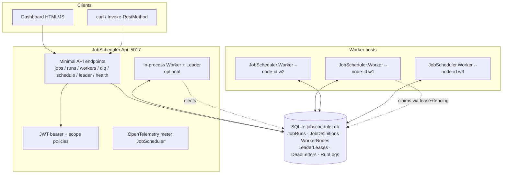
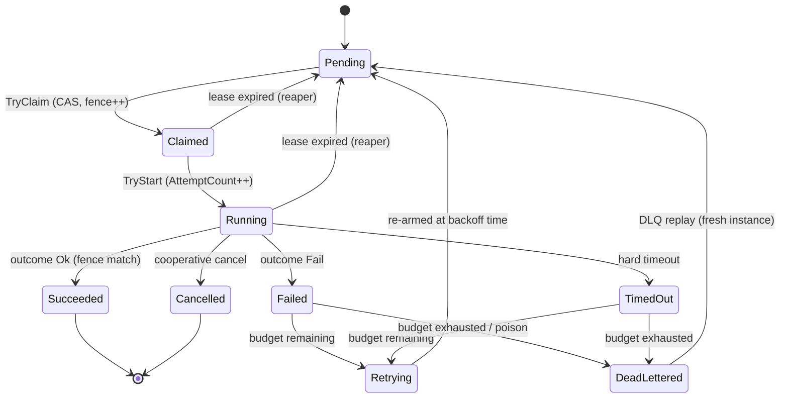

# Architecture

## Overview

The Distributed Job Scheduler is a **modular monolith** with clean/hexagonal layering, plus a
separate worker host. One codebase produces two runnable processes (API and Worker) that coordinate
only through the shared store — there is no in-memory shared state between nodes.

```
JobScheduler.Domain          (entities, state machine, cron, timezone, retry/DAG/priority math — no infra deps)
      ▲
JobScheduler.Application      (port interfaces: IJobRunStore, ILeaderElectionStore, IWorkerRegistry,
      ▲                        IHandlerRegistry, ISchedulerMetrics, IClock; services: RetryDecider,
      │                        ConcurrencyGate, DagOrchestrator, SchedulerMaterializer; options)
JobScheduler.Infrastructure   (EF Core + SQLite stores, RunExecutor, WorkerService, LeaderService,
      ▲                        HandlerRegistry + sample handlers, metrics, DI composition root)
      ├─────────────▲
JobScheduler.Api              JobScheduler.Worker
(HTTP, auth, OTel,            (headless worker+leader host,
 dashboard, health)           `--node-id`, `--tags`)
```

- **Domain** depends on nothing. All time comes from `IClock` (never `DateTime.UtcNow`).
- **Application** defines the ports and time-independent policy. It never references EF Core.
- **Infrastructure** implements the ports with EF Core, and hosts the engine (`WorkerService`,
  `LeaderService`, `RunExecutor`).
- **Api** and **Worker** are thin hosts over the same `AddSchedulerCore` composition root.

See [`../coordination-protocol.md`](../coordination-protocol.md) for the protocol,
[`../database-schema.md`](../database-schema.md) for the schema, and the ADRs in
[`../decisions/`](../decisions) for the rationale.

---

## Container view



All nodes are peers competing for work through conditional updates on `JobRuns`; exactly one node
holds the `LeaderLeases` lease and performs singleton duties (schedule materialisation, reaping,
retention).

---

## Headline flow — claim, execute, complete (with reclaim)

The signature sequence: due-detection → atomic claim → start → heartbeated execution →
fencing-guarded completion, and what happens when the worker stalls.

```mermaid
sequenceDiagram
    autonumber
    participant SCH as Leader (materialiser)
    participant DB as Store (JobRuns)
    participant WK as Worker loop
    participant EX as RunExecutor
    participant H as Handler (allow-listed)

    SCH->>DB: materialise due occurrences (idempotency-keyed)
    loop poll every PollSeconds
        WK->>DB: GetDue (State=Pending, ScheduledAt<=now, priority+aging)
        DB-->>WK: candidate run R
        WK->>DB: TryClaim(R) — CAS Pending→Claimed, token=t, fence+1
        alt won
            DB-->>WK: Claimed (fence=f)
            WK->>EX: ExecuteAsync(R, token=t, fence=f)
            EX->>DB: TryStart — Claimed→Running, AttemptCount++
            par heartbeat loop (own scope)
                EX->>DB: Heartbeat — extend lease while token owns it
            and handler
                EX->>H: ExecuteAsync(ctx, linkedCancellationToken)
                H-->>EX: HandlerOutcome (Ok/Fail) or throws on timeout/cancel
            end
            EX->>DB: TryComplete(fence=f, State=Running) → Succeeded/Failed
            alt fenced out (0 rows)
                Note over EX,DB: superseded by a reclaim — result discarded
            else committed
                DB-->>EX: 1 row; on fail → retry or dead-letter
            end
        else lost
            DB-->>WK: 0 rows — another node won; move on
        end
    end
```

The failure/reclaim variant (stalled worker fenced out on write-back) is diagrammed and proven in
[`../coordination-protocol.md` §7](../coordination-protocol.md#7-the-failure-case-proven).

---

## Run state diagram



---

## Key components

| Component | Layer | Responsibility |
|---|---|---|
| `JobRun`, `JobDefinition`, `WorkerNode`, `LeaderLease`, `DeadLetterEntry`, `RunLog` | Domain | Entities; all transitions guarded by `RunStateMachine`. |
| `CronExpression`, `TriggerSchedule`, `TimeZoneResolver` | Domain | Cron parsing + next-occurrence with DST/misfire handling. |
| `RetryPolicy`, `RetryDecider`, `PriorityScheduler`, `DagValidator` | Domain/App | Backoff math, aging, topological ordering + cycle detection. |
| `JobRunStore`, `LeaderElectionStore`, `WorkerRegistry`, `DeadLetterStore`, `RunLogStore` | Infra | Atomic compare-and-set coordination via `ExecuteUpdateAsync`. |
| `RunExecutor` | Infra | Per-run timeout, heartbeat loop, fencing-guarded write-back, retry/DLQ decision. |
| `WorkerService`, `LeaderService` | Infra | Background hosts: claim/execute loop; election + singleton duties. |
| `HandlerRegistry` + sample handlers | Infra | The executable **allow-list**; payloads select a handler, never arbitrary code. |
| `SchedulerMetrics` | Infra | OpenTelemetry instruments. |
| Endpoints, `AuthSetup`, middleware, dashboard | Api | HTTP surface, JWT scopes, correlation ids, ProblemDetails, rate limiting. |

## Design decisions (index)

1. `ADR-001` — Lease + fencing vs a distributed lock service.
2. `ADR-002` — DB-as-queue trade-offs and the `SELECT … FOR UPDATE SKIP LOCKED` mapping.
3. `ADR-003` — Cron / timezone / DST strategy.
4. `ADR-004` — At-least-once + idempotent handlers.
5. `ADR-005` — DAG support scope.
