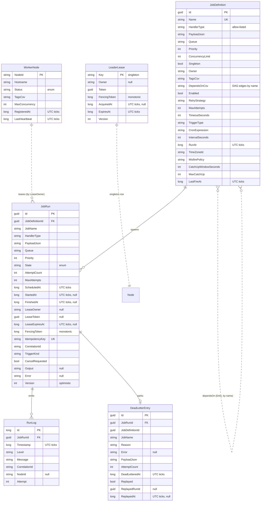

# Database Schema

The scheduler persists to a single relational database via EF Core 10. **SQLite is the default**
(zero-infrastructure); the schema and every query are written to port to PostgreSQL by changing only
the provider registration. Schema is created with `EnsureCreated()` on startup (a migration-based
flow is the documented production path — see [Notes](#notes)).

- `DateTimeOffset` values are stored as **UTC ticks (`long`)** via a value converter
  (`UtcTicksDateTimeOffsetConverter`). This is required because the EF Core SQLite provider cannot
  translate `DateTimeOffset` comparisons in `WHERE`/`ExecuteUpdate`, and it keeps all lease/schedule
  ordering monotonic. All times are UTC (the app never uses `DateTime.UtcNow`; it uses `IClock`).
- Enums are stored as **strings** (`HasConversion<string>()`) for readability and stability.

---

## ER diagram

---

## Tables, keys & indexes

### `JobDefinitions`
| Column | Type | Notes |
|---|---|---|
| `Id` | guid | **PK** |
| `Name` | string(200) | **Unique** |
| `HandlerType` | string(200) | Must resolve on the handler allow-list |
| `PayloadJson`, `Queue`, `Priority`, `ConcurrencyLimit`, `Singleton`, `Owner`, `TagsCsv`, `DependsOnCsv` | — | scheduling/config |
| `Enabled`, `RetryStrategy`, `MaxAttempts`, `TimeoutSeconds`, `DeadlineSeconds` | — | policy |
| `TriggerType`, `CronExpression`, `IntervalSeconds`, `RunAt`, `TimeZoneId`, `MisfirePolicy`, `CatchUpWindowSeconds`, `MaxCatchUp`, `LastFireAt` | — | trigger |

Indexes:
- `UNIQUE (Name)` — name is the human key and the DAG-edge key.
- `(Enabled, TriggerType)` — the leader's schedule-materialisation scan (`ListEnabledScheduled`) filters exactly on these.

### `JobRuns` — the hot table
| Column | Type | Notes |
|---|---|---|
| `Id` | guid | **PK** |
| `State` | string(30) | enum; drives every scan |
| `ScheduledAt` | long (UTC ticks) | due-time |
| `LeaseOwner` / `LeaseToken` / `LeaseExpiresAt` | string / guid / long | the lease |
| `FencingToken` | long | monotonic; the safety property |
| `IdempotencyKey` | string(300) | **Unique** — dedupe guard |
| `Version` | int | optimistic-concurrency stamp |

**The indexes that make claiming efficient** (all in `JobRunConfiguration`):

| Index | Serves |
|---|---|
| `(State, ScheduledAt)` | **The claim hot path.** `GetDueAsync` = `WHERE State='Pending' AND ScheduledAt<=now ORDER BY Priority`. This composite index turns the due-scan into a range seek instead of a full-table scan — the single most important index in the system. |
| `(State, LeaseExpiresAt)` | The reaper: `WHERE State IN ('Claimed','Running') AND LeaseExpiresAt<=now`. |
| `(JobDefinitionId, State)` | Per-definition active counting (concurrency cap) and the singleton `NOT EXISTS` sub-query inside the claim. |
| `(Queue, State)` | Per-queue slot counting. |
| `(CorrelationId, JobName, State)` | DAG fan-in: "did job A succeed in this workflow instance?" |
| `UNIQUE (IdempotencyKey)` | At-least-once dedupe; prevents a double-materialised occurrence. |

> Why these matter under contention: workers poll the due-scan continuously. Without
> `(State, ScheduledAt)` every poll is O(rows); with it, each poll is O(due). The reaper and the
> concurrency/singleton checks are similarly bounded to the rows that actually matter.

### `WorkerNodes`
| Column | Type | Notes |
|---|---|---|
| `NodeId` | string(100) | **PK** |
| `Status` | string(20) | `Active` / `Draining` / `Dead` |
| `TagsCsv` | string(1000) | capability tags |
| `LastHeartbeat` | long (UTC ticks) | dead-node detection |

Index: `(LastHeartbeat)` — dead-node reap scan.

### `LeaderLeases`
Single-row table (`Key='leader'`). Holds `Owner`, `Token`, `FencingToken`, `AcquiredAt`,
`ExpiresAt`, `Version`. PK `(Key)`. The election CAS operates entirely on this one row.

### `DeadLetters`
| Column | Type | Notes |
|---|---|---|
| `Id` | guid | **PK** |
| `JobRunId` | guid | the parked run |
| `Reason`, `Error`, `PayloadJson`, `AttemptCount` | — | diagnostics |
| `Replayed`, `ReplayedRunId`, `ReplayedAt` | — | replay bookkeeping |

Indexes: `(Replayed, DeadLetteredAt)` — the DLQ listing (active first, newest first); `(JobRunId)`.

### `RunLogs`
Append-only structured log lines stamped with `CorrelationId` and `NodeId`. PK `(Id)` (identity).
Indexes: `(JobRunId, Timestamp)` — per-run log retrieval; `(Timestamp)` — retention pruning.

---

## Notes

- **Single-writer reality.** SQLite serialises writers; a `busy_timeout` + WAL journal
  (`SqlitePragmaInterceptor`) makes concurrent claim `UPDATE`s queue rather than throw
  `SQLITE_BUSY`. This is intentional: it demonstrates that coordination correctness comes from the
  protocol, not the store. On PostgreSQL the same claim uses `SELECT … FOR UPDATE SKIP LOCKED` for
  writer parallelism (see `ADR-002`).
- **`EnsureCreated` vs migrations.** The project uses `EnsureCreated()` for a friction-free,
  zero-infra demo. Production would use `dotnet ef migrations` for versioned schema evolution; the
  entity configurations here are migration-ready.
- **No raw SQL for coordination.** Every atomic operation is expressed as a single EF Core
  `ExecuteUpdateAsync`/`ExecuteDeleteAsync`, so the provider emits one guarded statement — the
  compare-and-set primitive the protocol depends on.
