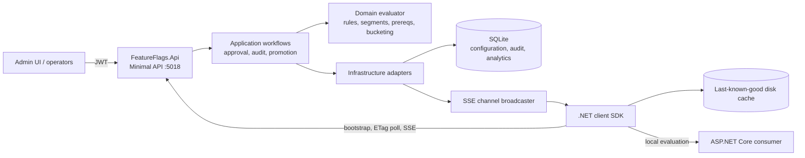

# Feature Flag & Dynamic Configuration Service

## Portfolio Classification
Self-directed engineering case study. This is a production-style reference implementation of a LaunchDarkly/Unleash-style control plane and a .NET client SDK; it is not client work or a claim of production deployment.

## Executive Summary
Feature Flags separates deployment from release. The API stores project/environment-specific flag configuration in SQLite, evaluates targeting deterministically, audits every configuration mutation, and publishes changes over server-sent events (SSE). The companion SDK bootstraps once, evaluates locally on the request path, persists its last known good configuration, and falls back safely when disconnected.

## Business Problem
Teams need to release risky changes gradually, target cohorts, stop a harmful feature immediately, and know who changed a production rule. Remote evaluation on every request turns flagging into a dependency and latency risk. This project demonstrates a control plane that keeps governance centralized while SDK data planes remain fast and resilient.

## Functional Requirements
- Projects contain `dev`, `staging`, and `production` environments with distinct configuration and server/client SDK keys.
- Boolean, string, number, and JSON flags support arbitrary variations, off/default variations, fallback values, prerequisites, segments, rules, and percentage rollout.
- Evaluations return a value, variation index, and an explainable reason.
- Production configuration uses request/review/approve/apply four-eyes workflow; emergency kill switches bypass it with a distinct audit action.
- The service offers diff previews, promotion, immutable audit history/revert, exact unique-context analytics, experiment conversion summaries, stale-flag debt reporting, ETags, polling, SSE, and an admin page.

## Non-Functional Requirements
The default adapter is SQLite and tests run with in-memory SQLite, so no external infrastructure is required. Evaluations are local in the SDK; SHA-256 bucketing is deterministic across server and SDK; regex evaluation is input/pattern bounded with a timeout and non-backtracking mode. API state changes are auditable, authenticated, rate-limited, and served with correlation and security headers.

## Architecture
The solution is a modular monolith: `Domain` contains the pure evaluator; `Application` owns ports and workflows; `Infrastructure` implements SQLite, analytics, and SSE fan-out; `Api` hosts the control plane; `Sdk` references only the shared domain evaluator. This intentionally avoids a premature microservice split while preserving adapter boundaries.

## Architecture Diagram


## Technology Stack
.NET 10 / C#; ASP.NET Core Minimal APIs; Entity Framework Core 10 with SQLite; JWT bearer authentication; OpenTelemetry console tracing; SSE; xUnit; `WebApplicationFactory` with in-memory SQLite. The utilitarian admin page is dependency-free HTML/JavaScript.

## Domain Model
`EnvironmentConfiguration` is a versioned ruleset containing flags and reusable segments. A `FlagDefinition` owns typed variations, targeting constructs, a stable salt, lifecycle/schedule metadata, and prerequisite edges. `EvaluationContext` carries a stable key, kind, attributes, and private-attribute declarations. `EvaluationResult` contains `Value`, `VariationIndex`, and reason: `Off`, `TargetMatch`, `SegmentMatch`, `RuleMatch(index)`, `Fallthrough`, `PrerequisiteFailed`, or `Error(kind)`.

## Core Workflows
Evaluation is ordered and short-circuited deliberately:
```mermaid
flowchart TD
  Start[Evaluate flag/context] --> On{Effective on?\nkill switch + schedule}
  On -- No --> Off[Off variation / Off]
  On -- Yes --> Pre[Evaluate prerequisites]
  Pre -- unmet/cycle --> PF[Off variation / PrerequisiteFailed or Error]
  Pre -- met --> Target{Individual target?}
  Target -- yes --> TM[TargetMatch]
  Target -- no --> Segment{Reusable segment?}
  Segment -- yes --> SM[SegmentMatch]
  Segment -- no --> Rules{First matching rule?}
  Rules -- yes --> RM[RuleMatch(index)]
  Rules -- no --> Rollout{Stable bucket allocated?}
  Rollout -- yes --> FT[Allocated variation / Fallthrough]
  Rollout -- no --> Default[Fallthrough variation / Fallthrough]
```

Configuration delivery keeps the evaluation path independent of the control plane:
```mermaid
sequenceDiagram
  participant C as Consumer process
  participant S as SDK local cache
  participant A as API control plane
  C->>S: BoolVariation(context, default)
  S-->>C: local value + reason (no network)
  S->>A: GET config with X-Sdk-Key
  A-->>S: ruleset + ETag
  S->>A: GET SSE stream
  Admin->>A: save/approve/kill-switch change
  A->>A: persist audit + version; publish change
  A-->>S: event: config
  S->>A: conditional GET ruleset
  A-->>S: changed ruleset (or 304)
  S->>S: atomically replace cache and persist disk copy
```

## Security Model
Administrative APIs require JWT scope policies: `flags:read`, `flags:write`, and `flags:approve`. SDK configuration endpoints authenticate an environment-specific `X-Sdk-Key`; client keys receive only `ClientSide` flags, whereas server keys receive the complete environment ruleset. Private attributes stay in the SDK context and are never placed in buffered events. See [security review](docs/security/security-review.md).

## Reliability & Failure Handling
The SDK evaluates the last received ruleset synchronously and never calls the network per variation. It first loads its disk cache, attempts bootstrap, consumes SSE with exponential reconnect backoff, and polls as a fallback. If no cache/ruleset exists, typed variation methods return the caller default and `Error(ClientNotReady)` rather than throwing. Events batch in a bounded queue; transient failures requeue and overflow increments a visible drop counter.

## Observability
The API emits correlation IDs in `X-Correlation-Id`, scopes logs by correlation ID, exposes `/health/live` and `/health/ready`, configures ASP.NET Core OpenTelemetry console tracing, retains append-only audit records, and persists exact evaluation/unique-context metrics. The analytics implementation intentionally uses exact distinct context counts for this demonstration, not HyperLogLog.

## Testing Strategy
There are 72 automated tests: domain/operator behavior, rules and reasons, prerequisite cycles, FakeClock schedule behavior, typed variations, deterministic/uniform/sticky bucketing, a 10,000-key server-to-SDK parity fixture, SDK cache/event/ETag behavior, SQLite-backed workflows, auth/validation, client/server SDK-key exposure, environment promotion, and a connected SSE-to-SDK refresh. Real final output is recorded in [docs/test-results.md](docs/test-results.md).

## Local Development
```powershell
cd C:\Users\rukwaropaul\Downloads\DEV\Projects\18-feature-flag-service
dotnet build -c Release
dotnet test -c Release
dotnet run --project src\FeatureFlags.Api
# In another terminal:
dotnet run --project samples\DemoApp
```
The API is `http://localhost:5018`; the demo consumer is `http://localhost:5019`. Development startup seeds `Acme Manufacturing (fictional)` idempotently. Use `scripts\demo.ps1` for a guided flow.

## Running with Docker
Docker configuration created but Docker is unavailable on the build host; the compose stack has not been started or verified. The authored files use the API image and a mounted SQLite data directory only; Docker is not required for local build or test.

## API Documentation
OpenAPI is exposed at `/openapi/v1.json`; a lightweight documentation link lives at `/docs`. Major route groups are `/api/v1/projects`, `/api/v1/sdk`, `/api/v1/events`, and `/api/v1/analytics`. The browser UI at `/` obtains a development token only outside Production.

## Example Usage
```powershell
# Development-only token
$token = (Invoke-RestMethod -Method POST http://localhost:5018/api/v1/auth/token -ContentType 'application/json' -Body '{"actor":"operator-a","scopes":["flags:read","flags:write","flags:approve"]}').accessToken
$headers = @{ Authorization = "Bearer $token" }
Invoke-RestMethod http://localhost:5018/api/v1/projects/acme/environments/dev/flags -Headers $headers

# Local targeting preview returns value, variation index, and explanation.
Invoke-RestMethod -Method POST http://localhost:5018/api/v1/projects/acme/environments/dev/evaluate -Headers $headers -ContentType 'application/json' -Body '{"flagKey":"new-checkout","contextKey":"demo-user","attributes":{"country":"KE"}}'
# { "value": true, "variationIndex": 1, "reason": { "kind": "SegmentMatch" } }

# SDK bootstrap with a client key exposes no server-only JSON flags.
Invoke-WebRequest http://localhost:5018/api/v1/sdk/config/acme/dev -Headers @{ 'X-Sdk-Key' = 'client-dev-acme-public-demo' }
```

## Performance / Load Testing
The repository does not claim a throughput benchmark. The actual bucketing distribution verification over 10,000 fixture keys is documented in [docs/bucketing-verification.md](docs/bucketing-verification.md). A future load test should measure API/SSE and SDK evaluation separately on recorded hardware.

## Trade-offs
Rulesets are persisted as versioned JSON snapshots rather than fully normalized rule tables, making atomic promotion/revert and SDK transport simple at the cost of SQL-level rule queries. Exact unique counts are accurate but grow with retained event rows; a production-scale deployment would use HyperLogLog or an analytics pipeline. SSE is lighter than WebSockets for one-way configuration updates but still needs polling fallback.

## Architecture Decisions
See [ADRs](docs/decisions/): local evaluation, SHA-256 bucketing/stickiness, SSE/polling, production approvals, and lifecycle debt management.

## Known Limitations
This reference implementation uses a single-process SSE broadcaster, development JWT issuer, demo SDK keys in seed data, SQLite snapshot storage, and no distributed event relay. A process restart requires SDK polling to observe missed updates. Audit records are append-only by application behavior, not an independently immutable store.

## Future Improvements
Add encrypted/rotated SDK-key hashes, OIDC/JWKS production authentication, per-flag database normalization/search, transactional outbox and distributed fan-out, rule schema/editor validation, HLL estimates, retention jobs, migrations, multi-region relay, and a production admin identity integration.

## Portfolio Talking Points
The difficult aspects are deterministic server/SDK parity, a stable rollout contract that remains sticky as percentages grow, explicit evaluation reasons, offline-safe SDK semantics, bounded event buffering, and governance that does not block an emergency kill switch. These are reliability and operational design choices rather than CRUD alone.

## Upwork Portfolio Description
Feature Flag & Dynamic Configuration Service — self-directed engineering case study

Problem: teams need safe progressive delivery and live configuration without inserting a remote dependency into every request. Built: a .NET 10 feature-flag control plane plus resilient local-evaluation SDK. Engineering focus: deterministic bucketing, SSE/polling consistency, offline cache, audit/revert, four-eyes production changes, and tested SQLite portability. Verification: 72 automated tests run locally. This is a self-directed portfolio project, not client work.
