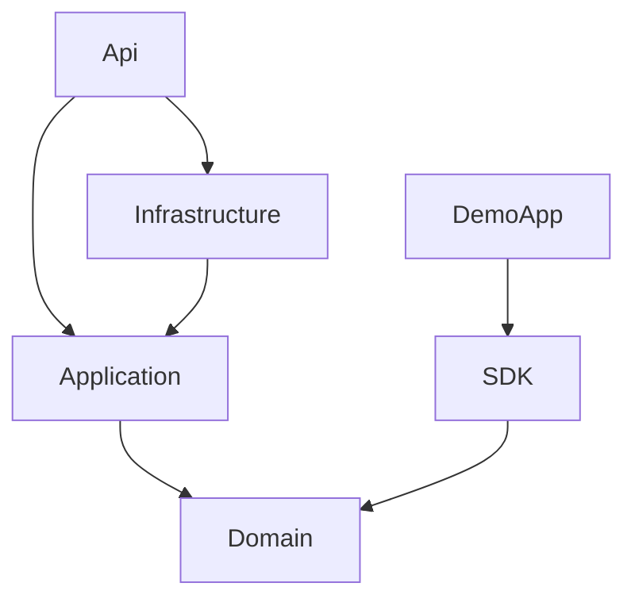
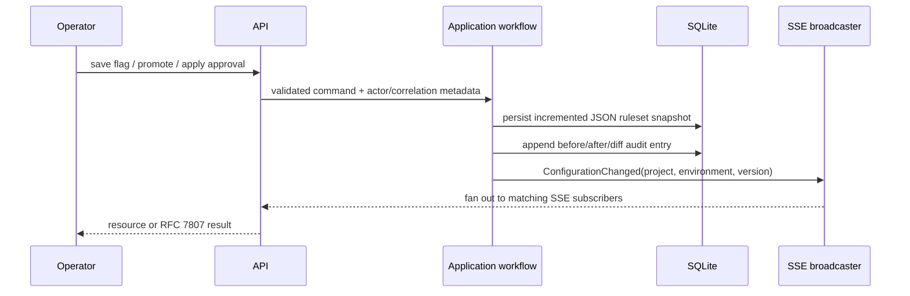

# Architecture — Feature Flag & Dynamic Configuration Service

## Modular boundaries

`Domain` is deliberately dependency-free and contains the shared evaluator/bucketer. `Application` owns time, persistence, analytics, approval, audit, and broadcast ports. `Infrastructure` supplies EF Core/SQLite stores and in-process channel broadcast. `Api` is the composition root. The SDK depends only on the domain contract, avoiding any server database or HTTP concern on the evaluation path.

## Configuration mutation sequence

## Evaluation invariant
The bucketing function is `SHA-256(UTF8(flagKey + "|" + salt + "|" + contextKey))`, interpreted as the first eight bytes in network (big-endian) order modulo 100,000. Allocations are contiguous lower ranges. Growing a first allocation from 10,000 to 20,000 basis points therefore preserves every key already below 10,000.
