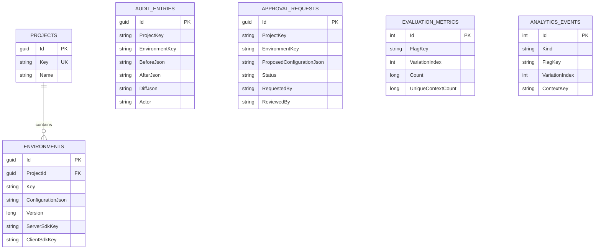

# Database Schema

SQLite is the default and only active adapter for this reference implementation. Configuration is a versioned JSON snapshot per environment so a promotion or revert is atomic; audit and analytics records remain queryable tables.

## Tables, keys, and indexes
| Table | Primary key | Purpose | Important indexes |
|---|---|---|---|
| `projects` | `Id` (GUID) | tenant-like project boundary | unique `Key` |
| `environments` | `Id` (GUID) | names, SDK keys, version, `ConfigurationJson` | unique (`ProjectId`,`Key`), unique server/client SDK keys |
| `audit_entries` | `Id` (GUID) | append-only before/after/diff record | (`ProjectKey`,`EnvironmentKey`,`OccurredAt`) |
| `approval_requests` | `Id` (GUID) | production proposed snapshot and review state | (`ProjectKey`,`EnvironmentKey`,`Status`) |
| `evaluation_metrics` | `Id` (integer) | per flag/variation count, exact unique contexts, last evaluation | unique (`ProjectKey`,`EnvironmentKey`,`FlagKey`,`VariationIndex`) |
| `analytics_events` | `Id` (integer) | evaluation/custom/conversion events | composite flag/variation/kind and `OccurredAt` |

## ER diagram

## Snapshot shape and concurrency
`ConfigurationJson` serializes `EnvironmentConfiguration`, including flags, variations, segments, rollout allocations, lifecycle/schedule fields, and prerequisite edges. A successful mutation increments `Version`, writes a new snapshot, appends an audit entry, and publishes `ConfigurationChanged`. This project does not yet expose an optimistic concurrency token to callers; a production API should require an `If-Match` version for independent editors.
