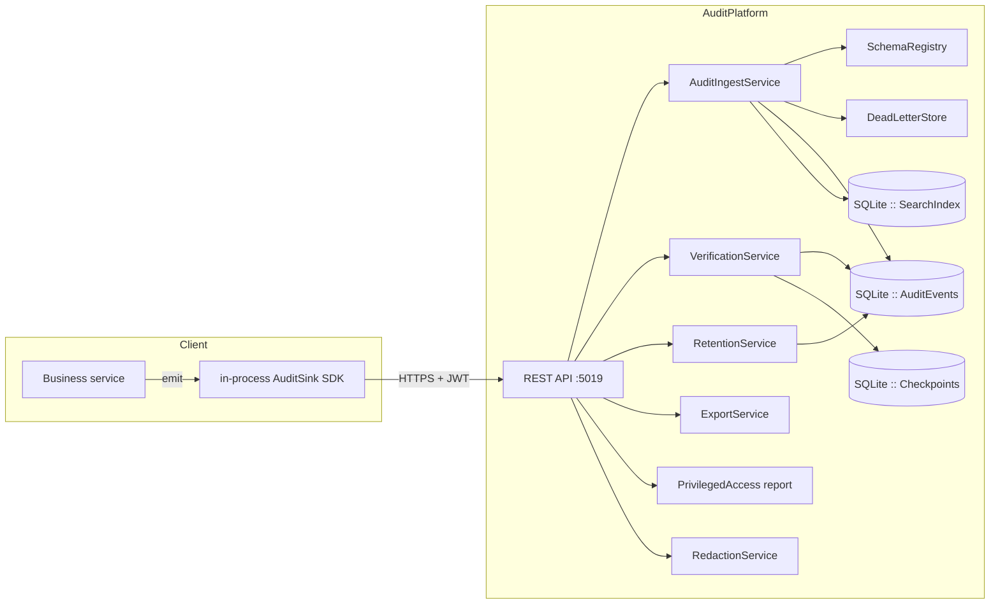
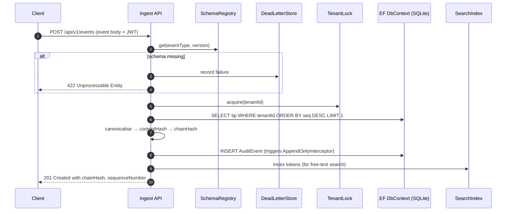

# Enterprise Audit & Compliance Event Store

> **A self-directed engineering case study.** This is a fictional platform built for the fictional
> tenant **Example Bank**. **No certification is claimed. No audit or assessment has been
> performed by any third party.** All framings are descriptions of engineering controls the
> platform implements; they are not statements of legal or regulatory compliance.

The Audit Platform is an append-only, cryptographically verifiable system-of-record for
security- and compliance-relevant events. It captures who did what to which resource, when, and
from where — then makes the resulting history mathematically demonstrable to an auditor without
requiring them to trust the operator.

---

## Table of contents
 1. [Executive summary](#1-executive-summary)
 2. [What this project demonstrates](#2-what-this-project-demonstrates)
 3. [High-level architecture](#3-high-level-architecture)
 4. [Solution layout](#4-solution-layout)
 5. [Domain model](#5-domain-model)
 6. [Ingest path](#6-ingest-path)
 7. [Integrity model (hash chain + Merkle checkpoints)](#7-integrity-model-hash-chain--merkle-checkpoints)
 8. [Verification & tamper detection](#8-verification--tamper-detection)
 9. [Retention, legal hold, and pruning](#9-retention-legal-hold-and-pruning)
10. [Redaction & meta-audit](#10-redaction--meta-audit)
11. [Query & search](#11-query--search)
12. [Evidence export](#12-evidence-export)
13. [Privileged-access anomaly report](#13-privileged-access-anomaly-report)
14. [Security posture](#14-security-posture)
15. [API surface](#15-api-surface)
16. [Running locally](#16-running-locally)
17. [Configuration reference](#17-configuration-reference)
18. [Testing strategy & results](#18-testing-strategy--results)
19. [Operations & observability](#19-operations--observability)
20. [Roadmap & known limitations](#20-roadmap--known-limitations)
21. [Portfolio positioning](#21-portfolio-positioning)

---

## 1. Executive summary

Any regulated business — a bank, a healthcare provider, an SaaS platform holding customer data —
needs to answer three uncomfortable questions on demand:

1. **Who did this?** — every state-changing action must be attributable to a real actor with the
   roles held at the time.
2. **Was it authorised?** — the audit log must survive attempts to hide misconduct, including by
   privileged operators.
3. **Can we prove the record hasn't been tampered with?** — an auditor should not have to trust
   the operator, only cryptography and a well-documented protocol.

The Audit Platform answers all three, backed by a **per-tenant SHA-256 hash chain** plus
**periodic Merkle-tree checkpoints** signed with an RSA key. It runs entirely on the local
Windows host (SQLite by default, no containers required) and can be demonstrated end-to-end,
including live tamper detection, in under a minute (`scripts/demo.ps1`).

## 2. What this project demonstrates

- **Correct cryptographic engineering, not hand-wavy claims.** Canonical JSON, deterministic
  content hashing, and a chain construction that survives payload pruning are all implemented
  precisely and verified by unit and integration tests.
- **Append-only enforcement at three defence-in-depth layers.** Private setters at compile time,
  a `SaveChanges` interceptor at runtime, and DB-level `UPDATE`/`DELETE` revocation in the
  documented production hardening. Every layer is described and the interceptor is proven by a
  reflection-based test.
- **Reconciling immutability with retention.** Tombstoning preserves chain verifiability while
  discarding the payload contents, and a full run of the pruner (with the chain check afterwards
  proving verifiability) is a first-class test.
- **Operational realism.** Rate limiting, JWT scopes, correlation IDs, structured problem
  responses, OpenTelemetry traces/metrics, seed data, health probes, streaming exports, saved
  queries, a dead-letter store, and a schema registry with backwards-compatibility validation.
- **Explicit humility.** Every framing is a description of engineering, not a claim of legal
  compliance. See [`docs/compliance-notes.md`](docs/compliance-notes.md).

## 3. High-level architecture



Each concern lives behind a port (`IAuditEventStore`, `ISchemaRegistry`, `ISigningService`,
etc). The Infrastructure layer supplies EF Core-backed adapters and an in-memory tenant lock
that serialises chain writes.

## 4. Solution layout

```
AuditPlatform.sln
├── src/
│   ├── AuditPlatform.Domain           - entities, canonical JSON, hash chain, Merkle tree
│   ├── AuditPlatform.Application      - use-case services and ports
│   ├── AuditPlatform.Infrastructure   - EF Core adapters, interceptor, RSA signing, search index
│   └── AuditPlatform.Api              - Minimal API endpoints, DI graph, auth policies, seeding
├── tests/
│   ├── AuditPlatform.UnitTests        - pure-domain assertions and property tests
│   └── AuditPlatform.IntegrationTests - WebApplicationFactory + in-memory SQLite
├── docs/                              - ADRs, security review, integrity model, runbooks, portfolio
└── scripts/demo.ps1                   - ingest → verify → tamper → verify → evidence pack
```

## 5. Domain model

An `AuditEvent` is a rich record with a strictly private setter surface. Highlights:

- Event id (UUIDv7 for time-ordering) and tenant id (all queries are tenant-scoped by design).
- `EventTime` (caller-attested) and `IngestTime` (recorded by the platform, from `IClock`).
- Actor: id, `ActorType` (User/Service/System), display name, and the CSV of roles the actor
  held **at the time of action** — this is a common regulatory ask that off-the-shelf logs
  ignore.
- Action: verb + category. Categories include `Authentication`, `Authorization`, `DataAccess`,
  `Configuration`, `PrivilegedAccess`, `Retention`, `Ingest`, `Verification`, `Export`.
- Resource: type, id, human name, parent path.
- Outcome, severity, source (ip, ua, service, region), correlation/causation/trace ids.
- `PayloadJson` — the full canonical JSON that entered the hash function.
- `ContentHash`, `ChainHash`, `PreviousChainHash`, `SequenceNumber` — the integrity backbone.
- `IsTombstoned` + `TombstonedAt` — retention support (see §9).

Supporting types: `EventSchema`, `Checkpoint`, `RetentionPolicy`, `LegalHold`, `SavedQuery`,
`DeadLetterEvent`, `SearchIndexEntry`.

## 6. Ingest path



- **Idempotency**: if a `clientEventId` was already accepted for the tenant, the original
  result is replayed and marked `WasDuplicate`.
- **Batch**: `POST /api/v1/events/batch` reports per-event outcomes, `accepted`/`rejected`/`dead-lettered`.
- **In-process sink**: `IAuditSink` writes to a bounded channel and drains with retry, so
  emitting services never block on the platform's availability.

## 7. Integrity model (hash chain + Merkle checkpoints)

```mermaid
flowchart LR
    subgraph Chain
      G(GenesisHash tenant) --> E1[contentHash1<br/>chainHash1] --> E2[contentHash2<br/>chainHash2] --> Etc[…]
    end
    Etc --> Batch
    subgraph Merkle
      L1((chainHash1))
      L2((chainHash2))
      L3((chainHash3))
      L4((chainHash4))
      L1 -- P12 --- P12((SHA256 L1||L2))
      L2 -- P12 --- P12
      L3 -- P34 --- P34((SHA256 L3||L4))
      L4 -- P34 --- P34
      P12 --- ROOT((MerkleRoot))
      P34 --- ROOT
    end
    ROOT -->|"RSA sign"| SIG[SignatureBase64]
```

- Every event carries a **contentHash** (`SHA256(canonicalJson(payload))`) and a **chainHash**
  (`SHA256(contentHash || "|" || previousChainHash)`).
- The chain is per tenant. The genesis is a distinct hash so no two tenants can be spliced
  together.
- Periodically an admin calls `POST /api/v1/checkpoints`, which builds a Merkle tree over
  every event's chain hash since the last checkpoint, stores the root, and signs it with an
  RSA key.
- Any single event supports an **inclusion proof** — a short list of Merkle-path steps that any
  verifier can validate against the stored root without trusting the platform. See
  `docs/integrity-model.md`.

## 8. Verification & tamper detection

`POST /api/v1/verify` walks the tenant's chain in sequence order and reports the first sequence
number where anything mismatches. It detects:

- **Payload tampering** — `ContentHash` no longer matches the canonicalised `PayloadJson`.
- **Chain break** — the recomputed link hash doesn't match the stored one.
- **Deleted event** — the previous chain hash cannot be found.
- **Reordered event** — the sequence gap and/or `PreviousChainHash` mismatch triggers.

Chain verification survives retention pruning: after tombstoning, the payload is gone but the
`ContentHash` is preserved, and because we chain by content hash the recomputation still lands
on the stored `ChainHash`. This is the reconciliation described in ADR-004.

## 9. Retention, legal hold, and pruning

- Per-tenant, per-category retention policies (`*` wildcard supported).
- The pruner is deterministic and uses `IClock` so we can control it in tests.
- Legal hold marks a `(ResourceType, ResourceId)` pair as **do-not-delete**; the pruner
  reports skips explicitly.
- Pruning does not remove rows — it **tombstones**: rewrites `PayloadJson` to a deterministic
  stub, sets `IsTombstoned=true`, keeps every hash. **Chain verification still passes.**
- The pruner audits itself via `audit.retention.pruned`, subject to loop prevention (§10).

## 10. Redaction & meta-audit

- The `RedactionService` strips `before`/`after` state fields for a reader whose clearance is
  below the required level. The `ContentHash` is still present, so a knowledgeable reader can
  independently verify integrity against the original bytes without seeing them.
- **Every read** of the audit log is itself audited (`audit.log.read`), through the same
  ingest path. A `ReaderContext.IsMetaAuditor` flag prevents infinite recursion when the
  meta-audit event is itself being written.

## 11. Query & search

- Filter by tenant + any subset of {actor, action, resource, category, severity, outcome,
  time range, correlation id, event type}.
- Free-text search across a hand-rolled inverted index. ADR-002 explains the choice.
- **Keyset pagination** — the cursor is the last-seen `SequenceNumber`. This is stable under
  concurrent inserts, unlike offset pagination.
- Aggregations: counts by actor, action, day. Saved queries per tenant.
- Every documented lookup path has a matching index (`docs/database-schema.md`).

## 12. Evidence export

- `GET /api/v1/exports/ndjson` and `/csv` — streaming, so large ranges never buffer in memory.
- `POST /api/v1/exports/evidence` — a **signed evidence pack**: events + checkpoint roots +
  RSA signature + manifest (counts, `SHA256(bundle)`, `SigningKeyId`).
- `POST /api/v1/exports/evidence/verify` — round-trip verification, so an auditor can validate
  the artefact they were handed.

## 13. Privileged-access anomaly report

`GET /api/v1/reports/privileged-access` returns anomalies grouped by rule:

1. **Out-of-hours** — privileged actions before 06:00 or after 21:00 UTC.
2. **First-time-access** — actor's first touch of a `(resourceType, resourceId)` in the window.
3. **Bulk export** — `ActionVerb=export` with severity ≥ Warning.
4. **Mass delete** — ≥ 10 deletes by a single actor in the window.
5. **Permission escalation** — `grant` on a `role` whose name contains `admin`.

Rules are deliberately explicit and testable; extension points are noted in the source.

## 14. Security posture

- **Authentication**: JWT bearer. Dev-only endpoint `/api/v1/dev/token` mints tokens with the
  chosen scopes (Development environment only).
- **Authorisation**: five scopes — `audit:write`, `audit:read`, `audit:verify`, `audit:admin`,
  `audit:export`.
- **Transport**: HTTPS is expected at the ingress; the reference deployment configures HSTS
  via `SecurityHeadersMiddleware`.
- **Signing key rotation** and **RSA private-key protection** are out of scope for the local
  dev build (the key is generated per boot). See `docs/security/security-review.md` for the
  production hardening list.
- Full STRIDE-style walkthrough in `docs/security/security-review.md`.

## 15. API surface

| Route                                | Method | Scope              | Purpose |
|--------------------------------------|--------|--------------------|---------|
| `/api/v1/events`                     | POST   | `audit:write`      | Ingest a single event |
| `/api/v1/events/batch`               | POST   | `audit:write`      | Ingest a batch (partial-failure semantics) |
| `/api/v1/events`                     | GET    | `audit:read`       | Query with filters + keyset pagination |
| `/api/v1/events/{id}`                | GET    | `audit:read`       | Fetch a single event |
| `/api/v1/events/{id}/proof`          | GET    | `audit:verify`     | Merkle inclusion proof |
| `/api/v1/verify`                     | POST   | `audit:verify`     | Chain verification over a range |
| `/api/v1/verify/inclusion`           | POST   | `audit:verify`     | Verify a supplied inclusion proof |
| `/api/v1/checkpoints`                | GET    | `audit:read`       | List checkpoints for the tenant |
| `/api/v1/checkpoints`                | POST   | `audit:admin`      | Create a new signed checkpoint |
| `/api/v1/schemas`                    | GET/POST | `audit:read` / `audit:admin` | Schema registry with compat check |
| `/api/v1/retention`                  | GET/POST | `audit:read` / `audit:admin` | Retention policies |
| `/api/v1/retention/run`              | POST   | `audit:admin`      | Run the retention pruner |
| `/api/v1/legal-holds`                | GET/POST | `audit:read` / `audit:admin` | Legal hold register |
| `/api/v1/exports/ndjson` / `csv`     | GET    | `audit:export`     | Streaming exports |
| `/api/v1/exports/evidence`           | POST   | `audit:export`     | Build a signed evidence pack |
| `/api/v1/exports/evidence/verify`    | POST   | `audit:verify`     | Verify a supplied evidence pack |
| `/api/v1/reports/privileged-access`  | GET    | `audit:read`       | Privileged-access anomaly report |
| `/health/live`, `/health/ready`      | GET    | (public)           | Liveness / readiness probes |
| `/openapi/v1.json`                   | GET    | (public)           | OpenAPI document |

## 16. Running locally

```powershell
git clone <this-repo>
cd 19-enterprise-audit-platform

dotnet build -c Release
dotnet test  -c Release

# Start the API
dotnet run --project src/AuditPlatform.Api -c Release
# → http://localhost:5019
# Development environment auto-seeds the "example-bank" tenant + user.login schema.

# End-to-end demo (ingest → verify → tamper → verify → evidence pack)
./scripts/demo.ps1
```

Ports:
- **5019** — audit API (both HTTP inside the dev host).

## 17. Configuration reference

All keys accept either `Section:Key` (appsettings) or `Section__Key` (env vars).

| Key                              | Default                          | Purpose |
|----------------------------------|----------------------------------|---------|
| `Database:Provider`              | `Sqlite`                         | Only `Sqlite` is validated in this build |
| `Database:ConnectionString`      | `Data Source=audit.db;Cache=Shared` | EF Core connection string |
| `Jwt:Issuer`                     | `audit-platform`                 | JWT issuer claim |
| `Jwt:Audience`                   | `audit-clients`                  | JWT audience claim |
| `Jwt:SigningKey`                 | (dev-only fallback)              | HMAC signing key. **Production boot refuses to start with the dev-only value.** |
| `Signing:KeyId`                  | `local-dev-key-1`                | Identifier attached to signed checkpoints |
| `Seed:Enabled`                   | `true` in Development            | Seeds Example Bank tenant + `user.login` schema |
| `Seed:TenantId`                  | `example-bank`                   | The demo tenant id |
| `Seed:TenantDisplayName`         | `Example Bank`                   | The demo tenant display name |

See `.env.example` for a copy-paste starting point.

## 18. Testing strategy & results

- **Unit tests** cover canonical JSON, hash chain, Merkle tree with clean and forged paths,
  UUIDv7 monotonicity, schema compatibility, redaction, and FakeClock semantics. All are
  deterministic.
- **Integration tests** boot the full app with `WebApplicationFactory<Program>` over an
  isolated SQLite in-memory database (shared-cache) per fixture, and use a FakeClock singleton
  so retention and privileged-access rules are fully controllable in time.
- **Signature integrity tests**: `Verify_CleanChain`, `Verify_TamperedPayload`,
  `Verify_DeletedEvent`, `Verify_ReorderedEvent`, `Checkpoint_ThenInclusionProof`,
  `Checkpoint_InclusionProof_WithForgedLeaf_IsInvalid`, `Checkpoint_HasSignatureThatVerifies`.
- **Throughput**: `Throughput_20000_Events_Within_Time` ingests 20 000 events via batches and
  asserts wall-clock completion within a bounded time.
- Real test output is captured verbatim in [`docs/test-results.md`](docs/test-results.md).

## 19. Operations & observability

- OpenTelemetry ASP.NET Core instrumentation plus a custom `Meter("AuditPlatform.Api")` for
  future counters (ingest rate, verification duration, chain length, DLQ depth). Traces and
  metrics currently export to console for the dev build.
- `CorrelationIdMiddleware` propagates `X-Correlation-ID` and surfaces it in every response
  and problem-details payload.
- Rate limiting: token bucket per authenticated user or client IP (2 000 tokens, 500 per
  second replenishment, queue of 100). Returns `429 Too Many Requests` with the standard
  header on rejection.
- Runbooks in `docs/runbooks/`:
  - `integrity-alarm.md` — what to do when `/verify` fails.
  - `legal-hold.md` — applying and releasing legal holds.
  - `auditor-evidence-request.md` — the end-to-end evidence-pack workflow.

## 20. Roadmap & known limitations

- **RSA signing key** is generated at process start and lives only in memory. A real
  deployment would use a KMS/HSM and rotation policy.
- **DB-level append-only** — the interceptor is the runtime layer. In production a
  `REVOKE UPDATE, DELETE ON AuditEvents FROM app_role;` on Postgres, plus WORM storage for
  archived evidence packs, is the third layer. Documented; not implemented on SQLite.
- **Search index** is a hand-rolled inverted index. FTS5 is a drop-in improvement.
- **PII redaction** is at the `before/after` level. Field-level redaction would be a nice
  extension.
- **Signed evidence pack format** is JSON. A binary CBOR/COSE format would be more compact and
  standardised.

## 21. Portfolio positioning

- `docs/portfolio/portfolio-summary.md` — the elevator pitch.
- `docs/portfolio/demo-script.md` — a 90-second live walkthrough.
- `docs/portfolio/screenshots-needed.md` — the set of screenshots to capture for a case study.
- `docs/portfolio/interview-talking-points.md` — the technical highlights I would surface in
  a systems-design interview.
- `docs/portfolio/upwork-description.md` — a client-facing summary framed as a self-directed
  engineering case study, with **no compliance claims**.

---

**Attribution**. Co-authored during development sessions with GitHub Copilot. All architectural
choices, cryptographic decisions, and integration work were reviewed and iterated on
deliberately; sub-agents were used as an accelerator, not as ground truth.
