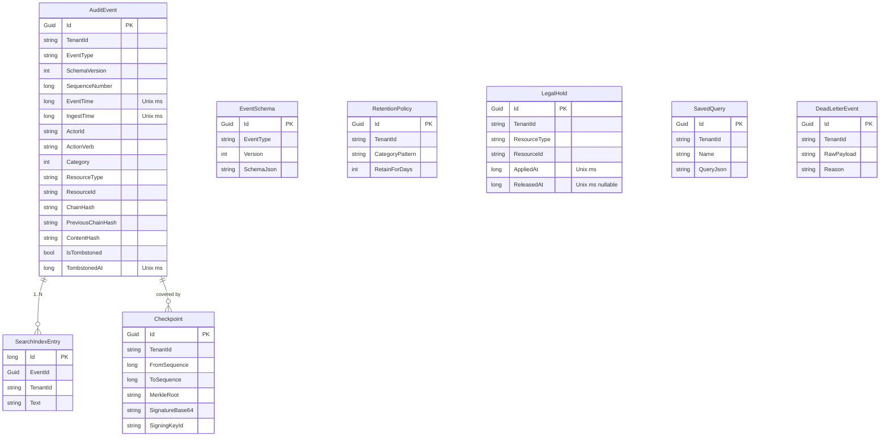

# Database schema

The audit platform uses SQLite by default. All tables are managed by EF Core; migrations were
not committed for the local dev build because `EnsureCreated()` produces the same schema
deterministically from the current model (this is documented in ADR-005 and worth swapping to
`Migrate()` before any production use).

## Entity–relationship diagram

## Indexes and rationale

| Table               | Columns                                   | Uniqueness | Rationale |
|---------------------|-------------------------------------------|------------|-----------|
| `AuditEvents`       | `TenantId, SequenceNumber`                | Unique     | The chain's fundamental invariant; every verification walk uses this order. |
| `AuditEvents`       | `TenantId, EventTime`                     | Non-unique | Time-range filters (evidence packs, retention, reports). |
| `AuditEvents`       | `TenantId, ActorId, EventTime`            | Non-unique | "What did actor X do between T1 and T2?" — one of the most common queries. |
| `AuditEvents`       | `TenantId, ResourceType, ResourceId`      | Non-unique | Resource-centric queries. |
| `AuditEvents`       | `TenantId, CorrelationId`                 | Non-unique | Recovering a distributed transaction across services. |
| `AuditEvents`       | `TenantId, Category, EventTime`           | Non-unique | Category-based dashboards and retention runs. |
| `AuditEvents`       | `TenantId, ClientEventId`                 | Unique (filtered) | Idempotency: reject/return duplicate at insert time. |
| `AuditEvents`       | `ChainHash`                               | Unique     | Sanity-check global uniqueness of the chain hash across all tenants. |
| `EventSchemas`      | `EventType, Version`                      | Unique     | One schema per (type, version). |
| `Checkpoints`       | `TenantId, FromSequence, ToSequence`      | Non-unique | Finding "the checkpoint covering sequence N" for a given tenant. |
| `RetentionPolicies` | `TenantId, CategoryPattern`               | Unique     | Prevent duplicate policies for the same category. |
| `LegalHolds`        | `TenantId, ResourceType, ResourceId`      | Non-unique | Fast pruning-time lookup: is this resource on hold? |
| `SavedQueries`      | `TenantId, Name`                          | Unique     | Named queries per tenant. |
| `DeadLetter`        | `TenantId, ReceivedAt`                    | Non-unique | Time-ordered ops view of quarantined events. |
| `SearchIndex`       | `TenantId, EventId`                       | Non-unique | Cross-reference tokens back to events. |

## Storage of `DateTimeOffset`

SQLite's LINQ provider cannot natively translate `DateTimeOffset` comparisons in some
scenarios (especially inside multi-predicate `Where` clauses on the retention path). We store
all `DateTimeOffset` columns as Unix milliseconds using a global
`DateTimeOffsetToLongConverter` (`AppDbContext.ConfigureConventions`). Ordering, ranges, and
equality all fold into integer SQL. Human display is reconstructed on materialisation.

## Referential integrity

The schema is deliberately flat: `AuditEvents` and `Checkpoints` are only loosely coupled by
`(TenantId, FromSequence, ToSequence)`. No FK constraints are declared because:

- The chain hash / Merkle root is the referential integrity for evidence.
- Deleting parent rows makes no sense (append-only).

## Future work

- **Migrations**: switch from `EnsureCreated` to `Migrate()` and check in the migration files.
- **FTS5**: replace the hand-rolled `SearchIndex` with `contentless FTS5` for large search
  workloads.
- **Partitioning**: for very large deployments, per-tenant table partitions or per-tenant
  schemas.
