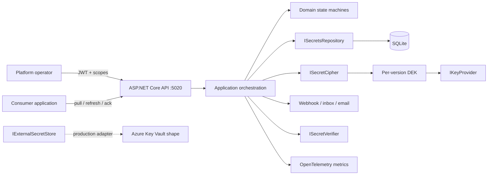
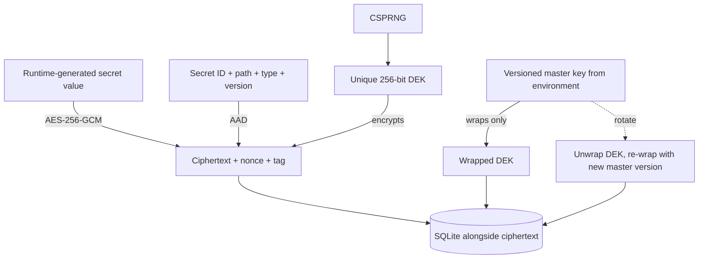

> [!CAUTION]
> **SAFETY DEMONSTRATION ONLY. No real credential belongs in this repository or its demo
> database. All demo secret material is generated at runtime or is explicitly named
> `demo-only-not-a-real-secret-*`. Replace every development key through environment
> configuration before any non-development use. Production startup rejects the bundled
> development master key.**

# Northstar Secrets Rotation & Credential Lifecycle Platform

## Portfolio Classification

**Self-directed engineering case study.** This is a production-style reference implementation,
not client work and not a claim that the system has operated in a real production environment.
The fictional operator is **Northstar Platform Engineering (fictional)** and the seeded inventory
represents 40 synthetic applications.

## Executive Summary

Northstar is a .NET 10 control plane for registering, encrypting, versioning, rotating, auditing,
and revoking application credentials. The central engineering problem is safe rotation
choreography: a persisted, resumable state machine coordinates generated material, consumer
notifications, acknowledgements, verification, promotion, and rollback.

The default runtime is a modular monolith backed by SQLite. It requires no cloud account,
container runtime, database server, or third-party endpoint. An Azure Key Vault-shaped adapter is
compile checked, but no Azure resources were provisioned.

## Business Problem

Credentials frequently outlive their owners, are copied directly into application configuration,
and fail during rushed rotations. A platform team needs an inventory, durable lifecycle, explicit
consumer coordination, separation of duties, emergency controls, and evidence of every value read.
The difficult failure modes are partial rollout, an unresponsive consumer, a bad replacement
credential, process interruption, notification spoofing, and compromised wrapping keys.

## Functional Requirements

- Register hierarchical names in `app/environment/purpose` form across eight secret types.
- Link secrets to applications/consumers and use versioned references such as
  `@secret:orders/prod/database#v3`.
- Encrypt each value with a unique AES-256-GCM data-encryption key (DEK).
- Bind ciphertext to secret identity, name, type, and version through authenticated associated
  data (AAD).
- Re-wrap DEKs during master-key rotation without re-encrypting values.
- Maintain `Pending`, `Current`, `Previous`, `Deprecated`, `Revoked`, and `Destroyed` versions.
- Run dual-write and maintenance-window single-cutover strategies through a durable state machine.
- Notify consumers, track acknowledgements, verify candidates, and roll back automatically.
- Schedule rotations using an injected clock, maximum age, grace period, and deterministic jitter.
- Support emergency revocation, application-wide incident rotation, and four-eyes approval.
- Enforce JWT scopes and path policies while auditing every attempted value read.
- Report upcoming expiry, per-secret access, anomalous access, and notification dead letters.

## Non-Functional Requirements

- `dotnet build -c Release` and `dotnet test -c Release` run without external infrastructure.
- SQLite is the default provider; tests use an open SQLite in-memory connection.
- State changes use persisted idempotency keys and explicit lifecycle transitions.
- Secret material is excluded from logs and HTTP caches; value reads are rate limited.
- Cancellation tokens flow through asynchronous application and persistence operations.
- Configuration is typed, validated at startup, and guarded against development keys in Production.
- Local startup is deterministic and seed data is idempotent.

## Architecture

The solution is a modular monolith with ports and adapters:

- **Domain** owns lifecycle invariants and transition rules, with no I/O dependency.
- **Application** owns use cases and ports for storage, cryptography, verification, notification,
  metrics, external secret stores, and time.
- **Infrastructure** supplies EF Core/SQLite, AES-GCM envelope encryption, the local wrapping-key
  provider, notification simulators, logging redaction, telemetry, and the Azure adapter shape.
- **API** is the composition root and exposes minimal API endpoint groups plus a static dashboard.
- **Consumer sample** demonstrates pull, refresh, in-memory cache replacement, and acknowledgement.

## Architecture Diagram



## Technology Stack

| Area | Technology |
|---|---|
| Runtime | .NET 10 / C# |
| HTTP | ASP.NET Core minimal APIs, ProblemDetails, OpenAPI |
| Persistence | EF Core 10 + SQLite |
| Cryptography | `AesGcm`, per-version 256-bit DEKs, HMAC-SHA256 |
| Identity | JWT bearer, policy-based scope authorization |
| Telemetry | OpenTelemetry ASP.NET Core instrumentation and custom `Meter` |
| Tests | xUnit, `WebApplicationFactory<Program>`, SQLite in-memory |
| UI | Dependency-free HTML/CSS/JavaScript dashboard |

## Domain Model

`SecretRecord` is the aggregate root for immutable encrypted versions, tags, and consumer links.
`RotationOperation` persists progress and per-consumer acknowledgement records. `AccessPolicy`
separates metadata, value-read, rotation, and break-glass permissions. `AuditRecord` is append-only
through the application surface. `ApprovalRequest` is a single-use, expiring authorization for a
destructive operation.

Promoting version `N` moves the current version to `Previous`, deprecates any older previous
version, and activates `N`; therefore no more than two promoted versions remain active.
Revocation invalidates every non-destroyed version immediately. Destruction clears encrypted
material and requires an approval workflow.

## Core Workflows

### Persisted rotation state

```mermaid
stateDiagram-v2
    [*] --> Requested
    Requested --> Generating
    Generating --> StagedNewVersion
    StagedNewVersion --> NotifyingConsumers
    NotifyingConsumers --> AwaitingAcknowledgement
    AwaitingAcknowledgement --> Promoting: acks/window satisfied
    AwaitingAcknowledgement --> RolledBack: acknowledgement timeout
    Promoting --> Verifying
    Verifying --> Completed: verification passes; promote atomically
    Verifying --> RolledBack: verification fails
    Requested --> RolledBack: cancelled
    Generating --> Failed: unexpected step failure
```



`Promoting` records intent. The actual version promotion occurs only after the `Verifying` state
passes, reconciling durable observability with the invariant that an unverified credential never
becomes current.

### Dual-write sequence

```mermaid
sequenceDiagram
    participant O as Operator/Scheduler
    participant R as Rotation Engine
    participant S as Secret Registry
    participant C as Consumers
    participant V as Verifier
    O->>R: request(idempotency key)
    R->>S: generate, encrypt, stage vNext
    R->>C: signed notices with @secret reference
    C->>S: fetch explicit pending version
    C->>R: acknowledge
    R->>V: verify staged credential
    alt verification succeeds
        R->>S: current -> previous; pending -> current
        R-->>O: Completed
    else fails or acknowledgement expires
        R->>S: revoke candidate; retain prior current
        R-->>O: RolledBack
    end
```

### Envelope encryption



### Consumer pull and acknowledgement

The API exposes `/api/v1/consumers/{id}/pending`; the compile-checked sample under
`samples/Northstar.Secrets.ConsumerSample` refreshes the explicit staged reference into an
in-memory cache and then acknowledges the rotation. It never prints the value.

## Security Model

- HS256 is development-only; Production rejects the checked-in placeholder. Real deployment uses
  OIDC workload identities and externally managed signing keys.
- The local master key comes from `NORTHSTAR_MASTER_KEY`; its checked-in value is deliberately fake.
- Every secret value uses a fresh DEK, AES-256-GCM nonce, authentication tag, and canonical AAD.
- JWT scopes separate metadata management (`secrets.manage`) from value reads (`secrets.read`).
- Glob/prefix path policies provide a second authorization layer for value access.
- Every value-read attempt records actor, reason, correlation ID, source, outcome, and timestamp.
- Value endpoints send `Cache-Control: no-store` and use a strict fixed-window rate limit.
- Webhook notices contain references, never values, and are HMAC-SHA256 signed.
- The logger provider redacts all runtime values registered with the redaction registry.
- Break-glass, destroy, emergency revoke, and incident operations use expiring four-eyes approvals.

See [the security review](docs/security/security-review.md) for STRIDE analysis and non-claims.

## Reliability & Failure Handling

- Rotation requests are idempotent through a unique persisted idempotency key.
- Each state transition is committed independently, so a restarted worker resumes from the stored
  state rather than generating a new candidate.
- Dual-write waits for every required consumer; timeout revokes the candidate and retains current.
- Single-cutover cannot proceed before its maintenance window.
- Verification failure automatically revokes the candidate and restores the previous version.
- Webhooks use bounded retry and a dead-letter store; in-app and email simulator channels provide
  alternate notification paths.
- Scheduled rotations use deterministic ±10% jitter and a max-age/grace-period hard deadline.
- Operator cancellation and explicit rollback are idempotent.

## Observability

Every response carries `X-Correlation-Id`, and inbound values are honoured. Logs use scopes and a
redacting provider. OpenTelemetry traces ASP.NET Core requests. Custom metrics include:

- `northstar.rotations` counter by outcome and strategy;
- `northstar.secret_value_reads` counter by environment, type, and authorization outcome;
- `northstar.consumer_ack_latency` histogram;
- `northstar.secret_age` observable gauge by secret path.

Health probes are `/health/live` and `/health/ready`.

## Testing Strategy

The test suite covers cryptographic round trips, tamper detection, AAD transplant rejection,
master-key re-wrapping, version invariants, generators, both rotation strategies, verification and
timeout rollback, crash/resume, scheduler jitter, expiry, RBAC, auditing, anomalies, four-eyes,
redaction, webhook signing/retry/DLQ, validation, 401, and 403 behavior. Integration tests run the
real HTTP pipeline against SQLite in memory. See [test-results.md](docs/test-results.md) for the
actual final command output.

## Local Development

Prerequisite: .NET SDK 10.

```powershell
Set-Location C:\Users\rukwaropaul\Downloads\DEV\Projects\20-secrets-rotation-platform
$env:NORTHSTAR_MASTER_KEY = "demo-only-not-a-real-secret-runtime-local-key"
dotnet restore
dotnet run --project src\Northstar.Secrets.Api
```

Open:

- Dashboard: `http://localhost:5020/`
- OpenAPI JSON: `http://localhost:5020/openapi/v1.json`
- API documentation landing page: `http://localhost:5020/docs`
- Readiness: `http://localhost:5020/health/ready`

Development startup seeds 40 fictional applications idempotently. Testing does not seed.

## Running with Docker

**Docker configuration created but Docker is unavailable on the build host; the compose stack has
not been started or verified.**

The unverified command would be `docker compose up --build`. Replace all placeholder environment
values first and use a durable key provider before any serious deployment.

## API Documentation

| Method | Route | Scope | Purpose |
|---|---|---|---|
| POST | `/api/v1/auth/token` | local only | Issue a development JWT |
| POST/GET | `/api/v1/secrets` | `secrets.manage` | Register/list metadata |
| GET | `/api/v1/secrets/{name}` | `secrets.manage` | Get metadata |
| GET | `/api/v1/secrets/{name}/versions` | `secrets.manage` | List lifecycle history |
| GET | `/api/v1/secrets/{name}/value` | `secrets.read` | Audited value retrieval |
| POST/GET | `/api/v1/rotations` | `secrets.rotate` | Request/list rotations |
| GET/POST | `/api/v1/rotations/{id}[/*]` | `secrets.rotate` | Status, resume, cancel, rollback |
| POST/GET | `/api/v1/consumers` | `secrets.manage` | Consumer registry |
| GET | `/api/v1/consumers/{id}/pending` | `secrets.ack` | Pull pending notices |
| POST | `/api/v1/consumers/{id}/rotations/{rid}/acknowledge` | `secrets.ack` | Acknowledge |
| POST/GET | `/api/v1/policies` | `secrets.manage` | Path RBAC |
| GET | `/api/v1/reports/*` | `secrets.manage` | Expiry, access, anomaly, DLQ |
| POST | `/api/v1/break-glass/*` | break-glass/approval scopes | Approval and emergency actions |

Because a secret name contains slashes, path parameters use `~` as the URL-safe separator:
`orders~prod~database`. JSON and secret references always retain `/`.

## Example Usage

```powershell
$base = "http://localhost:5020"
$auth = Invoke-RestMethod -Method Post -Uri "$base/api/v1/auth/token" `
  -ContentType "application/json" `
  -Body (@{ subject="demo-admin"; scopes=@("secrets.manage","secrets.read","secrets.rotate") } | ConvertTo-Json)
$headers = @{ Authorization = "Bearer $($auth.accessToken)" }

$registered = Invoke-RestMethod -Method Post -Uri "$base/api/v1/secrets" -Headers $headers `
  -ContentType "application/json" -Body (@{
    name="checkout/prod/webhook"; type="WebhookSigningSecret"
    ownerTeam="Northstar Platform Engineering (fictional)"; environment="prod"
    criticality="High"; tags=@("synthetic"); description="Runtime-generated only"
    rotationIntervalHours=168; maxAgeHours=720; gracePeriodHours=24
  } | ConvertTo-Json)

Invoke-RestMethod -Method Post -Uri "$base/api/v1/rotations" -Headers $headers `
  -ContentType "application/json" -Body (@{
    secretName="checkout/prod/webhook"; strategy="DualWrite"
    idempotencyKey="demo-rotation-001"; maintenanceWindowStart=$null
  } | ConvertTo-Json)
```

The complete success-and-rollback walkthrough is `scripts\demo.ps1`.

## Performance / Load Testing

No throughput or latency claim is made. The repository has correctness and integration tests, not
a published load benchmark. Before production sizing, exercise encrypted value reads, rotation
fan-out, SQLite write contention, and audit growth with a documented synthetic workload; use a
server database when concurrent write demand exceeds SQLite's intended operating envelope.

## Trade-offs

- SQLite makes the project runnable anywhere but is not the intended multi-node control-plane
  database.
- The local key provider keeps historical wrapping keys in process memory; a real KMS/HSM supplies
  key durability, authorization, and deletion controls.
- Notification adapters are deterministic local simulators, so no external email or webhook is
  contacted.
- State-machine advancement is request/background-service driven rather than a distributed queue.
- `EnsureCreated` is used for this self-contained demonstration; production adoption should add
  reviewed migrations and backup/restore validation.
- The redaction registry protects application logs but cannot erase secrets captured by an
  external debugger, crash dump, or compromised host.

## Architecture Decisions

- [ADR-001: Envelope encryption and AAD binding](docs/decisions/ADR-001-envelope-encryption-aad.md)
- [ADR-002: Dual-write and single-cutover strategies](docs/decisions/ADR-002-rotation-strategies.md)
- [ADR-003: Acknowledgement-gated promotion](docs/decisions/ADR-003-acknowledgement-promotion.md)
- [ADR-004: Secret references over value injection](docs/decisions/ADR-004-secret-references.md)
- [ADR-005: Persisted resumable state machine](docs/decisions/ADR-005-resumable-state-machine.md)

## Known Limitations

- The Azure Key Vault adapter is a compile-checked port adapter over `IAzureKeyVaultClient`; no
  Azure SDK client or Azure resource is configured.
- SQLite and in-process scheduling assume one host. Multi-node leasing is not implemented.
- The simulated verifier models downstream login/ping outcomes but does not contact a real system.
- Email, in-app, webhook transport, and DLQ storage are in-memory demonstrations.
- Development JWT issuance is intentionally local-only and is not an identity provider.
- Master-key history is process-local; restarting after an in-memory key rotation would require the
  previous and current wrapping keys from a durable KMS.

## Future Improvements

- Replace local key wrapping with Azure Key Vault Managed HSM or AWS KMS and workload identity.
- Add transactional outbox tables and a leased multi-node rotation worker.
- Add EF migrations, database backup drills, and SQL Server/PostgreSQL adapters.
- Add signed consumer attestations, webhook replay nonce persistence, and mTLS.
- Add distributed rate limiting and policy decision caching with safe invalidation.
- Add property-based state-machine tests, chaos tests, and measured load benchmarks.
- Add real notification providers behind the existing ports.

## Portfolio Talking Points

1. The core is a durable choreography, not a CRUD wrapper around encryption.
2. AES-GCM AAD prevents a valid ciphertext row from being transplanted to another secret.
3. Master-key rotation touches wrapped DEKs only, reducing blast radius and operational work.
4. Verification happens before actual promotion; automatic rollback preserves the known-good value.
5. Consumers migrate through explicit references and acknowledgements instead of synchronized
   deployment assumptions.
6. Security controls are layered: JWT scopes, path policy, rate limits, audit, approval, and
   redaction.
7. Time and downstream behavior are ports, making timeout, expiry, jitter, and recovery testable.
8. The limitations clearly separate a working local reference implementation from production
   claims.

## Upwork Portfolio Description

**Secrets rotation platform — self-directed engineering case study**

Problem: safely rotate shared application credentials without causing partial-rollout outages or
losing an audit trail. Built: a .NET 10/SQLite secrets control plane with envelope encryption,
versioned references, two rotation strategies, acknowledgement-gated promotion, verification,
automatic rollback, scheduling, RBAC, break-glass controls, and a dashboard. Engineering focus:
AES-GCM AAD binding, DEK re-wrapping, persisted resumable workflows, failure recovery, and
security-focused testing. Verification: the repository builds and its unit/integration suite runs
without external infrastructure. This is a self-directed portfolio project, not client work.
