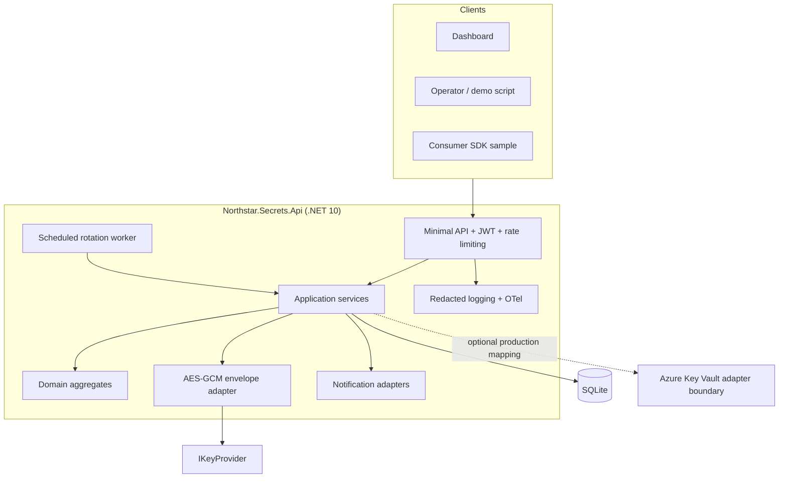
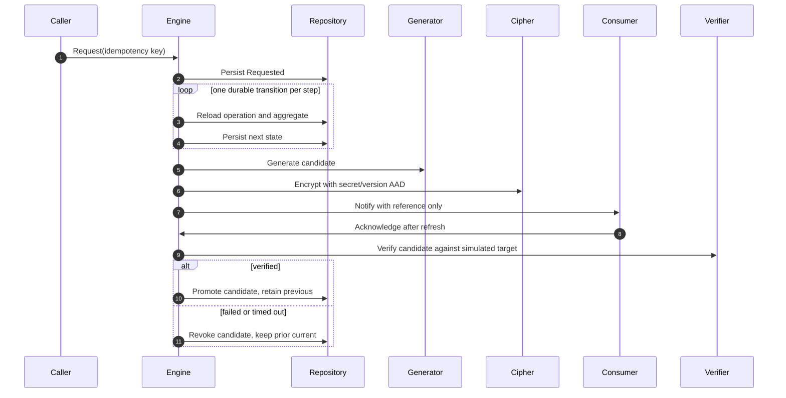

# Architecture

## Context

Northstar Secrets Rotation is a self-contained control-plane reference implementation for a
fictional platform team. It manages metadata and encrypted versions; applications receive
references and retrieve values at runtime. No external secret manager is required for the local
mode.

## Containers and boundaries



## Dependency direction

```text
Api -> Infrastructure -> Application -> Domain
Api --------------------> Application -> Domain
```

The Domain project references no framework or persistence package. Application owns every port.
Infrastructure contains adapters and API is the composition root.

## Rotation sequence



## Consistency model

Each transition and aggregate mutation is committed together through `ISecretsRepository`.
The idempotency key is unique. A crash before commit leaves the old state; a crash after commit
leaves the new state, which can be resumed. Generation and staging are one commit so replay does
not produce an unreferenced persisted candidate.

SQLite is used with a single application process. The aggregate contains an explicit
`ConcurrencyVersion` useful for a future compare-and-swap repository, while this local adapter
serializes writes through a scoped EF Core context. A production multi-worker deployment would add
row-version compare-and-swap plus a leased work queue.

## Cryptographic data flow

1. A generator creates value material using the platform CSPRNG.
2. The envelope adapter generates a unique 256-bit DEK.
3. AES-256-GCM encrypts UTF-8 bytes using a 96-bit nonce and 128-bit tag.
4. Canonical AAD binds secret ID, hierarchical name, type, and version.
5. `IKeyProvider` wraps the DEK using the current master-key version.
6. SQLite stores ciphertext, nonce, tag, wrapped DEK, and wrapping-key version.
7. Master-key rotation unwraps and re-wraps only DEKs; ciphertext remains byte-identical.

## Extensibility seams

| Port | Local implementation | Production direction |
|---|---|---|
| `ISecretsRepository` | EF Core SQLite | PostgreSQL/SQL Server |
| `IKeyProvider` | environment-backed local AES wrapper | Azure Key Vault/Managed HSM, AWS KMS |
| `ISecretVerifier` | deterministic login/ping simulator | database/API/vendor-specific verifier |
| `INotificationChannel` | webhook simulator, inbox, email simulator | resilient HTTP/email/messaging |
| `IExternalSecretStore` | Azure-shaped unconfigured adapter | SDK-backed Key Vault adapter |
| `IClock` | system clock | deterministic fake in tests |

## Operational failure modes

| Failure | Behavior |
|---|---|
| Consumer does not acknowledge | Deadline marks pending acknowledgements timed out; candidate is revoked |
| Candidate fails verification | Candidate is revoked and old current remains current |
| Process stops mid-rotation | Next call/worker loads persisted state and resumes |
| Duplicate request | Existing operation is returned by idempotency key |
| Webhook repeatedly fails | Bounded attempts, then dead-letter record; alternate channels still run |
| Ciphertext/tag/AAD altered | AES-GCM authentication fails closed |
| Current wrapping key changes | DEKs are re-wrapped; encrypted values are not decrypted/re-encrypted |

## Deployment note

The repository was built and tested on Windows without Docker or Azure. `Dockerfile` and
`docker-compose.yml` are design artifacts only and are explicitly marked unverified.
