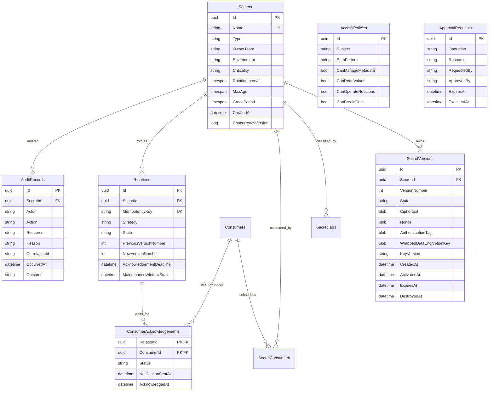

# Database Schema

SQLite is the default store. EF Core creates the schema with `EnsureCreated` for this portable
demonstration. Production adoption should introduce reviewed migrations and a database that
supports multi-writer concurrency controls.

## Constraints and indexes

| Table | Constraint/index | Purpose |
|---|---|---|
| `Secrets` | unique `Name` | One registry entry per hierarchical path |
| `SecretVersions` | unique `(SecretId, VersionNumber)` | Ordered history cannot fork |
| `SecretTags` | primary `(SecretId, Value)` | Deduplicated classification |
| `SecretConsumers` | primary `(SecretId, ConsumerId)` | Deduplicated subscription |
| `Consumers` | unique `(Application, Name)` | Stable consumer identity |
| `Rotations` | unique `IdempotencyKey` | Safe request replay |
| `Rotations` | `(SecretId, State)` | Find active operations |
| `ConsumerAcknowledgements` | primary `(RotationId, ConsumerId)` | One acknowledgement per consumer |
| `AccessPolicies` | unique `(Subject, PathPattern)` | Avoid ambiguous duplicates |
| `AuditRecords` | `(SecretId, OccurredAt)`, `(Actor, OccurredAt)` | Access and anomaly reports |

## Sensitive columns

Only encrypted bytes and wrapped DEKs are persisted. Nonce and authentication tag are not secret
but are integrity-critical. Plaintext values, generated private keys, certificate export
passwords, JWTs, and master-key material are not database columns.

`Destroyed` versions retain lifecycle metadata while cryptographic byte arrays and key version are
cleared. Audit rows are append-only through the application interface.
