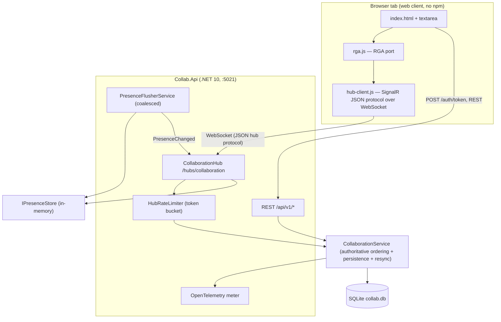
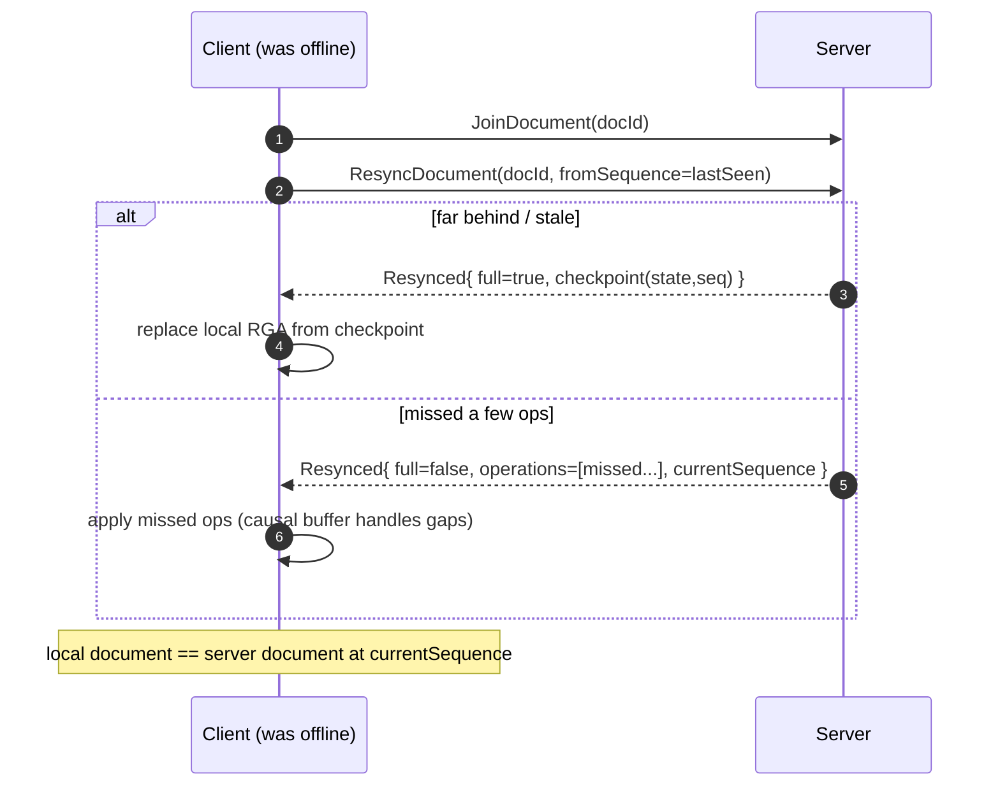
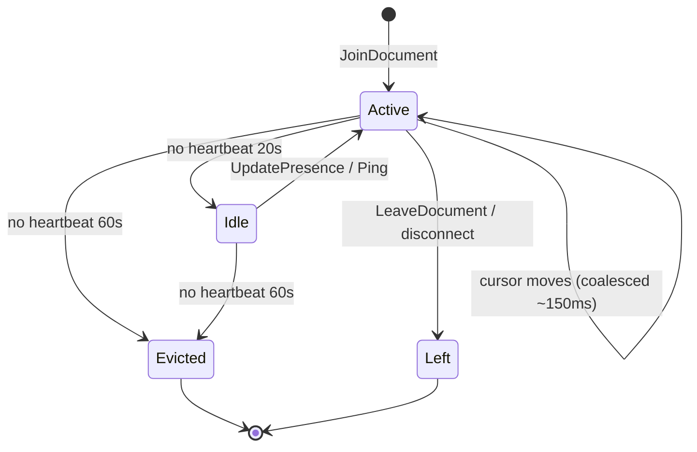

# Collab — Real-Time Collaboration Backend

A production-shaped **.NET 10** backend for real-time collaborative editing of runbooks, incident
notes, and checklists. The engineering story is **correct concurrent editing with an honestly
documented conflict model** — a from-scratch **RGA CRDT** for text (convergence proven by a
randomised property test) and **field-level LWW with version vectors** for structured documents.

Fictional context: a collaborative operations workspace for **Acme Manufacturing (fictional)**.

- **Build:** `dotnet build -c Release` → 0 warnings, 0 errors
- **Tests:** `dotnet test -c Release` → **55 passed, 0 failed** (30 unit + 25 integration), **zero
  external infrastructure** (EF Core + SQLite; SignalR over the in-memory test host)
- **API:** `http://localhost:5021` · **Hub:** `/hubs/collaboration`

> New here? The two documents worth reading are `docs/conflict-resolution.md` (the guarantees **and**
> limitations) and `docs/decisions/ADR-001-ot-vs-crdt.md` (the central decision).

---

## Portfolio Classification

**Self-directed engineering case study.** This is a demonstration project built to a fixed engineering
contract. All data is fictional and labelled; there are no real users, clients, revenue, or uptime
claims. Authentication is intentionally demo-grade and documented as such.

## Executive Summary

Collab lets multiple people edit the same document at the same time and **converge to identical
state** on every replica, while the server stays authoritative for ordering and persistence. Text
documents use a **Replicated Growable Array (RGA) CRDT**; structured documents (checklists) use
**field-level last-writer-wins**. Convergence is not asserted by hand — it is **proven by a randomised
property test** with a fixed seed, plus exhaustive transform-pair unit tests. On top of the core
model, the system implements presence, reconnect/resync from a checkpoint + operation log, versioning
with time-travel and restore, comment anchoring with rebasing, notifications, audit, and hub rate
limiting. A dependency-free browser client (hand-rolled SignalR protocol + a JavaScript port of the
RGA) lets two tabs co-edit and see each other's cursors.

## Business Problem

Operations teams keep critical knowledge — incident runbooks, checklists, post-incident notes — in
documents that several people need to edit **at once**, especially during an incident. Emailing files
or locking documents fails exactly when collaboration matters most. The hard part is not the UI; it is
**merging concurrent edits correctly** and being honest about what "merge" can and cannot mean. Collab
demonstrates a correct, well-documented answer to that problem for two representative data shapes
(free text and structured records).

## Functional Requirements

- Workspaces with members and roles (**Owner, Editor, Commenter, Viewer**) and policy authorization.
- Documents belonging to workspaces (title, type, derived content, current version, timestamps).
- Real-time editing over SignalR: join/leave document rooms, submit operations, receive broadcasts and
  **acks with server sequence numbers**.
- **Text CRDT** (RGA): concurrent inserts/deletes converge; causality respected; late/rejected
  operations return a defined result.
- **Structured CRDT** (field-level LWW + version vectors) for checklists.
- **Presence**: participants, cursor/selection, idle/active, heartbeat eviction, coalesced broadcast.
- **Optimistic local editing** reconciled against the server's authoritative sequence.
- **Versioning & history**: operation log + snapshots, named versions, diff, restore-as-forward,
  time-travel read.
- **Comments & threads** anchored to a text range or field, with **anchor rebasing** and orphan
  detection, replies, resolve/reopen, mentions.
- **Notifications**: mentions delivered live and persisted when offline; per-user read/unread inbox.
- **Audit**: append-only record of who changed what and when, including permission changes.
- **Rate limiting / abuse control** on the hub: per-connection op cap, max document/op size,
  disconnect on abuse.
- A minimal but real **web client** for two-tab co-editing.

## Non-Functional Requirements

- **Correctness first:** convergence proven by test; server-authoritative, gap-free sequencing.
- **Zero external infrastructure:** SQLite default; runs and tests with only the .NET SDK.
- **Reproducibility:** fixed-seed randomised tests; deterministic tie-breaks.
- **Testability:** pure domain (no framework deps); realtime tests with hard cancellation deadlines.
- **Observability:** OpenTelemetry metrics for the realtime-specific signals.
- **Security-awareness:** single authorization chokepoint; explicit, documented non-claims.
- **Honesty:** limitations and unverified areas (Redis backplane) stated plainly.

## Architecture

A **modular monolith** with strict inward dependencies `Api → Infrastructure → Application → Domain`.
The Domain (CRDT, diff, LWW, entities, role policy) has **no framework dependencies** and is unit
tested in isolation. The Application layer owns realtime *semantics* (ordering, validation,
persistence, resync) behind ports; the Api layer owns *transport* (the SignalR hub, REST, auth,
rate limiting, telemetry). See `docs/architecture/architecture.md` for the full write-up.

| Layer | Project | Responsibility |
|---|---|---|
| Domain | `Collab.Domain` | RGA CRDT, structured LWW, diff, entities, `RolePolicy`, `IClock` |
| Application | `Collab.Application` | `CollaborationService` engine, use-case services, contracts, ports |
| Infrastructure | `Collab.Infrastructure` | EF Core, repositories, presence store, metrics, seed |
| Api | `Collab.Api` | Minimal-API REST, SignalR hub, JWT, rate limiting, OpenTelemetry, web client |

## Architecture Diagram

### Realtime architecture (container view)



### Operation flow with transform/merge (headline sequence)

```mermaid
sequenceDiagram
    autonumber
    participant A as Client A (Editor)
    participant S as Server (Hub + Engine)
    participant B as Client B (Editor)
    Note over A: types locally (optimistic)
    A->>A: apply insert to local RGA (id 7@ada)
    A->>S: SubmitOperation({insert 7@ada after Root})
    S->>S: rate-limit → validate causal readiness → assign ServerSequence → append log → maybe snapshot
    S-->>A: ack(sequence=42)
    S->>B: OperationApplied({seq:42, insert 7@ada})
    B->>B: observe clock; MERGE into local RGA (no transform needed)
    Note over A,B: concurrent inserts sort by DESC id → both replicas render identical text
```

### Reconnect / resync (sequence)



### Presence lifecycle



## Technology Stack

- **.NET 10** / C#, ASP.NET Core **Minimal APIs**
- **SignalR** (realtime hub; JSON hub protocol)
- **EF Core** with **SQLite** (default; Postgres by config swap — same model)
- **JWT bearer** authentication (`Microsoft.AspNetCore.Authentication.JwtBearer`)
- Built-in **rate limiting** (`Microsoft.AspNetCore.RateLimiting`)
- **OpenTelemetry** metrics + tracing (console exporter outside Testing)
- **xUnit** + `Microsoft.AspNetCore.Mvc.Testing` + `Microsoft.AspNetCore.SignalR.Client`
- Web client: **hand-written** SignalR JSON protocol + RGA port (no npm dependency)

## Domain Model

- **User** — account; JWT `sub` maps to `Id`.
- **Workspace** / **WorkspaceMember(Role)** — tenancy and authorization source.
- **Document(Type: Text|Structured, CurrentSequence)** — content is **derived**, not stored.
- **OperationLogEntry(ServerSequence, Payload)** — append-only, gap-free per document.
- **DocumentSnapshot(AtSequence, State, MaterializedContent)** — periodic checkpoints.
- **NamedVersion** — human-named checkpoint.
- **Comment(AnchorKind, AnchorStart/End, Status, IsOrphaned, ThreadId)** — anchored, rebased.
- **Notification(Type, IsRead)** — per-user inbox.
- **AuditRecord** — append-only who/what/when.

CRDT internals: **ElementId** `(lamport@replica)`, **RgaDocument** (causal tree), **LamportClock**;
structured: **LwwStamp**, **VersionVector**. Full schema in `docs/database-schema.md`.

## Core Workflows

1. **Edit text (optimistic):** client applies locally → `SubmitOperation` → server validates causal
   readiness, assigns sequence, persists, broadcasts → other clients **merge**; author's op is acked.
2. **Join / load:** `JoinDocument` returns authoritative state (latest snapshot + tail replay).
3. **Reconnect / resync:** `ResyncDocument(fromSequence)` → full checkpoint or missed-tail (see diagram).
4. **History:** operation log + snapshots enable time-travel read, named versions, diff, and
   **restore-as-forward-operation** (never a rewrite).
5. **Comment:** anchor to a text range; the anchor **rebases** as text changes and **orphans** if its
   text is deleted.
6. **Notify:** a mention delivers live over SignalR when connected and is **persisted** otherwise.

## Security Model

- **Authentication:** JWT bearer; browsers pass the token via `access_token` query string **only** on
  the hub path. `sub` → user id; `MapInboundClaims=false`.
- **Authorization:** a single chokepoint — `RolePolicy` maps roles to capabilities
  (`View/Comment/Edit/Manage`). Every REST and hub mutation funnels through it. A `Viewer` cannot
  edit; a non-member cannot join or read (tested).
- **Abuse control:** per-connection token-bucket operation limiter with disconnect-on-abuse; document
  and operation size caps; a separate REST global fixed-window limiter (hub excluded).
- **Content safety:** the web client renders text via `value`/`textContent` only — never `innerHTML`.
- **Auditing:** append-only records with correlation ids, including permission changes.
- Full STRIDE analysis and **explicit non-claims** in `docs/security/security-review.md`.

## Reliability & Failure Handling

- **Server authoritative:** gap-free monotonic sequence per document (unique index enforced); a
  causally-unplaceable operation returns a defined `Rejected{unknown_reference}` — never silent
  corruption.
- **Out-of-order safe:** a causal buffer holds operations until their dependencies arrive.
- **Recoverable content:** content is derived from an append-only log; a bad snapshot is recoverable
  by falling back to a prior snapshot or full replay (`docs/runbooks/document-corruption-recovery.md`).
- **Presence is soft state:** a hub restart clears it; clients repopulate within one heartbeat.
- **Connection storms:** per-connection limits + edge guidance in
  `docs/runbooks/hub-connection-storm.md`.
- **Deterministic tests:** hard `CancellationTokenSource` deadlines on every realtime test.

## Observability

OpenTelemetry meter **`Collab.Collaboration`** exposes:

| Metric | Type | Meaning |
|---|---|---|
| `collab.clients.connected` | gauge | Currently connected hub clients |
| `collab.operations.applied` | counter | CRDT operations applied (ops/sec derived) |
| `collab.operations.rejected` | counter | Rejected submissions |
| `collab.resync.count` | counter | Client resyncs served |
| `collab.apply.duration` | histogram (ms) | Apply/transform duration |

ASP.NET Core instrumentation is also registered; a console exporter is enabled outside the Testing
environment. Correlation ids flow through requests, responses, and audit records.

## Testing Strategy

- **Unit (30):** every CRDT transform/merge pair (ins/ins, ins/del, del/del; same position, adjacent,
  overlapping), out-of-order buffering, the **randomised convergence property test** (fixed seed
  20260903), structured LWW, LCS diff, and comment anchor rebasing.
- **Integration (25):** **real SignalR clients** over `WebApplicationFactory` (Long Polling transport)
  — two-client convergence, concurrent same-position convergence, contiguous sequencing under
  concurrency, presence propagation/coalescing, resync-from-checkpoint, authorization denials
  (viewer/non-member/unauthenticated), hub rate-limit disconnect, comment anchor+orphan, diff,
  time-travel, restore-forward, snapshot+replay fidelity, live+offline notifications, and REST
  validation/401/403/health.
- Full list and real output in `docs/test-results.md`.

## Local Development

**Prerequisites:** .NET SDK 10.0.400. No Docker, database server, or Node required.

```powershell
# from the project root
dotnet build -c Release
dotnet test  -c Release          # 55 passed, 0 failed

# run the API (serves the web client too)
dotnet run -c Release --project src\Collab.Api\Collab.Api.csproj
# → http://localhost:5021  (Swagger/OpenAPI in Development at /openapi)
```

Open `http://localhost:5021/` in **two browser tabs**, sign in as `ada@acme.example` and
`grace@acme.example`, connect both to document `55555555-5555-5555-5555-555555555555`, and type — edits
and cursors converge live. Or run `./scripts/demo.ps1` for a guided end-to-end demo.

Seeded demo data (idempotent): workspace **Acme Operations**; users **Ada** (Owner), **Grace**
(Editor), **Linus** (Viewer); an **Incident Runbook** (Text) and a **Release Checklist** (Structured).

## Running with Docker

**Docker configuration created but Docker is unavailable on the build host; the compose stack has not
been started or verified.** The `Dockerfile` and `docker-compose.yml` are authored to a standard,
correct pattern and are labelled UNVERIFIED. The `redis` service in compose illustrates the SignalR
scale-out backplane from `docs/decisions/ADR-005-scale-out-backplane.md` and is **not** enabled by
default; single-node (api + SQLite) is the only verified topology.

## API Documentation

OpenAPI is served at `/openapi` in Development. REST surface (all under `/api/v1`, JWT required except
`/auth/token` and health):

| Method & path | Purpose |
|---|---|
| `POST /auth/token` | Exchange an email for a demo JWT (provisions on first sight) |
| `POST /workspaces` · `GET /workspaces` · `GET /workspaces/{id}` | Manage/list workspaces |
| `GET /workspaces/{id}/members` · `POST /workspaces/{id}/members` · `PUT /workspaces/{id}/members/{userId}` | Members & roles |
| `POST /documents` · `GET /documents?workspaceId=` · `GET /documents/{id}` | Create/list/read documents |
| `GET /documents/{id}/history` · `GET /documents/{id}/at/{sequence}` | History & time-travel |
| `POST /documents/{id}/versions` · `GET /documents/{id}/versions` | Named versions |
| `GET /documents/{id}/diff?from=&to=` · `POST /documents/{id}/restore` | Diff & restore-forward |
| `GET /documents/{id}/comments` · `POST /documents/{id}/comments` | Comments |
| `POST /comments/{id}/replies` · `POST /comments/{id}/resolve` · `POST /comments/{id}/reopen` | Threads |
| `GET /notifications?unreadOnly=` · `POST /notifications/{id}/read` · `POST /notifications/read-all` | Inbox |
| `GET /health` · `GET /health/ready` | Health |

Hub (`/hubs/collaboration`) methods: `JoinDocument`, `LeaveDocument`, `SubmitOperation`,
`UpdatePresence`, `Ping`, `ResyncDocument`. Server events: `OperationApplied`, `PresenceChanged`,
`Rejected`, `Resynced`, `CommentAdded`, `NotificationReceived`.

## Example Usage

```powershell
$base = "http://localhost:5021"

# 1) Get a token (password-less demo)
$ada = Invoke-RestMethod -Method Post -Uri "$base/api/v1/auth/token" `
    -ContentType "application/json" -Body (@{ email = "ada@acme.example" } | ConvertTo-Json)
$h = @{ Authorization = "Bearer $($ada.token)" }

# 2) List workspaces and documents
$ws = Invoke-RestMethod -Uri "$base/api/v1/workspaces" -Headers $h
$docs = Invoke-RestMethod -Uri "$base/api/v1/documents?workspaceId=$($ws[0].id)" -Headers $h

# 3) Read the runbook, its history, and a time-travel snapshot
$doc = "55555555-5555-5555-5555-555555555555"
Invoke-RestMethod -Uri "$base/api/v1/documents/$doc" -Headers $h
Invoke-RestMethod -Uri "$base/api/v1/documents/$doc/history" -Headers $h
Invoke-RestMethod -Uri "$base/api/v1/documents/$doc/at/0" -Headers $h

# 4) Comment with an @mention
$body = @{ body = "Check step 2 @grace"; anchorStart = 0; anchorEnd = 3; mentions = @() } | ConvertTo-Json
Invoke-RestMethod -Method Post -Uri "$base/api/v1/documents/$doc/comments" -Headers $h `
    -ContentType "application/json" -Body $body
```

Example token response:

```json
{ "token": "eyJhbGci...", "userId": "11111111-1111-1111-1111-111111111111",
  "email": "ada@acme.example", "displayName": "Ada Lovelace", "expiresAt": "2026-09-03T20:00:00+00:00" }
```

Realtime editing is driven from the browser client (two tabs) or by the SignalR integration tests;
see `tests/Collab.IntegrationTests` for programmatic hub usage.

## Performance / Load Testing

No formal load test was run (single-host, zero-infra scope). The design decisions that bound cost are
in place and measurable via the metrics above:

- **Presence coalescing** bounds broadcast volume to (documents × flush rate), not (participants ×
  cursor speed) — see ADR-004.
- **Snapshots** bound document load cost to (snapshot cadence) rather than (total edits) — ADR-003.
- **Per-connection rate limiting** bounds a single client's server load — verified by test.
- `collab.apply.duration` and `collab.operations.applied` expose apply throughput/latency for any
  future load harness. A meaningful multi-node load test requires the (UNVERIFIED) backplane first.

## Trade-offs

- **CRDT over OT:** simpler, testable convergence and merge-not-transform reconciliation, at the cost
  of per-character id overhead, tombstone accumulation, and possible character-level interleaving.
- **Server-authoritative CRDT:** single source of truth and defined rejection, at the cost of a server
  round-trip for durability (local edits are still optimistic).
- **Derived content (log + snapshots):** history/time-travel/restore for free, at the cost of storage
  growth with edit volume.
- **LWW for structured data:** intuitive, always-defined values, at the cost of **dropping the loser**
  of a concurrent single-field write (by design).
- **In-memory presence:** cheap and fast, at the cost of being cleared on restart (soft state).

## Architecture Decisions

Five ADRs in `docs/decisions/` (Context / Options / Decision / Consequences / Risks / Alternatives):

1. **ADR-001 — OT vs CRDT** (the central decision, with an explicit limitations section).
2. **ADR-002 — SignalR vs raw WebSockets.**
3. **ADR-003 — Snapshot + operation-log persistence.**
4. **ADR-004 — Presence throttling & coalescing.**
5. **ADR-005 — Scale-out via a Redis backplane (configured, UNVERIFIED).**

## Known Limitations

- **Convergence, not intention merge.** Concurrent typed runs can **interleave** at the character
  level; RGA does not produce a semantic merge.
- **Structured LWW drops the loser** of a concurrent single-field write; no cross-field transactions.
- **Logical (Lamport) ordering**, not wall-clock: "last writer" means highest logical stamp.
- **Tombstones accumulate**; no distributed garbage collection (mitigated by snapshots).
- **Plain text only**; no rich-text/formatting CRDT.
- **Auth is demo-grade** (password-less email→JWT); see security non-claims.
- **Redis backplane / multi-node is UNVERIFIED**; presence and global limits are per-node.
- Full, blunt list in `docs/conflict-resolution.md` and `docs/security/security-review.md`.

## Future Improvements

- Replace demo auth with OIDC + refresh-token rotation; asymmetric signing keys via a KMS.
- Verify the Redis backplane; move presence to shared state; add sticky sessions and cross-node limits.
- Tombstone GC via replica acknowledgement watermarks; grapheme-cluster-aware text handling.
- Rich-text CRDT (e.g. Peritext-style) for formatting; block-level intention preservation.
- A load-test harness driving many concurrent SignalR clients against the exposed metrics.
- Cryptographic chaining of the audit log for tamper evidence.

## Portfolio Talking Points

- "**Convergence is proven, not claimed**" — a fixed-seed randomised property test across shuffled
  application orders, backed by exhaustive transform-pair tests.
- "**Reconciliation is merge, not transform**" — the CRDT payoff over OT for optimistic editing.
- "**Different data shapes, different strategies**" — RGA for text, field-level LWW for records.
- "**Server-authoritative with defined rejection**" — no silent corruption; gap-free sequencing.
- "**I documented the limitations**" — the honesty in `conflict-resolution.md` is the senior signal.
- More in `docs/portfolio/interview-talking-points.md`.

## Upwork Portfolio Description

See `docs/portfolio/upwork-description.md` for a ready-to-paste client-facing description. In brief:
a real-time collaborative editing backend (.NET 10 + SignalR + a from-scratch CRDT) with proven
convergence, reconnect/resync, presence, versioning with time-travel and restore, comment anchoring,
notifications, audit, and abuse control — building and passing **55 tests with zero external
infrastructure**, with limitations and unverified areas documented honestly.

---

*Fictional demo project. No real users, clients, or data. Authentication is demo-grade by design.*
