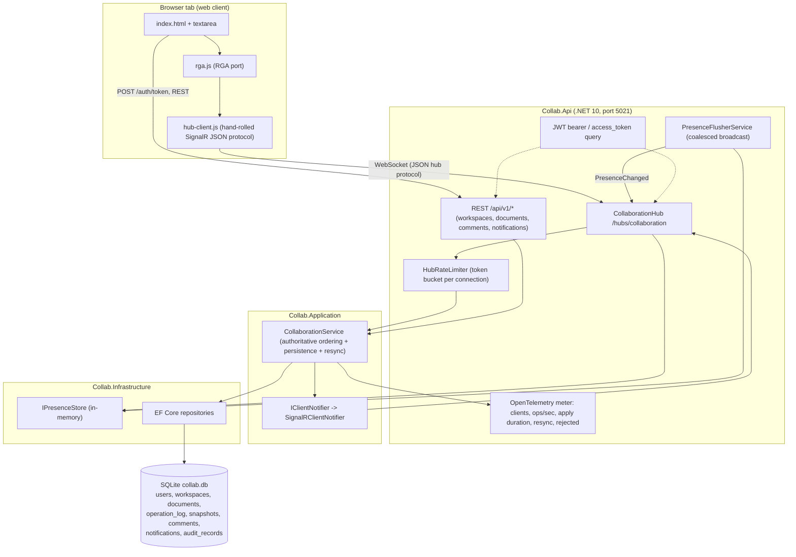
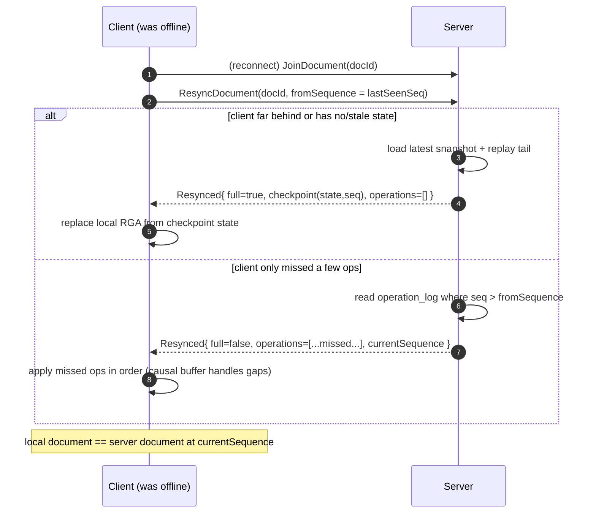
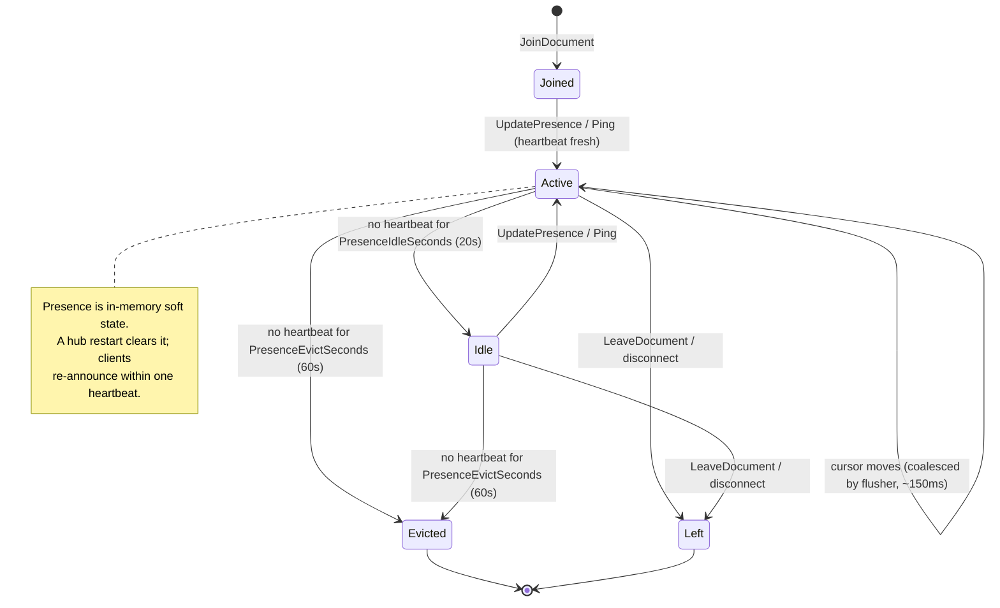

# Architecture

Collab is a **modular monolith** in four layers with strict inward-pointing dependencies
(`Api → Infrastructure → Application → Domain`). The Domain has **no** framework dependencies; the
CRDT, diff, and conflict logic are pure and unit-testable in isolation.

## Layers

| Layer | Project | Responsibility | Depends on |
|---|---|---|---|
| Domain | `Collab.Domain` | RGA CRDT, structured LWW, diff engine, entities, role policy, `IClock` | (nothing) |
| Application | `Collab.Application` | Use-case services, the `CollaborationService` engine, contracts/DTOs, ports (`IUnitOfWork`, repositories, `IClientNotifier`, `ICollabMetrics`, `IPresenceStore`) | Domain |
| Infrastructure | `Collab.Infrastructure` | EF Core (`AppDbContext`), repositories, presence store, runtime cache, metrics, DB initializer/seed | Application |
| Api | `Collab.Api` | Minimal-API REST endpoints, SignalR hub, JWT auth, rate limiting, OpenTelemetry, static web client | Infrastructure |

The **Application** layer owns the realtime *semantics* (ordering, validation, persistence, resync)
behind ports; the **Api** layer owns the *transport* (SignalR hub) and calls into it. This keeps the
engine testable without a hub and lets the hub stay thin.

## Realtime architecture (container view)



## Operation flow with transform/merge (sequence)

Two clients editing the same text document. The server is authoritative for sequence and
persistence; remote ops **merge** into each client's local RGA (no OT-style transform needed).

```mermaid
sequenceDiagram
    autonumber
    participant A as Client A (Ada, Editor)
    participant S as Server (Hub + CollaborationService)
    participant B as Client B (Grace, Editor)

    Note over A: types "x" locally (optimistic)
    A->>A: apply insert to local RGA (id 7@ada)
    A->>S: SubmitOperation({textOps:[insert 7@ada after Root]})
    S->>S: rate-limit check (token bucket)
    S->>S: validate causal readiness (parent exists?)
    S->>S: assign ServerSequence, append operation_log, maybe snapshot
    S-->>A: ack(sequence=42)  %% remove from pending
    S->>B: OperationApplied({sequence:42, insert 7@ada})
    B->>B: clock.observe(7); merge insert into local RGA
    Note over B: concurrently types "y" (id 7@grace)
    B->>S: SubmitOperation({textOps:[insert 7@grace after Root]})
    S->>S: assign sequence=43, persist
    S-->>B: ack(sequence=43)
    S->>A: OperationApplied({sequence:43, insert 7@grace})
    A->>A: merge; siblings sorted by DESC id -> deterministic order
    Note over A,B: both render identical text (e.g. "yx") — strong eventual consistency
```

## Reconnect / resync (sequence)

A client that was offline for K operations catches up from a checkpoint + the operation-log tail.



## Presence lifecycle



## Key cross-cutting mechanisms

- **Authoritative ordering & persistence** live in `CollaborationService.ApplyAsync` →
  authorize (`RolePolicy`) → validate (size, causal readiness) → rate gate → commit (RGA/structured)
  → persist (`++ServerSequence`, append log, snapshot every *N*, `SaveChanges`).
- **Anchor rebasing** happens inside the text commit so comment ranges follow edits and orphan when
  their text is deleted.
- **Notifications** are delivered live via `IClientNotifier` when connected and always persisted.
- **Observability**: an OpenTelemetry meter exposes connected clients, ops applied, apply/transform
  duration, resync count, and rejected ops.
