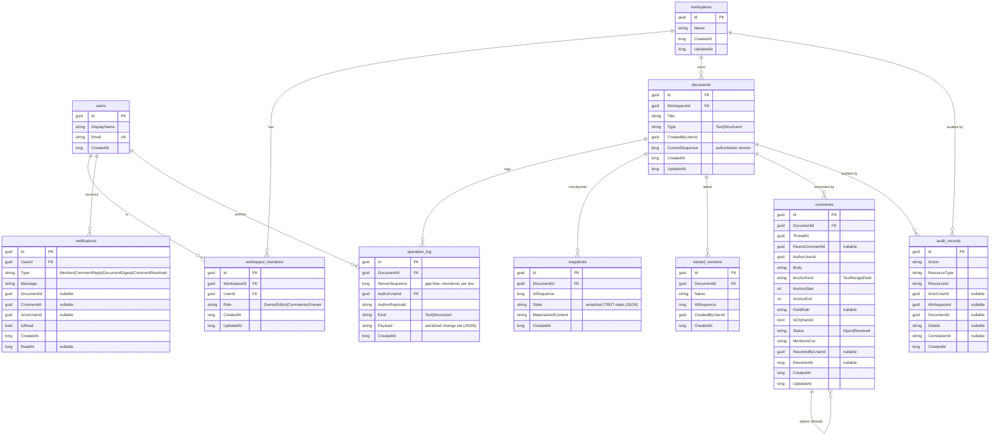

# Database Schema

Provider: **SQLite** by default (file `collab.db`), created at startup via EF Core
`EnsureCreated`. The same model runs on PostgreSQL by swapping the provider/connection string
(no schema changes) — SQLite is the verified default per the prime directive.

> **SQLite note:** `DateTimeOffset` is persisted as **UTC ticks (`INTEGER`)** via a global value
> converter, because SQLite cannot `ORDER BY`/compare `DateTimeOffset` natively. Timestamps
> round-trip losslessly for our UTC clock. All ids are GUIDs (`TEXT`). Enums are stored as strings.

## ER diagram

## Tables, keys, and indexes

| Table | PK | Notable columns | Indexes | Notes |
|---|---|---|---|---|
| `users` | `Id` | `DisplayName`, `Email` | **UNIQUE** `Email` | Auth maps JWT `sub` → `Id` |
| `workspaces` | `Id` | `Name` | — | Owns documents & members |
| `workspace_members` | `Id` | `Role` (string) | **UNIQUE** `(WorkspaceId, UserId)` | One membership per user per workspace |
| `documents` | `Id` | `Type`, `CurrentSequence` | `WorkspaceId` | Content is **not** stored here — it is the fold of the log over the latest snapshot |
| `operation_log` | `Id` | `ServerSequence`, `Payload` | **UNIQUE** `(DocumentId, ServerSequence)` | Append-only; the authoritative version axis |
| `snapshots` | `Id` | `State`, `MaterializedContent` | **UNIQUE** `(DocumentId, AtSequence)` | Periodic checkpoints for fast load |
| `named_versions` | `Id` | `Name`, `AtSequence` | `DocumentId` | Human-named checkpoints |
| `comments` | `Id` | `AnchorKind`, `AnchorStart/End`, `Status`, `IsOrphaned` | `DocumentId`, `ThreadId` | Text anchors rebase on edits; self-referential threads |
| `notifications` | `Id` | `Type`, `IsRead` | `(UserId, IsRead)` | Per-user inbox; delivered live or persisted |
| `audit_records` | `Id` | `Action`, `ResourceType/Id`, `CorrelationId` | `DocumentId`, `WorkspaceId`, `CreatedAt` | Append-only; never updated/deleted by app code |

## Design notes

- **Content is derived, not stored.** `documents` holds only metadata and `CurrentSequence`. The
  actual text/structured content is reconstructed from `snapshots` + `operation_log`. This is what
  makes history, time-travel, diff and restore first-class (ADR-003).
- **Gap-free sequence.** The unique `(DocumentId, ServerSequence)` index enforces the monotonic,
  gap-free version axis that all version math and resync logic rely on.
- **Append-only tables.** `operation_log` and `audit_records` are never updated or deleted by
  application code; "undo"/restore is modelled as new forward operations.
- **Enums as strings.** Roles, document types, comment anchor kinds/status, and notification types are
  stored as strings for readability and forward-compatibility, capped with `HasMaxLength`.
- **Mentions** are stored as a CSV column (`MentionsCsv`) and projected to a `Guid[]` in the domain to
  avoid an extra join table for a small, read-mostly list.
