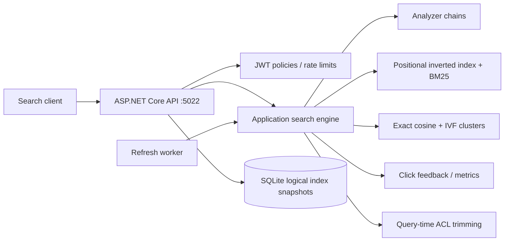
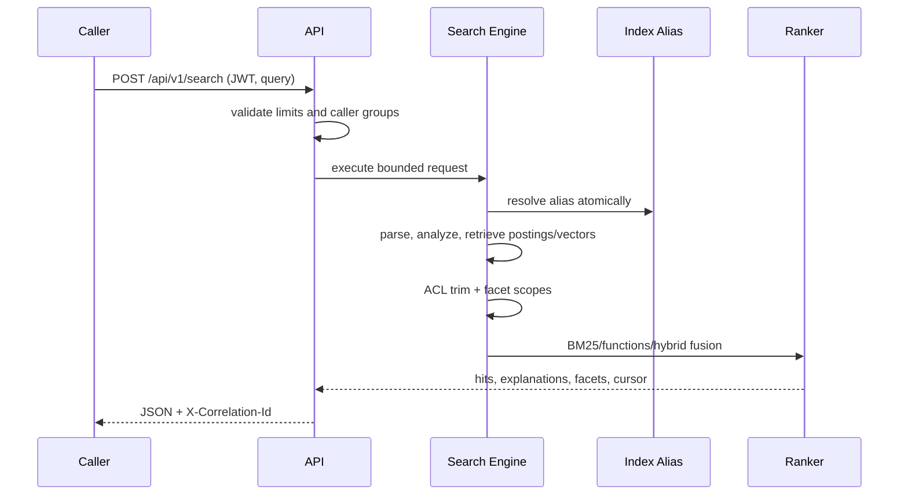
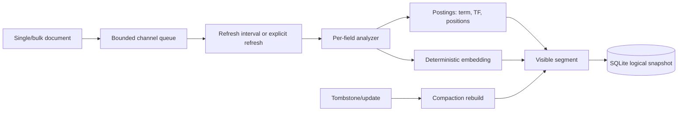
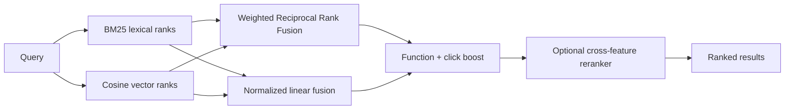

# Enterprise Search Platform with Hybrid Retrieval

## Portfolio Classification
Self-directed engineering case study. This is a production-style prototype for a fictional Contoso Retail catalogue and support knowledge base; it is not client work or a production deployment.

## Executive Summary
A .NET 10 modular monolith that implements search-engine mechanics in C#: analyzer chains, positional inverted indexes, BM25, query parsing, facets, deterministic embeddings, IVF approximate nearest-neighbour search, hybrid fusion, relevance evaluation, and click feedback. It runs with SQLite and no external search cluster.

## Business Problem
Contoso Retail needs one search surface across a product catalogue and a support knowledge base. Product discovery needs structured price/category facets and commercial boosts; support discovery needs full-text relevance and ACL-aware answers. Search must remain explainable, testable, and demonstrable without a managed search service.

## Functional Requirements
- Separate `catalogue` and `knowledge` aliases resolve to versioned indices with different field schemas.
- Analyze text, enqueue indexing work, refresh near-real-time visibility, bulk/patch/delete documents, compact tombstones, and atomically swap aliases.
- Search term, phrase/slop, prefix, wildcard, fuzzy, range, multi-field, and Boolean clauses; paginate by offset or stable `search_after` cursor.
- Produce highlights, score explanations, facets (including correct multi-select semantics), suggestions, corrections, click analytics, and evaluation reports.
- Combine lexical and deterministic vector retrieval with weighted RRF or normalized linear fusion.

## Non-Functional Requirements
SQLite is the default persistence adapter; no Docker, network model, Elasticsearch, OpenSearch, PostgreSQL, or Redis is required. Query clauses, wildcard expansions, fuzzy candidates, page depth, request size, and elapsed time are bounded. JWT scopes, rate limiting, correlation IDs, ProblemDetails, health checks, OpenTelemetry metrics, and query-time ACL trimming are included.

## Architecture
The solution follows dependency-only Clean Architecture: `Api -> Infrastructure -> Application -> Domain`. The domain contains immutable query/document contracts. The application owns the engine and ports. Infrastructure provides SQLite snapshots, clock, JWT issuer, refresh worker, and fictional seed data. The API is a thin minimal-API composition root.

## Architecture Diagram




## Technology Stack
.NET 10 / C# 14, ASP.NET Core minimal APIs, EF Core 10 SQLite, xUnit, JWT bearer authentication, built-in rate limiting, and OpenTelemetry APIs. Vector embeddings and IVF are deterministic in-repository C# implementations.

## Domain Model
`SearchDocument` holds text fields, numeric/date fields, ACL groups, recency, popularity, and stock state. `IndexDefinition` assigns field analyzers/boosts. `SearchClause` is a closed query AST. `IndexSnapshot` preserves logical index definitions, document versions, and refresh generation in SQLite; postings and vectors are rebuilt deterministically on hydration.

## Core Workflows




The refresh worker drains a bounded channel; work is invisible until a refresh. Updates leave obsolete postings as tombstones; compaction rebuilds active postings and vectors. Alias swapping changes one in-memory mapping under a write lock after a candidate version is built and verified.

## Security Model
All search and indexing routes require JWT scope policies (`search.read` or `search.manage`). A development-only token endpoint is unavailable outside Development/Testing. ACL groups are applied at query time before hits and facets are returned. Search syntax is parsed into an AST, never passed to SQL; wildcards, fuzzy candidates, clauses, pages, and time are bounded.

## Reliability & Failure Handling
A full indexing queue returns `429` rather than growing unboundedly; a later refresh frees capacity (covered by test). The refresh worker catches and logs an unsuccessful interval, then retries on the next interval. SQLite snapshots allow logical index hydration after restart; a reindex runbook reconstructs a new version before alias swap.

## Observability
Every response has `X-Correlation-Id`. The engine emits query-latency histogram, zero-result counter, indexed-document counter, and index-document gauge through `EnterpriseSearch.Engine`. ASP.NET Core traces are registered through OpenTelemetry. Health endpoints are `/health/live` and `/health/ready`; analytics exposes zero-result rate, CTR by position, and top queries.

## Testing Strategy
The suite includes analyzer filters/tokenizer edges, Porter stems, positional phrase/slop, hand-computed BM25, Boolean/filter score semantics, facets/ACLs, aliases, NRT refresh, suggestions, highlighting, IVF measurement, RRF, click boost, golden-set regression, cursors, throughput, API validation, `401`, and `403`. SQLite in-memory backs API integration tests. See `docs/test-results.md` for the final executed command output.

## Local Development
```powershell
Set-Location C:\Users\rukwaropaul\Downloads\DEV\Projects\22-enterprise-search-platform
dotnet run --project src\EnterpriseSearch.Api
# API: http://localhost:5022; OpenAPI: http://localhost:5022/openapi/v1.json
```

Development startup seeds 5,000 fictional catalogue documents and 1,000 fictional knowledge-base documents once. Use `scripts\demo.ps1` after the API is running. `--evaluate` runs the persisted seeded corpus evaluation and exits.

## Running with Docker
Docker configuration created but Docker is unavailable on the build host; the compose stack has not been started or verified. The authored files are deployment sketches only; SQLite storage is mounted at `/app/data` in the compose sketch.

## API Documentation
OpenAPI is at `/openapi/v1.json`; `/docs` redirects there. Main groups are `/api/v1/indices`, `/api/v1/indices/{name}/documents`, `/api/v1/search`, `/api/v1/suggest`, `/api/v1/analyze`, `/api/v1/events/click`, `/api/v1/analytics/*`, `/api/v1/eval/run`, and `/api/v1/auth/token` (Development/Testing only).

## Example Usage
```powershell
$token = (Invoke-RestMethod http://localhost:5022/api/v1/auth/token -Method Post -ContentType application/json -Body '{"subject":"demo","scopes":["search.manage"],"groups":["support-agent"]}').accessToken
$headers = @{ Authorization = "Bearer $token" }
Invoke-RestMethod http://localhost:5022/api/v1/search -Method Post -Headers $headers -ContentType application/json -Body '{"index":"catalogue","query":"title:(laptop OR notebook) AND price:[100 TO 500] -refurbished","mode":"HybridRrf","facets":[{"name":"category","field":"category","kind":"Hierarchical"}],"highlightFields":["title"],"explain":true}'
# Returns hits with BM25 term/field explanations, ACL-safe facet buckets, snippets, and search_after.
Invoke-RestMethod http://localhost:5022/api/v1/analyze -Method Post -Headers $headers -ContentType application/json -Body '{"text":"<b>Café laptops</b>","analyzer":"standard"}'
```

## Performance / Load Testing
A repeatable in-process 5,000-document benchmark and the actual host measurements are documented in `docs/performance.md`. The benchmark is synthetic and not a production throughput claim.

## Trade-offs
This code favors inspectability over Lucene-grade efficiency. SQLite persists logical snapshots rather than mutable posting blocks, so cold hydration rebuilds the derived structures. Exact cosine is the correctness baseline; IVF reduces candidates but can lose recall. Weighted RRF intentionally favors strong lexical evidence for this catalogue golden set.

## Architecture Decisions
See [ADR-001](docs/decisions/ADR-001-build-engine-vs-lucene-elasticsearch.md), [ADR-002](docs/decisions/ADR-002-bm25-parameters.md), [ADR-003](docs/decisions/ADR-003-sqlite-persistence-and-compaction.md), [ADR-004](docs/decisions/ADR-004-ivf-ann-tradeoffs.md), and [ADR-005](docs/decisions/ADR-005-query-time-security-trimming.md).

## Known Limitations
The analyzer is English-focused and uses an in-repository Porter implementation. IVF is intentionally lightweight and in-memory. ACL checks are group allow-lists only; no deny rules or document-level policy language exists. Snapshot saves replace a version's document rows, which is appropriate for the case study but not large production shards. No external search cluster is provisioned.

## Future Improvements
Add language-specific analyzers, compressed immutable posting blocks, query/result caching, asynchronous durable queueing, true HNSW, learned ranking features, admin audit persistence, OIDC/JWKS production configuration, and dual-write migration tooling for Elasticsearch or Azure AI Search.

## Portfolio Talking Points
The differentiator is not calling a search SDK: positional postings prove phrase semantics, the BM25 fixture proves scoring arithmetic, the analyzer endpoint makes token transformations inspectable, and ACL-safe facet counting demonstrates an often-missed security boundary. The design explains how to move to managed search while preserving contracts and evaluation discipline.

## Upwork Portfolio Description
**Enterprise Search Platform with Hybrid Retrieval — self-directed engineering case study**

Problem: a fictional retail catalogue and support corpus need relevant, secure, explainable multi-index search without relying on an external search service. Built: a .NET 10 reference implementation with analyzer pipelines, positional BM25 retrieval, deterministic vector/IVF search, hybrid fusion, alias reindexing, ACL trimming, click analytics, and relevance regression tests. Stack: ASP.NET Core, C#, EF Core SQLite, OpenTelemetry, xUnit. Verification: local release build/test and synthetic evaluation are recorded in this repository. This is a self-directed portfolio project, not client work.
