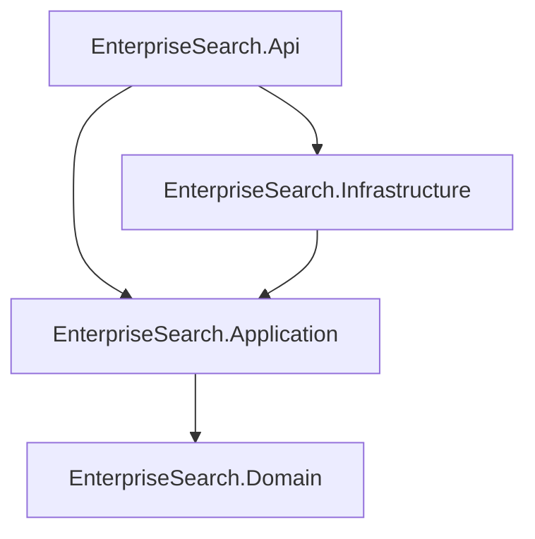
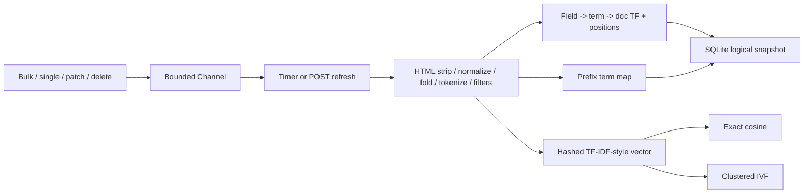
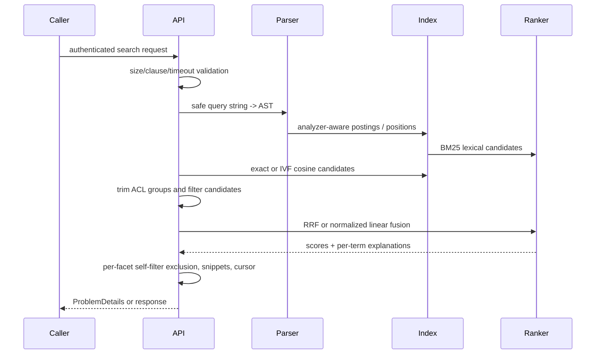

# Architecture — Enterprise Search Platform

## Context
This modular monolith intentionally implements the concepts normally hidden behind Lucene, Elasticsearch, or Azure AI Search. It serves a fictional Contoso Retail catalogue and support knowledge base from independent, versioned logical indices.

## Modules and dependency rule

`Domain` has no I/O or framework dependencies. `Application` owns query contracts, analysis, index data structures, rankers, vector interfaces, and ports. `Infrastructure` owns EF Core SQLite, time, JWT issuance, refresh hosting, and deterministic seed data. `Api` owns HTTP, composition, transport validation, and middleware.

## Indexing pipeline

Updates assign a higher document version. Old postings remain physically present but cannot match because their version does not equal the active document version. Deletes remove active document state and leave tombstones. Compaction rebuilds all derived structures from active documents and resets obsolete-posting accounting.

## Query execution

## Persistence and restart
SQLite holds index definitions, current versioned source documents, alias mappings, refresh generations, and timestamps. It is deliberately the durable logical source, not an attempt to emulate Lucene's compressed immutable segment files. Startup recreates posting, prefix, exact-vector, and IVF state from it. This keeps the custom engine transparent and makes reindexing deterministic.

## Production adapter mapping
The application contracts map directly to external search adapters:

| Local engine concept | Elasticsearch | Azure AI Search |
|---|---|---|
| `IndexDefinition` / alias | index mapping + alias | index + index alias / swap strategy |
| Analyzer chain | custom analyzer | lexical analyzer / custom skillset where supported |
| posting positions / BM25 | Lucene postings + similarity | built-in BM25 |
| `IVectorIndex` | `dense_vector` + HNSW | vector fields + HNSW/exhaustive KNN |
| RRF / linear fusion | retriever / rank features | hybrid query + semantic ranker |
| query-time ACL filter | terms filter on groups | filter expression on allowed groups |

The migration concern is behavioral parity: retain the golden evaluation set, analyzer tests, query limits, result schemas, and ACL/facet tests before changing adapters.
