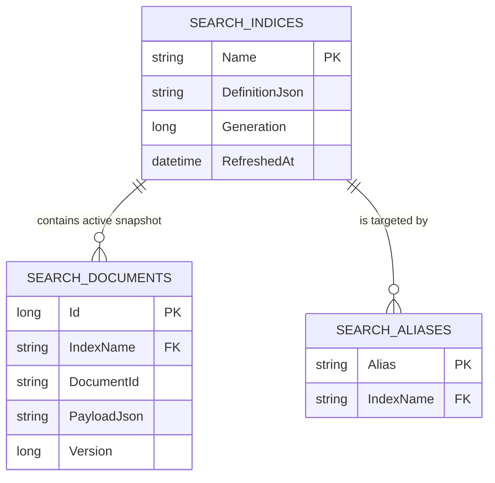
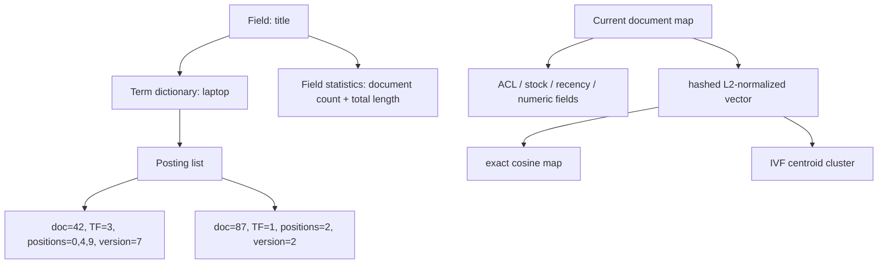

# Database Schema and Index Format

## SQLite role
SQLite is the default durable adapter (`Data Source=enterprise-search.db`). It persists the *logical visible index snapshot*: schema/analyzer metadata, active versioned documents, aliases, refresh generation, and timestamp. At startup, the application rebuilds the derived inverted postings, prefix map, exact vector map, and IVF clusters from those documents. This is intentional and documented in ADR-003.

## Tables

| Table | Primary key | Important columns | Indexes / constraints | Purpose |
|---|---|---|---|---|
| `search_indices` | `Name` | `DefinitionJson`, `Generation`, `RefreshedAt` | index on `RefreshedAt` | A concrete versioned index definition and visible generation. |
| `search_documents` | `Id` (surrogate) | `IndexName`, `DocumentId`, `PayloadJson`, `Version` | unique `(IndexName, DocumentId)`; index `IndexName` | Current logical document payload and index version. |
| `search_aliases` | `Alias` | `IndexName` | index `IndexName` | Atomic logical-alias target persisted across restart. |



## Logical document format
`PayloadJson` serializes `SearchDocument`:

```json
{
  "id": "catalogue-golden-01",
  "indexName": "catalogue-v1",
  "fields": { "title": "Contoso Retail laptop qtoken01", "category": "electronics/laptops" },
  "numericFields": { "price": 125 },
  "allowedGroups": [],
  "createdAt": "2026-09-01T00:00:00+00:00",
  "popularity": 3,
  "isInStock": true
}
```

The payload is application data, not a user-supplied SQL fragment. EF Core parameterizes writes and reads.

## In-memory derived index format



A posting only participates if its stored document version equals the active document map version. This is the tombstone/version check that prevents update/delete ghosts. `POST /api/v1/indices/{name}/compact` reconstructs only active postings and resets obsolete posting counts.

## Rebuild and alias sequence
1. Create `catalogue-v2` with a new `IndexDefinition`.
2. Bulk index source documents, call explicit refresh, and validate stats/evaluation.
3. Atomically `POST /api/v1/indices/aliases/swap` with expected `catalogue-v1` and next `catalogue-v2`.
4. Drop `catalogue-v1` only after the alias has moved.

The compare-and-swap precondition avoids silently overwriting an alias updated by another operator.
