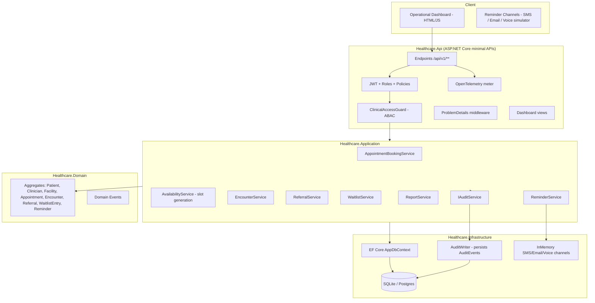
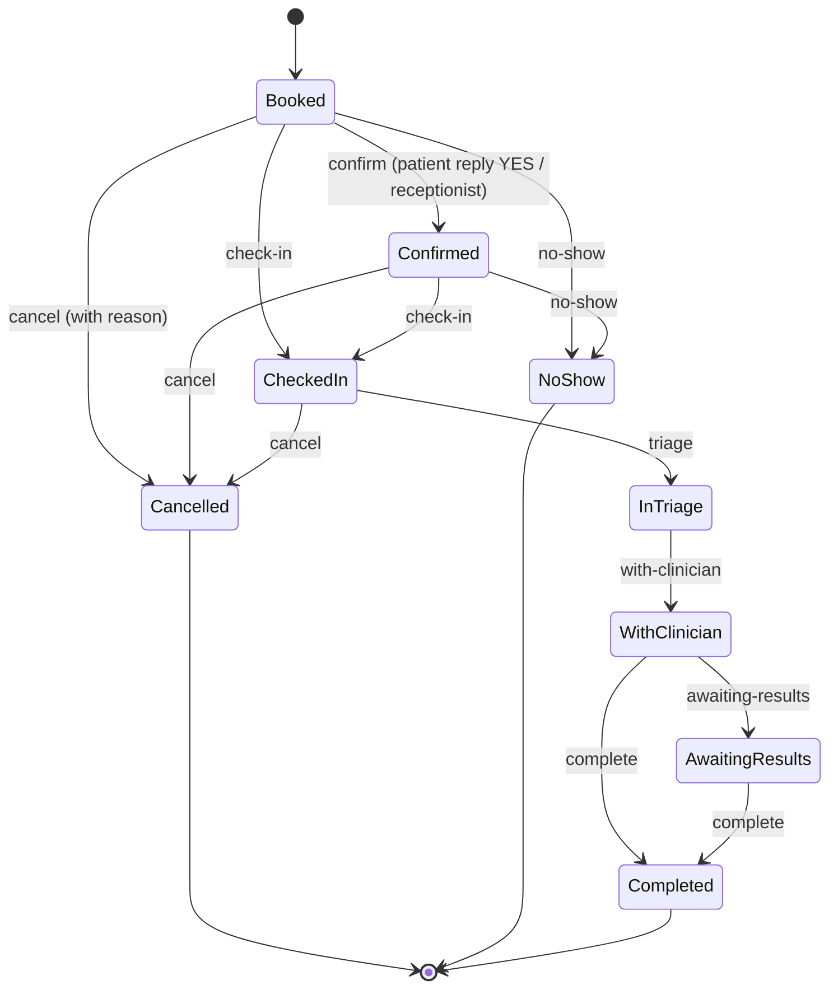
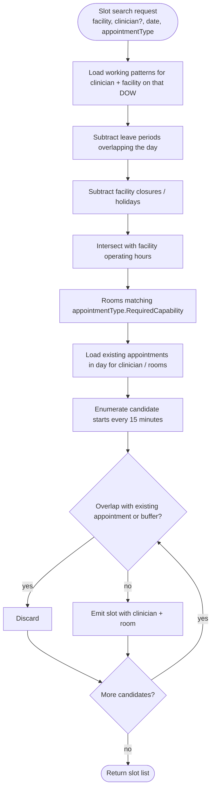
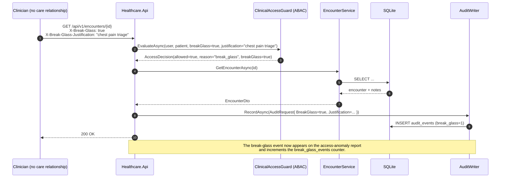

# Healthcare Appointment & Clinical Workflow Platform

> ⚠️ **Synthetic data only.** All patients, clinicians, facilities, and clinical notes in this
> project are fictional (e.g. `Nairobi Demo Clinic (fictional)`). Nothing here represents a
> real person, real hospital, or real clinical activity.
>
> ⚠️ **No compliance or certification is claimed.** This project describes *privacy and security
> design considerations* aligned to concepts found in HIPAA, GDPR, and ISO 27001; **no
> HIPAA/GDPR/ISO assessment, audit, or certification has been performed and none is claimed.**

## Portfolio Classification
Self-directed engineering case study.

The scheduling and coordination engine of a multi-site outpatient clinic. This project focuses on
the parts of healthcare software that genuinely are hard: **strict scheduling constraints,
provably correct concurrency, tightly scoped access control with a break-glass override, and
end-to-end auditability of every read of clinical data.**

## Executive Summary
A .NET 10 modular monolith that manages the operational lifecycle of an outpatient clinic:
patients, clinicians, facilities and rooms, appointment types with resource requirements,
slot generation, booking under contention, recurring series, waitlist and no-show handling,
patient-journey state machine, append-only clinical notes with amendments and co-signing,
referrals with SLA clocks, multi-channel reminders, RBAC + ABAC access control with
break-glass, an audit log covering every clinical read, and an operational dashboard.

- 4-project modular monolith: `Healthcare.Domain`, `Healthcare.Application`,
  `Healthcare.Infrastructure`, `Healthcare.Api`.
- EF Core 9 on SQLite by default (works out of the box; no external infrastructure required).
- 62 automated tests (29 unit + 33 integration) — all pass on `dotnet test -c Release`.
- Documented with 6 ADRs, security review, privacy considerations, database schema, scheduling
  model, three runbooks, five portfolio artefacts.

## Business Problem
Outpatient clinics are held together by scheduling correctness and by controls that make sure
the right people can see the right data at the right time. In practice:

1. Overlap-free slot allocation depends on working patterns, holidays, leave, room capabilities
   and appointment-type buffers — and must be timezone-correct across sites, including through
   DST transitions.
2. **Under contention (e.g. an online-booking widget, a waitlist auto-offer, a receptionist all
   working the same slot at once) exactly one booking must succeed.** Naive locking or
   optimistic concurrency at the row level is not enough; the constraint has to be at the
   database.
3. Clinicians must be able to read the notes of patients they are treating — but not of
   patients they are not treating. Break-glass access must be available for emergencies but
   must be audited and alerted, not silent.
4. Notes must be legally durable — nothing is ever overwritten or deleted; a change is an
   amendment (a new version) that references the original.
5. Every read of clinical data must be recorded for later access-anomaly review.

This project delivers each of these as a *tested* feature, not just a documented intention.

## Functional Requirements

### Facilities, rooms, resources
- Sites with timezone; per-day operating hours; holidays / closures.
- Rooms with capabilities (e.g. `gp`, `procedure`) and equipment.
- Appointment types with required resource / room capability.

### Clinicians
- Speciality, qualifications (all fictional — e.g. `MBChB (fictional)`).
- Per-site assignment.
- Recurring weekly working patterns.
- Leave / absence periods.
- Capacity rules: default duration, buffer/turnaround per appointment type,
  min break between appointments, max patients per day.

### Patients
- Synthetic demographics; a fictional patient-id scheme with a **check digit** (`P` +
  6-digit body + 1 check digit; check digit validated on registration and re-registration).
- Contact preferences (SMS / email), consent flags, allergies/alerts.
- Registered clinic.
- **Duplicate-detection on registration** using fuzzy name + DOB + phone.

### Appointment scheduling
- Slot-generation engine that computes availability from:
  working patterns − leave − holidays − existing bookings − buffers − room availability
  − room capability match.
- **Timezone-correct** across sites (a London-based facility crossing the March DST transition
  is tested).
- **Concurrent-booking-safe:** two parallel booking attempts on the same slot → exactly one
  success (proven by a real parallel test against the real DB).
- Reschedule, cancel with reason codes (`PatientRequest`, `ClinicianUnavailable`, `Weather`,
  `Other`), overbooking policy per appointment type, recurring series with exception dates.

### Waitlist & no-show
- Waitlist with priority; auto-offer when a slot is cancelled/freed; acceptance window
  (default 4 hours); offer expiry when window elapses.
- No-show recording; DNA statistics; policy hook to require confirmation for future bookings
  once a patient's DNA count crosses a threshold.

### Patient journey / encounter workflow
`Booked → Confirmed → CheckedIn → InTriage → WithClinician → AwaitingResults → Completed`
with terminal branches `NoShow` and `Cancelled`. Per-stage timestamps drive operational
metrics (median wait, throughput per clinician, utilisation %).

### Clinical notes
- Structured: chief complaint, observations/vitals, assessment, plan.
- **Append-only, with amendments.** An amendment is a new version referencing the original;
  nothing is ever overwritten or deleted. This is enforced at three layers: domain
  (`Encounter.AmendNote` never mutates prior notes), DbContext (`SaveChanges` rejects
  `UPDATE` and `DELETE` on `clinical_notes`), and integration tests.
- Vitals: **unit validation** (`temperature` accepts only `C`) and **plausibility ranges**
  (e.g. 30 – 45 °C for temperature).
- Authorship and optional co-sign by a supervising clinician.

### Referrals
- Internal (destination facility) and external (free-text destination).
- Priority: `Routine`, `Urgent`, `TwoWeek`.
- Workflow: `Draft → Submitted → Triaged → Accepted → Completed`, with `Rejected` as a
  terminal branch.
- **SLA clocks per priority** (14d / 7d / 14d) with escalation on breach.

### Access control (RBAC + ABAC)
- Roles: `Receptionist`, `Nurse`, `Clinician`, `ClinicalLead`, `Administrator`,
  `BillingClerk`, `Auditor`.
- **RBAC:** endpoints enforce role policies (e.g. only `Clinician` / `ClinicalLead` can add
  clinical notes; only `Auditor` can view the audit log).
- **ABAC (care relationship):** a clinician may read a patient's clinical record only if
  there is a care relationship (an appointment, an encounter, or a referral within a window).
- **Break-glass:** explicit override via `X-Break-Glass: true` +
  `X-Break-Glass-Justification: <text>` (justification required, non-empty). Every break-glass
  read is audited with `BreakGlass = true` and shows up on the access-anomaly report.
- **Field-level minimisation:** list endpoints return demographic / scheduling fields only;
  clinical fields require care relationship + audit.

### Audit
- Every access to patient data (**read included**) is audited with actor, actor role,
  purpose, patient identifier, correlation id, and break-glass flag.
- Access-anomaly report identifies (a) break-glass events, (b) staff reading patients
  they had no care relationship with, (c) out-of-hours access, and (d) reads of VIP patients.

### Reminders
- Multi-channel simulator (`SMS`, `Email`, `Voice`).
- Timezone-aware send windows.
- Configurable lead times (default 48h and 2h before).
- Confirmation replies (`YES`) transition `Booked → Confirmed`.
- Opt-out honoured (per patient flag).
- **Idempotent scheduling:** re-invoking the scheduler for the same appointment never
  produces duplicate rows.
- Retry / dead-letter for channel failures (deterministic in tests via `FakeClock`).

### Operational dashboard
Utilitarian HTML/JS pages: today's schedule per site, live clinic board with journey stages
and wait times, utilisation and DNA stats, referral SLA breaches, waitlist, and the access-anomaly
report.

## Non-Functional Requirements
- **Correctness under contention** for slot booking (proven by tests).
- **Deterministic reminder timing** in tests via `FakeClock` (no real time dependence).
- **No hidden state.** Every state change on an appointment or encounter emits an audit event.
- **Local-first developer experience.** No Docker required. No Postgres, no Redis. Just
  `dotnet run --project src\Healthcare.Api`.
- **Testability.** External integrations (SMS, email, LLM) live behind interfaces with
  in-memory adapters.
- **Observability.** OpenTelemetry meter `Healthcare` exposes booking latency, slot-search
  duration, utilisation gauge, and break-glass counter.
- **Documented.** README + 6 ADRs + security review + privacy considerations + scheduling
  model + database schema + 3 runbooks + 5 portfolio artefacts.

## Architecture

Four assemblies:

| Layer                     | Responsibility                                                        |
| ------------------------- | --------------------------------------------------------------------- |
| `Healthcare.Domain`       | Aggregates, value objects, domain events, invariants. No I/O.         |
| `Healthcare.Application`  | Use cases, DTOs, `IAppDbContext` abstraction, service orchestration.  |
| `Healthcare.Infrastructure` | EF Core, SQLite / Postgres providers, external adapters, audit sink. |
| `Healthcare.Api`          | ASP.NET Core minimal APIs, JWT, ProblemDetails, OpenAPI, dashboard.   |

Dependencies point inward: `Api → Application → Domain`, `Infrastructure → Application →
Domain`. `Api` composes `Infrastructure` at the composition root only.

## Architecture Diagram

### Platform (container view)



### Appointment lifecycle state diagram



### Slot-availability computation flow



### Break-glass access sequence



## Technology Stack
- **.NET 10 SDK 10.0.400**, `net10.0` target.
- **EF Core 9** with SQLite (default) or Postgres (via connection string).
- **ASP.NET Core minimal APIs**, JWT bearer, ProblemDetails, OpenAPI (Swashbuckle).
- **xUnit** for tests; `WebApplicationFactory<Program>` for integration tests against an
  open in-memory SQLite (shared across tests within a class fixture).
- **OpenTelemetry** metrics (meter `Healthcare`).
- **BCrypt.Net** (via the auth token endpoint; only fictional users seeded).

## Domain Model
Aggregates (each with private setters, factory methods, and invariant enforcement):

| Aggregate root       | Highlights                                                             |
| -------------------- | ---------------------------------------------------------------------- |
| `Facility`           | Rooms, operating hours, closures; timezone stored as IANA id.          |
| `Clinician`          | Working patterns, leave, per-facility assignments.                     |
| `Patient`            | `PatientId` value object with check digit; consents; VIP flag.         |
| `Appointment`        | State machine; reschedule/cancel guarded by status; buffers.           |
| `Encounter`          | Notes (append-only), vitals, co-sign, close guard.                     |
| `ClinicalNote`       | Immutable; amendments are new rows on the same `RootNoteId`.           |
| `Referral`           | State machine + SLA due date computed from priority.                   |
| `WaitlistEntry`      | Priority + auto-offer; offer expiry.                                   |
| `Reminder`           | Idempotent per `(AppointmentId, LeadTime)`; per-channel status.        |
| `AuditEvent`         | Append-only at the persistence layer.                                  |

## Core Workflows

### Booking flow
1. Receptionist calls `POST /api/v1/appointments`.
2. `AppointmentBookingService` loads patient & appointment type, computes `EndUtc = Start +
   Duration`.
3. Application-level overlap check: any active appointment for the same clinician-or-room
   overlapping (Start, End)? If yes → 409 `appointment.conflict`.
4. `Appointment.Book(...)` creates the aggregate.
5. `SaveChangesAsync` inserts. A **filtered unique index** on `(ClinicianId, StartUtc)` and
   `(RoomId, StartUtc)` filtered to non-terminal statuses enforces the constraint at the
   database level.
6. On unique-constraint violation (concurrent lost race), the service catches the
   `DbUpdateException` and translates to `409 appointment.conflict`.
7. Audit event `appointment.book` written.

### Reminder scheduling & dispatch
1. `ReminderService.ScheduleAsync(appointmentId)` — idempotent. For each configured lead time,
   insert one `Reminder` row unless one already exists for the same `(AppointmentId, LeadTime,
   Channel)`. Idempotent per lead time.
2. `ReminderService.DispatchDueAsync()` runs in the background (in tests, called explicitly
   with a `FakeClock`).
3. Each due `Reminder` is dispatched via all registered `IReminderChannel`s; success flips
   `Status = Sent`, failure increments retries; permanent failures land in DLQ.
4. `ReminderService.ApplyConfirmationAsync(appointmentId)` transitions `Booked → Confirmed`.

### Access-control decision
- Endpoint requires an `Authorization: Bearer <jwt>` token with the required role.
- On a clinical read, endpoint calls `ClinicalAccessGuard.EvaluateAsync(user, patient,
  breakGlass?, justification?)`.
- Guard returns `AccessDecision(allowed, reason, breakGlass)`.
- Endpoint records an `AuditEvent` regardless of decision.
- On `allowed = false`, endpoint returns `403 Forbidden`.

## Security Model
See `docs/security/security-review.md` for the full STRIDE analysis and the explicit non-claims
statement, and `docs/privacy-considerations.md` for the data-minimisation / retention model.

Highlights:
- JWT bearer, symmetric key from `Auth:SigningKey` (dev key in `.env.example` is clearly a
  fictional placeholder — regenerate before any real use).
- Every request receives a correlation id (either the incoming `X-Correlation-Id` header or a
  freshly generated GUID).
- RBAC via ASP.NET Core policies; ABAC via `ClinicalAccessGuard` at the endpoint.
- Break-glass requires a non-empty justification header; missing justification denies.
- Audit log is append-only (rejected at `AppDbContext.SaveChanges` if modified or deleted).
- Rate limiting via ASP.NET Core `AddRateLimiter` (fixed-window; 200 req/min per user by default).

## Reliability & Failure Handling
- **Concurrency:** filtered unique indexes at the DB layer.
- **Reminders:** idempotent schedule; retry with attempt counter; DLQ on max attempts.
- **State machine guards** on `Appointment`, `Encounter`, `Referral` throw `DomainException`
  which the middleware translates to `422 UnprocessableEntity` with ProblemDetails.
- **Correlation id** on every response header for correlation across logs.
- **FakeClock** for deterministic tests.

## Observability
Meter `Healthcare` exposes:

| Instrument                     | Type       | Meaning                                          |
| ------------------------------ | ---------- | ------------------------------------------------ |
| `healthcare.booking.latency`   | Histogram  | Time from booking request to SaveChanges commit. |
| `healthcare.slots.search.ms`   | Histogram  | Slot-search duration by facility.                |
| `healthcare.utilisation`       | Observable | % of clinician working hours booked today.       |
| `healthcare.break_glass.total` | Counter    | Total break-glass events since process start.    |

All endpoints emit correlation-id-prefixed logs. ProblemDetails responses include `traceId`.

## Testing Strategy
- **29 unit tests** (Domain + Application in isolation): patient id check digit, slot generation,
  encounter state machine, notes append-only, vitals validation, referral SLA computation,
  reminder policy, waitlist priority, etc.
- **33 integration tests** (`WebApplicationFactory<Program>` + open in-memory SQLite):
  - `AvailabilityTests` — slot generation, DST correctness, room/buffer conflicts.
  - `AppointmentLifecycleTests` — book / reschedule / cancel-then-rebook / full state
    machine walkthrough / 422 for bad body.
  - `ConcurrentBookingTests` — **two parallel booking attempts → exactly one success**, count
    verified against the DB.
  - `WaitlistTests` — auto-offer on cancel, expiry after window.
  - `ClinicalNotesTests` — append-only enforced at persistence layer, amendment creates new
    version, vitals 422 for wrong unit.
  - `AccessControlTests` — receptionist blocked from clinical, clinician with/without care
    relationship, break-glass grants access and audits and is flagged as anomaly, missing
    justification denies, unauthenticated 401, auditor standing access.
  - `ReminderTests` — idempotent scheduling, dispatch marks sent + logs SMS, opt-out skipped,
    confirmation reply confirms appointment.
  - `ReferralAndRegistrationTests` — fuzzy duplicate detection, non-duplicate allowed, urgent
    SLA breach after clock advance, accepted before breach doesn't breach.
  - `ApiSurfaceTests` — health, dev-token endpoint, 401.

## Local Development
Requires **.NET 10 SDK 10.0.400** on Windows/macOS/Linux.

```powershell
git clone <this repo>
cd 23-healthcare-workflow-platform

# 1. Restore and build.
dotnet build -c Release

# 2. Run the API on port 5023.
dotnet run --project src\Healthcare.Api
# → https://localhost:5023/swagger

# 3. Run every test.
dotnet test -c Release
```

- Default database: SQLite file `healthcare.db` in the API working directory.
- To use Postgres instead, set `ConnectionStrings__Default` in your environment; the DbContext
  auto-detects the provider from the connection string prefix.
- The dev-only auth endpoint `POST /auth/dev-token` mints a JWT for a fictional user (see
  `.env.example`).

## Running with Docker
Docker configuration created but **Docker is unavailable on the build host; the compose stack
has not been started or verified.** The `Dockerfile` and `docker-compose.yml` are provided
as an unverified starting point for later work — labelled `# UNVERIFIED` at the top of each
file. See `Dockerfile` and `docker-compose.yml`.

## API Documentation

OpenAPI: `https://localhost:5023/swagger`.

Top-level endpoints:

| Method | Path                                             | Purpose                                       |
| ------ | ------------------------------------------------ | --------------------------------------------- |
| POST   | `/auth/dev-token`                                | Dev-only token for a fictional user.          |
| GET    | `/health/live`, `/health/ready`                  | Liveness / readiness.                         |
| GET    | `/api/v1/facilities`                             | List facilities.                              |
| GET    | `/api/v1/clinicians`                             | List clinicians.                              |
| POST   | `/api/v1/patients`                               | Register a patient (duplicate detection).     |
| GET    | `/api/v1/availability`                           | Slot search.                                  |
| POST   | `/api/v1/appointments`                           | Book an appointment.                          |
| POST   | `/api/v1/appointments/{id}/reschedule`           | Reschedule.                                   |
| POST   | `/api/v1/appointments/{id}/cancel`               | Cancel.                                       |
| POST   | `/api/v1/appointments/{id}/status`               | Advance the state machine.                    |
| GET    | `/api/v1/appointments/{id}`                      | Retrieve.                                     |
| POST   | `/api/v1/encounters`                             | Open an encounter for an appointment.         |
| POST   | `/api/v1/encounters/{id}/notes`                  | Add a note.                                   |
| POST   | `/api/v1/encounters/{id}/notes/{noteId}/amend`   | Amend a note (new version).                   |
| POST   | `/api/v1/encounters/{id}/vitals`                 | Record a vital.                               |
| POST   | `/api/v1/encounters/{id}/cosign`                 | Co-sign.                                      |
| POST   | `/api/v1/referrals`                              | Create referral.                              |
| POST   | `/api/v1/referrals/{id}/transition`              | Submit / triage / accept / reject / complete. |
| POST   | `/api/v1/waitlist`                               | Add to waitlist.                              |
| POST   | `/api/v1/reminders/schedule`                     | Force schedule (idempotent).                  |
| POST   | `/api/v1/reminders/{id}/confirm`                 | Apply confirmation reply.                     |
| GET    | `/api/v1/reports/utilisation`                    | Utilisation per clinician.                    |
| GET    | `/api/v1/reports/access-anomalies`               | Access-anomaly report.                        |
| GET    | `/api/v1/audit`                                  | Audit log (Auditor role only).                |

## Example Usage

### 1) Get a dev token as a receptionist

```powershell
$body = @{ userId = "recep-1"; roles = @("Receptionist") } | ConvertTo-Json
$token = (Invoke-RestMethod -Uri https://localhost:5023/auth/dev-token -Method POST `
    -ContentType 'application/json' -Body $body).accessToken
```

### 2) Book an appointment

```powershell
$hdrs = @{ Authorization = "Bearer $token"; 'X-Correlation-Id' = [guid]::NewGuid() }
$req = @{
    patientId          = "b3a0f52c-...-..."
    clinicianId        = "27d2f3ee-...-..."
    facilityId         = "5d4c1a6b-...-..."
    roomId             = "af07b3c8-...-..."
    appointmentTypeId  = "10a2c5d4-...-..."
    startUtc           = "2026-09-07T06:00:00Z"
} | ConvertTo-Json
Invoke-RestMethod -Uri https://localhost:5023/api/v1/appointments -Method POST `
    -Headers $hdrs -ContentType 'application/json' -Body $req
```

Response (201 Created):

```json
{
  "id": "e2f4d3a1-...",
  "patientId": "b3a0f52c-...",
  "clinicianId": "27d2f3ee-...",
  "startUtc": "2026-09-07T06:00:00Z",
  "endUtc": "2026-09-07T06:15:00Z",
  "status": "Booked"
}
```

### 3) Break-glass read of a clinical encounter

```powershell
$hdrs = @{
    Authorization              = "Bearer $clinicianToken"
    'X-Break-Glass'            = "true"
    'X-Break-Glass-Justification' = "Suspected sepsis - patient in ED"
}
Invoke-RestMethod -Uri https://localhost:5023/api/v1/encounters/$encId -Method GET -Headers $hdrs
```

Every field returned is also logged with `break_glass = true` in the audit table; the
endpoint returns 200 and the access-anomaly report will surface the event.

## Performance / Load Testing
No formal load test was executed. Design supports:
- Slot search: O(candidate_slots × log(existing_appointments)) using the day-indexed
  `(ClinicianId, StartUtc)` index.
- Booking: two SELECT + one INSERT + one INSERT into audit; unique-index enforcement at
  the DB layer means it is safe under contention.

The scheduling model in `docs/scheduling-model.md` documents the algorithmic complexity
and where a Postgres deployment would scale further via partial-indexes and window queries.

## Trade-offs
See ADRs. Headline trade-offs:

- **Modular monolith vs microservices.** A single deployable simplifies cross-aggregate
  transactions (e.g. booking + audit + reminder scheduling) at the cost of independent
  deployability. Justified for a single-clinic operational domain.
- **On-demand slot generation vs precomputed slots.** On-demand is chosen for correctness
  (no cache invalidation) at the cost of higher per-request compute. See ADR-003.
- **SQLite for local dev vs Postgres in prod.** Filtered unique indexes work in both; the
  same schema deploys to both. See ADR-004.
- **Break-glass by header vs pre-approval.** Header + audit + review chosen for latency;
  formal review out of band. See ADR-005.
- **Amendments as new rows vs blob history.** New rows preserve full queryability; keeps
  the `clinical_notes` table simple. See ADR-002.

## Architecture Decisions
See `docs/decisions/`:

- ADR-001 — RBAC + ABAC care-relationship model.
- ADR-002 — Append-only clinical notes with amendments.
- ADR-003 — On-demand slot generation.
- ADR-004 — Timezone handling (UTC storage, IANA site tz).
- ADR-005 — Break-glass design.
- ADR-006 — SQLite as default persistence, Postgres compatible.

## Known Limitations
- **All data synthetic.** No real integration with a HIS/EMR is provided; the reminder
  channels are in-memory simulators.
- **No compliance certification.** This project uses concepts from HIPAA / GDPR / ISO 27001
  as *design references only*.
- **Dev token endpoint** is enabled by default. In a real deployment it must be disabled
  and replaced with a real IdP.
- **No load test** was performed.
- **Docker configuration is unverified** (no Docker on build host).
- **Recurring series** support is partial: exception dates are modeled but the recurring
  materialisation background job is not scheduled.
- **Voice reminder channel** is stubbed as SMS behaviour.

## Future Improvements
- FHIR-lite adapter to publish events to a downstream integration engine (`ADT^A04`,
  `SIU^S12` analogues).
- Push notifications channel.
- Consent-management UI (currently API-only).
- Recurring-series materialisation background service.
- Per-tenant JWT audiences and per-site rate-limit buckets.

## Portfolio Talking Points
See `docs/portfolio/interview-talking-points.md`. Two are worth naming here:

1. **Concurrent booking correctness under contention** — proven by a real parallel
   integration test, not a mock.
2. **Break-glass as a first-class citizen** — required justification, always audited,
   always visible on the anomaly report. Real hospitals need this exact control; naïve
   role-based systems do not have it.

## Upwork Portfolio Description
See `docs/portfolio/upwork-description.md`.
