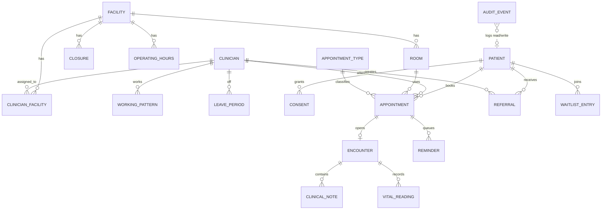

# Database schema

> ⚠️ Schema is defined by EF Core migrations in `Healthcare.Infrastructure/Persistence`. This
> document is a hand-maintained summary. Types shown are the CLR types; SQLite maps them to
> `INTEGER`, `TEXT`, `REAL`, `BLOB` as usual, with UTC `DateTimeOffset` stored as `long`
> ticks via a global value converter.

## Tables

### `facilities`
| Column         | Type              | Notes                                    |
| -------------- | ----------------- | ---------------------------------------- |
| `Id`           | Guid (PK)         |                                          |
| `Code`         | string(32)        | Unique.                                  |
| `Name`         | string(128)       |                                          |
| `TimezoneId`   | string(64)        | IANA tz id.                              |
| `IsActive`     | bool              |                                          |

### `rooms`
| Column         | Type              | Notes                                    |
| -------------- | ----------------- | ---------------------------------------- |
| `Id`           | Guid (PK)         |                                          |
| `FacilityId`   | Guid (FK)         | `facilities(Id)`.                        |
| `Name`         | string(64)        |                                          |
| `Capabilities` | string (CSV)      | e.g. `gp;procedure`.                     |

### `operating_hours`
| Column         | Type              | Notes                                    |
| -------------- | ----------------- | ---------------------------------------- |
| `FacilityId`   | Guid (FK)         | Composite key.                           |
| `Day`          | int (DayOfWeek)   | 0..6.                                    |
| `OpenLocal`    | TimeOnly          |                                          |
| `CloseLocal`   | TimeOnly          |                                          |

### `closures`
| Column         | Type              | Notes                                    |
| -------------- | ----------------- | ---------------------------------------- |
| `Id`           | Guid (PK)         |                                          |
| `FacilityId`   | Guid (FK)         |                                          |
| `From`         | DateOnly          |                                          |
| `To`           | DateOnly          |                                          |
| `Reason`       | string(128)       |                                          |

### `clinicians`
| Column         | Type              | Notes                                    |
| -------------- | ----------------- | ---------------------------------------- |
| `Id`           | Guid (PK)         |                                          |
| `GivenName`    | string(64)        |                                          |
| `FamilyName`   | string(64)        |                                          |
| `Speciality`   | string(64)        |                                          |
| `Qualifications` | string (CSV)    |                                          |
| `IsActive`     | bool              |                                          |

### `clinician_facilities`, `working_patterns`, `leave_periods`
Assignment and calendar tables owned by the `Clinician` aggregate.

### `patients`
| Column           | Type              | Notes                                  |
| ---------------- | ----------------- | -------------------------------------- |
| `Id`             | Guid (PK)         |                                        |
| `ExternalId`     | string(16)        | `P######C` check-digit scheme; unique. |
| `GivenName`      | string(64)        |                                        |
| `FamilyName`     | string(64)        |                                        |
| `DateOfBirth`    | DateOnly          |                                        |
| `Sex`            | string(16)        | Free text kept intentionally.          |
| `PhoneE164`      | string(24)        |                                        |
| `Email`          | string(128)?      |                                        |
| `PreferredChannel` | int              | Enum.                                  |
| `RegisteredClinicId` | Guid          | FK `facilities`.                       |
| `IsVip`          | bool              |                                        |
| `OptedOutOfReminders` | bool         |                                        |

### `consents`
Per-purpose consent grant tracking (owned by Patient).

### `appointments`
| Column               | Type              | Notes                                  |
| -------------------- | ----------------- | -------------------------------------- |
| `Id`                 | Guid (PK)         |                                        |
| `PatientId`          | Guid (FK)         |                                        |
| `ClinicianId`        | Guid (FK)         |                                        |
| `FacilityId`         | Guid (FK)         |                                        |
| `RoomId`             | Guid (FK)         |                                        |
| `AppointmentTypeId`  | Guid (FK)         |                                        |
| `StartUtc`           | long (ticks)      | Via DateTimeOffset converter.          |
| `EndUtc`             | long (ticks)      |                                        |
| `Status`             | int (enum)        | See `AppointmentStatus`.               |
| `CancellationReason` | int?              |                                        |
| `CancellationNotes`  | string(512)?      |                                        |

**Indexes:**
- `IX_appointments_ClinicianId_StartUtc`
- `IX_appointments_RoomId_StartUtc`
- `ux_appointments_clinician_slot_active` — UNIQUE `(ClinicianId, StartUtc)` filtered
  `WHERE "Status" NOT IN (7, 8)` — enforces exactly-one-booking under contention.
- `ux_appointments_room_slot_active` — UNIQUE `(RoomId, StartUtc)` filtered
  `WHERE "Status" NOT IN (7, 8)`.

### `appointment_types`
Duration, buffer, capability requirement, overbooking flag.

### `recurring_series`, `series_exceptions`
Optional recurring booking rules and exception dates.

### `encounters`
One per appointment (unique).

### `clinical_notes`
| Column           | Type              | Notes                                  |
| ---------------- | ----------------- | -------------------------------------- |
| `Id`             | Guid (PK)         |                                        |
| `EncounterId`    | Guid (FK)         |                                        |
| `RootNoteId`     | Guid              | Points at initial version.             |
| `Version`        | int               | 1 for initial, 2+ for amendments.      |
| `IsAmendment`    | bool              |                                        |
| `AmendmentReason`| string(512)?      |                                        |
| `AuthorId`       | Guid              |                                        |
| `ChiefComplaint` | string(1024)      |                                        |
| `Observations`   | string(4096)      |                                        |
| `Assessment`     | string(4096)      |                                        |
| `Plan`           | string(4096)      |                                        |
| `CreatedAtUtc`   | long (ticks)      |                                        |

**Indexes:** UNIQUE `(RootNoteId, Version)`.

Persistence: `SaveChanges` refuses UPDATE and DELETE (append-only).

### `vital_readings`
| Column           | Type              | Notes                                  |
| ---------------- | ----------------- | -------------------------------------- |
| `Id`             | Guid (PK)         |                                        |
| `EncounterId`    | Guid (FK)         |                                        |
| `Kind`           | string(64)        | `temperature`, `heartRate`, ...        |
| `Value`          | decimal(10,2)     |                                        |
| `Unit`           | string(16)        | Validated in domain.                   |
| `RecordedAtUtc`  | long (ticks)      |                                        |

### `referrals`
| Column           | Type              | Notes                                  |
| ---------------- | ----------------- | -------------------------------------- |
| `Id`             | Guid (PK)         |                                        |
| `PatientId`      | Guid              |                                        |
| `ReferringClinicianId` | Guid        |                                        |
| `DestinationFacilityId` | Guid?      | Or free-text destination.              |
| `ExternalDestination` | string(128)? |                                        |
| `Speciality`     | string(64)        |                                        |
| `Priority`       | int (enum)        | Routine/Urgent/TwoWeek.                |
| `Reason`         | string(1024)      |                                        |
| `Status`         | int (enum)        | Draft/Submitted/Triaged/Accepted/…     |
| `SlaDueUtc`      | long (ticks)      | Computed from priority + submitted.    |
| `SlaBreached`    | bool              | Flipped by `EvaluateSlasAsync`.        |

### `waitlist_entries`
| Column           | Type              | Notes                                  |
| ---------------- | ----------------- | -------------------------------------- |
| `Id`             | Guid (PK)         |                                        |
| `PatientId`      | Guid              |                                        |
| `AppointmentTypeId` | Guid           |                                        |
| `Priority`       | int               |                                        |
| `Status`         | int (enum)        | Active/Offered/Accepted/Expired/…      |
| `OfferedAtUtc`   | long?             |                                        |
| `AcceptanceDeadlineUtc` | long?      |                                        |

### `reminders`
| Column           | Type              | Notes                                  |
| ---------------- | ----------------- | -------------------------------------- |
| `Id`             | Guid (PK)         |                                        |
| `AppointmentId`  | Guid (FK)         |                                        |
| `LeadTime`       | TimeSpan          | e.g. 48h.                              |
| `Channel`        | int (enum)        | SMS/Email/Voice.                       |
| `SendAtUtc`      | long (ticks)      |                                        |
| `Status`         | int (enum)        | Pending/Sent/Failed/DeadLetter.        |
| `Attempts`       | int               |                                        |

**Indexes:** UNIQUE `(AppointmentId, LeadTime, Channel)` — enforces idempotency.

### `audit_events`
| Column           | Type              | Notes                                  |
| ---------------- | ----------------- | -------------------------------------- |
| `Id`             | Guid (PK)         |                                        |
| `Kind`           | int (enum)        | PatientDataRead/PatientDataWrite/…     |
| `ActorId`        | string(64)        |                                        |
| `ActorRole`      | string(64)        |                                        |
| `PatientExternalId` | string(16)?    |                                        |
| `Resource`       | string(128)?      |                                        |
| `Action`         | string(64)        |                                        |
| `Purpose`        | string(64)        |                                        |
| `CorrelationId`  | string(64)        |                                        |
| `BreakGlass`     | bool              |                                        |
| `Justification`  | string(512)?      |                                        |
| `VipPatient`     | bool              |                                        |
| `AtUtc`          | long (ticks)      |                                        |

Persistence: append-only.

## ER diagram

