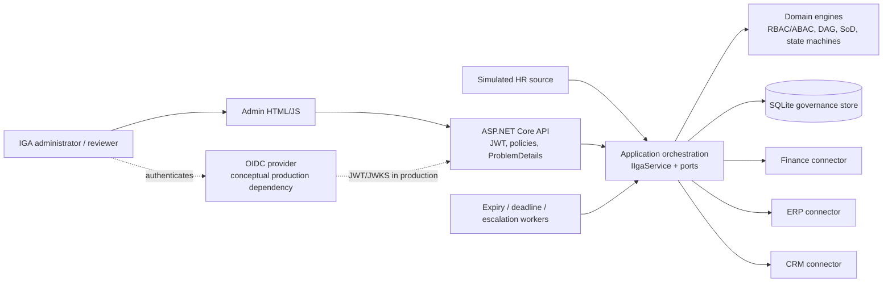
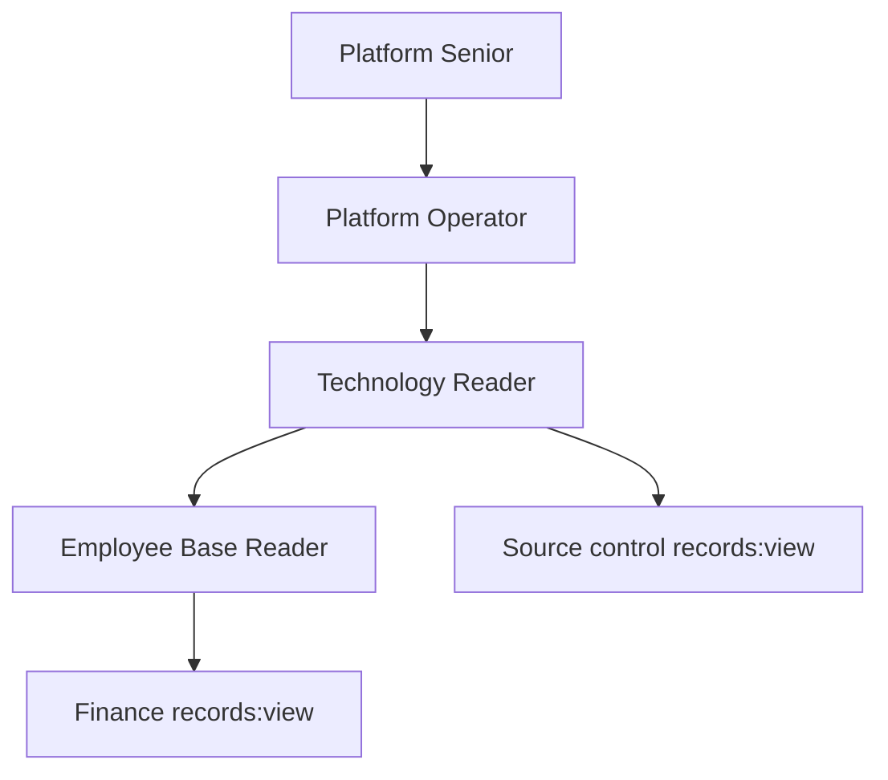
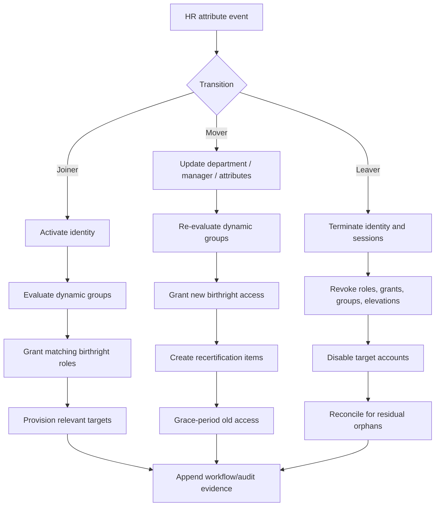
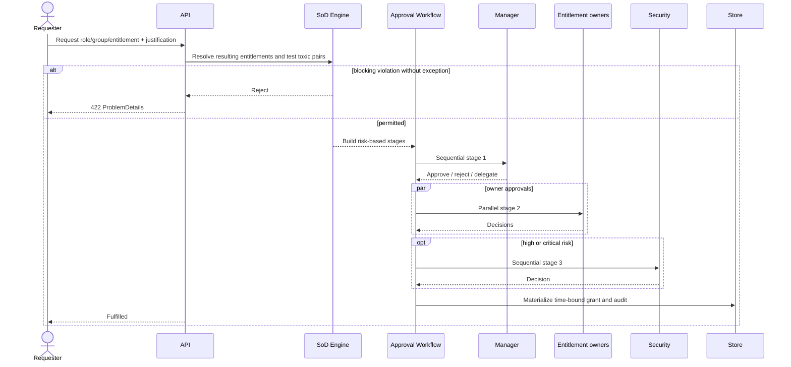
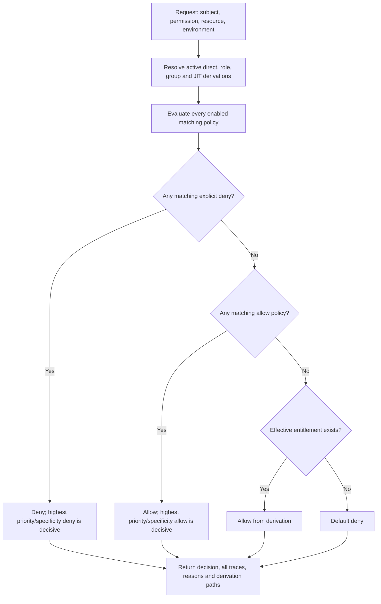

# Northstar Identity & Access Management Administration Portal

## Portfolio Classification

Self-directed engineering case study. This repository is a production-style reference implementation of an identity governance and administration (IGA) control plane for **Northstar Group (fictional)**. It is not client work, is not deployed, and makes no claim of production scale or certification.

## Executive Summary

The portal governs approximately 500 deterministic synthetic identities and 25 fictional applications. It implements joiner-mover-leaver automation, dynamic groups, hierarchical roles, RBAC plus ABAC policy evaluation, separation of duties, multi-stage approvals, just-in-time privileged access, certification campaigns, simulated provisioning/reconciliation, explainable access reports, SCIM-shaped endpoints, and append-only audit records.

The design deliberately separates governance from authentication. In a real enterprise, an OIDC provider such as Microsoft Entra ID would authenticate administrators and workloads; this service would decide and orchestrate who should have access, provision that access, and prove why it exists.

## Business Problem

Enterprises accumulate access through job changes, nested roles, target-side manual grants, temporary incidents, and inconsistent approvals. Reviewers then struggle to answer:

- What can this person access?
- Why do they have it?
- Does the access violate policy or separation of duties?
- Who approved it, and has the approval expired?
- Did the target system drift from the governance source?
- What happens when a person joins, moves, or leaves?

This project makes those questions executable rather than spreadsheet-driven.

## Functional Requirements

- Joiner, mover, and leaver workflows with retryable audited steps.
- Employment attributes, lifecycle status, manager relationships, start/end dates, and session termination metadata.
- Static and dynamic groups whose rules are re-evaluated after identity changes.
- Role inheritance as a cycle-free DAG with transitive entitlement resolution.
- Business-readable entitlement catalogue with application scope, owners, risk, and privileged classification.
- Hybrid RBAC/ABAC decisions with subject, resource, and environment attributes; deny always wins.
- Explainable `POST /api/v1/authz/evaluate` and estate-wide policy what-if simulation.
- Preventive and detective separation-of-duties controls with expiring approved exceptions.
- Sequential and parallel approvals, delegation, SLA escalation, auto-approval, and reasoned rejection.
- Time-boxed elevation, mandatory ticket/justification, approval option, alert audit, recording metadata, early revocation, and automatic expiry.
- Campaign generation by application, department, or risk; bulk certification; deadline auto-revocation; progress/reporting.
- Three deterministic target connectors plus an HR source, retries, quarantine, reconciliation, orphan and rogue-grant detection.
- Append-only hash-linked audit and governance reports, including complete access derivation paths.
- Utilitarian administration UI and core SCIM 2.0 user/group surfaces.

## Non-Functional Requirements

- Runs offline with .NET 10 and SQLite; no database server, queue, cache, Docker daemon, or paid API.
- Release build and tests are independently executable from the solution root.
- Correlation IDs, RFC 7807 errors, security headers, rate limiting, JWT scopes, health probes, OpenAPI, and Swagger UI.
- Bounded pagination, deterministic synthetic data, typed validated configuration, cancellation propagation, and no real secrets or personal data.
- Background expiry/deadline processing uses `IClock`; integration tests replace it with `FakeClock`.

## Architecture

The system is a modular monolith with ports and adapters:

- **Domain** owns entities, policy matching, role graph traversal, dynamic-group rules, SoD detection, and approval state transitions.
- **Application** owns commands, report DTOs, options, telemetry instruments, `IIgaService`, `IClock`, token, HR, and provisioning ports.
- **Infrastructure** owns EF Core/SQLite, connector simulators, JWT-independent orchestration, seed data, audit chaining, and reports.
- **API** owns HTTP, JWT validation/token adapter, scope policies, middleware, workers, Swagger/OpenAPI, SCIM, and static administration assets.

The governance store is intentionally authoritative for desired access. Simulated targets are independent so reconciliation can expose drift.

## Architecture Diagram



## Technology Stack

| Area | Choice |
|---|---|
| Runtime | .NET 10 / ASP.NET Core minimal APIs |
| Persistence | EF Core 10 + SQLite default |
| Authentication | JWT bearer; local development token issuer; conceptual production OIDC |
| Authorization | API scope policies plus custom explainable RBAC/ABAC engine |
| Observability | OpenTelemetry traces/metrics, structured `ILogger`, health checks |
| API discovery | ASP.NET OpenAPI JSON and Swashbuckle UI |
| Tests | xUnit, `WebApplicationFactory<Program>`, SQLite in-memory, `FakeClock` |
| UI | Dependency-free HTML, CSS, and JavaScript |

## Domain Model

The central aggregates and records are:

- `UserIdentity`, `Group`, `Role`, `Entitlement`, `PolicyDefinition`
- `UserRoleGrant`, `UserEntitlementGrant`, `UserEntitlementExclusion`
- `AccessRequest`, `ApprovalStep`, `Elevation`
- `SoDRule`, `SoDException`
- `CertificationCampaign`, `CertificationItem`
- `LifecycleWorkflow`, `LifecycleWorkflowStep`
- `ProvisioningAccount`, `ProvisioningGrant`, `ProvisioningJob`, `ProvisioningQuarantineItem`
- `AuditRecord`

Role inheritance points from a role to the role it inherits. Resolution walks every path, preserving multiple derivations rather than flattening away evidence.



## Core Workflows

### Joiner-mover-leaver



### Access request approval



### Policy evaluation



## Security Model

- JWT bearer authentication protects governance APIs; scope policies distinguish read, administration, and approval actions.
- Local token issuance exists only in `Development` and `Testing`; production startup rejects the default signing key.
- Approval commands bind the asserted approver/reviewer ID to the JWT subject, preventing body-level approver spoofing.
- Explicit deny policies override ABAC allows, RBAC grants, group-derived access, and JIT elevation.
- SoD checks occur before requests are accepted and as an estate scan.
- Audit rows cannot be updated or deleted through EF Core; each row includes previous/record hashes.
- CSP, frame denial, MIME sniffing protection, permissions policy, referrer policy, rate limiting, correlation IDs, and bounded request surfaces are enabled.
- The detailed threat model is in `docs/security/security-review.md`.

## Reliability & Failure Handling

- Lifecycle transitions persist named steps, attempt counts, terminal state, error details, and audit evidence.
- Target operations retry bounded transient failures; exhaustion creates a quarantine record instead of silently dropping work.
- Reconciliation is independent of provisioning and detects orphan accounts plus target-side rogue grants.
- Approval SLA escalation and campaign/JIT expiry are background jobs and callable administration operations.
- Campaign revocation writes an explicit user-entitlement exclusion, so nested role/group derivations cannot immediately reintroduce uncertified access.
- SQLite transactions protect seed creation; unique indexes reject duplicate catalogue and relationship records.

## Observability

OpenTelemetry instruments ASP.NET Core and the custom `Northstar.Iga` meter/source. Business telemetry includes:

- `iga.authorization.decision.duration` histogram
- `iga.requests.pending` observable gauge
- `iga.elevations.active` observable gauge
- `iga.campaign.completion` observable gauge
- `iga.audit.events` counter

All responses carry `X-Correlation-Id`. Audit records also store the correlation identifier. `/health/live` tests process liveness and `/health/ready` checks SQLite connectivity.

## Testing Strategy

The suite contains substantially more than the required 30 tests:

- Domain tests pin deep role inheritance, cycle detection, dynamic membership rules, deny precedence, ABAC subject/resource/environment comparisons, explanation traces, SoD, approval state transitions, and identity invariants.
- SQLite-backed integration tests exercise all three lifecycle transitions, manager-change recertification, policy simulation, preventive/detective SoD, expiring exceptions, sequential/parallel/delegated/escalated approvals, JIT expiry with `FakeClock`, certification, provisioning retries/quarantine/reconciliation, audit immutability, validation, 401, and 403.
- The exact final command output is recorded in `docs/test-results.md`.

## Local Development

Prerequisite: .NET SDK 10.

```powershell
Set-Location C:\Users\rukwaropaul\Downloads\DEV\Projects\24-identity-access-management
dotnet restore
dotnet build -c Release
dotnet test -c Release
dotnet run --project src\Northstar.Iga.Api --launch-profile http
```

Open:

- Admin UI: `http://localhost:5024/`
- Swagger UI: `http://localhost:5024/docs`
- OpenAPI JSON: `http://localhost:5024/openapi/v1.json`
- Readiness: `http://localhost:5024/health/ready`

Development startup creates `northstar-iga.db` and idempotently seeds 500 synthetic identities and 25 fictional applications.

## Running with Docker

Docker configuration created but Docker is unavailable on the build host; the compose stack has not been started or verified.

The authored, unverified command is:

```powershell
docker compose up --build
```

## API Documentation

| Surface | Key routes |
|---|---|
| Authentication | `POST /api/v1/auth/token` (development/testing only) |
| Identities | `/api/v1/users`, `/{id}/joiner`, `/{id}/mover`, `/{id}/leaver`, `/{id}/access-profile` |
| Catalogue | `/api/v1/applications`, `/api/v1/groups`, `/api/v1/roles`, `/api/v1/entitlements` |
| Policies | `/api/v1/policies`, `/api/v1/policies/simulate` |
| Decision | `POST /api/v1/authz/evaluate` |
| Requests | `/api/v1/requests`, step approve/reject/delegate, `/escalate` |
| JIT | `/api/v1/elevations`, approve/revoke/expire |
| Certification | `/api/v1/campaigns`, items/progress/certify, auto-revoke-overdue |
| SoD | `/api/v1/sod/rules`, `/exceptions`, `/violations` |
| Provisioning | `/api/v1/provisioning/{connector}/users/{user}`, `/reconcile`, `/hr/import`, `/quarantine` |
| Reports | entitlement holders, user access, privileged, dormant, SoD, orphaned, certification status |
| Audit | `/api/v1/audit` |
| SCIM-shaped | `/scim/v2/Users`, `/scim/v2/Groups` |

All protected endpoints use bearer authentication. Pagination is implemented on users and audit; list sizes are capped server-side.

## Example Usage

Issue a local development token:

```powershell
$tokenResponse = Invoke-RestMethod -Method Post `
  -Uri http://localhost:5024/api/v1/auth/token `
  -ContentType application/json `
  -Body '{"subject":"portfolio-demo","scopes":["iga.read","iga.admin","iga.approve"]}'
$headers = @{ Authorization = "Bearer $($tokenResponse.accessToken)" }
```

List synthetic users:

```powershell
$users = Invoke-RestMethod `
  -Uri 'http://localhost:5024/api/v1/users?page=1&pageSize=10' `
  -Headers $headers
$users.items | Select-Object displayName, department, status
```

Ask “can this user do this, and why?”:

```powershell
$body = @{
  userId = $users.items[0].id
  permission = 'app:finance/vendor:create'
  resource = @{ classification = 'Internal'; costCentre = 'CC-FIN' }
  environment = @{
    networkZone = 'Corporate'
    ipAddress = '10.20.30.40'
    deviceTrust = 'Trusted'
    mfaLevel = 2
  }
} | ConvertTo-Json -Depth 5

Invoke-RestMethod -Method Post `
  -Uri http://localhost:5024/api/v1/authz/evaluate `
  -Headers $headers -ContentType application/json -Body $body
```

Representative response:

```json
{
  "allowed": true,
  "decision": "Allow",
  "explanation": "Allowed by effective RBAC/group/JIT entitlement; no matching explicit deny policy was found.",
  "decisivePolicyId": null,
  "derivations": [
    {
      "permission": "app:finance/vendor:create",
      "path": ["birthright-role", "role:finance-operator", "entitlement:create-vendor"]
    }
  ],
  "policiesEvaluated": []
}
```

## Performance / Load Testing

No production performance claim is made. No load benchmark is included, so the project intentionally publishes no throughput or latency number. The authorization histogram is ready for local measurement; a future benchmark should capture estate size, policy count, hierarchy depth, warm-up, hardware, and percentile latency.

## Trade-offs

- A modular monolith preserves transactional consistency and reviewability; independent services would add deployment and consistency costs without improving this demonstration.
- SQLite is the offline default. Production deployments would use a managed relational database and database-native concurrency controls.
- Policy conditions use a constrained JSON model rather than arbitrary code. This reduces expressiveness but makes evaluation deterministic and explainable.
- Certification revocation uses explicit entitlement exclusions to defeat nested derivations. Restoring access therefore requires a deliberate new grant/request.
- Connector state is in memory so drift can be demonstrated without infrastructure. Governance records, jobs, and findings are persisted.
- `EnsureCreated` is used for the reference implementation; a production evolution path would use reviewed EF migrations.

## Architecture Decisions

- [ADR-001: Hybrid RBAC/ABAC with deny-wins precedence](docs/decisions/ADR-001-hybrid-rbac-abac-deny-wins.md)
- [ADR-002: Role hierarchy as a cycle-checked DAG](docs/decisions/ADR-002-role-hierarchy-dag.md)
- [ADR-003: JIT elevation over standing privilege](docs/decisions/ADR-003-jit-over-standing-privilege.md)
- [ADR-004: Materialized certification campaign items](docs/decisions/ADR-004-certification-campaign-design.md)
- [ADR-005: Authoritative-source reconciliation](docs/decisions/ADR-005-provisioning-reconciliation.md)

## Known Limitations

- This is an IGA governance plane, not an OIDC/OAuth authorization server or password directory.
- The local token endpoint is deliberately development-only; production JWKS discovery and key rotation are configuration/design work, not implemented vendor integration.
- Connector targets and the HR feed are deterministic simulators and reset with the process.
- Core SCIM list/create/get/deactivate behavior is implemented, not every SCIM filter, PATCH operation, bulk request, or service-provider configuration endpoint.
- SQLite plus `EnsureCreated` is suitable for offline demonstration, not a zero-downtime enterprise migration strategy.
- Audit hashes are application-enforced; production should anchor them in immutable external storage and use stronger concurrent sequencing.
- Policy simulation is synchronous and evaluates current active identities; very large estates should use queued, partitioned simulation jobs.

## Future Improvements

- OIDC/JWKS integration with Entra ID, workload identities, and key rotation.
- SQL Server/PostgreSQL adapter, migrations, optimistic concurrency, and outbox-driven connector dispatch.
- SCIM filtering/PATCH/bulk and vendor-specific connector adapters.
- Asynchronous campaign generation and policy simulation for million-identity estates.
- Immutable audit export to WORM/object-lock storage with independently verified hash anchors.
- Browser end-to-end tests, accessibility audit, and a measured synthetic load benchmark.
- Policy versioning, staged rollout, shadow evaluation, and approval before activation.

## Portfolio Talking Points

1. The hardest problem is not CRUD; it is retaining the full derivation path through dynamic groups and nested roles.
2. Deny precedence is deterministic, testable, and explained alongside every policy considered.
3. Campaign revocation remains effective even when entitlement access is inherited indirectly.
4. `FakeClock` proves JIT and deadline expiry actually change authorization decisions.
5. The connector model demonstrates both forward provisioning failure and independent reconciliation drift.
6. The design chooses a modular monolith because the governance transaction boundary matters more than fashionable distribution.

## Upwork Portfolio Description

**Identity Governance & Access Administration Portal — self-directed engineering case study**

Problem: Enterprises need to prove who has access, why it exists, whether it violates policy, and whether target systems drifted from approved state.

Built: A .NET 10 IGA reference implementation with lifecycle automation, explainable RBAC/ABAC, SoD, approval workflows, JIT privilege, certification campaigns, provisioning reconciliation, audit, reports, SCIM-shaped APIs, and an administration UI.

Engineering focus: deny-wins policy evaluation, cycle-safe transitive roles, expiring privilege tested with a fake clock, certification auto-revocation, derivation-path evidence, and retry/quarantine reconciliation.

Stack: ASP.NET Core, EF Core, SQLite, OpenTelemetry, JWT, xUnit.

Verification: Release build and offline SQLite-backed test suites are executed and recorded in `docs/test-results.md`.

This is a self-directed portfolio project, not client work.
