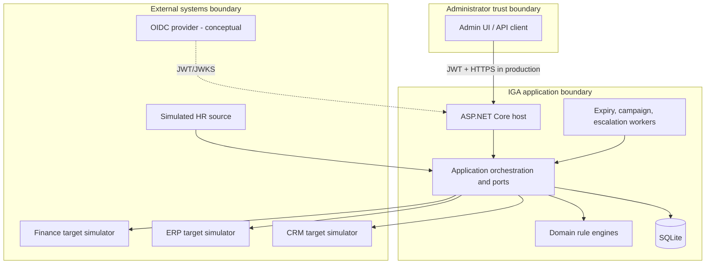

# Architecture — Northstar IGA

## Context

Northstar IGA is the governance plane for Northstar Group (fictional). It consumes authoritative employment facts, computes desired access, routes human decisions, provisions simulated targets, reconciles actual state, and retains evidence. Authentication remains the responsibility of an external OIDC provider in a production deployment.

## Container view



## Module dependency rule

```text
Northstar.Iga.Api -> Northstar.Iga.Infrastructure
Northstar.Iga.Infrastructure -> Northstar.Iga.Application
Northstar.Iga.Application -> Northstar.Iga.Domain
Northstar.Iga.Domain -> no project dependency
```

The API is composition and transport. Infrastructure owns adapters. Application owns ports and use-case contracts. Domain owns deterministic rules and contains no EF Core or ASP.NET reference.

## Headline sequence: campaign deadline enforcement

```mermaid
sequenceDiagram
    participant Admin
    participant API
    participant IGA as Campaign service
    participant Resolver as Access resolver
    participant DB as SQLite
    participant Worker as Deadline worker
    participant Authz as Policy engine

    Admin->>API: Create application/department/risk campaign
    API->>IGA: CreateCampaign
    loop each active identity
        IGA->>Resolver: Resolve entitlement + derivation paths
        Resolver->>DB: Grants, roles, groups, hierarchy, elevation, exclusions
        IGA->>DB: Materialize review item and reviewer
    end
    Worker->>IGA: AutoRevokeOverdueCampaigns
    IGA->>DB: Mark pending items AutoRevoked
    IGA->>DB: Add user-entitlement exclusions
    IGA->>DB: Append hash-linked audit
    Admin->>API: Evaluate permission
    API->>Authz: Resolve effective access
    Authz-->>Admin: Deny; excluded entitlement has no active derivation
```

## Major design elements

### Explainable access resolver

The resolver loads active direct grants, active role grants, persisted static/dynamic group membership, group-role assignments, the role inheritance DAG, active JIT elevation, and certification exclusions. It emits one `AccessDerivation` per distinct path. Reports group paths by entitlement without discarding alternatives.

### Policy engine

The engine receives the resolved derivations plus subject, resource, environment, and current clock. It evaluates every enabled policy whose wildcard permission pattern is relevant. Conditions are ANDed within and across sections. Matching denies take precedence globally; otherwise the highest ranked allow is decisive; otherwise an effective derivation allows; otherwise default deny.

### Workflow persistence

Lifecycle workflows have named ordered steps with status, attempts, timestamps, and last error. Access requests have a separately tested state machine: all steps in a stage execute in parallel, while stages execute sequentially.

### Certification enforcement

Campaign items are a review-time snapshot of `(user, entitlement, reviewer, derivation paths)`. Revocation creates a persistent entitlement exclusion in addition to revoking a direct grant. This prevents a nested role or dynamic group from silently restoring access.

### Provisioning and reconciliation

`IProvisioningConnector` defines create/update/disable/delete/list. Provisioning retries transient failures and quarantines exhausted jobs. Reconciliation compares connector snapshots with authoritative identities and resolved expected entitlements, classifying missing-source accounts as orphans and unapproved target permissions as rogue grants.

## Persistence

EF Core maps each entity explicitly, with unique indexes for employee number, email, application/role/group keys, permission, DAG edges, memberships, campaign review tuples, connector external IDs, and audit sequence. SQLite is the offline default. `EnsureCreated` is a documented prototype trade-off; a production deployment should use reviewed migrations and a managed relational engine.

## Runtime topology

One API process hosts HTTP and background services. This is deliberate: access changes and their evidence share a transaction boundary. Scale-out would require database-backed worker leasing, optimistic concurrency, outbox dispatch, and connector idempotency keys.

## Failure boundaries

| Boundary | Failure | Handling |
|---|---|---|
| Client → API | invalid/unauthorized/overloaded request | ProblemDetails, JWT policies, fixed-window rate limit |
| Workflow → database | constraint or storage failure | transaction failure; step remains failed/retryable |
| IGA → target connector | transient failure | bounded retry; job attempt count |
| IGA → target connector | exhausted/permanent failure | quarantine plus audit and runbook |
| Reviewer → campaign | missed deadline | automatic item revocation and overdue campaign status |
| JIT grant → time | end time elapsed | background expiry plus direct administrative expiry operation |

## Production evolution

- Replace local JWT issuer with OIDC/JWKS validation and managed identities.
- Move SQLite to SQL Server/PostgreSQL with migrations and optimistic concurrency tokens.
- Add outbox-backed asynchronous connector jobs and idempotency keys.
- Anchor audit hashes in immutable object-lock storage.
- Partition large simulations/campaign generation and introduce worker leases.
