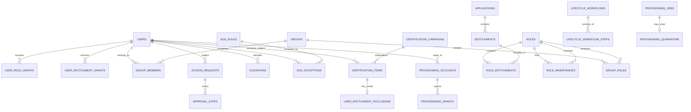

# Database Schema

## Storage choice

EF Core 10 maps the governance model to SQLite by default. Tables use GUID application-generated identifiers except the auto-increment audit primary key. Enumerations are stored as readable strings. Dates/timestamps use EF Core mappings; `DateTimeOffset` ordering that SQLite cannot translate is intentionally performed after materialization.

`EnsureCreated` is used for an infrastructure-free portfolio demonstration. Production should use reviewed migrations, backup/restore procedures, encrypted managed storage, and concurrency tokens enforced by the target database.

## Table catalogue

| Table | Primary key | Important foreign keys / purpose |
|---|---|---|
| `Users` | `Id` | authoritative employment identity, manager reference by `ManagerId` |
| `Applications` | `Id` | target application catalogue |
| `Entitlements` | `Id` | `ApplicationId`; permission, owner, risk, reviewer text |
| `Roles` | `Id` | business role and optional birthright rule |
| `RoleEntitlements` | `(RoleId, EntitlementId)` | role composition |
| `RoleInheritances` | `(RoleId, InheritedRoleId)` | DAG edge |
| `UserRoleGrants` | `Id` | user-to-role, source, expiry/revocation |
| `UserEntitlementGrants` | `Id` | direct/request entitlement grant |
| `UserEntitlementExclusions` | `Id` | enforced certification revocation |
| `Groups` | `Id` | static/dynamic group and rule |
| `GroupMembers` | `(GroupId, UserId)` | evaluated/static membership and source |
| `GroupRoles` | `(GroupId, RoleId)` | group-derived role |
| `Policies` | `Id` | effect, pattern, priority, conditions JSON |
| `SoDRules` | `Id` | toxic entitlement pair |
| `SoDExceptions` | `Id` | user/rule approval and expiry |
| `AccessRequests` | `Id` | target, justification, risk, state |
| `ApprovalSteps` | `Id` | stage, approver, delegation/escalation evidence |
| `Elevations` | `Id` | user/entitlement, ticket, time box, recording metadata |
| `CertificationCampaigns` | `Id` | scope, reviewer mode, deadline, status |
| `CertificationItems` | `Id` | campaign/user/entitlement/reviewer decision and derivation snapshot |
| `LifecycleWorkflows` | `Id` | joiner/mover/leaver instance |
| `LifecycleWorkflowSteps` | `Id` | ordered status/attempt/error evidence |
| `ProvisioningAccounts` | `Id` | discovered/provisioned target account |
| `ProvisioningGrants` | `Id` | target permission and rogue flag |
| `ProvisioningJobs` | `Id` | operation, attempts, status, error |
| `ProvisioningQuarantine` | `Id` | exhausted job payload and reason |
| `AuditRecords` | `Id` | immutable sequence and hash chain |

## Entity relationship diagram

## Key uniqueness and indexes

- `Users(EmployeeNumber)` unique; `Users(Email)` unique.
- `Users(Department, Status)` and `Users(ManagerId)` for directory/campaign lookups.
- `Applications(Key)`, `Roles(Key)`, and `Groups(Key)` unique.
- `Entitlements(ApplicationId, Key)` and `Entitlements(Permission)` unique.
- Composite keys prevent duplicate role entitlement, hierarchy edge, group membership, and group role rows.
- Active grant lookup indexes start with `UserId`.
- `UserEntitlementExclusions(UserId, EntitlementId)` unique.
- `Policies(Enabled, Priority)` supports evaluation ordering.
- `SoDExceptions(UserId, RuleId, ExpiresAt)` supports active-exception lookup.
- `ApprovalSteps(ApproverId, Status, DueAt)` supports inbox/escalation.
- `Elevations(UserId, Status, EndsAt)` supports effective-access and expiry scans.
- `CertificationItems(CampaignId, UserId, EntitlementId)` unique.
- `ProvisioningAccounts(ConnectorKey, ExternalId)` unique.
- `ProvisioningGrants(ProvisioningAccountId, Permission)` unique.
- `AuditRecords(Sequence)` unique; correlation and resource timeline indexes are present.

## Audit hash chain

For sequence `n`, the application computes hashes of before/after state and a record hash over sequence, timestamp, actor, action, resource, correlation, details, and the prior record hash. `IgaDbContext` throws if an audit entity is modified or deleted. This detects application-level history mutation but is not a substitute for externally anchored immutable storage.

## Deletion behavior

Relationship/join rows generally cascade when their parent aggregate is deleted. Catalogue entities referenced by historical grants use restricted deletion. The API exposes no audit deletion. Identity lifecycle uses status and revocation timestamps rather than deleting the identity.
