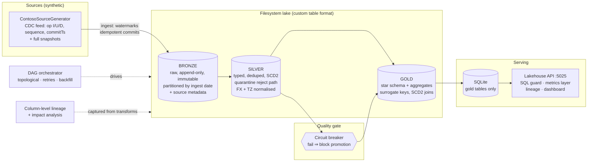
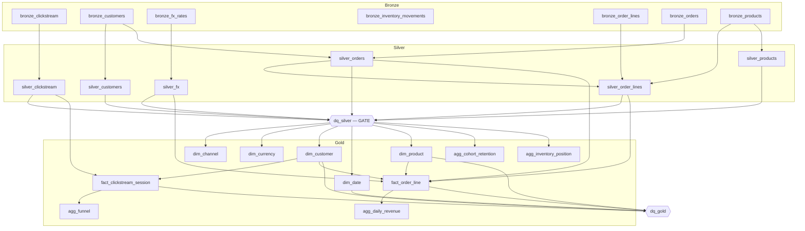
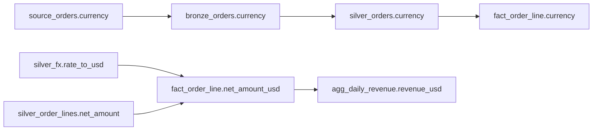
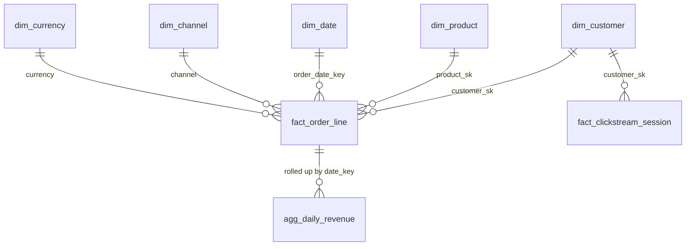

# Data Pipeline & Analytics Lakehouse

A from-first-principles **medallion lakehouse** (bronze → silver → gold → serving) for a fictional
retailer, **Contoso Retail (fictional)**. It implements — by hand, with no external data infrastructure —
a Delta-like table format (atomic commits, snapshot isolation, time travel, MERGE, schema evolution),
CDC ingestion, SCD2 conforming, a declarative data-quality gate with a circuit breaker, a dependency
DAG with backfill, automatic column-level lineage with impact analysis, and a guarded SQL/metrics
serving layer with a dashboard.

Everything runs on the local filesystem with SQLite as the query engine. `dotnet build -c Release` and
`dotnet test -c Release` succeed with **zero external infrastructure**.

## Portfolio Classification

Self-directed engineering case study. This is a personal, self-directed project built to demonstrate
data-platform engineering depth end-to-end. **Contoso Retail** and all data are fictional and
synthetically generated. No client, no production deployment, no real users, revenue, or PII. Nothing
was provisioned in any cloud. The value on display is that the hard concepts of a lakehouse (table
format, incremental/idempotent processing, SCD2, data-quality gates, lineage) are implemented from
first principles rather than assembled from managed services — and then mapped honestly onto Azure in
[`docs/azure-mapping.md`](docs/azure-mapping.md).

## Executive Summary

Modern analytics platforms are usually described in terms of the services that implement them (Delta
Lake, Databricks, Synapse, Purview). This project demonstrates that the **engineering concepts** beneath
those services are understood by building a working, tested version of each on a single machine:

- A **table format** with a transaction log giving atomic commits, snapshot isolation for readers, time
  travel (as-of snapshot N / timestamp T), MERGE upserts, delete-by-predicate, and per-version schema
  evolution.
- A **medallion pipeline**: immutable bronze (CDC + watermarks + idempotent commits), cleansed silver
  (typed parse with a quarantine reject path, dedup by business key + sequence, **SCD2** on customers
  and products), and curated gold (a proper **star schema** with surrogate keys, effective-version SCD2
  joins, inferred late-arriving members, and incremental aggregates).
- A **data-quality framework** with declarative expectations, `warn`/`fail` severity, a quarantine, and
  a **circuit breaker** that blocks promotion to gold when a critical expectation fails.
- **Orchestration** (topological DAG, retries, partial re-run of a downstream closure, backfill,
  concurrency control), **automatic column-level lineage** (queryable, Mermaid, impact analysis), and a
  **guarded serving layer** (read-only SQLite + `SqlGuard`, a metrics/semantic layer, and a dashboard).

The whole thing is validated by **99 automated tests** (88 unit + 11 integration) that assert the
tricky properties — time travel, SCD2 out-of-order correctness, the effective-version fact join,
idempotent re-runs, the circuit breaker, and SQL-injection rejection.

## Business Problem

Contoso Retail (fictional) sells across web, mobile, store and partner channels in KES and USD. The
business needs trustworthy answers to analytical questions — daily revenue by channel, customer cohort
retention, the web conversion funnel, and current inventory position — from messy operational data that
arrives late, out of order, with deletes, schema changes and real defects (nulls in required fields,
negative amounts, invalid foreign keys, duplicate ids, bad dates, mixed currencies).

The platform must turn that raw, defective, ever-changing feed into **correct, conformed, auditable**
marts, and must **refuse to publish** bad data rather than silently corrupt the numbers. It must be
incremental (cheap to run often), idempotent (safe to retry and backfill), and observable (every run
accounted for, every column's lineage known).

## Functional Requirements

- **Source simulation**: OLTP-style generator for customers, products, orders, order lines, clickstream,
  inventory movements and FX rates, with realistic distributions, late/out-of-order records, deletes
  (tombstones), mid-stream schema evolution, and deliberate data-quality defects. Emits a **CDC change
  feed** (`op: I/U/D`, `sequence`, `commitTs`) and full snapshots.
- **Table format**: partitioned data files + a manifest/transaction log with atomic commits, snapshot
  isolation, time travel, MERGE upsert, delete-by-predicate, and registered per-version schemas.
- **Bronze**: batch + micro-batch ingestion, exactly-once-effective via idempotent commits + watermarks,
  checkpoint/resume without duplication, full source metadata on every row, immutable.
- **Silver**: typed parse with a quarantine reject path (reasons kept, nothing silently dropped), dedup
  by business key + sequence, **SCD2** on customers/products (valid-from/valid-to/is-current, correct
  under out-of-order updates), RI conformance, currency + timezone normalisation, incremental and
  idempotent.
- **Gold**: star schema (`fact_order_line`, `fact_clickstream_session`, `dim_customer` SCD2,
  `dim_product` SCD2, `dim_date`, `dim_currency`, `dim_channel`) with surrogate keys, **effective-version
  joins**, inferred late-arriving dimension members, and incremental aggregates (daily revenue, cohort
  retention, funnel, inventory position).
- **Data quality**: declarative expectations (not-null, unique, accepted range/values, referential
  integrity, freshness, row-count anomaly, distribution drift) with `warn`/`fail`, quarantine, and a
  circuit breaker blocking gold promotion; a DQ report per run.
- **Orchestration**: dependency DAG with topological execution, retries, partial re-run of a downstream
  closure, backfill of a date range, run history, and concurrency control.
- **Lineage**: automatic column-level lineage, queryable, rendered as Mermaid, plus impact analysis.
- **Serving**: guarded read-only SQL API over gold, a metrics/semantic layer, and an HTML/JS dashboard.
- **Observability**: run metrics, freshness gauges, OpenTelemetry traces per task, structured logs.

## Non-Functional Requirements

- **Zero external infrastructure** — builds and tests run with only the .NET SDK; SQLite is embedded.
- **Correctness first** — the subtle properties (time travel, SCD2 out-of-order, effective-version join,
  idempotency) are asserted by tests, not asserted by prose.
- **Idempotent & incremental** — re-running a window yields identical results; retries/backfills are safe.
- **Secure by construction** — read-only query surface, PII never enters the serving store, injection
  rejected.
- **Deterministic** — `IClock` is injected everywhere; no hidden `DateTime.UtcNow` in engine code, so
  snapshots and time travel are reproducible under test.
- **Performance** — processes ≥ 100,000 synthetic source rows within a bounded time (asserted).

## Architecture

The solution follows a clean, layered architecture. Dependencies point inward; `Domain` has no
dependency on `Api`.

- **`Lakehouse.Domain`** — pure engine primitives: the table format (transaction log, snapshots,
  schema), rows/values, expectations/reports, lineage graph, DAG types. No I/O, no ASP.NET.
- **`Lakehouse.Application`** — the pipeline logic: source generator, bronze ingestor, silver/gold
  builders, dimension resolver, quality suites + gate, orchestration wiring, metrics + lineage catalogs.
- **`Lakehouse.Infrastructure`** — filesystem lake (`FileSystemLakehouse`), file stores for checkpoints
  / quality / runs, JSONL data-file format, and the SQLite serving engine.
- **`Lakehouse.Api`** — the ASP.NET Core host: endpoints, JWT auth, dashboard, OpenTelemetry + Serilog.

The medallion layers are separated so each has a single responsibility and a clear contract: bronze is
immutable and lossless, silver is cleansed and conformed, gold is curated and query-shaped.

## Architecture Diagram

**Medallion architecture (container view):**



**Orchestration DAG (real captured order, 26 tasks):**



**Column-level lineage (excerpt — full graph in [`docs/lineage.md`](docs/lineage.md)):**



**Star schema (ER) — full version in [`docs/database-schema.md`](docs/database-schema.md):**



A **sequence diagram** of the headline ingest→serve flow is in
[`docs/architecture/architecture.md`](docs/architecture/architecture.md).

## Technology Stack

- **Runtime/language:** .NET 10 (`net10.0`), C# — SDK 10.0.400.
- **Web:** ASP.NET Core Minimal APIs (Lakehouse.Api), port **5025**.
- **Serving DB:** SQLite via `Microsoft.Data.Sqlite` 10.0.11 (embedded, read-only query connection).
- **Auth:** `Microsoft.AspNetCore.Authentication.JwtBearer` 10.0.11 + `System.IdentityModel.Tokens.Jwt`
  (HS256 dev token).
- **Observability:** OpenTelemetry (`Extensions.Hosting`, `Instrumentation.AspNetCore`,
  `Exporter.Console`) 1.18.0; Serilog (`Serilog.AspNetCore` 10.0.0) structured logs.
- **API docs:** `Microsoft.AspNetCore.OpenApi` 10.0.11.
- **Testing:** xUnit + `Microsoft.AspNetCore.Mvc.Testing` 10.0.11 (WebApplicationFactory).
- **Storage format:** hand-written **JSONL** data files behind an `IDataFileFormat` abstraction. See
  *Trade-offs* and ADR-001 — Parquet.Net/DuckDB were available on the feed but deliberately not used.

## Domain Model

- **Table format:** `ILakeTable` (Create/Append/Overwrite/Merge/Delete/EvolveSchema/Scan/ScanAsOf/
  History/CurrentSnapshotId), `TableSchema` (versioned columns), `Row`/typed values, a per-table
  transaction log of `Snapshot`s (commit id, timestamp, added files, schema version, summary).
- **CDC:** `ChangeEvent` (`op`, `sequence`, `commitTs`, business key, payload) — the unit of ingestion.
- **SCD2 dimensions:** `dim_customer` / `dim_product` carry `valid_from`, `valid_to`, `is_current`,
  `is_inferred` and a surrogate key (`*_sk`).
- **Star facts:** `fact_order_line` (grain: one order line), `fact_clickstream_session` (grain: one
  session); aggregates roll these up.
- **Quality:** `Expectation` types → `ExpectationResult` (severity, passed, failed count, message) →
  `DataQualityReport` (`HasBlockingFailure`). `CircuitBreaker.Assert` throws `CircuitBreakerException`.
- **Lineage:** `ColumnRef(Dataset, Column)` nodes in a `LineageGraph` (`Upstream`, `Impact`, `ToMermaid`).
- **Orchestration:** `Dag` of tasks (`Func<RunContext, StepResult>` + deps + retries), `DagRunner`
  (`Run`, `Backfill`), `RunContext`, `TaskResult`/`RunRecord`.

Full column-by-column definitions are in [`docs/database-schema.md`](docs/database-schema.md).

## Core Workflows

1. **Generate → ingest (bronze).** The generator emits a CDC feed; `BronzeIngestor` appends only new
   records (watermark per entity), stamps source metadata (file/offset/ingest-time/run-id), and commits
   atomically with an idempotency token. Bronze is immutable.
2. **Conform (silver).** `SilverBuilder` deterministically rebuilds silver from immutable bronze: typed
   parse (bad rows → quarantine with reason), dedup by business key + sequence, SCD2 interval building
   (order-independent), FX + timezone normalisation.
3. **Gate.** `dq_silver` evaluates the silver expectation suite; a blocking failure trips the circuit
   breaker and **blocks** all gold tasks (they show as `Blocked`).
4. **Curate (gold).** `GoldBuilder` builds dimensions (SCD2), resolves surrogate keys, joins facts to the
   dimension **version effective at the event time**, infers late-arriving members, and materialises
   incremental aggregates. `dq_gold` validates curated invariants.
5. **Serve.** `SqliteQueryEngine.Rebuild` loads gold tables into SQLite; the API answers guarded SQL,
   resolves named metrics to SQL, and powers the dashboard.

## Security Model

- **AuthN/Z:** HS256 JWT bearer; `reader` and `operator` roles enforced by authorization policies. No
  token ⇒ 401; wrong role ⇒ 403. The dev token endpoint is clearly dev-only.
- **SQL surface:** `/api/sql` runs on a genuinely **read-only** SQLite connection; every statement passes
  `SqlGuard` (single `SELECT`/`WITH`, no comments, no `;` batching, forbidden-keyword allow-list) and is
  bounded by a row cap + timeout. Writes/DDL/injection return **400**.
- **PII boundary:** PII lives only in bronze/silver on the filesystem; **only gold tables** are loaded
  into the query store, so PII is not reachable via the API. Quarantine (raw payloads) is never served.
- **Metrics layer** never accepts raw SQL — named metrics + allow-listed dimensions + a closed
  `TimeGrain` enum only.

Full STRIDE analysis and explicit non-claims: [`docs/security/security-review.md`](docs/security/security-review.md).

## Reliability & Failure Handling

- **Idempotent by construction** — silver/gold are deterministic rebuilds from immutable bronze, so
  retries and backfills cannot double-count (ADR-004). Asserted by `PipelineTests` (identical results on
  re-run) and `BronzeIngestionTests` (idempotent re-ingest, checkpoint resume, zero duplicates).
- **Atomic commits + snapshot isolation** — a failed run never leaves partial data; readers see a
  consistent snapshot; time travel can read as-of any snapshot/timestamp.
- **Retries** — per-task `maxRetries`; transient failures retry, `CircuitBreakerException` is terminal.
- **Circuit breaker** — a critical DQ failure blocks gold promotion instead of publishing bad data.
- **Concurrency control** — overlapping runs of the same window are rejected (`OverlappingRunException`).
- **Partial re-run & backfill** — re-run a task and only its downstream closure; backfill a date range.

Operational procedures: [`docs/runbooks/`](docs/runbooks) (failed-run, backfill, data-quality-breach,
late-arriving-data).

## Observability

- **Run metrics:** rows-in / rows-out / quarantined / attempts / duration per task; failure/blocked
  counts per run; persisted run history (`/api/pipeline/runs`, `/api/observability/metrics`).
- **Freshness gauges:** per-table latest-snapshot age (`/api/observability/freshness`).
- **Tracing:** an OpenTelemetry span per DAG task (console exporter in this build; App Insights in Azure).
- **Logging:** structured Serilog logs carrying run id + task id.

## Testing Strategy

**99 tests total — 88 unit + 11 integration — all passing** (see the real pasted output in
[`docs/test-results.md`](docs/test-results.md)). Highlights, chosen to assert the properties that are
easy to get wrong:

- **Table format:** atomic commit + snapshot isolation + time travel; MERGE upsert & delete-by-predicate;
  schema-evolution read of old + new files.
- **Bronze:** immutability; idempotent re-ingest; checkpoint resume without duplication.
- **CDC/Silver:** late-arriving & out-of-order handling; dedup by business key; quarantine with reasons.
- **SCD2:** correctness including **out-of-order updates**, and the **effective-version join** in the fact
  build (the classic bug) — tested in both `Scd2Tests`/`CdcSilverTests` and `GoldTests`/`DimensionJoinTests`.
- **Data quality:** every expectation type (pass + fail); circuit breaker blocks gold promotion.
- **Incremental:** re-run window ⇒ identical results; backfill of a range materialises gold.
- **Orchestration:** topological order; cycle detection; retry; partial re-run of downstream only;
  overlapping-run rejection.
- **Lineage:** multi-hop column lineage correctness; impact analysis.
- **Serving:** metrics-layer SQL generation; **SQL API rejects writes/DDL/injection**; dashboard endpoints.
- **Performance:** a throughput test over ≥ 100,000 synthetic rows within a bounded time.

## Local Development

Prerequisites: **.NET SDK 10** (10.0.400). No Docker, database server, or other services required.

```powershell
# from the project root
dotnet build -c Release
dotnet test  -c Release          # 99 tests

# run the API (seeds a synthetic lake on startup)
dotnet run -c Release --project src\Lakehouse.Api
# API on http://localhost:5025 ; dashboard at http://localhost:5025/
```

Configuration lives under the `Lakehouse:` section of `appsettings.json` (lake root, serving DB path,
generator sizes/defect rate, auth issuer/audience/signing key) and can be overridden by environment
variables, e.g. `Lakehouse__Generator__Orders=2000`. See `.env.example`.

A one-command demo — generate → run DAG → break a quality rule → see the circuit breaker → backfill →
query the marts — is in [`scripts/demo.ps1`](scripts/demo.ps1).

## Running with Docker

Docker configuration created but Docker is unavailable on the build host; the compose stack has not been started or verified. `Dockerfile` and `docker-compose.yml` are included and labelled **UNVERIFIED**;
they are provided for completeness and have not been built or run.

## API Documentation

All non-public routes require a bearer token from `POST /api/auth/token` (`{ "role": "reader" | "operator" }`).

| Method & path | Auth | Purpose |
|---|---|---|
| `GET /health` | anon | Liveness |
| `GET /api/info` | anon | Build/config info |
| `POST /api/auth/token` | anon | Issue a dev JWT for a role |
| `GET /api/pipeline/dag` | reader | DAG tasks + topological order |
| `GET /api/pipeline/runs` | reader | Run history with per-task metrics |
| `POST /api/pipeline/run?window=` | operator | Run the DAG (optional window label) |
| `POST /api/pipeline/rerun?task=&window=` | operator | Re-run one task + its downstream closure |
| `POST /api/pipeline/backfill?from=&to=` | operator | Backfill a date range (`yyyy-MM-dd`, per-day) |
| `GET /api/quality/latest` | reader | Latest DQ report (silver + gold) |
| `GET /api/quality/reports` | reader | Historical DQ reports |
| `GET /api/lineage/mermaid` | reader | Column-level lineage as Mermaid |
| `GET /api/lineage/columns` | reader | All lineage columns |
| `GET /api/lineage/upstream?column=` | reader | Upstream columns (`column` = `dataset.column`) |
| `GET /api/lineage/impact?column=` | reader | Impact analysis (`column` = `dataset.column`) |
| `GET /api/metrics/catalog` | reader | Named metrics + dimensions |
| `POST /api/metrics/query` | reader | Resolve a metric to SQL + run it (JSON body) |
| `GET /api/sql/tables` | reader | Serving tables |
| `POST /api/sql` | reader | Guarded read-only SQL (JSON body `{ sql, maxRows }`) |
| `GET /api/observability/freshness` | reader | Per-table freshness |
| `GET /api/observability/metrics` | reader | Run/task metrics |
| `GET /api/dashboard/{revenue-trend,cohort-retention,funnel,quality}` | anon | Dashboard data |

## Example Usage

Real calls against the running API (PowerShell). Responses below are **real captured output** from a seed
run (80 customers / 40 products / 600 orders / 400 sessions / 30 days, seed 42).

```powershell
# 1) get a reader token
$rd = (Invoke-RestMethod -Method Post http://localhost:5025/api/auth/token `
        -Body (@{ role = 'reader' } | ConvertTo-Json) -ContentType application/json).token
$h  = @{ Authorization = "Bearer $rd" }

# 2) guarded SQL over the gold marts
Invoke-RestMethod -Method Post http://localhost:5025/api/sql -Headers $h -ContentType application/json `
  -Body (@{ sql = 'SELECT date_key, orders, revenue_usd FROM agg_daily_revenue ORDER BY date_key'; maxRows = 5 } | ConvertTo-Json)
```

```json
{
  "columns": ["date_key", "orders", "revenue_usd"],
  "rows": [
    [20260101, 16, "9014.45"],
    [20260102, 14, "9303.10"],
    [20260103, 20, "19421.97"],
    [20260104, 13, "12565.68"],
    [20260105, 20, "20193.98"]
  ],
  "truncated": false, "elapsedMs": 6.15, "rowCount": 5
}
```

```powershell
# 3) a write attempt is rejected (SqlGuard) -> HTTP 400
Invoke-RestMethod -Method Post http://localhost:5025/api/sql -Headers $h -ContentType application/json `
  -Body (@{ sql = 'DELETE FROM fact_order_line' } | ConvertTo-Json)
# => 400 Bad Request: "Only read-only SELECT/WITH statements are permitted."

# 4) resolve a named metric to SQL and run it
Invoke-RestMethod -Method Post http://localhost:5025/api/metrics/query -Headers $h -ContentType application/json `
  -Body (@{ metric = 'revenue_usd'; dimensions = @('channel'); grain = 'Month' } | ConvertTo-Json)
```

```json
{
  "metric": "revenue_usd", "grain": "Month",
  "sql": "SELECT (order_date_key / 100) AS period, channel, SUM(net_amount_usd) AS revenue_usd FROM fact_order_line GROUP BY (order_date_key / 100), channel ORDER BY (order_date_key / 100), channel",
  "result": {
    "columns": ["period", "channel", "revenue_usd"],
    "rows": [
      [202601, "mobile", 81742.09],
      [202601, "partner", 76050.58],
      [202601, "store", 104075.23],
      [202601, "web", 102948.39]
    ],
    "rowCount": 4
  }
}
```

```powershell
# 5) impact analysis: what breaks if silver_fx.rate_to_usd changes?
Invoke-RestMethod "http://localhost:5025/api/lineage/impact?column=silver_fx.rate_to_usd" -Headers $h

# 6) operator: backfill a date range (per-day windows), then run the full DAG
$op = (Invoke-RestMethod -Method Post http://localhost:5025/api/auth/token `
        -Body (@{ role = 'operator' } | ConvertTo-Json) -ContentType application/json).token
$oh = @{ Authorization = "Bearer $op" }
Invoke-RestMethod -Method Post "http://localhost:5025/api/pipeline/backfill?from=2026-01-01&to=2026-01-07" -Headers $oh
Invoke-RestMethod -Method Post "http://localhost:5025/api/pipeline/run" -Headers $oh
```

## Performance / Load Testing

A throughput test (`ThroughputTests`) generates and processes **≥ 100,000 synthetic source rows**
end-to-end (bronze → silver → gold) and asserts completion within a bounded time on the build host. The
seed demo run above materialised the full 26-task DAG (all succeeded, 0 failed/blocked) in **~1.3 s** for
~9,577 output rows. The platform is a synchronous, single-node batch engine — the point of the load test
is to show the medallion transforms and the full-rebuild idempotency strategy hold up at 100k-row scale,
not to benchmark a distributed cluster.

## Trade-offs

- **JSONL instead of Parquet.** Parquet.Net (6.1.0) and DuckDB.NET both resolved on the NuGet feed, but
  Parquet.Net's untyped deserialize path throws `Cannot create boxed ByRef-like values` on .NET 10, and
  DuckDB would have reframed the from-first-principles story around a native engine. Data files are JSONL
  behind an `IDataFileFormat` seam, so a columnar format can be dropped in later. This costs columnar
  compression/scan efficiency; it buys reliability and a clear, dependency-light implementation. (ADR-001)
- **Own table format vs Delta/Iceberg.** Building the log by hand is the entire point (understanding),
  but it is a *small* subset of Delta — no multi-writer optimistic concurrency at scale, no Z-order/vacuum.
  Documented honestly in ADR-001.
- **SCD2 vs snapshot-only.** SCD2 is more complex but is the only correct way to answer "what was true at
  event time"; ADR-002.
- **Full rebuild vs true incremental merge.** Deterministic full rebuild of silver/gold makes idempotency
  structural at the cost of per-run work; ADR-004.
- **SQLite serving.** Ubiquitous and guardable, but row-oriented and single-node; ADR-005.

## Architecture Decisions

Full ADRs (Context / Options / Decision / Consequences / Risks / Alternatives) in
[`docs/decisions/`](docs/decisions):

- **ADR-001** — Own table format vs Delta/Iceberg (with an honest comparison, and the JSONL fallback).
- **ADR-002** — SCD2 over snapshot-only dimensions.
- **ADR-003** — Declarative data-quality gates and the fail-vs-warn policy (why silver RI is `warn`).
- **ADR-004** — Incremental watermarks and deterministic, idempotent rebuilds.
- **ADR-005** — SQLite serving and its limits.

## Known Limitations

- Single-node, synchronous batch engine; not distributed and not a streaming runtime.
- JSONL data files — no columnar compression or predicate pushdown (see ADR-001).
- Full-rebuild silver/gold — per-run cost grows with total history (mitigated by watermark-scoped bronze).
- SQLite serving — row-oriented, single-writer, `Decimal` stored as TEXT; not an MPP warehouse (ADR-005).
- Auth is a **dev-only** HS256 token endpoint — no real IdP, TLS, at-rest encryption, or rate limiting.
- **Docker/compose are UNVERIFIED** — no Docker on the build host.
- PII handling demonstrates the **serving boundary**, not a full tokenisation vault.
- No IaC and **nothing was provisioned** in any cloud — the Azure mapping is design-only.

## Future Improvements

- Swap JSONL for a real columnar format (Parquet via Arrow, or DuckDB) behind `IDataFileFormat`.
- Partition-scoped incremental rebuilds (keep idempotency, cut per-run cost).
- Optimistic-concurrency multi-writer commits in the table format.
- Real IdP (Entra ID/OAuth2), TLS, at-rest encryption, and API rate limiting.
- Distribution-drift and richer freshness/anomaly expectations with alerting.
- Export OpenTelemetry to Application Insights; ship structured logs to Log Analytics.

## Portfolio Talking Points

- Built a **Delta-like table format** (atomic commits, snapshot isolation, time travel, MERGE, schema
  evolution) from first principles — and can explain exactly how it differs from Delta/Iceberg.
- Got **SCD2 right**, including the classic bug: facts join the dimension **version effective at event
  time**, proven by tests with out-of-order updates.
- Made incrementality **safe** by making derived layers deterministic rebuilds of immutable bronze — so
  retries, partial re-runs and backfills are idempotent by construction, and asserted as such.
- Shipped a **data-quality circuit breaker** that refuses to publish bad data, with a considered
  fail-vs-warn policy (silver RI is a warning because gold infers late members).
- Delivered **automatic column-level lineage with impact analysis** — not a hand-drawn diagram.
- Hardened the serving layer: read-only SQLite + `SqlGuard` + a metrics layer that never accepts raw SQL,
  with injection/write attempts rejected and PII kept out of the query surface entirely.
- More detail in [`docs/portfolio/`](docs/portfolio) (summary, demo script, interview talking points).

## Upwork Portfolio Description

*Data Pipeline & Analytics Lakehouse (.NET 10).* I design and build correct, testable data platforms. For
this self-directed case study I implemented a full **medallion lakehouse** from first principles — a
Delta-like table format with time travel and MERGE, CDC ingestion with watermarks and idempotent commits,
**SCD2** dimensions with correct event-time joins, a declarative **data-quality gate with a circuit
breaker**, a dependency **DAG** with backfill and partial re-runs, **automatic column-level lineage with
impact analysis**, and a guarded SQL/metrics serving layer with a dashboard — all validated by **99
automated tests** and running with **zero external infrastructure**. I document trade-offs honestly (own
table format vs Delta, JSONL vs Parquet, SQLite's limits) and map every component cleanly onto Azure
(ADLS Gen2, Data Factory/Synapse, Databricks/Fabric, Delta Lake, Synapse Serverless, Purview, Event
Hubs). If you need a data engineer who understands the internals — not just the buttons — let's talk. A
fuller version is in [`docs/portfolio/upwork-description.md`](docs/portfolio/upwork-description.md).
