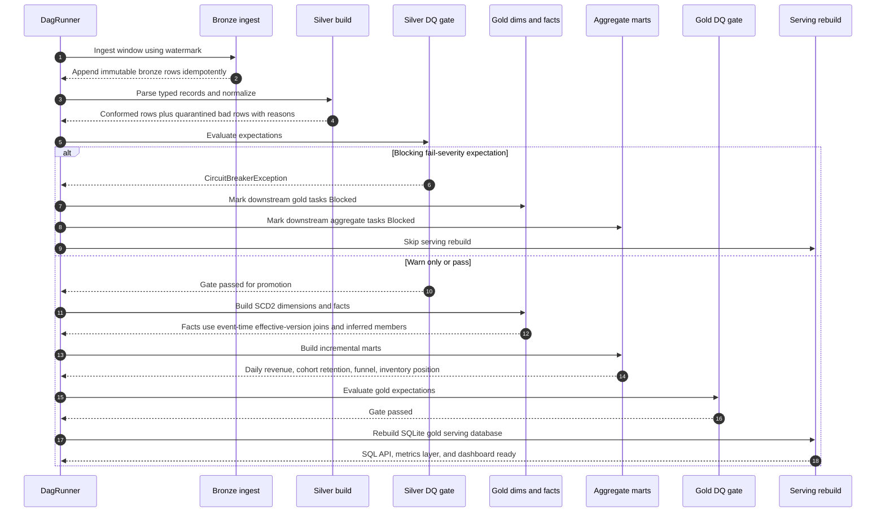

# Architecture

## Container / Component View

```mermaid
flowchart LR
    subgraph Sources[Sources]
        Gen[Synthetic OLTP generator]
        CDC[CDC change feed<br/>op I/U/D, sequence, commitTs]
        Gen --> CDC
    end

    subgraph Bronze[Bronze layer]
        BronzeRaw[Raw append-only immutable JSONL files]
        BronzeMeta[Full source metadata<br/>file, offset, ingest time, run id, op, sequence, commit_ts]
        BronzeRaw --> BronzeMeta
    end

    subgraph Silver[Silver layer]
        SilverTyped[Typed parsing and normalization]
        Quarantine[Quarantine with rejection reasons]
        Dedup[Dedup by business key and sequence]
        SCD2[SCD2 customers and products]
        Conformance[RI conformance, FX normalization, timezone normalization]
        SilverDQ[Silver DQ gate<br/>warn/fail expectations]
        SilverTyped --> Dedup --> SCD2 --> Conformance --> SilverDQ
        SilverTyped --> Quarantine
    end

    subgraph Gold[Gold layer]
        Dims[Dimensions<br/>dim_customer SCD2, dim_product SCD2, dim_date, dim_currency, dim_channel]
        Facts[Facts<br/>fact_order_line, fact_clickstream_session]
        Aggs[Aggregate marts<br/>agg_daily_revenue, agg_cohort_retention, agg_funnel, agg_inventory_position]
        GoldDQ[Gold DQ gate]
        Dims --> Facts --> Aggs --> GoldDQ
    end

    subgraph Serving[Serving layer]
        SQLite[(SQLite gold serving DB)]
        SqlApi[Guarded SQL API<br/>read-only SELECT/WITH]
        Metrics[Metrics and semantic layer]
        Dashboard[Dependency-free HTML/JS dashboard]
        SQLite --> SqlApi
        SQLite --> Metrics
        SqlApi --> Dashboard
        Metrics --> Dashboard
    end

    subgraph CrossCutting[Cross-cutting platform services]
        Dag[DAG runner<br/>26 tasks, Kahn topological order, retries, backfill]
        TableFormat[Custom table format<br/>JSONL data files, manifests, snapshots, schema versions]
        Lineage[Column-level lineage<br/>Mermaid, upstream, impact]
        Observability[Observability<br/>Serilog, OpenTelemetry, freshness, run metrics]
        Security[Security boundary<br/>JWT roles, SQL guards, PII excluded from serving]
    end

    CDC --> BronzeRaw
    BronzeMeta --> SilverTyped
    SilverDQ --> Dims
    SilverDQ --> Facts
    GoldDQ --> SQLite

    Dag -. orchestrates .-> BronzeRaw
    Dag -. orchestrates .-> SilverTyped
    Dag -. gates .-> SilverDQ
    Dag -. orchestrates .-> Dims
    Dag -. orchestrates .-> Facts
    Dag -. orchestrates .-> Aggs
    Dag -. gates .-> GoldDQ
    Dag -. rebuilds .-> SQLite

    TableFormat -. stores .-> BronzeRaw
    TableFormat -. stores .-> SilverTyped
    TableFormat -. stores .-> Dims
    TableFormat -. stores .-> Facts
    TableFormat -. stores .-> Aggs

    Lineage -. captures transform metadata .-> SilverTyped
    Lineage -. captures transform metadata .-> Facts
    Lineage -. captures transform metadata .-> Aggs

    Observability -. spans and metrics .-> Dag
    Security -. protects .-> SqlApi
    Security -. constrains .-> SQLite
```

The system is a local medallion lakehouse. It begins with a synthetic OLTP generator for the fictional Contoso Retail domain. The generator emits CDC-style source records with operation, sequence, and commit timestamp fields.

Bronze stores raw source rows as append-only immutable data, partitioned by ingest date. Every bronze row carries source metadata: file, offset, ingest time, run id, operation, sequence, and commit timestamp. This makes replay, audit, and idempotent processing possible.

Silver converts raw records into typed, conformed data. It has an explicit quarantine path, so rejected records are retained with reasons instead of being silently dropped. Silver also handles deduplication by business key and sequence, SCD Type 2 customer and product dimensions, referential-integrity conformance, FX-based currency normalization, and timezone normalization. The silver DQ gate distinguishes warnings from blocking failures.

Gold is the served analytical model. It contains a star schema with `fact_order_line`, `fact_clickstream_session`, SCD2 customer and product dimensions, date, currency, and channel dimensions, plus incremental aggregate marts for daily revenue, cohort retention, funnel, and inventory position. Facts join the SCD2 dimension version effective at the event time. Late-arriving dimension members can be inferred at gold so serving referential integrity passes.

Serving uses SQLite over gold tables only. The API exposes a guarded SQL endpoint, a metrics/semantic layer, and a dependency-free HTML/JS dashboard. PII is not loaded into the serving SQLite database; it remains in bronze and silver filesystem data.

The table format is a small Delta-Lake-like implementation using JSONL data files behind an `IDataFileFormat` abstraction. It supports manifests, atomic commits, snapshot isolation, time travel, schema versions, MERGE-style upsert, and delete-by-predicate. It does not implement concurrent multi-writer semantics, compaction, Z-ordering, or distributed execution.

Cross-cutting services include the 26-task DAG runner, column-level lineage, and observability. The DAG runner executes in deterministic topological order using Kahn's algorithm, supports retries and backfill, records timings and row counts, and rejects overlapping runs of the same window. Lineage is captured from transform declarations and served as Mermaid, upstream lineage, and impact analysis. Observability includes Serilog structured logs, OpenTelemetry spans per task, freshness gauges, and run metrics.

## Headline flow (sequence diagram)

A normal run promotes one bounded window through the DAG. Bronze ingestion uses watermarks and immutable appends. Silver performs typed parsing, normalization, deduplication, quarantine, SCD2 preparation, and conformance. The silver DQ gate is the first promotion control. A warning can be reported without blocking; a fail-severity expectation trips the circuit breaker and prevents downstream gold work.

When promotion is allowed, gold builds SCD2 dimensions and facts. The important dimensional rule is that facts join to the dimension version valid at the event time, not to the current dimension row. Aggregate marts are then built incrementally, gold expectations are evaluated, and the serving SQLite database is rebuilt from gold-only tables.

## Clean-architecture project layering

The solution follows a clean architecture structure:

- `Lakehouse.Domain`: domain concepts and rules that should not depend on infrastructure details.
- `Lakehouse.Application`: pipeline orchestration, use cases, transform coordination, data-quality evaluation, lineage behavior, and application services.
- `Lakehouse.Infrastructure`: filesystem lake storage, JSONL table-format implementation, SQLite serving implementation, logging, tracing, and other concrete adapters.
- `Lakehouse.Api`: ASP.NET Core minimal APIs for SQL serving, metrics, lineage, dashboard endpoints, authentication, and role-based access.
- `Lakehouse.UnitTests`: focused tests for domain/application/table-format behaviors and edge cases.
- `Lakehouse.IntegrationTests`: API and end-to-end integration tests using `Microsoft.AspNetCore.Mvc.Testing`.

This separation keeps the pipeline rules testable without requiring external infrastructure. Infrastructure choices such as JSONL files, SQLite, Serilog, OpenTelemetry, and ASP.NET Core are adapters around the core pipeline behavior rather than the center of the design.

## Operational characteristics

- **Runtime**: .NET 10 (`net10.0`).
- **Serving port**: 5025.
- **Serving engine**: SQLite through raw `Microsoft.Data.Sqlite`; EF Core is not used.
- **Authentication**: JWT bearer auth with HS256 for development, using reader and operator roles.
- **Observability**: structured Serilog logs, OpenTelemetry console exporter, run/task ids, duration, row counts, failure rate, and freshness gauges.
- **Quality gates**: warn/fail severity with quarantine and circuit-breaker behavior.
- **Lineage endpoints**: `/api/lineage/mermaid`, `/api/lineage/upstream`, and `/api/lineage/impact`.
- **Honest limits**: Contoso Retail is fictional; no cloud infrastructure was provisioned; Docker was not verified; data files are JSONL rather than Parquet; the custom table format is deliberately scoped and single-process.
