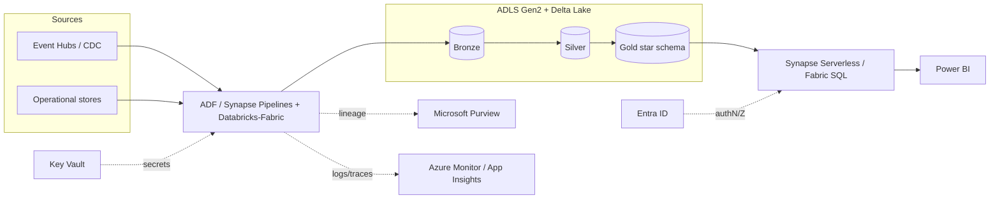

# Azure Mapping

> **Nothing in this document was provisioned.** No Azure resources were created, deployed, or billed.
> This build runs entirely on a local filesystem with SQLite and **zero external infrastructure** (that
> is the point — the concepts are implemented from first principles). This document shows how each
> hand-built component maps onto managed Azure services if this platform were taken to production. It is
> a design/positioning artifact, not a deployment record.

## Component → Azure service map

| This build (from first principles) | Azure equivalent | Notes on the mapping |
|---|---|---|
| Filesystem "lake" (`_data/…`) with bronze/silver/gold partitions | **ADLS Gen2** (hierarchical namespace) | Same medallion layout maps to containers/paths; partitioning by ingest date maps to folder partitioning |
| Custom table format: manifest + transaction log, atomic commits, snapshot isolation, time travel, MERGE, schema evolution | **Delta Lake** (on Databricks or Microsoft Fabric) | Our log is a small Delta-like implementation; Delta provides the production-grade version (see ADR-001 for the honest comparison — we do *not* claim Delta's optimistic-concurrency-at-scale, Z-ordering, or vacuum) |
| `BronzeIngestor` (batch + micro-batch, watermarks, idempotent commits, checkpointing) | **Azure Data Factory** / **Synapse Pipelines** copy + **Databricks/Fabric** Structured Streaming (`Auto Loader`) | Watermarks ⇢ ADF incremental watermark pattern; checkpointing ⇢ Structured Streaming checkpoints |
| CDC change feed (`op: I/U/D`, sequence, commitTs) | **Event Hubs** (or **Azure SQL / Cosmos DB change feed**) → Structured Streaming | Our synthetic feed stands in for a real CDC source (Debezium/Event Hubs) |
| `SilverBuilder` (typed parse, dedup, SCD2, quarantine, FX/TZ normalise) | **Databricks / Fabric** notebooks or **Synapse Spark** | Deterministic transforms map directly to Spark/Delta MERGE-based SCD2 |
| `GoldBuilder` (star schema, surrogate keys, effective-version joins, aggregates) | **Databricks / Fabric** + **Delta** gold tables | Star schema and incremental aggregates are the standard gold pattern |
| Orchestration DAG (topological, retries, backfill, concurrency control) | **Azure Data Factory** / **Synapse Pipelines**, or **Databricks Workflows** / **Apache Airflow (Azure Managed)** | Our DAG runner ⇢ pipeline/trigger + dependency + retry policy; backfill ⇢ tumbling-window triggers |
| Column-level lineage (auto-captured, queryable, Mermaid + impact analysis) | **Microsoft Purview** | Purview provides scanned/automated lineage and impact analysis at org scale; ours is built from the declared transformations |
| Data-quality framework (declarative expectations, severity, circuit breaker) | **Great Expectations** on Databricks, **Delta Live Tables expectations**, or **Purview data quality** | `fail`/`warn` ⇢ DLT `EXPECT … ON VIOLATION FAIL/DROP`; circuit breaker ⇢ pipeline gate |
| SQL serving over gold (SQLite + guards) | **Synapse Serverless SQL** / **Fabric SQL endpoint** / **Azure SQL** | See ADR-005 for why SQLite locally and its limits; production analytical serving ⇢ Synapse Serverless over Delta |
| Metrics / semantic layer (named metrics → SQL) | **Power BI semantic models** / **Fabric** metrics, or **dbt semantic layer** | Named metrics + dimensions + time grains map to a BI semantic model |
| Dashboard (HTML/JS) | **Power BI** | The utilitarian dashboard stands in for a Power BI report over the gold marts |
| Observability (run metrics, freshness, OTel traces, structured logs) | **Azure Monitor** / **Application Insights** + **Log Analytics** | OpenTelemetry exports natively to Application Insights; freshness gauges ⇢ Monitor metrics/alerts |
| JWT dev auth | **Microsoft Entra ID** (OAuth2/OIDC) + **Azure RBAC** | The dev token endpoint is replaced by a real IdP (see security review) |
| Secrets (`.env`, dev signing key) | **Azure Key Vault** | No real secrets are committed; production keys live in Key Vault |

## Reference production topology (illustrative only — not provisioned)

## Honest boundaries

- This mapping is **aspirational architecture**, not an implemented deployment. No IaC (Bicep/Terraform)
  is included and no resources exist.
- The from-first-principles components deliberately omit production concerns that managed services solve
  (multi-writer optimistic concurrency at scale, autoscaling, geo-redundancy, RBAC/masking, cost
  governance). Those are called out where relevant in the ADRs and the security review.
- The value of this build is demonstrating that the **concepts** (table format, SCD2, DQ gates,
  lineage, incremental/idempotent processing) are understood well enough to implement them — which is
  what makes the Azure mapping credible rather than buzzword bingo.
