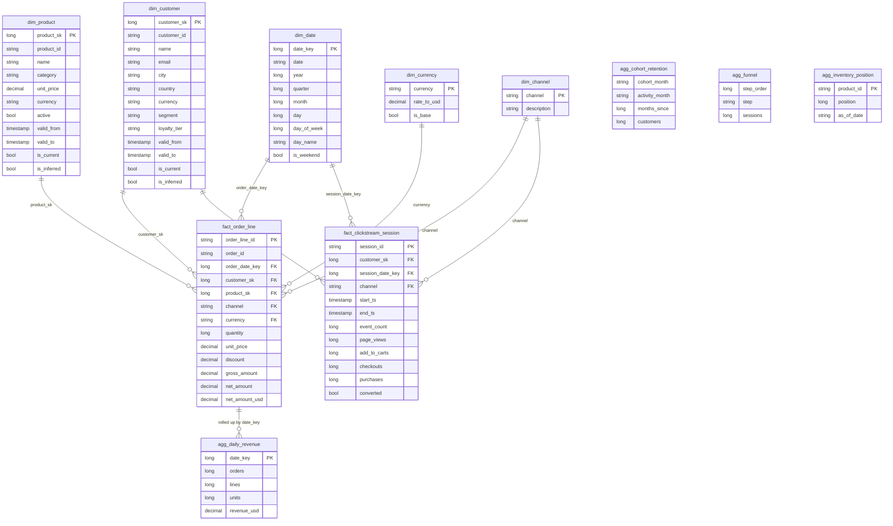

# Database / Star-Schema Reference

This document describes the **gold** star schema that is served through SQLite. Bronze and silver are
intermediate medallion layers on the filesystem lake (see the README and `docs/lineage.md`); only the
gold serving tables listed here are projected into the query engine.

> Storage note: the lake stores `Decimal` and `Timestamp` as text to preserve precision/round-trip;
> when loaded into SQLite, `Decimal` columns have **TEXT** affinity and `Timestamp` columns are ISO-8601
> text. Cast in SQL where you need numeric ordering on a decimal column.

## Grain statements (the most important lines in this file)

- **`fact_order_line`** — grain: **one row per order line** (`order_line_id`). Additive measures:
  `quantity`, `gross_amount`, `net_amount`, `net_amount_usd`. `net_amount_usd` is `net_amount`
  converted with the FX rate effective on the order date.
- **`fact_clickstream_session`** — grain: **one row per web session** (`session_id`). Measures:
  `event_count`, `page_views`, `add_to_carts`, `checkouts`, `purchases`, plus a `converted` flag.
- **`agg_daily_revenue`** — grain: **one row per calendar day** (`date_key`). Pre-aggregated from
  `fact_order_line`.
- **`agg_cohort_retention`** — grain: **one row per (acquisition cohort month, activity month)**.
- **`agg_funnel`** — grain: **one row per funnel step**.
- **`agg_inventory_position`** — grain: **one row per product** (current on-hand position as of the
  latest movement).

## Keys & relationships

- Surrogate keys (`customer_sk`, `product_sk`) are integers derived from the SCD2 business key +
  `valid_from`, stable across re-runs.
- Facts reference the **dimension version effective at the event time** (SCD2), not the current version.
- `dim_date` uses an integer `date_key` (`yyyymmdd`); facts carry `order_date_key` / `session_date_key`.
- Referential integrity is enforced by the gold quality gate; late/deleted dimension members are
  **inferred** so every fact key resolves (`is_inferred = true` marks them).

## ER diagram

## Serving tables loaded into SQLite (`GoldServingTables`)

`dim_customer`, `dim_product`, `dim_date`, `dim_currency`, `dim_channel`, `fact_order_line`,
`fact_clickstream_session`, `agg_daily_revenue`, `agg_cohort_retention`, `agg_funnel`,
`agg_inventory_position` (11 tables). Bronze/silver/quarantine are **not** loaded — that is the PII
boundary described in the security review.

## Indexes

The serving tables are rebuilt per pipeline run and are small (demo marts), so no secondary indexes are
created; SQLite scans the marts directly within the row-cap/timeout guards. Primary-key columns above
are logical (dimensional) keys — see ADR-005 for why SQLite (not a partitioned warehouse) is the
serving engine, and its limits.
