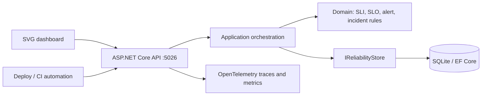
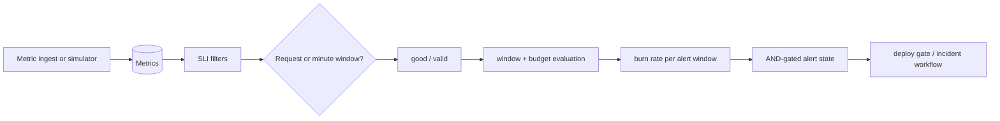
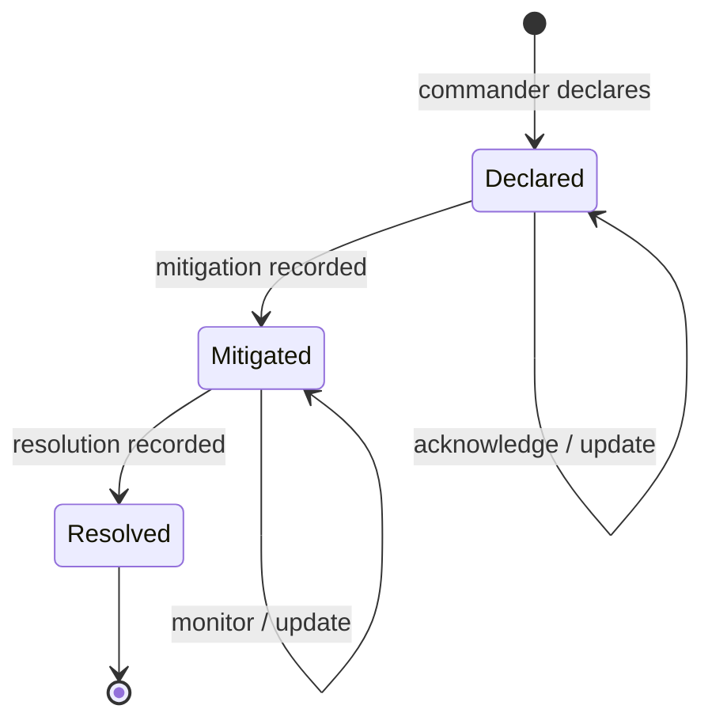
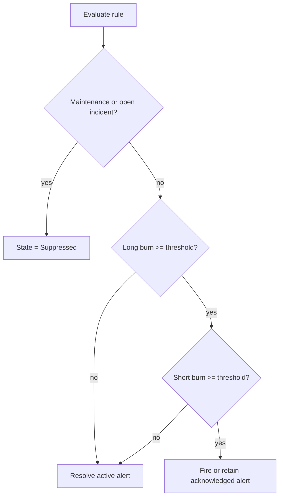

# Northstar Reliability Control Room

## Portfolio Classification
Self-directed engineering case study. A production-style prototype for **Northstar Group (fictional)** that demonstrates correct SLO arithmetic, multi-window burn-rate alerting, and error-budget-governed change control.

## Executive Summary
Northstar Reliability Control Room is a modular .NET 10 SRE platform for twelve synthetic services. It turns request, probe, latency, correctness, and freshness telemetry into declarative SLIs; evaluates rolling and calendar SLOs; pages only when both burn-rate windows breach; attributes incidents to budget spend; and exposes a machine-readable deploy gate.

## Business Problem
Teams often collect dashboards without a defensible answer to “are we spending reliability faster than planned?” A simple percentage threshold hides traffic weighting, alert detection delay, and a key distinction: 99.9% over a rolling 30 days is not the same contract as 99.9% for the current calendar month. This reference implementation makes those choices explicit and testable.

## Functional Requirements
- Service catalogue with tier, ownership, on-call rotation, repository/runbook links, dependency cycle detection, and maturity scorecards.
- Request- and window-based availability, latency, quality, and freshness SLIs with endpoint, region, and tier filtering.
- Rolling and calendar SLO status, error budget, history, burn rates, and projected exhaustion.
- Google SRE-style multi-window / multi-burn-rate page and ticket evaluation with recovery and suppression.
- Synthetic diurnal traffic simulation plus partial outage, latency, dependency-cascade, and deployment-spike injections.
- Incident command, timeline, MTTA/MTTD/MTTR, budget attribution, postmortems, overdue actions, and thematic analysis.
- Service/team/quarter reporting, alert quality analysis, and a deploy-gate API.

## Non-Functional Requirements
The default adapter is EF Core + SQLite; no database server, container, or telemetry platform is required. All application time flows through an `IClock` port in testable paths. API responses use JWT policy authorization, RFC 7807 errors, correlation IDs, security headers, rate limiting, health checks, and OpenTelemetry instrumentation.

## Architecture
This is a modular monolith. `Domain` contains calculations and invariants; `Application` owns orchestration and ports; `Infrastructure` maps the SQLite adapter; `Api` composes minimal-API endpoints and the dashboard. The deliberately local time-series store keeps the project runnable without Prometheus while documenting its honest production mapping in ADR-004.

## Architecture Diagram




## Technology Stack
- .NET 10 / C# minimal APIs, xUnit, `WebApplicationFactory`
- EF Core 10 with SQLite (default; no external infrastructure)
- JWT bearer authentication and policy authorization
- OpenTelemetry ASP.NET Core instrumentation and console exporter
- Plain HTML, JavaScript, and SVG; no charting dependency

## Domain Model
`ServiceDefinition` owns catalogue metadata and directed dependencies. `SliDefinition` declares an aggregation mode, measurement kind, and filter. `SloDefinition` defines target and rolling/calendar period. Immutable results model SLI attainment, error budget, burn-rate readings, alert lifecycle, incident timeline/impact, and postmortem review/action state.

## Core Workflows
Telemetry is ingested at a configured resolution or generated deterministically by the simulator. Evaluation scopes it by service/filter/window, computes good and valid events, then derives budget and burn. An alert requires both its long and short burn windows to breach.





## Security Model
All `/api/v1` reliability surfaces except the development/testing token helper require JWTs. Policies require `reliability.read`, `reliability.write`, or `reliability.admin` scopes. Production startup rejects the known development signing key. Inputs are edge-validated and domain invariants are checked again. See [security review](docs/security/security-review.md).

## Reliability & Failure Handling
Alert state explicitly records detection time, source-data lag, acknowledgement, recovery, and suppression reason. A present maintenance window or open incident suppresses duplicate noise. Budget policy returns allow/warn/deny rather than relying on human memory. SQLite remains local and restart-safe; production scaling alternatives are documented rather than claimed.

## Observability
Every response includes `X-Correlation-Id`; it is also placed in the logging scope. The API emits ASP.NET Core traces plus custom activity/counter instrumentation for ingest, alert evaluation, and incident declaration. `/health/live`, `/health/ready`, and `/openapi/v1.json` are available without authentication.

## Testing Strategy
The unit suite uses hand-built fixtures to pin SLI, budget, burn-rate, calendar-boundary, alert-state, incident, postmortem, retention, scorecard, and reporting mathematics. Integration tests use a persistent open SQLite `:memory:` connection through `WebApplicationFactory` and prove validation, 401, 403, correlation headers, metric rejection, and deploy-gate behavior. See [real test output](docs/test-results.md).

## Local Development
```powershell
Set-Location C:\Users\rukwaropaul\Downloads\DEV\Projects\26-sre-reliability-dashboard
dotnet restore
dotnet run --project src\Northstar.Reliability.Api
# http://localhost:5026
```
Development startup creates `northstar-reliability.db` and idempotently seeds twelve fictional services and synthetic telemetry. The dashboard can request a development-only token.

## Running with Docker
Docker configuration created but Docker is unavailable on the build host; the compose stack has not been started or verified.

## API Documentation
OpenAPI is exposed at [`/openapi/v1.json`](http://localhost:5026/openapi/v1.json). In Development, [`/docs`](http://localhost:5026/docs) links to the document. Main resources are `/api/v1/services`, `/slis`, `/slos`, `/metrics/ingest`, `/burn-rates`, `/alerts`, `/incidents`, `/postmortems`, `/gates/{service}/deploy`, `/maintenance-windows`, and `/reports`.

## Example Usage
```powershell
$token = (Invoke-RestMethod http://localhost:5026/api/v1/auth/token `
  -Method Post -ContentType application/json `
  -Body '{"subject":"demo.sre@northstar.invalid","scopes":["reliability.read","reliability.write","reliability.admin"]}').accessToken
$headers = @{ Authorization = "Bearer $token" }

Invoke-RestMethod "http://localhost:5026/api/v1/slos" -Headers $headers
Invoke-RestMethod "http://localhost:5026/api/v1/gates/checkout/deploy" -Headers $headers
```

```json
{
  "allowed": false,
  "action": "FreezeAllChanges",
  "reason": "checkout has exhausted its error budget; all changes are frozen until reliability recovers.",
  "remainingBudgetPercent": 0
}
```

## Performance / Load Testing
No load benchmark is claimed. The simulator creates deterministic synthetic aggregates, not a measured throughput claim. A production deployment would load test ingestion, retention compaction, and concurrent alert evaluation against its selected time-series backend.

## Trade-offs
SQLite and aggregate samples prioritize reproducibility over high-cardinality telemetry scale. Error budgets use observed valid events/minutes in the evaluated window; this communicates current spend accurately but differs from capacity planning with a predeclared traffic forecast. Alert rules are standard defaults but exposed as policy data, not universal truth.

## Architecture Decisions
See the five ADRs: [request versus window SLIs](docs/decisions/ADR-001-request-vs-window-based-slis.md), [multi-window alerting](docs/decisions/ADR-002-multi-window-multi-burn-rate-alerting.md), [rolling versus calendar periods](docs/decisions/ADR-003-rolling-vs-calendar-windows.md), [local telemetry storage](docs/decisions/ADR-004-own-time-series-store-vs-prometheus.md), and [deploy gates](docs/decisions/ADR-005-error-budget-policy-gate.md).

## Known Limitations
The simulator emits pre-aggregated metrics rather than raw spans. There is no external paging/status-page integration, multi-tenant boundary, durable alert history table, or Prometheus remote-write adapter. The development token endpoint is intentionally unavailable outside Development and Testing.

## Future Improvements
Add OpenTelemetry OTLP ingestion, histogram-native threshold interpolation, migration-based schema evolution, alert notification adapters with deduplication, immutable audit records, SSO/OIDC JWKS validation, and a separate reporting read model for high-cardinality deployments.

## Portfolio Talking Points
The standout implementation detail is not the dashboard: it is the tested equation `burn rate = observed error rate / (1 - target)` and the AND of two independently computed windows. This project makes the alert’s intended budget spend derivable, preserves the behavioral distinction between mitigation and resolution, and turns reliability policy into an API other delivery systems can enforce.

## Upwork Portfolio Description
**Northstar Reliability Control Room — self-directed engineering case study**

Problem: engineering teams need defensible SLO, error-budget, and alert-quality decisions rather than decorative monitoring. Built: a .NET 10 SRE reference implementation with SQLite, synthetic telemetry, correct multi-window burn-rate evaluation, incident/postmortem workflows, and deploy-gate enforcement. Engineering focus: SLO mathematics, policy enforcement, lifecycle correctness, local reproducibility, and testable failure handling. This is a self-directed portfolio project, not client work.
