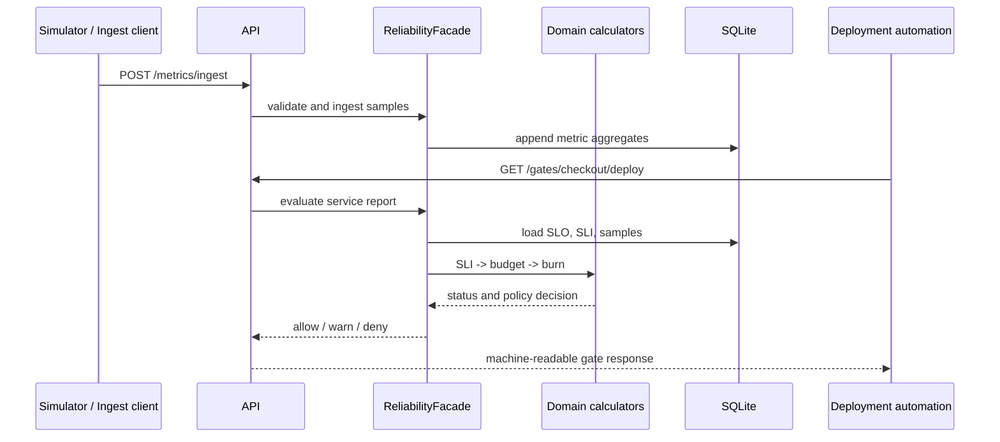

# Architecture

Northstar Reliability Control Room is a modular monolith designed for local reproducibility. The application port (`IReliabilityStore`) prevents SLO logic from depending on EF Core; the SQLite adapter persists service, SLI/SLO, and metric rows while storing lifecycle-rich aggregates as JSON payloads.

## Module boundaries

| Module | Responsibility | May reference |
|---|---|---|
| Domain | invariants, arithmetic, state machines | BCL only |
| Application | ports, simulation, orchestration, reports | Domain |
| Infrastructure | EF Core / SQLite adapter and mappings | Application |
| API | HTTP, JWT, configuration, dashboard, composition | Application + Infrastructure |

## Failure behavior

The application emits RFC 7807 responses. Domain rule violations return 422, missing resources return 404, input validation returns 400, scope failure returns 401/403, and fixed-window rate limiting returns 429. Alert suppression is explicit state rather than implicit disappearance.
