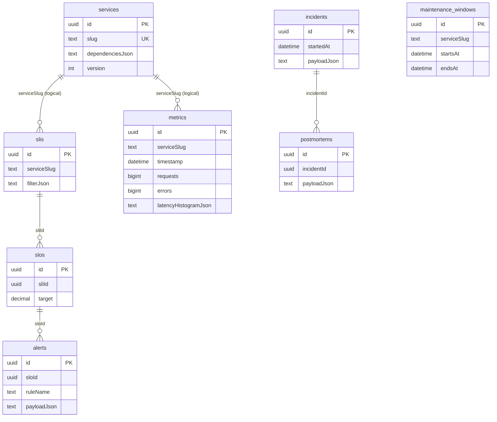

# Database Schema

SQLite is the default adapter. EF Core creates the schema with `EnsureCreated` in local Development; migration generation is a future improvement because schema evolution is not the instructional focus of this self-directed reference implementation.

## Tables and constraints

| Table | Primary key | Important columns | Indexes / constraints |
|---|---|---|---|
| `services` | `id` | catalogue metadata, `dependenciesJson`, `version` | unique `slug`; version concurrency token |
| `slis` | `id` | service, aggregation mode, kind, `filterJson`, latency threshold | unique `(serviceSlug, name)` |
| `slos` | `id` | `sliId`, service, target, window configuration | index `sliId`; unique `(serviceSlug, name)` |
| `metrics` | `id` | scope dimensions, aggregate counters, percentiles, histogram JSON | `(serviceSlug, timestamp)` |
| `alerts` | `id` | `sloId`, rule name, lifecycle payload | unique `(sloId, ruleName)` |
| `maintenance_windows` | `id` | service, start/end, payload | `(serviceSlug, startsAt, endsAt)` |
| `incidents` | `id` | start time, timeline/status/impacts payload | `startedAt` |
| `postmortems` | `id` | incident ID, review/actions/factors payload | `incidentId` |

Lifecycle aggregates (`alerts`, `incidents`, `postmortems`) are serialized deliberately because their nested timelines and action items are read and mutated atomically by this local prototype. Their top-level lookup keys remain indexed. A production reporting scale-out would normalize query-heavy child data or project it into a warehouse/read model.
