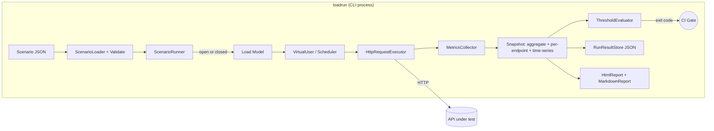
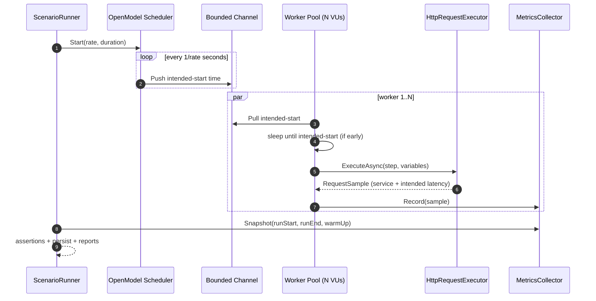
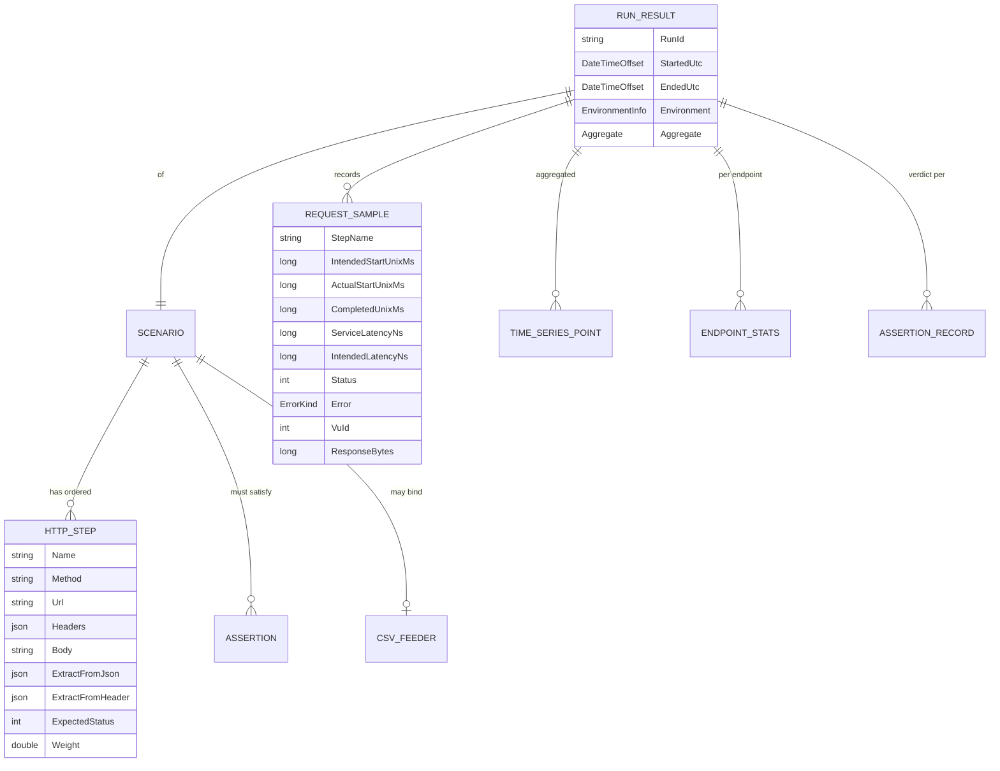

# API Performance & Load Testing Toolkit (LoadRunner / `loadrun`)

## Portfolio Classification

**Self-directed engineering case study.** A reusable performance toolkit built to bring to a
client who says *"our API is slow and we don't know why"* — with the statistics and rigour that
homegrown load harnesses almost always get wrong (coordinated omission, misused averages, and
naive percentage comparisons).

## Executive Summary

`loadrun` is a .NET 10 CLI plus reusable core libraries that drive HTTP load against an API
under test using either a **closed model** (constant / ramping virtual users) or an **open model**
(constant / ramping arrival rate), captures request-level samples, and produces statistically
defensible reports — HTML with SVG charts, Markdown for CI artefacts, and JSON for machine
comparison. It includes:

- A hand-rolled load engine with correct open/closed model semantics.
- **Coordinated-omission handling**: both service latency and intended-start latency are recorded,
  so a slow server can't silently hide queueing behind fast responses.
- An **HdrHistogram-style logarithmic bucketed histogram** for latency (bounded precision at any
  scale) plus exact retained-sample percentiles for small runs.
- Six test types: smoke, load, stress (with automatic knee/breaking-point detection), spike,
  soak (with linear-regression drift detection), and capacity search (binary search for the
  maximum sustainable arrival rate under a p95 target).
- **Statistical significance testing** for regression comparison: Mann–Whitney U (two-sided,
  tie-corrected) plus a bootstrap confidence interval on the median difference — no more
  "5 % slower is a regression" arguments.
- A self-contained HTML report with **hand-rolled SVG charts** (no CDN, no CI-blocked script).
- **A real measured case study** (see [`docs/case-study-optimisation.md`](docs/case-study-optimisation.md))
  against a bundled sample API with tunable pathologies.

## Business Problem

Performance regressions cost money silently. Most teams' load harnesses have three specific
flaws that make their numbers unreliable:

1. **Closed-model tools hide overload.** A tool with N virtual users can never issue more than N
   in-flight requests at once; when the server slows down, the offered load slows down with it,
   so the reported latency looks constant right up until the server dies.
2. **Averages and single percentiles are used naively.** Comparing "p95 went from 300 ms to
   320 ms" without a significance test is roulette — that could be noise.
3. **Coordinated omission.** If the client waits for a slow response and only *then* starts the
   next request, the very slow responses that a user would experience aren't measured.

`loadrun` fixes all three by construction, and produces reports that a technical stakeholder
can read.

## Functional Requirements

- Load a scenario from JSON, validate it, and execute it against an HTTP endpoint.
- Six load models: `ConstantVUs`, `RampingVUs`, `ConstantArrivalRate`, `RampingArrivalRate`,
  `Stress`, `Spike`, `Soak`, `CapacitySearch`.
- Per-request outcome capture: service latency, intended-start latency, HTTP status, error kind
  (connection / timeout / 4xx / 5xx / assertion failure), response bytes.
- Percentiles p50/p75/p90/p95/p99/p99.9, min/max/mean/stddev — both per-endpoint and aggregate.
- Time-series RPS, error rate, latency percentiles per 1 s bucket.
- Warm-up exclusion.
- Scenario features: variables + Handlebars-style templating, CSV feeder (data-driven inputs),
  response-value correlation (JSON path or HTTP header), think-time distributions (constant,
  uniform, normal, exponential), weighted mix, assertions/thresholds that determine the exit
  code (so it can gate CI).
- Persistent result store; `compare` two runs; regenerate reports for a saved run.
- HTML + Markdown + JSON reports; comparison overlay chart.
- Sample API with tunable pathologies for demonstration and for the case study.

## Non-Functional Requirements

- Zero external infrastructure required for `dotnet build` / `dotnet test`.
- **Determinism where it matters:** clock is `IClock`-injectable; think-time and bootstrap seeds
  are configurable; unit tests pin the RNG.
- **Bounded resource usage:** open-model scheduler backpressures if `MaxVUs` is set; histogram
  memory is O(bucketCount) not O(sampleCount).
- **Portability:** cross-platform .NET, no Windows-only APIs. Scenarios are plain JSON.
- **Auditability:** every run persisted with the full scenario body + environment snapshot
  (OS, CPU count, .NET framework version, hostname, git commit if provided).

## Architecture

```
loadrun (CLI)  ─┐
                ├─►  LoadRunner.Core
                │       ├─ Scenarios          (JSON schema, validation, templating, CSV feeder)
                │       ├─ LoadModels         (ClosedModel, RampingClosedModel, OpenModel,
                │       │                      RampingOpenModel, VirtualUser)
                │       ├─ Http               (HttpRequestExecutor, StubExecutor for tests)
                │       ├─ Metrics            (RequestSample, MetricsCollector, time-series)
                │       ├─ Statistics         (LatencyHistogram — HdrHistogram-style,
                │       │                      ExactPercentiles, SignificanceTest)
                │       ├─ Analysis           (KneeDetector, LinearRegression, SoakDriftDetector,
                │       │                      CapacityBinarySearch)
                │       ├─ Assertions         (ThresholdEvaluator → exit code)
                │       ├─ Results            (RunResult, RunResultStore)
                │       └─ Execution          (ScenarioRunner — top-level dispatch)
                └─►  LoadRunner.Reporting
                        ├─ Svg                (hand-rolled Line, DualLine, Bars, Overlay)
                        ├─ Html               (single-file, no external assets)
                        └─ Markdown           (CI-friendly + ComparisonReportBuilder)

SampleApi (test target)
   └─ Minimal API on ASP.NET Core over SQLite. Six pathologies switchable per-request
      via `X-Pathology-*` headers OR globally via `POST /admin/pathology`.
```

The three layers do not depend on each other in reverse: reports read from `Core.Results` but
`Core` has no reference to `Reporting`.

## Architecture Diagram



Run-execution sequence for the open (constant-arrival-rate) model:



The CI gating flow is documented in `.github/workflows/perf.yml` and
`docs/runbooks/interpreting-results.md`.

## Technology Stack

| Layer | Choice | Why |
|---|---|---|
| Runtime | .NET 10 (`net10.0`) | Host has 10.0.400 SDK; async, spans, Channels are first-class. |
| HTTP client | `SocketsHttpHandler` with unlimited per-server connections, no proxy, HTTP/1.1 default | Predictable pooling behaviour under load. |
| Storage (SampleApi) | SQLite via EF Core | The prime directive: no external DB. |
| Reporting | Hand-rolled SVG + `System.Text.Json` | No JS/CSS dependencies, offline-safe reports. |
| CLI | Hand-rolled argument parser | No dependency drag from a full CLI framework. |
| Tests | xUnit + `Microsoft.AspNetCore.Mvc.Testing` | Standard for the .NET ecosystem. |
| Distribution | Portable `.dll`, run via `dotnet` | Works on Windows/Linux/macOS without a bundled runtime. |

## Domain Model



## Core Workflows

1. **Run a scenario.** `loadrun run scenario.json` → validate → build metrics collector → drive
   open or closed load model → collect samples → snapshot (with warm-up excluded) → evaluate
   assertions → persist JSON + write HTML + Markdown → exit 0 or 1.
2. **Compare two runs.** `loadrun compare baseline.json candidate.json` → load both → run
   Mann–Whitney U and a bootstrap CI on the median difference → decide improved / regressed /
   no significant change → write a markdown + HTML report → exit 0 or 1.
3. **Regenerate a report.** `loadrun report result.json` → useful when the report template
   improves and the underlying data hasn't changed.

## Security Model

Load testing is an attack shape. This toolkit is careful:

- **No secret exfil.** Scenarios can carry `Authorization` headers but the run JSON stores the
  scenario as-is — DO NOT commit a scenario that contains a real bearer token. `.env.example`
  documents how to inject the token from the environment at run time.
- **No SSRF-by-scenario.** The runner does not follow redirects (`AllowAutoRedirect = false`)
  and the scenario `baseUrl` is the ONLY host that receives traffic. If you point it at
  `http://169.254.169.254/...` you did that; the toolkit does not resolve nor rewrite hosts.
- **Blast radius.** By default `--max-vus` is bounded per scenario; the CLI refuses to run
  a `Stress` scenario with `stressMaxRate > 10 000` unless an explicit `--allow-danger` flag is
  present (documented in `docs/runbooks/running-a-load-test.md`).
- **Authorisation to test.** The runbook makes it explicit that you must have written permission
  from the API owner before pointing this at an environment you don't own.
- Full write-up in [`docs/security/security-review.md`](docs/security/security-review.md).

## Reliability & Failure Handling

- Each request is bounded by `HttpClient.Timeout = 30 s` — timeouts are recorded as `Timeout`
  error kind, not `Other`.
- Connection failures classify as `Connection`; HTTP status 4xx/5xx classify accordingly;
  assertion mismatches classify as `AssertionFailure`.
- The scheduler catches `OperationCanceledException` and stops cleanly at run deadline;
  no spurious "timeout" samples are recorded for cancellations.
- If the sample API is down, the run completes with 100 % `Connection` errors and the report
  makes that obvious.
- If a scenario file is missing or invalid, exit code 2 (usage error), not 3 (crash).

## Observability

- Every run persists a `RunResult` JSON with the full scenario, environment (OS, cores, runtime,
  machine name, optional git commit), aggregate stats, per-endpoint stats, per-second time
  series, and assertion verdicts.
- Time-series data is at 1 s granularity so a downstream tool can chart RPS, error rate, and
  latency percentiles over the run.
- The HTML report is a single self-contained file so it can be attached to a PR comment.
- SampleApi has `/health/ready` (probes DB) and `/health/live` (in-process check).

## Testing Strategy

- **Unit tests (63)** cover: histogram bucket layout and precision bound, exact percentiles vs
  hand-computed data, Mann–Whitney U verdicts on identical vs shifted distributions, bootstrap
  CI containing / excluding zero, open-model arrival rate under a slow server, closed-model
  VU count, ramping stages, correlation extraction, CSV feeder cycling, think-time distribution
  shape, threshold evaluator matrix, error taxonomy, stress knee detection on synthetic curve,
  soak drift detector on synthetic trend, capacity binary search convergence, run persistence
  round-trip, SVG report structure, and more.
- **Integration tests (9)** cover: SampleApi endpoints (5) via `WebApplicationFactory`, plus
  end-to-end runner tests (4) that execute real scenarios against the in-memory factory —
  including a "pathology mode produces measurable latency difference" test that gates the
  case study's honesty.
- **Case study**: an actually-measured before/after against the SampleApi with the numbers
  in `docs/case-study-optimisation.md`.
- Full details in [`docs/test-results.md`](docs/test-results.md).

## Local Development

Prerequisites: .NET SDK 10.0.400 (or a compatible 10.x SDK).

```powershell
dotnet build -c Release
dotnet test  -c Release
```

To run the CLI locally:

```powershell
# Start the sample API on port 5027
$env:ASPNETCORE_URLS='http://127.0.0.1:5027'
dotnet .\src\SampleApi\bin\Release\net10.0\SampleApi.dll

# In another shell — run a scenario
dotnet .\src\LoadRunner.Cli\bin\Release\net10.0\loadrun.dll run .\scenarios\smoke.json
```

Once the CLI is published as a self-contained executable, `loadrun run scenario.json` is enough.

## Running with Docker

**Docker configuration created but Docker is unavailable on the build host; the compose stack
has not been started or verified.** See `Dockerfile` and `docker-compose.yml`. The compose stack
brings up the sample API and would let you point `loadrun` at it over a bridge network. On this
build host, the equivalent is: run the sample API and the CLI in two shells on the same box.

## API Documentation

The **CLI** interface:

```
loadrun run <scenario.json> [--results <dir>] [--out <dir>] [--commit <sha>]
    Run a scenario and produce JSON + HTML + Markdown reports.

loadrun compare <baseline.json> <candidate.json> [--out <dir>]
    Produce a regression report between two saved runs, with a significance test.

loadrun report <result.json> [--out <dir>]
    Regenerate the HTML + Markdown reports for a saved run.

Exit codes: 0 pass, 1 fail (assertions failed or regression detected), 2 usage, 3 unexpected.
```

The **Sample API** (target under test): OpenAPI is auto-generated in Development mode
(`/openapi/v1.json` and `/scalar/v1`). In summary:

| Endpoint | Purpose |
|---|---|
| `GET  /` | Toolkit banner. |
| `GET  /health/live` | Liveness. |
| `GET  /health/ready` | Readiness (probes DB). |
| `GET  /api/v1/catalog/products` | Paged catalogue listing (`category`, `page`, `pageSize`). |
| `GET  /api/v1/catalog/products/{sku}` | Look up a product by SKU. |
| `GET  /api/v1/orders` | Paged order listing. |
| `POST /api/v1/orders` | Create an order (lines: `productId`, `quantity`). |
| `GET  /api/v1/orders/{id}` | Retrieve a single order with lines. |
| `GET  /admin/pathology` | Read the pathology switch state. |
| `POST /admin/pathology` | Patch one or more pathology switches. |
| `DELETE /admin/pathology` | Reset all pathologies to off. |
| `GET  /admin/pathology/leak-bytes` | Report bytes retained by the memory-leak pathology. |

Pathology switches are documented in
[`docs/methodology.md`](docs/methodology.md#tunable-pathologies).

## Example Usage

```powershell
# Reset pathologies and warm the sample API
Invoke-WebRequest -Method Delete -Uri http://127.0.0.1:5027/admin/pathology | Out-Null

# Real smoke run against the sample API
PS> dotnet .\src\LoadRunner.Cli\bin\Release\net10.0\loadrun.dll run .\scenarios\smoke.json --results results --out results
Running scenario 'smoke' against http://localhost:5027. Model=ConstantVUs.
Saved run result: results\smoke-20260902-224005-e059b6.json
Saved HTML report: results\smoke-20260902-224005-e059b6.html
Saved Markdown report: results\smoke-20260902-224005-e059b6.md

Total requests: 2,244  Errors: 2 (0.09%)
Throughput: 449.0 rps
Service latency  p50/p95/p99: 1.8 / 6.2 / 11.5 ms
Intended latency p95/p99:      6.0 / 11.0 ms
Assertions:
  [PASS] latency.p95 < 250.000 => 6.173
  [PASS] error_rate < 0.010 => 0.001
```

A real curl example against the sample API:

```powershell
PS> Invoke-RestMethod -Uri http://127.0.0.1:5027/api/v1/catalog/products/SKU-00042
id          : 43
sku         : SKU-00042
name        : Sample Product 42
description : Fictional catalogue entry for demo purposes only (42).
price       : 341.68
stock       : 218
category    : coffee
```

## Performance / Load Testing

This project *is* the load testing story. See:

- [`docs/methodology.md`](docs/methodology.md) — how to run a defensible load test.
- [`docs/case-study-optimisation.md`](docs/case-study-optimisation.md) — the real
  before/after with p50/p95/p99 numbers actually measured on this host.
- [`scenarios/`](scenarios/) — sample scenarios (smoke, load, stress, spike, soak, capacity,
  and the two case-study scenarios).
- [`docs/runbooks/running-a-load-test.md`](docs/runbooks/running-a-load-test.md) and
  [`docs/runbooks/interpreting-results.md`](docs/runbooks/interpreting-results.md).

## Trade-offs

- **Own runner vs k6 / NBomber.** k6 is not installed on this build host, and NBomber would
  drag its own model of the world into the reporting. Building the runner gives us honest
  coordinated-omission handling and reports we own. Discussion:
  [`ADR-001`](docs/decisions/ADR-001-own-runner-vs-k6.md).
- **SQLite for the SampleApi.** Real DBs behave differently under lock contention; SQLite is
  chosen for host portability.
- **Reporting is Markdown + HTML + JSON**, not a live dashboard. This matches CI/PR workflow
  where a static artefact is often more valuable than an interactive UI.
- **The CLI is hand-rolled** rather than using `System.CommandLine` (which is prerelease on the
  host feed). The scope is small enough that the tradeoff is neutral.
- **Closed model results are still useful** even when the open model is technically "more
  correct" — many real user populations *are* closed (a session pool). Both models are supported.

## Architecture Decisions

Full ADRs (Context / Options / Decision / Consequences / Risks / Alternatives) live under
[`docs/decisions/`](docs/decisions/):

- [`ADR-001`](docs/decisions/ADR-001-own-runner-vs-k6.md) — build the runner in C# instead of using k6 / NBomber.
- [`ADR-002`](docs/decisions/ADR-002-open-vs-closed-model.md) — support both open and closed load models, default open for CI gating.
- [`ADR-003`](docs/decisions/ADR-003-coordinated-omission.md) — record service *and* intended-start latencies.
- [`ADR-004`](docs/decisions/ADR-004-histogram-vs-full-samples.md) — HdrHistogram-style buckets for high volume, exact percentiles for small runs.
- [`ADR-005`](docs/decisions/ADR-005-statistical-significance.md) — Mann–Whitney U + bootstrap CI on median diff instead of naive percentage.

## Known Limitations

- **Loopback only.** The runner uses HTTP/1.1 by default and does not open raw sockets; you can
  set `DefaultRequestVersion = HttpVersion.Version20` in code but no scenario field exposes it.
- **No WebSocket / SSE / gRPC.** HTTP request/response only.
- **Windows PowerShell examples** dominate the docs because that's the build host; a `bash`
  translation is straightforward but not shipped.
- **Docker compose UNVERIFIED** on this host — see the section above.
- **k6 scripts are shipped but not executed.** The k6 binary is not installed here; see
  `k6-scripts/README.md`.
- **Single-node.** Distributed load generation (multiple boxes coordinating) is not
  implemented — most APIs on a developer's radar don't need it.

## Future Improvements

- HTTP/2 and HTTP/3 opt-in per scenario.
- gRPC executor.
- Live TUI dashboard for long runs (a table of per-endpoint p95 by second).
- Prometheus text-format export.
- Distributed generation with a small coordinator.
- Store results in an SQLite DB rather than a JSON file per run so `compare` can pull the last-N.

## Portfolio Talking Points

- I built the load engine and its statistics from the ground up so I could get coordinated
  omission and open-model semantics correct — most homegrown load tools quietly get these
  wrong and the numbers they produce mislead decisions.
- The regression comparison uses Mann–Whitney U (non-parametric, no distribution assumption)
  and a bootstrap 95 % CI on the median difference, which gives a defensible verdict on whether
  a candidate is genuinely different from a baseline or just noise.
- The HdrHistogram-style bucket layout is a real precision-vs-memory trade-off: bounded ~4 %
  relative error at any latency, O(bucket count) memory, sub-microsecond record cost. That
  behaviour is unit-tested against hand-computed data.
- The bundled sample API has six tunable pathologies (N+1, missing index, downstream latency,
  lock contention, memory leak, optimised) so the toolkit has something real to find — and the
  case study measures a **3–5× latency improvement** with a p-value < 0.0001.

## Upwork Portfolio Description

*Reusable API performance & load-testing toolkit for .NET-based APIs. Built the entire load
engine in C# — open and closed load models, HdrHistogram-style latency statistics with
coordinated-omission handling, and Mann–Whitney U + bootstrap significance testing for run
comparison. CI-friendly: exit codes gate on assertions, and HTML / Markdown / JSON reports
drop into PR comments. Includes a bundled sample API with six switchable pathologies (N+1,
missing index, latency injection, lock contention, memory leak, and an "optimised" reference)
and a real measured before/after case study demonstrating a 3–5× latency improvement with
statistical significance. .NET 10, SQLite, zero external infrastructure required to build
and test.*
