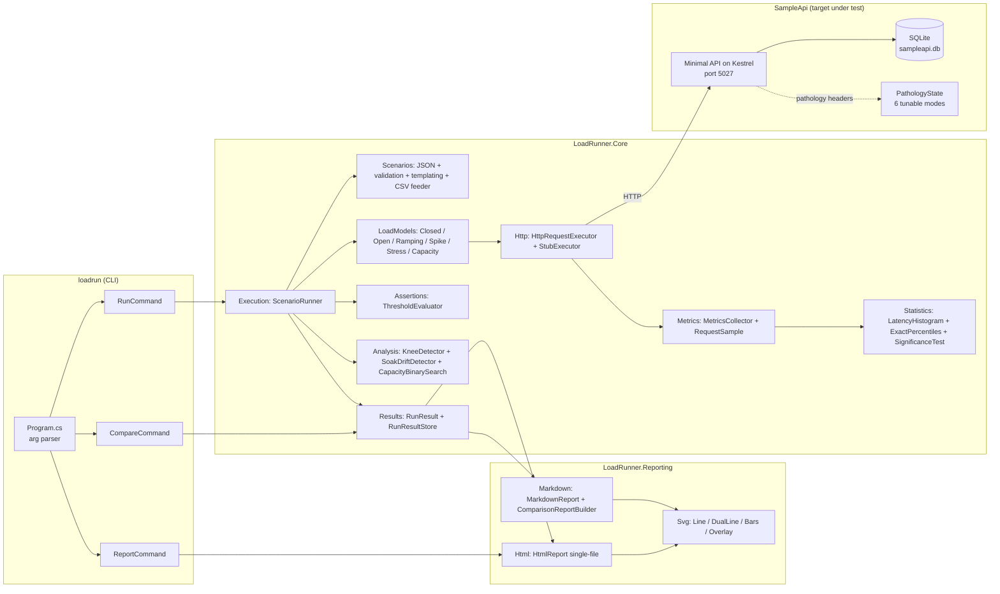
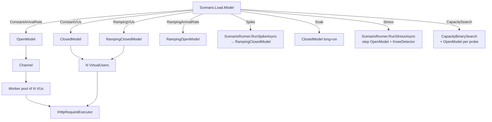
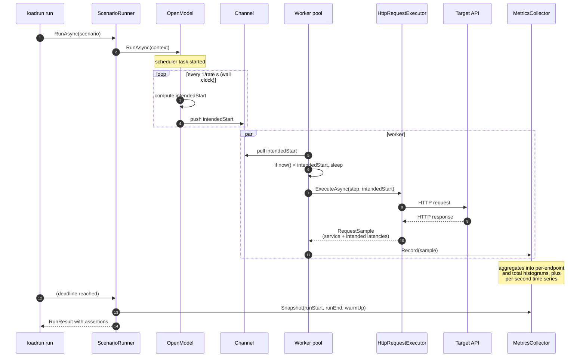

# Architecture

This document is a longer-form partner to the README's Architecture section. Read that first.

## Container view



## The load-model dispatch



Every dispatch ends in the same executor interface, so a `StubExecutor` in tests exercises
the exact same load-model code paths that the CLI uses against real Kestrel.

## Sequence: open-model run with coordinated-omission tracking



## Data flow through the metrics pipeline

```
per-request sample ─► endpoint LatencyHistogram (service)
                    ├► endpoint LatencyHistogram (intended)
                    ├► aggregate LatencyHistogram (service)
                    ├► aggregate LatencyHistogram (intended)
                    ├► per-endpoint error counter by ErrorKind
                    ├► per-endpoint response-byte counter
                    └► per-second time-series bucket
```

`MetricsCollector` is thread-safe: histograms use interlocked increments on the count array.
No locks on the hot path.

## Assertions and exit codes

```
scenario.assertions ─► ThresholdEvaluator.Evaluate(snapshot)
                         ├─ latency.p50 / p75 / p90 / p95 / p99 / p99.9
                         ├─ intended.p50 / p95 / p99
                         ├─ throughput.rps
                         ├─ error_rate
                         └─ count
                       ► AssertionResult[]
                       ► all pass?  → CLI exit 0
                       ► any fail?  → CLI exit 1
```

## Directory structure

```
src/
  LoadRunner.Core/          class library — engine
  LoadRunner.Reporting/     class library — SVG/HTML/Markdown
  LoadRunner.Cli/           console app — outputs loadrun.dll (AssemblyName)
  SampleApi/                ASP.NET Core Minimal API on port 5027

tests/
  LoadRunner.UnitTests/         xUnit — 63 tests, no I/O
  LoadRunner.IntegrationTests/  xUnit — 9 tests, WebApplicationFactory + SampleApi in-proc

scenarios/                  JSON scenarios
results/                    persisted RunResults (JSON) and reports (HTML + MD)
docs/
  adr/                      ADR-001..005
  architecture/             this file
  runbooks/                 runbooks
  security/                 security review
  portfolio/                portfolio artefacts
  case-study-optimisation.md
  methodology.md
  test-results.md
k6-scripts/                 k6 scripts (NOT executed on this host)
scripts/                    demo.ps1
.github/workflows/          ci.yml + perf.yml
```

## Deployment / distribution

- The CLI is a portable `.dll`; on Windows, `dotnet loadrun.dll` runs it. `dotnet publish
  -c Release -r <rid> --self-contained true` produces a single-file executable per RID.
- The SampleApi is designed as a demonstration target, not a production service — but it
  runs fine as a standalone kestrel app under a service manager if you want a permanent
  practice target.
