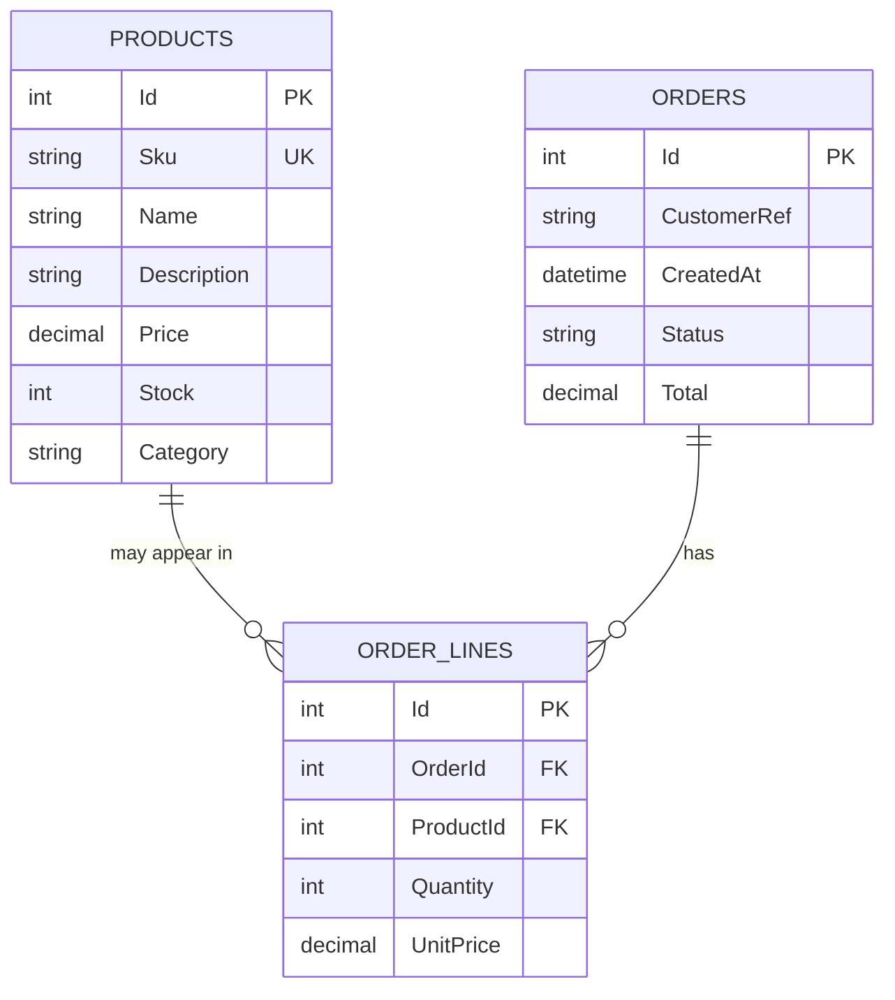

# Database schema (SampleApi)

The SampleApi uses SQLite (default file: `sampleapi.db`) via EF Core. The schema is
intentionally small; the interesting behaviour is in the endpoint code that queries it.

## Tables

### Products

| Column | Type | Notes |
|---|---|---|
| `Id` | INTEGER PK, autoincrement | EF-managed. |
| `Sku` | TEXT NOT NULL | **Unique index** `IX_Products_Sku`. Case-sensitive by default in SQLite. |
| `Name` | TEXT NOT NULL, max 200 | Human-readable name. |
| `Description` | TEXT | Longer copy. |
| `Price` | NUMERIC(18,2) NOT NULL | Stored as `TEXT` in SQLite by EF's decimal converter. |
| `Stock` | INTEGER NOT NULL | On-hand quantity (fictional). |
| `Category` | TEXT NOT NULL | **Index** `IX_Products_Category`. |

### Orders

| Column | Type | Notes |
|---|---|---|
| `Id` | INTEGER PK, autoincrement | |
| `CustomerRef` | TEXT NOT NULL | Fictional customer identifier like `CUST-00042`. |
| `CreatedAt` | TEXT (ISO 8601) NOT NULL | Order timestamp. |
| `Status` | TEXT NOT NULL | `Pending`, `Complete`, `Cancelled`. |
| `Total` | NUMERIC(18,2) NOT NULL | Sum of line totals. |

### OrderLines

| Column | Type | Notes |
|---|---|---|
| `Id` | INTEGER PK, autoincrement | |
| `OrderId` | INTEGER NOT NULL | **Index** `IX_OrderLines_OrderId`, FK to `Orders(Id)`. |
| `ProductId` | INTEGER NOT NULL | FK to `Products(Id)`, no cascading; N+1 pathology counts these. |
| `Quantity` | INTEGER NOT NULL | |
| `UnitPrice` | NUMERIC(18,2) NOT NULL | Snapshot at the time of the order. |

## Indexes (visible in the DB)

- `IX_Products_Sku` UNIQUE — supports the fast SKU lookup path.
- `IX_Products_Category` — supports the fast category filter path.
- `IX_OrderLines_OrderId` — supports `Include(Lines)` and the N+1 pathology's per-order count.

The **missing-index pathology** does not remove these indexes. Instead the endpoint code
wraps the column in `ToLower()`, which SQLite (and every other engine) cannot satisfy from
an index — this simulates the very common bug of forgetting `citext` / case-insensitive
collation and losing your index in the process.

## ER diagram

## Seed data

`Seed.EnsureAsync(db, productCount: 200, orderCount: 500)` is called at startup unless the
environment is `Testing`. It:

- Populates 200 fictional `Products` across 8 categories with prices in `[5, 505]` KES (well,
  they're just numbers; treat the unit as whatever you like).
- Populates 500 fictional `Orders` with 1–5 lines each, all deterministic with `Random(20260903)`.

Reset by deleting `sampleapi.db*`.
