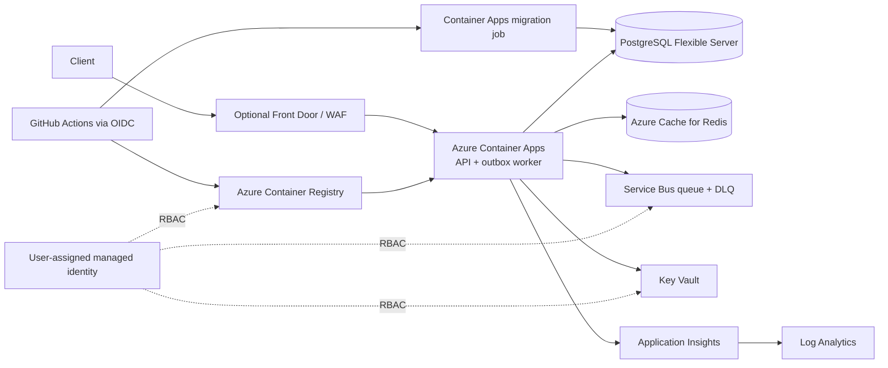
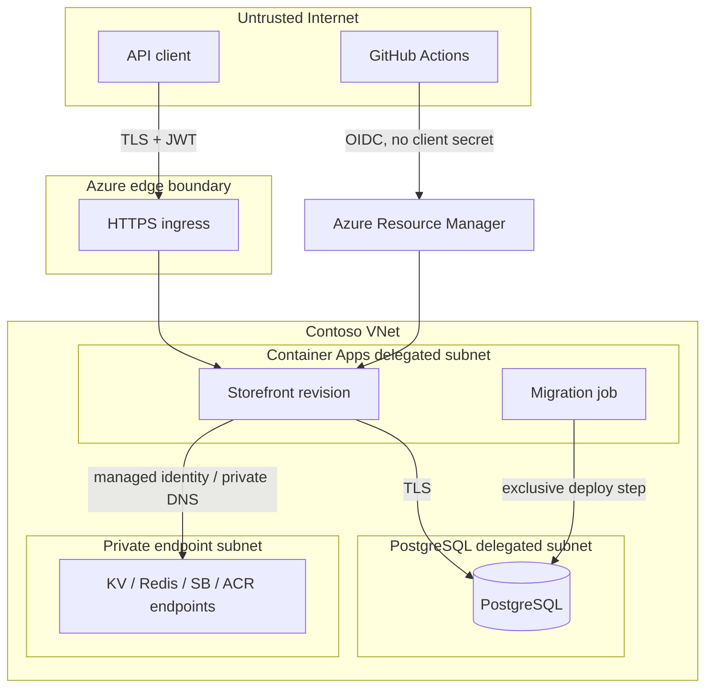
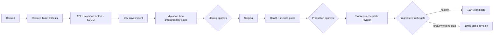
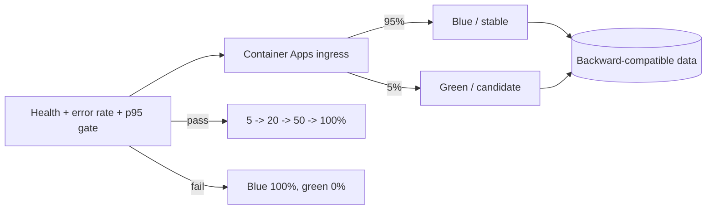
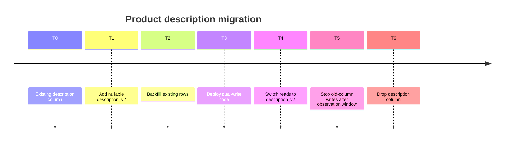
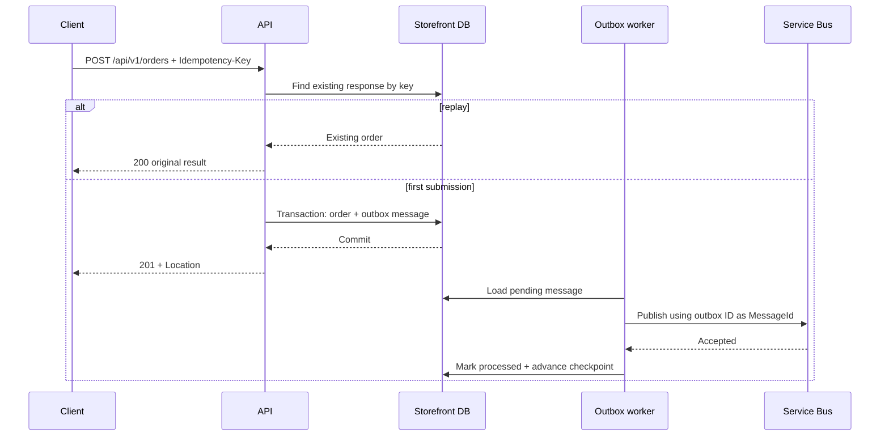

# Contoso Retail Storefront — Azure Cloud Deployment Reference

## Portfolio Classification

Self-directed engineering case study. This repository is an Azure-targeted reference implementation and production-style prototype, not client work and not evidence of a live production deployment.

## Executive Summary

This is the handover package for the question, “How should we deploy this workload properly on Azure?” It combines a runnable ASP.NET Core storefront API, a transactional outbox worker, an explicit EF Core migration runner, operational probes, telemetry, release gates, Bicep and Terraform reference infrastructure, GitHub Actions delivery workflows, and operator documentation.

The local path is deliberately infrastructure-free: .NET 10 and SQLite are sufficient. The Azure path targets Container Apps, PostgreSQL Flexible Server, Azure Cache for Redis, Service Bus, Key Vault, ACR, Log Analytics, and Application Insights with managed identity and least-privilege RBAC.

## Business Problem

Contoso Retail (fictional) needs to move a small storefront workload from “it runs on a server” to a repeatable, observable and reversible cloud deployment. The difficult work is not catalogue CRUD; it is safe configuration, dependency readiness, data migration ordering, in-flight work preservation, progressive delivery, rollback, identity, network boundaries and evidence that those controls work.

## Functional Requirements

- List a small fictional product catalogue.
- Submit idempotent orders and return the original order on replay.
- Persist an order and its integration event atomically.
- Relay outbox events with at-least-once delivery and durable checkpoints.
- Preview a new pricing path behind a dark-launch feature flag.
- Issue development JWTs and enforce catalogue/order scopes.
- Run schema migrations from a separate executable.
- Simulate a downstream dependency through a resilient `HttpClient`.

## Non-Functional Requirements

- Starts locally with SQLite; supports SQLite, PostgreSQL and SQL Server by configuration.
- Refuses unsafe development defaults in `Production`.
- Exposes distinct liveness, readiness and startup probes.
- Drains connections and waits for in-flight requests during shutdown.
- Preserves unprocessed outbox records when worker cancellation occurs.
- Emits W3C-correlated OpenTelemetry traces, metrics and logs.
- Supports Console, OTLP and Azure Monitor exporters.
- Uses bounded startup dependency wait, timeout, retry and circuit breaking.
- Requires no external infrastructure for build or tests.
- Treats IaC as reference material only; no cloud resources are provisioned here.

## Architecture

The code is a modular monolith with ports and adapters:

```text
Api -> Infrastructure -> Application -> Domain
Api --------------------> Application -> Domain
```

`Domain` owns catalogue/order invariants. `Application` owns use cases and ports. `Infrastructure` implements EF Core, SQLite/PostgreSQL/SQL Server selection, Redis and Service Bus adapters, Key Vault configuration, resilience and the outbox relay. `Api` is the composition root. `MigrationRunner` is a separate deploy-time entry point.

See [Azure architecture](docs/azure-architecture.md), [detailed code architecture](docs/architecture/architecture.md), [12-factor review](docs/12-factor.md), and [ADRs](docs/decisions/).

## Architecture Diagram

### Azure target architecture



### Network and trust boundaries



### CI/CD pipeline



### Blue/green traffic shift



### Expand/contract migration timeline



## Technology Stack

| Concern | Choice |
|---|---|
| Runtime | .NET SDK 10.0.400, ASP.NET Core minimal APIs, `net10.0` |
| Data | EF Core 10; SQLite default; Npgsql and SQL Server provider switches |
| Messaging | Transactional outbox; in-memory local adapter; Azure Service Bus adapter |
| Cache | In-memory local health adapter; StackExchange.Redis production probe |
| Security | JWT bearer, scope policies, Key Vault configuration source, managed identity IaC |
| Telemetry | OpenTelemetry ASP.NET Core/HttpClient/runtime, Console/OTLP/Azure Monitor |
| IaC | Bicep primary reference; Terraform equivalent |
| Delivery | GitHub Actions, Azure OIDC federation, Container Apps revisions/jobs |
| Testing | xUnit, WebApplicationFactory, SQLite in-memory |

## Domain Model

- `Product`: normalized SKU, price/currency, active state, optimistic version.
- `Order`: customer reference, idempotency key, items, state and total.
- `OrderItem`: immutable submitted-line snapshot.
- `OutboxMessage`: event payload, attempt count, processing timestamp and last error.
- `WorkerCheckpoint`: last successfully published message for the relay identity.

The relational model and indexes are documented in [database-schema.md](docs/database-schema.md).

## Core Workflows



Migrations execute before revision traffic. The worker publishes before marking a record processed; cancellation therefore leaves the row pending for safe retry.

## Security Model

- Development/Testing only token endpoint; production callers should use an external OIDC issuer.
- Policy-based `storefront.catalogue.read` and `storefront.orders.write` scopes.
- Production guard rejects the demo key, SQLite, in-memory cache/bus and disabled Key Vault.
- Configuration precedence is appsettings → environment → user-secrets → Key Vault.
- Key Vault secret names become configuration keys by replacing `--` with `:`.
- Managed identity receives only Key Vault Secrets User, AcrPull, and Service Bus sender/receiver roles.
- Security headers, bounded rate limiting and RFC 7807 responses are middleware concerns.
- No real secrets or personal data are included.

See [security review](docs/security/security-review.md). No formal audit or certification is claimed.

## Reliability & Failure Handling

| Failure | Behaviour |
|---|---|
| Database unavailable/pending migration | Startup waits with bounded exponential backoff; readiness is unhealthy |
| Cache or bus fault | Liveness stays healthy; readiness becomes unhealthy |
| Transient HTTP 5xx/408/429 | Bounded exponential retry |
| Slow downstream | Per-attempt timeout |
| Repeated downstream failures | Circuit opens, then permits a half-open probe |
| SIGTERM/rolling replacement | New work rejected, pre-stop delay honoured, in-flight work drained |
| Worker cancellation during publish | Message remains pending and checkpoint does not advance |
| Canary error/latency breach | Traffic returns to stable revision |
| Missing canary metrics | Conservative rollback |

Probe mapping:

| Endpoint | Semantics | Container Apps / AKS | App Service |
|---|---|---|---|
| `/health/live` | Process only; no dependencies | Liveness probe | Not the primary health-check path |
| `/health/ready` | DB, cache, bus, migrations | Readiness probe | Health Check path |
| `/health/startup` | Bounded dependency initialization complete | Startup probe | Deployment-slot warm-up check |

## Observability

- W3C trace context and `X-Correlation-Id` are honoured inbound and propagated outbound.
- Resource attributes include `service.name`, assembly version, deployment environment and instance/revision.
- ASP.NET Core, HttpClient, runtime and custom storefront signals use OpenTelemetry.
- Exporter values: `None`, `Console`, `Otlp`, `AzureMonitor`.
- Set `Observability__OtlpEndpoint` for an OTLP collector.
- Set `Observability__ApplicationInsightsConnectionString` through Key Vault/environment and choose `AzureMonitor` for Application Insights.
- `/metrics` exposes canary-oriented Prometheus text: request count, 5xx count, error rate and rolling p95 latency.
- Structured logs use scopes and message templates.

## Testing Strategy

The suite contains **66 tests: 50 unit and 16 integration**. It covers domain invariants, options and production guards, secret precedence, all health semantics and fault modes, graceful draining, worker cancellation/checkpointing, resilience retry/timeout/circuit half-open behaviour, feature dark launch, trace propagation, migration idempotency and expand/contract ordering, API happy/validation/401/403 paths, and parsed IaC environment invariants.

Real local verification:

- `dotnet build -c Release`: succeeded, 0 warnings, 0 errors.
- `dotnet test -c Release`: 66 passed, 0 failed, 0 skipped.
- `az bicep build --file infra\bicep\main.bicep`: succeeded with Bicep CLI 0.44.1.
- All three `.bicepparam` files also passed `az bicep build-params`.
- Healthy and deliberately failing local canary simulations both ran; promotion and rollback paths were observed.
- Terraform was authored but not validated because the Terraform binary is unavailable.
- Container images/Compose were authored but not built because Docker is unavailable.
- No Azure deployment was executed and no Azure resources were provisioned.

The exact captured output is in [docs/test-results.md](docs/test-results.md).

## Local Development

Prerequisite: .NET SDK 10.0.400.

```powershell
Set-Location C:\Users\rukwaropaul\Downloads\DEV\Projects\28-cloud-deployment-reference
dotnet restore
dotnet run --project .\src\Contoso.Storefront.MigrationRunner
dotnet run --project .\src\Contoso.Storefront.Api
```

The API listens on `http://localhost:5028`. The host intentionally does **not** migrate at boot. Run the migration entry point first. Development seeding is idempotent.

Progressive-delivery demonstration:

```powershell
.\scripts\simulate-canary.ps1
.\scripts\simulate-canary.ps1 -InjectGreenFailure
```

## Running with Docker

Docker configuration created but Docker is unavailable on the build host; the compose stack has not been started or verified.

If Docker is available elsewhere:

```powershell
docker compose up --build
```

Treat the files as reviewed reference material until they are exercised in that environment.

## API Documentation

In Development/Testing:

- OpenAPI JSON: `GET /openapi/v1.json`
- Documentation pointer: `GET /docs`
- Liveness: `GET /health/live`
- Readiness: `GET /health/ready`
- Startup: `GET /health/startup`
- Metrics: `GET /metrics`
- Development token: `POST /api/v1/auth/token`
- Catalogue: `GET /api/v1/catalogue/products`
- Price preview: `GET /api/v1/catalogue/products/{id}/price-preview`
- Orders: `POST /api/v1/orders`, `GET /api/v1/orders/{id}`
- Simulated dependency: `GET /simulated/downstream?fail=false&delayMs=0`

## Example Usage

```powershell
$tokenResponse = Invoke-RestMethod `
  -Method Post `
  -Uri http://localhost:5028/api/v1/auth/token `
  -ContentType application/json `
  -Body (@{
    subject = "local-operator"
    scopes = @("storefront.catalogue.read", "storefront.orders.write")
  } | ConvertTo-Json)

$headers = @{ Authorization = "Bearer $($tokenResponse.accessToken)" }
$products = Invoke-RestMethod `
  -Uri http://localhost:5028/api/v1/catalogue/products `
  -Headers $headers

$headers["Idempotency-Key"] = [guid]::NewGuid().ToString("N")
$order = Invoke-RestMethod `
  -Method Post `
  -Uri http://localhost:5028/api/v1/orders `
  -Headers $headers `
  -ContentType application/json `
  -Body (@{
    customerReference = "contoso-demo-customer"
    items = @(@{ productId = $products[0].id; quantity = 2 })
  } | ConvertTo-Json -Depth 4)
```

Representative response:

```json
{
  "id": "f4e8210a-888a-4f79-8148-63f749366c4d",
  "customerReference": "contoso-demo-customer",
  "status": "Submitted",
  "total": 37.00,
  "currency": "USD",
  "items": [
    {
      "productName": "Contoso Trail Coffee",
      "quantity": 2,
      "unitPrice": 18.50,
      "lineTotal": 37.00,
      "currency": "USD"
    }
  ]
}
```

IDs vary by run; all demo data is fictional.

## Performance / Load Testing

No production throughput or latency claim is made. The repository includes a local progressive-delivery simulation that measures each synthetic request and evaluates error-rate/p95 gates. It is a release-control demonstration, not a load benchmark. A real engagement should add representative k6/Azure Load Testing workloads, record hardware and dataset context, and baseline database/bus saturation.

## Trade-offs

- Container Apps is the default for lower operational burden; AKS remains appropriate where Kubernetes control is genuinely required.
- SQLite gives deterministic local tests; PostgreSQL is the Azure target.
- The same process hosts API and worker locally, reducing moving parts; production may split worker scaling later.
- Bicep is the validated Azure-first path; Terraform is included for cross-cloud/team workflow comparison but was not executable here.
- Key Vault is loaded synchronously during configuration bootstrap when enabled. That fails fast, but a real implementation should add carefully bounded caching and diagnostics.
- Manual migrations maximize clarity for the worked example; future model changes should use the EF tooling and committed snapshots.

## Architecture Decisions

1. [ADR-001: Container Apps over AKS/App Service](docs/decisions/ADR-001-container-apps-hosting.md)
2. [ADR-002: Managed identity and Key Vault](docs/decisions/ADR-002-managed-identity-key-vault.md)
3. [ADR-003: Progressive release strategy](docs/decisions/ADR-003-progressive-release-strategy.md)
4. [ADR-004: Expand/contract migrations](docs/decisions/ADR-004-expand-contract-migrations.md)
5. [ADR-005: Bicep and Terraform](docs/decisions/ADR-005-bicep-and-terraform.md)
6. [ADR-006: OIDC CI credentials](docs/decisions/ADR-006-oidc-federation.md)

## Known Limitations

- No Azure subscription was used; IaC was never deployed and resource-provider runtime compatibility remains unproven.
- Terraform was not formatted, initialized, planned or applied because its binary is unavailable.
- Dockerfile and Compose were not built or started.
- Private endpoint DNS coverage is illustrative and needs validation for each selected Azure service.
- PostgreSQL uses a bootstrap password stored in Key Vault; replacing this with end-to-end PostgreSQL Entra token auth is recommended.
- Local Service Bus/Redis adapter behaviour is not integration-tested against those managed services.
- The development token issuer is not a substitute for Microsoft Entra ID.
- No WAF, Front Door, custom domain, certificate or multi-region resource was deployed.

## Future Improvements

- Add PostgreSQL Entra token acquisition and remove password authentication.
- Run Terraform `fmt`, `validate` and `plan` in a controlled toolchain.
- Deploy an ephemeral Azure test subscription and add What-If policy checks.
- Add private DNS zones/groups for every private endpoint and validate name resolution.
- Split worker scaling from API scaling when queue depth warrants it.
- Add OpenTelemetry Collector, sampling rules, SLO dashboards and alert rules.
- Add Azure Load Testing and chaos/failover exercises.
- Sign images, enforce ACR content trust policy and publish provenance attestations.

## Portfolio Talking Points

- Shows judgement about deployment safety rather than merely drawing an Azure diagram.
- Demonstrates migration ordering, rollback limits and a real expand/contract sequence.
- Tests liveness/readiness/startup as different contracts.
- Proves worker cancellation does not advance the checkpoint or lose the outbox record.
- Uses conservative, tested canary decision logic and a runnable two-instance simulation.
- Encodes environment invariants as executable tests over both IaC implementations.
- Separates what was verified locally from what remains unverified without cloud/container tooling.

## Upwork Portfolio Description

Azure cloud deployment reference architecture — self-directed engineering case study

Problem: A fictional retail API needed a credible path from local execution to secure, observable and reversible Azure delivery.

Built: A .NET 10 storefront/outbox reference application plus Container Apps-focused Bicep/Terraform, OIDC CI/CD, migration jobs, health probes, telemetry and progressive-delivery automation.

Engineering focus: managed identity, Key Vault layering, expand/contract migrations, graceful shutdown, checkpointed outbox delivery, canary rollback gates and IaC invariant tests.

Stack: ASP.NET Core, EF Core, SQLite/PostgreSQL/SQL Server, OpenTelemetry, Azure Container Apps, Service Bus, Redis, Key Vault, Bicep, Terraform, GitHub Actions.
Verification: Release build passed; 66 tests passed; Bicep main and parameters syntax-checked; local promote/rollback simulation executed. Terraform, Docker and Azure deployment were not executed.

This is a self-directed portfolio project, not client work.
