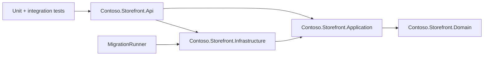
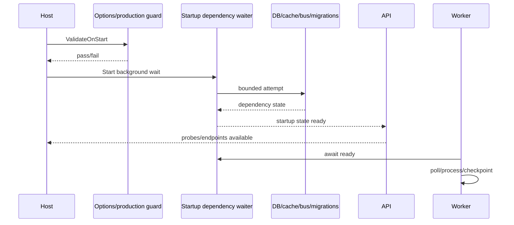

# Application Architecture

## Scope

This document describes the runnable reference application. Azure topology is in [../azure-architecture.md](../azure-architecture.md).

## Boundaries

- **Domain:** `Money`, products, orders, outbox messages and checkpoints. No EF or ASP.NET dependency.
- **Application:** options, ports, order orchestration, feature flags and canary decisions.
- **Infrastructure:** EF Core mappings/migrations, provider selection, local/Azure adapters, Key Vault source, HTTP resilience and outbox processing.
- **API:** composition, auth, middleware, health, telemetry, hosted lifecycle services and endpoints.
- **MigrationRunner:** the only normal deployment entry point that calls `MigrateAsync`.

## Runtime components

## Persistence

`StorefrontDbContext` uses explicit entity configurations. `Database:Provider` accepts `Sqlite`, `Postgres`/`PostgreSQL`, or `SqlServer`. Order and outbox rows are inserted in one transaction. The idempotency key is unique. Outbox pending and lookup paths have explicit indexes.

No `EnsureCreated()` or boot-time migration exists. Integration tests migrate their isolated in-memory SQLite database as fixture setup.

## Health semantics

- Live: process check only.
- Ready: database connectivity, cache, bus and pending migrations.
- Startup: bounded dependency initialization reached ready.

A dependency fault never changes liveness. A pending migration changes readiness. Startup state remains a separate contract.

## Shutdown semantics

The host lifetime callback records stopping. `GracefulShutdownService` marks the instance draining, waits the configured pre-stop delay, then waits for tracked requests up to the drain timeout. The worker observes cancellation. A publish that is cancelled does not mark the outbox row processed or advance its checkpoint.

## Configuration

Sources are deliberately ordered:

1. `appsettings.json` and environment-specific JSON
2. environment variables
3. .NET user-secrets
4. command-line values
5. Key Vault configuration source

The final provider wins. Production rejects local defaults before accepting traffic.

## Extension seams

- Split API and worker into separate Container Apps without changing domain/application layers.
- Replace password-based PostgreSQL with Entra token callbacks.
- Add Redis-backed application caching beyond the implemented health adapter.
- Replace the local JWT issuer with Entra ID/JWKS.
- Add a dead-letter replay use case and operator endpoint with strict authorization.
