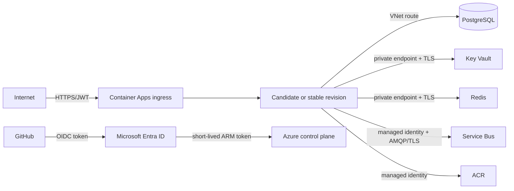

# Azure Target Architecture

## Intent

This is a deployment reference, not a record of provisioned resources. The Bicep template passed local compilation; no Azure What-If or deployment was run.

## Resource topology

| Resource | Purpose | Production posture |
|---|---|---|
| Resource group | Environment isolation | One per dev/staging/prod |
| Container Apps environment | Managed runtime boundary | VNet integrated |
| Container App | API plus checkpointed worker | Multiple revisions, min 3 replicas in prod |
| Container Apps Job | EF migration runner | Manual trigger, one replica |
| PostgreSQL Flexible Server | System of record/outbox | Zone-redundant HA and geo-redundant backup in prod |
| Azure Cache for Redis | Cache dependency | Premium in prod |
| Service Bus namespace/queue | Durable event destination | Premium/zone redundant in prod; duplicate detection and DLQ |
| Key Vault | Runtime/bootstrap secrets | RBAC, purge protection in prod |
| ACR | Immutable API/migration images | Managed-identity pull |
| Log Analytics + Application Insights | Logs, traces, metrics | Workspace-based, local auth disabled |
| VNet/subnets/private endpoints | Data-plane isolation | Enabled in staging/prod reference parameters |
| User-assigned identity | Stable workload identity | Resource-scoped RBAC |

## Trust boundaries

Public ingress is the only intended application entry. Data services are private in staging/prod parameters. The current reference creates representative endpoints but private DNS coverage must be completed and deployment-tested before production.

## Identity and secrets

The workload identity receives:

- `AcrPull` on the registry.
- `Key Vault Secrets User` on the vault.
- `Azure Service Bus Data Sender` and `Data Receiver` on the namespace.

The application contains no Azure credential. `DefaultAzureCredential` consumes the Container Apps managed identity. Container Apps settings point at Key Vault secret URIs. The templates bootstrap PostgreSQL, Redis, JWT and Application Insights values into Key Vault from secure deployment parameters/resource outputs. In a mature estate, PostgreSQL Entra authentication should remove the database password.

## Availability and scaling

- Production starts with three API replicas and scales to twenty on HTTP concurrency.
- Container Apps revision mode is `Multiple`.
- PostgreSQL production parameters request zone-redundant HA and 35-day/geo-redundant backup.
- Service Bus production uses Premium and zone redundancy.
- Redis production uses Premium.
- A regional outage is not solved by these single-region templates; the DR design describes the second-region extension.

## Probes

| Platform | Startup | Liveness | Readiness |
|---|---|---|---|
| Container Apps | `/health/startup`, 2-second period, threshold 30 | `/health/live`, 10 seconds | `/health/ready`, 5 seconds |
| AKS mapping | `startupProbe` | `livenessProbe` | `readinessProbe` |
| App Service mapping | Slot warm-up | Process monitoring | Health Check = `/health/ready` |

Never put external dependency checks into liveness; a database incident must remove an instance from traffic, not force a restart loop.

## Logging and telemetry

Container Apps platform logs route to Log Analytics. Application OpenTelemetry selects Azure Monitor using a Key Vault-backed connection string. The same code can export OTLP to a collector. Instance/revision attributes permit release comparison.

## Deployment order

1. Validate artifacts and IaC.
2. Ensure identity/RBAC and Key Vault values exist.
3. Push immutable API and migration images.
4. Update migration job image.
5. Run and wait for migration job.
6. Create candidate revision at zero/low traffic.
7. Check startup/readiness.
8. Shift 5 → 20 → 50 → 100 with metric gates.
9. Deactivate candidate on breach.

## Gaps before real production

- Execute Azure Policy, What-If and provider registration checks.
- Add private DNS zones/groups for Key Vault, ACR, Redis and Service Bus.
- Choose Front Door/WAF and DDoS posture.
- Configure alerts, dashboards, budgets, diagnostics categories and log retention policy.
- Test RBAC propagation, secret rotation, backup restore and region failover.
- Confirm current service SKUs/APIs in the target region.
