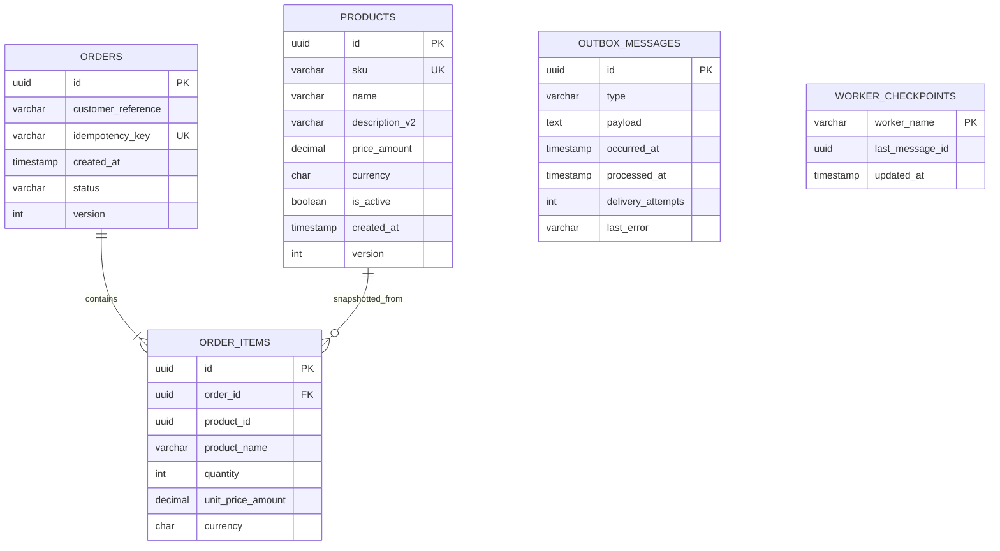

# Database Schema

SQLite is the local/test default. PostgreSQL Flexible Server is the Azure target; SQL Server is also selectable. Money uses `decimal(18,2)` semantics and a three-character currency code.

`ORDER_ITEMS.product_id` is retained for traceability but product name/price/currency are snapshotted, so later catalogue changes do not rewrite submitted orders.

## Tables

### `products`

- PK: `id`.
- Unique lookup: `ux_products_sku`.
- Optimistic concurrency: `version`.
- Current description column: `description_v2`; the migration history demonstrates retirement of `description`.

### `orders`

- PK: `id`.
- Unique replay boundary: `ux_orders_idempotency_key`.
- State is persisted as a string.
- Order and outbox insert share a transaction.

### `order_items`

- PK: `id`.
- FK: `order_id → orders.id`, cascade delete.
- Indexes: `ix_order_items_order_id`, `ix_order_items_product_id`.

### `outbox_messages`

- PK/message identity: `id`.
- Pending index: `ix_outbox_pending(processed_at, occurred_at)`.
- `processed_at IS NULL` means eligible for relay.
- `delivery_attempts` and `last_error` preserve retry evidence.

### `worker_checkpoints`

- PK: `worker_name`.
- Stores the last successfully published outbox message.
- Updated only after a publish succeeds.

### `deployment_migration_states`

Migration-owned operational table for the worked description transition. It is intentionally not an application aggregate.

## Migrations

Six committed migrations create the schema and execute expand → backfill → dual-write marker → read switch → contract. EF’s `__EFMigrationsHistory` makes the separate runner idempotent. The API only checks pending status; it does not modify schema at boot.

## Constraints and production hardening

- Required strings have explicit maximum lengths.
- SKU and idempotency key are unique.
- Price/currency and order quantity are revalidated in the domain.
- Production PostgreSQL should add query/lock monitoring, connection-pool limits and a maintenance process.
- A future high-volume outbox should use provider-specific claim/lease SQL such as `FOR UPDATE SKIP LOCKED`; the current single relay loop is deliberate.
