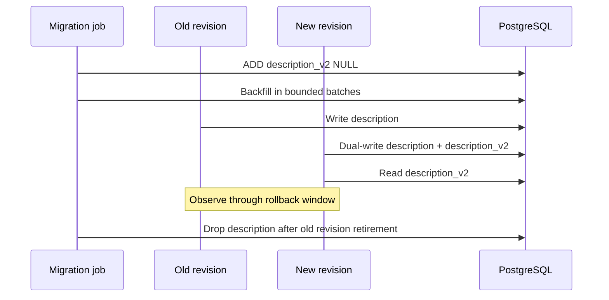

# Database Migration Strategy

## Rules

1. The API never calls `EnsureCreated()` or `Migrate()` at boot.
2. A dedicated migration executable runs as a deploy job.
3. Migration success precedes candidate traffic.
4. All changes must remain compatible with stable and candidate revisions.
5. Contract/destructive changes occur only after the rollback window.
6. Backfills are restartable, observable and throttled for real datasets.

## Worked expand/contract example

The committed migrations demonstrate replacing `products.description`:

| Migration | Change | Compatible readers/writers |
|---|---|---|
| `InitialSchema` | Existing `description` | Legacy |
| `ExpandProductDescription` | Add nullable `description_v2` | Legacy + new |
| `BackfillProductDescription` | Copy existing values | Legacy + new |
| `DualWriteProductDescription` | Record dual-write phase | Both |
| `SwitchProductDescriptionReads` | Ensure backfill, record v2 reads | Both |
| `ContractProductDescription` | Drop old column | New only |

The reference uses migration-state rows to make phases explicit. A production implementation should include data-quality queries (`NULL` count, value mismatch count), batch checkpoints and alerting before the read switch.

## Rollback interaction

- Before contract: traffic can return to the old revision.
- During/after a backfill: rollback is still safe because the old column remains.
- After contract: old binaries are incompatible; rollback requires a forward fix or database restore.
- Failed migrations are not automatically “down migrated.” Diagnose and apply a reviewed compensating migration.

## Idempotency

EF records each migration in `__EFMigrationsHistory`. Re-running the migration runner against a current database applies zero migrations; this is tested.
