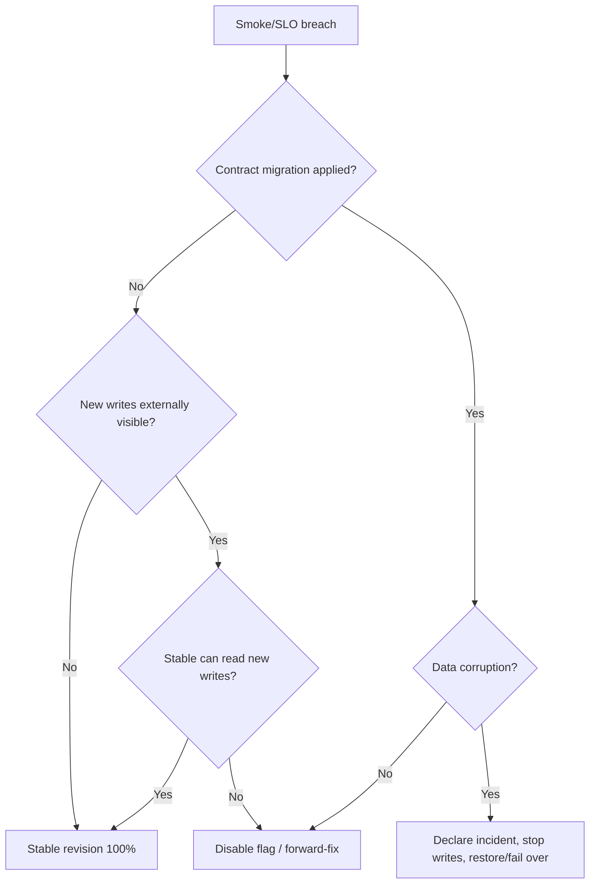

# Rollback Strategy

## What is reversible

- Container Apps traffic weights.
- Candidate revision activation.
- Feature flag values.
- API/worker image selection while schema compatibility is preserved.
- Non-destructive configuration changes.

## What is not automatically reversible

- Data already accepted under new business semantics.
- External messages already delivered.
- Contract migrations that dropped old columns.
- Key rotation after consumers stopped trusting the previous key.
- Region/data loss beyond the selected backup point.

## Decision tree



## Automatic path

`deploy-canary.ps1` and the reusable workflow preserve the stable revision. A readiness failure, missing metric, error-rate breach or p95 breach causes:

1. Stable revision weight = 100.
2. Candidate weight = 0.
3. Candidate deactivation in workflow cleanup.
4. Failed deployment status.

## Time-to-rollback targets

| Scenario | Target |
|---|---:|
| Metric-gate traffic rollback | ≤ 2 minutes |
| Manual revision traffic rollback | ≤ 5 minutes |
| Feature kill switch | ≤ 5 minutes |
| Forward-fix build/deploy | 30–60 minutes |
| Point-in-time database restore | ≤ 4 hours target; validate by exercise |

Targets are design objectives, not measured production performance.

## Operator commands

```powershell
$rg = "rg-contoso-storefront-prod"
$app = "ca-contoso-storefront-prod-api"
az containerapp revision list -g $rg -n $app --output table
az containerapp ingress traffic set -g $rg -n $app `
  --revision-weight "STABLE_REVISION=100" "CANDIDATE_REVISION=0"
az containerapp revision deactivate -g $rg -n $app --revision "CANDIDATE_REVISION"
```

Confirm `/health/ready`, error rate, queue depth and DB state after rollback. Preserve candidate logs and deployment evidence.
