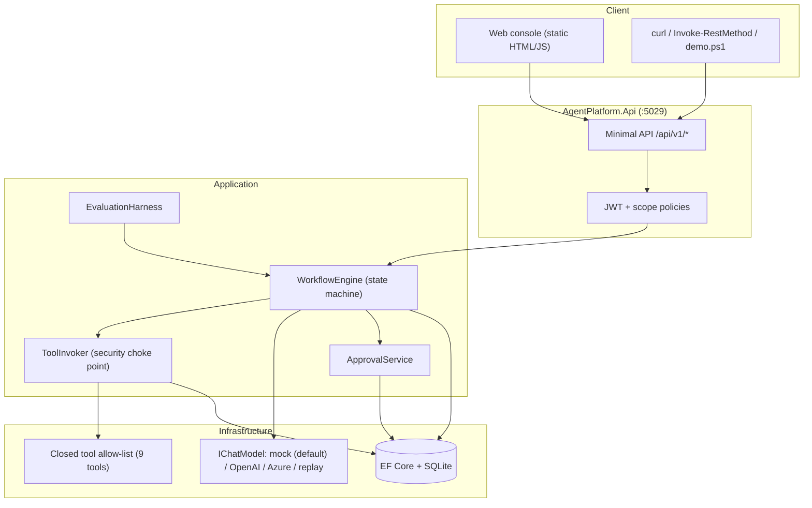
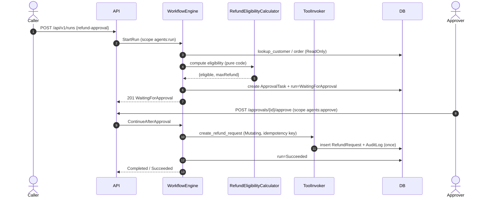
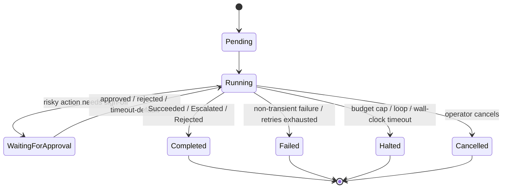
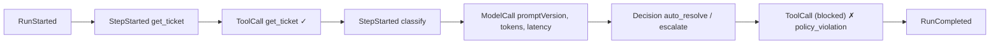

# AI Agent Workflow Orchestration Platform

> **Anti-hype first.** LLM agents are *bad* at anything with a correct answer: money movement,
> eligibility, routing, validation, authorization. They are *good* at bounded language tasks:
> classifying a ticket, summarising a document, extracting fields, drafting a reply. This platform is
> built on that distinction. The model **proposes**; deterministic code **disposes**.
>
> **The absolute rule:** *model output can never cause arbitrary code, shell, SQL or file-system
> execution.* Tools are a **closed, statically-registered allow-list** with typed, JSON-schema-validated
> parameters. There is no `eval`, no dynamic assembly loading, no shell tool, and no arbitrary HTTP
> tool. Everything the model can trigger is something a human wrote, registered and constrained in
> advance. Restraint here is the senior signal.

---

## Portfolio Classification

**Self-directed engineering case study.** A single engineer's end-to-end build of a
production-disciplined agent orchestration platform, used to demonstrate judgment about where LLMs
belong in a system and how to bound their blast radius. No real clients, users, revenue or uptime are
claimed. All demo data is fictional.

## Executive Summary

This is an **engineering-disciplined agent platform**: deterministic orchestration, typed tools,
budgets, human approvals, complete execution traces, and an offline evaluation harness. Workflows are
declarative, versioned graphs of typed steps with an explicit state machine. A large language model
participates only in the steps that are genuinely language problems, and even then it can only call
tools that are allow-listed for that specific step with schema-valid arguments.

The entire system **builds, tests and demos offline** using a `DeterministicMockModel` — no API keys,
no network, EF Core + SQLite by default. `dotnet build -c Release` and `dotnet test -c Release` both
pass (**139 tests, 0 failures**). An 86-scenario evaluation suite scores the three seeded workflows on
task success, tool-selection accuracy, unauthorised-attempt handling, budget adherence and approval
correctness, and a regression gate compares against a baseline.

## Business Problem

Teams rushing "autonomous agents" into production routinely ship systems where a cleverly-worded input
can make the model call the wrong tool, spend an unbounded amount of money, take an irreversible action
with no human in the loop, or leak data — and where nobody can reconstruct *why* the agent did what it
did. The problem this project addresses is not "can an LLM do a task?" but **"how do you operate an
LLM-driven workflow safely, cheaply, reproducibly and accountably?"** The answer here is
engineering discipline: determinism where correctness matters, a closed tool boundary, budgets,
approvals and total observability.

## Functional Requirements

- **Model provider abstraction** (`IChatModel`) with function/tool-calling-shaped requests/responses
  and token accounting; a deterministic mock by default; OpenAI/Azure adapters behind config.
- **Closed tool registry**: statically-registered tools with a name, version, JSON-schema parameter
  contract, output contract, side-effect classification (`ReadOnly | Mutating | External | Costly`),
  required scopes, rate limits, timeout, cost weight and idempotency contract.
- **Declarative, versioned workflows** composed of typed steps (Model, Tool, Condition, Parallel,
  Loop, HumanApproval, Transform, Terminal) with graph validation at registration.
- **Durable, resumable execution engine**: per-step persistence, retry-with-backoff for transient
  failures, per-step/per-run timeouts, cancellation, compensation hooks, and at-most-once mutation.
- **Budgets & guardrails**: per-run/per-tenant caps (tokens, cost, wall-clock, tool calls, model
  calls), loop/oscillation detection, output caps, graceful human hand-off.
- **Human-in-the-loop approvals** for risky actions, with the full proposed action + reasoning trace.
- **Complete, replayable execution traces** with an OpenTelemetry span tree and deterministic replay.
- **Versioned prompt management** with a strict renderer and per-run version recording.
- **Evaluation harness** with a regression gate and real measured numbers.
- **Three seeded workflows** end to end: support-ticket triage, document summarisation & extraction,
  refund approval.
- **HTTP API + web console**: runs, traces, approvals, tools, prompts, evals, health, OpenAPI.

## Non-Functional Requirements

- **Offline & deterministic**: builds/tests/demos with only the .NET SDK; no network in tests.
- **Secure by construction**: model output cannot reach an interpreter; closed tool boundary.
- **Reproducible**: same inputs → same trace → same scores (deterministic replay).
- **Observable**: every model call, tool call, decision and transition is recorded.
- **Portable persistence**: SQLite default; the same EF model runs on Postgres.
- **Testable**: clean layering; ports and adapters; `IClock`/`FakeClock`; fault injection.

## Architecture

Four layers, dependencies pointing inward only (`Domain ← Application ← Infrastructure ← Api`):

- **Domain** — entities/aggregates (`WorkflowRun`, `StepExecution`, `TraceEvent`, `ApprovalTask`),
  value objects, the `RefundEligibilityCalculator`, workflow step types and budgets. Pure, no I/O.
- **Application** — the `WorkflowEngine` state machine, the `ToolInvoker` security choke point, the
  `IChatModel` abstraction, `ApprovalService`, `EvaluationHarness`, JSON-schema validator, safe
  expression evaluator, and all port interfaces.
- **Infrastructure** — EF Core persistence, the closed tool implementations, deterministic transforms,
  the workflow/prompt catalogs, the model providers (mock/OpenAI/Azure/replay), and the DI root.
- **Api** — minimal APIs, JWT + scope policies, ProblemDetails, correlation ids, rate limiting,
  OpenTelemetry, health checks and a static console.

See [`docs/architecture/architecture.md`](docs/architecture/architecture.md) for the full write-up.

## Architecture Diagram

Platform container view:



Workflow execution sequence, with a human approval pause (refund flow — eligibility is deterministic
code, not the model):



Run state machine:



Trace anatomy (every run is a totally-ordered, replayable event stream):



## Technology Stack

| Concern | Choice |
|---|---|
| Language / runtime | C# / .NET 10 (`net10.0`) |
| API | ASP.NET Core Minimal APIs |
| Persistence | EF Core 10 + SQLite (default); same model runs on Postgres |
| Auth | JWT bearer (HS256), scope policies `agents:run/approve/admin` |
| Observability | OpenTelemetry (tracing + metrics), Serilog |
| Model (default) | `DeterministicMockModel` — offline, scripted, adversarial-capable |
| Model (optional) | OpenAI / Azure OpenAI adapters (config + env; stub-tested) |
| Tests | xUnit; `WebApplicationFactory` + in-memory SQLite for integration |
| API port | `5029` |

## Domain Model

- **WorkflowRun** — the central durable aggregate: status, current step, persisted `StateJson`,
  budget snapshot, outcome, halt reason, budget counters, optimistic-concurrency version.
- **StepExecution** — one attempt at one step; ordered; the basis for resume.
- **TraceEvent** — immutable, ordered execution-trace entry (model/tool/decision/transition).
- **ApprovalTask** — a pending decision carrying the proposed action, arguments and reasoning trace.
- **Money / RefundDecision** — value objects for the deterministic eligibility rules.
- Business records: Customer, Ticket, KnowledgeArticle, Order, RefundRequest, EmailOutbox, AuditLog.

See [`docs/database-schema.md`](docs/database-schema.md) for the full schema and ER diagram.

## Core Workflows

1. **Support-ticket triage** (`support-ticket-triage`) — get the ticket, build deterministic context,
   classify (model step, may search the knowledge base), then **branch deterministically**:
   auto-resolve low-risk categories, escalate everything else.
2. **Document summarisation & extraction** (`document-summarisation-extraction`) — chunk, summarise
   each chunk (loop with a hard cap), produce a narrative (model step), extract structured fields,
   **validate deterministically**, and flag low-confidence output for human review.
3. **Refund approval** (`refund-approval`) — look up the customer/order, **compute eligibility in
   deterministic code** (`RefundEligibilityCalculator`), propose the refund, require **human
   approval**, then execute idempotently with an audit record. No model step at all.

## Security Model

- **Closed tool allow-list** (9 tools), statically registered. Side-effect classes:
  `search_knowledge_base`, `get_ticket`, `lookup_customer` (ReadOnly); `summarise_document` (Costly);
  `calculate` (ReadOnly, safe evaluator — no `eval`); `update_ticket_status` (Mutating);
  `create_refund_request` (Mutating, **approval-gated**); `send_email` (External, **approval-gated**);
  `http_get` (External, **allow-list + SSRF guards**, redirects disabled).
- **One choke point** (`ToolInvoker`): exists → scope → JSON parse → schema-validate/coerce →
  rate-limit → approval-gate → idempotency → timeout → output-cap. Every failure is a structured,
  recorded error — never an exception or a side effect.
- **Per-step tool allow-lists** neutralise prompt injection: a model call to a tool the step doesn't
  permit is a `policy_violation`, recorded and escalated, never executed.
- **JWT + scopes** for API access; **human approval** (`agents:approve`) for risky actions.

Full STRIDE analysis and a dedicated prompt-injection / tool-abuse threat model (indirect injection,
confused deputy, exfiltration via tool arguments, cost-exhaustion) plus explicit non-claims are in
[`docs/security/security-review.md`](docs/security/security-review.md).

## Reliability & Failure Handling

- **Durable, resumable runs** — state and position persist after each step; a run interrupted between
  steps resumes exactly where it stopped (proven by a simulated-crash test).
- **At-most-once mutations** — idempotency keys mean a retry after a partial failure replays the
  cached result instead of double-executing (e.g. no duplicate refund).
- **Retry classification** — only classified-transient failures are retried, with backoff.
- **Timeouts** — per-step and per-run; wall-clock breaches halt the run.
- **Budgets & loop detection** — caps on tokens/cost/wall-clock/tool-calls/model-calls; oscillation
  detection; graceful degradation to a human hand-off with an explicit `HaltReason`.

## Observability

- **Execution traces** — every model call (prompt version, rendered messages, response, tokens,
  latency), tool call (args, result/error, duration, cost), decision and state transition, ordered
  and replayable. Exposed at `GET /api/v1/runs/{id}/trace` and in the console timeline viewer.
- **OpenTelemetry** — a span tree mirrors the trace; console exporter by default (off under tests).
- **Metrics** — runs by outcome, step durations, tool error rates, tokens/cost per workflow, approval
  latency, budget-halt counter (`GET /api/v1/metrics`).
- **Deterministic replay** — a `ReplayModel` re-runs a recorded run against recorded model responses;
  this is how agent behaviour is regression-tested.
- **Health** — `/health` and `/health/ready`.

## Testing Strategy

**139 tests, all passing** (129 unit + 10 integration), `dotnet test -c Release`. Highlights: JSON
schema accept/reject/coercion; unauthorised tool blocked as a structured error; prompt-injection
scenarios blocked and recorded; SSRF guard; safe-evaluator escape attempts; workflow graph validation;
every step type; resume-after-crash; retry classification and no double-execution; per-step & per-run
timeouts; loop and every budget halt; approval approve/reject/modify/timeout + audit; deterministic
replay reproduces a run; all three workflows end-to-end; the eval harness and regression gate; and API
401/403/400/404. Real output in [`docs/test-results.md`](docs/test-results.md).

## Local Development

Prerequisites: .NET SDK 10. No Docker, no Python, no database server required.

```powershell
# from the project root
dotnet build AgentPlatform.slnx -c Release
dotnet test  AgentPlatform.slnx -c Release

# run the API (http://localhost:5029), web console at /
dotnet run --project src/AgentPlatform.Api -c Release --launch-profile http

# drive all three workflows incl. an approval + the eval gate:
pwsh -File scripts/demo.ps1
```

Configuration is in `src/AgentPlatform.Api/appsettings.json` and overridable via environment
(`.env.example` documents every switch). The default model provider is the offline mock.

## Running with Docker

A `Dockerfile` and `docker-compose.yml` are included. **Docker configuration created but Docker is
unavailable on the build host; the compose stack has not been started or verified.** They are provided
for completeness and review only.

## API Documentation

OpenAPI at `/openapi`. All `/api/v1/*` endpoints require JWT bearer auth and the noted scope.

| Method & path | Scope | Purpose |
|---|---|---|
| `POST /api/v1/dev/token` | anon (dev) | Mint a dev bearer token |
| `GET /api/v1/workflows` | `agents:run` | List workflows (+ `/{name}`, `/{name}/{version}`) |
| `POST /api/v1/workflows/{name}/{version}/validate` | `agents:admin` | Re-validate a workflow graph |
| `POST /api/v1/runs` | `agents:run` | Start a run |
| `GET /api/v1/runs` / `GET /api/v1/runs/{id}` | `agents:run` | List / get runs |
| `GET /api/v1/runs/{id}/trace` | `agents:run` | Full execution trace |
| `POST /api/v1/runs/{id}/cancel` / `/resume` | `agents:run` | Cancel / resume |
| `GET /api/v1/approvals` / `GET /api/v1/approvals/{id}` | `agents:approve` | Approvals inbox |
| `POST /api/v1/approvals/{id}/approve` \| `/reject` \| `/modify` | `agents:approve` | Decide |
| `GET /api/v1/tools` | `agents:run` | The closed tool allow-list |
| `GET /api/v1/prompts` | `agents:run` | Versioned prompt templates |
| `GET /api/v1/evals/scenarios` | `agents:run` | Eval suite composition |
| `POST /api/v1/evals/run` \| `/compare` | `agents:admin` | Run evals / compare to baseline |
| `GET /api/v1/metrics` | `agents:run` | Operational metrics snapshot |
| `GET /health` \| `/health/ready` | anon | Liveness / readiness |

## Example Usage

```powershell
$base = 'http://localhost:5029'

# 1) mint a dev token (all scopes)
$tok = Invoke-RestMethod "$base/api/v1/dev/token" -Method Post -ContentType application/json `
  -Body (@{ subject='alice'; tenant='tenant-alpha'; scopes=@('agents:run','agents:approve','agents:admin') } | ConvertTo-Json)
$h = @{ Authorization = "Bearer $($tok.access_token)" }

# 2) triage a low-risk ticket → auto-resolved
Invoke-RestMethod "$base/api/v1/runs" -Method Post -Headers $h -ContentType application/json `
  -Body (@{ workflowName='support-ticket-triage'; inputs=@{ ticket_id='TCK-1001' } } | ConvertTo-Json)
# → { "status": "Completed", "outcome": "Succeeded", ... }

# 3) a prompt-injection ticket → the injected send_email call is BLOCKED and the run escalates
$inj = Invoke-RestMethod "$base/api/v1/runs" -Method Post -Headers $h -ContentType application/json `
  -Body (@{ workflowName='support-ticket-triage'; inputs=@{ ticket_id='TCK-INJ-1' } } | ConvertTo-Json)
Invoke-RestMethod "$base/api/v1/runs/$($inj.id)/trace" -Headers $h  # shows send_email ✗ policy_violation

# 4) refund → pauses for approval, then execute idempotently
$r = Invoke-RestMethod "$base/api/v1/runs" -Method Post -Headers $h -ContentType application/json `
  -Body (@{ workflowName='refund-approval'; inputs=@{ customer_id='CUST-001'; order_amount=50; currency='USD'; days_since_purchase=10; reason_category='change_of_mind'; item_returned=$true } } | ConvertTo-Json)
$a = (Invoke-RestMethod "$base/api/v1/approvals" -Headers $h | Where-Object runId -eq $r.id)
Invoke-RestMethod "$base/api/v1/approvals/$($a.id)/approve" -Method Post -Headers $h -ContentType application/json -Body '{}'
Invoke-RestMethod "$base/api/v1/runs/$($r.id)" -Headers $h   # → Completed / Succeeded
```

## Performance / Load Testing

No formal load test was run (this is a case study, not a deployment). The evaluation harness does,
however, produce real in-process latency numbers: **86 scenarios, mean ~36 ms per scenario** against
the deterministic mock model, fully offline. Because runs are persisted per step, throughput is
bounded by the store; SQLite is fine for the demo and single-node use, and the same EF model moves to
Postgres for concurrency. A realistic load test (e.g. `k6`/`bombardier` against `/api/v1/runs`) is
listed under future improvements; it has **not** been performed.

## Trade-offs

- **Deterministic orchestration over model-driven planning.** Less "magic", far more predictability,
  testability, replayability and auditability. The model cannot choose the next step — by design.
- **Closed tool allow-list over dynamic/plugin tools.** You must write and register every tool; in
  exchange the attack surface for arbitrary execution is essentially removed.
- **SQLite default over a server DB.** Zero-dependency local runs and tests; Postgres is a config
  swap when you need concurrency.
- **Mock model default over a live LLM.** Deterministic, offline CI and demos; the trade-off is that
  measured quality reflects the harness, not a real model (which is intentional and stated).
- **Human approval at the action boundary.** Adds latency to risky actions; that is the point.

## Architecture Decisions

Six ADRs in [`docs/decisions/`](docs/decisions):

1. Deterministic orchestration with a model-in-the-loop vs model-driven planning.
2. Closed, statically-registered tool allow-list with typed JSON-schema parameters.
3. Durable, resumable runs with per-step checkpointing.
4. Budgets, output caps and loop/oscillation detection.
5. Replay-based regression testing.
6. Human-approval placement for mutating/external actions.

See also [`docs/agent-engineering-principles.md`](docs/agent-engineering-principles.md).

## Known Limitations

- The default model is a deterministic mock; measured scores reflect the orchestration and guardrails,
  not any real LLM's quality. OpenAI/Azure adapters exist but are stub-tested and never used by default.
- Secret management is config/env only (no KMS/Key Vault wired).
- Multi-tenancy is row-level scoping, not per-tenant isolation/encryption.
- `send_email` writes to an outbox and refunds are recorded locally — no real email/payment provider.
- Docker/compose are unverified (no Docker on the build host).
- Rate limiting is a simple per-tenant fixed window; no WAF/DDoS protection.

## Future Improvements

- Wire a real load test (`k6`/`bombardier`) and publish numbers.
- Add A/B prompt-version experiments to the eval harness output.
- Postgres-backed integration test lane; per-tenant database option.
- Secret-manager integration and Production start-up guards for keys.
- Richer compensation/rollback library for mutating steps.
- Streaming trace updates to the console (SSE/WebSocket).

## Portfolio Talking Points

- "The model proposes; deterministic code disposes" — and *why* that matters for correctness,
  testability, replay and audit.
- A single security choke point and a closed, typed tool allow-list that makes arbitrary execution
  from model output structurally impossible.
- Prompt injection handled architecturally (per-step allow-lists, scopes, approvals) rather than by
  prompt wording — with tests that prove it.
- Durable, resumable runs with at-most-once mutations (idempotency), proven by a simulated-crash test.
- Full execution traces + deterministic replay + an 86-scenario eval harness with a regression gate.
- More in [`docs/portfolio/interview-talking-points.md`](docs/portfolio/interview-talking-points.md).

## Upwork Portfolio Description

A production-disciplined example of building **LLM agent systems that are safe to operate**:
deterministic workflow orchestration, a closed and typed tool allow-list, human-in-the-loop approvals,
strict budgets and loop detection, complete replayable execution traces, and an offline evaluation
harness with a regression gate — in C#/.NET 10, fully testable offline. Full text in
[`docs/portfolio/upwork-description.md`](docs/portfolio/upwork-description.md).

---

*All demo data is fictional (e.g. `Contoso Retail (fictional)`). No real secrets, clients, users or
metrics are present. Co-authored with GitHub Copilot.*
