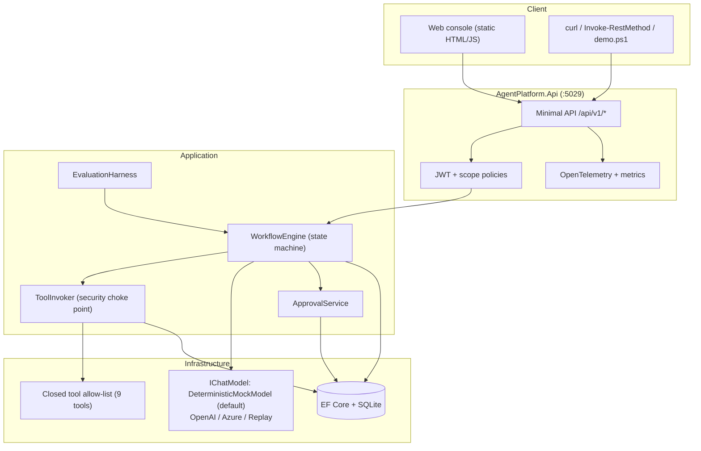
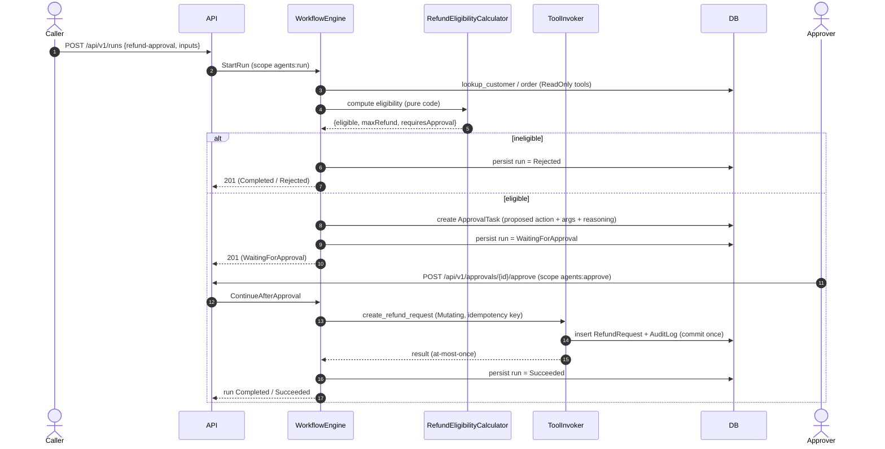
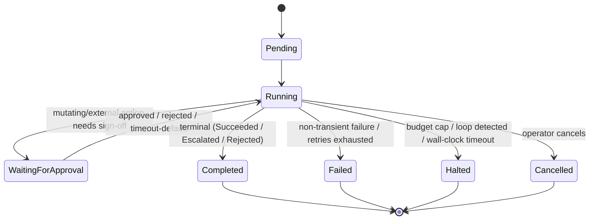
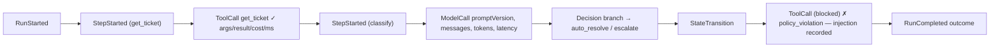

# Architecture

A deterministic agent-orchestration platform built as a clean 4-layer .NET solution. The guiding
idea: **the workflow engine is deterministic; the model is a bounded participant, never the driver.**

## Layers

```
AgentPlatform.Domain          (no dependencies)
  └─ entities & aggregates (WorkflowRun, StepExecution, TraceEvent, ApprovalTask),
     value objects (Money), rules (RefundEligibilityCalculator), workflow step types,
     budgets, security value objects. Pure, deterministic, no I/O.

AgentPlatform.Application     (→ Domain)
  └─ the orchestration brain: WorkflowEngine (state machine), ToolInvoker (security choke point),
     IChatModel abstraction, ApprovalService, EvaluationHarness, JSON-schema validator,
     safe expression evaluator, condition/loop logic, port interfaces (IRunStore, IApprovalStore,
     IIdempotencyStore, IClock, IFaultInjector …).

AgentPlatform.Infrastructure (→ Application)
  └─ adapters: EF Core persistence (AgentDbContext + stores), the closed tool implementations,
     deterministic transforms, the workflow/prompt catalogs, the model providers
     (DeterministicMockModel default; OpenAI/Azure adapters; ReplayModel), and the DI composition root.

AgentPlatform.Api            (→ Infrastructure)
  └─ ASP.NET Core minimal APIs, JWT auth + scope policies, ProblemDetails, correlation ids,
     rate limiting, OpenTelemetry, health checks, and a static HTML/JS console.
```

Dependencies point inward only. The Domain and Application layers know nothing about EF, HTTP or any
model vendor — which is exactly why the whole thing is testable offline.

## Container view



## Headline flow — refund approval (with a human pause)

The signature flow: gather evidence, compute eligibility **in deterministic code**, propose the
action, pause for a human, then execute idempotently. The model is not in this loop at all.



If the engine crashes between the mutation commit and advancing the run, resume replays the step and
the **idempotency key** returns the cached result instead of inserting a second refund.

## Run state machine



## Trace anatomy

Every run is a totally-ordered sequence of immutable `TraceEvent`s (ordered by `Ordinal`), mirrored
by an OpenTelemetry span tree and replayable via the `ReplayModel`.



Each event carries what you need to explain and reproduce a run: for a model call, the prompt
version, rendered messages, response, tokens and latency; for a tool call, the arguments, result or
structured error, duration and cost; plus every decision and state transition.

## Why this shape

- **Determinism first** — control flow is a validated state machine, so runs are predictable,
  testable, replayable and auditable. The model does bounded language work (classify, summarise) and
  never selects the next step or executes a side effect directly.
- **One security choke point** — every tool call goes through `ToolInvoker`: exists → scope → parse →
  schema-validate/coerce → rate-limit → approval-gate → idempotency → timeout → output-cap.
- **Durable by construction** — persisting per-step is what makes runs resumable; idempotency keys
  make mutating tools at-most-once.
- **Offline by default** — the deterministic mock model means the entire system builds, tests and
  demos with only the .NET SDK.
