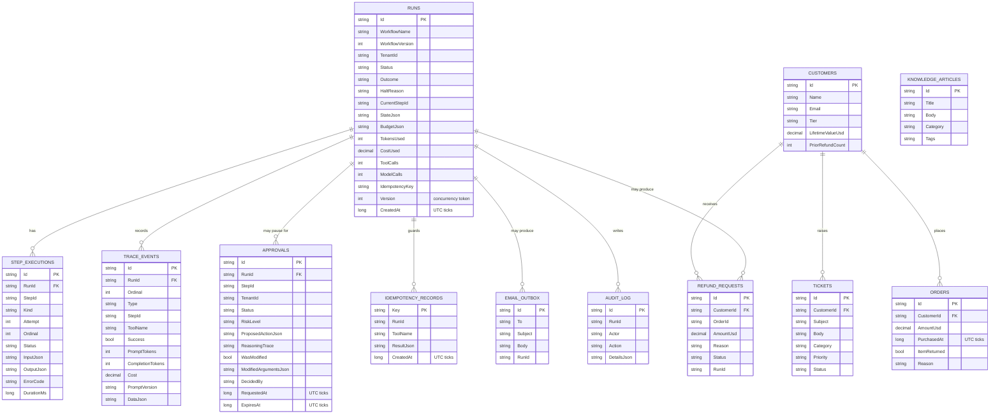

# Database Schema

The platform uses a single EF Core `DbContext` (`AgentDbContext`). **SQLite is the default and only
required provider** (`Data Source=agentplatform.db`; an in-memory SQLite connection is used for
tests). The schema is created at startup with `EnsureCreated()` and seeded idempotently by
`DatabaseSeeder`. The same model runs on Postgres if you wire Npgsql, but SQLite is the default.

Two groups of tables:

1. **Agent aggregates** — the durable orchestration state: runs, per-step executions, trace events,
   approvals and idempotency records. These are what make a run *resumable* and *replayable*.
2. **Business data** — the fictional records the tools operate on: customers, tickets, knowledge
   articles, orders, plus the durable outputs (refund requests, an email outbox, an audit log).

> **SQLite `DateTimeOffset` note.** SQLite cannot `ORDER BY` or range-compare a `DateTimeOffset`
> stored as text. A global value converter persists every `DateTimeOffset` as a `long` of UTC ticks
> (INTEGER), so ordering and time filters are correct on every provider. All timestamps are UTC.

---

## ER diagram

---

## Tables, keys and indexes

### Agent aggregates

| Table | PK | Indexes | Notes |
|---|---|---|---|
| `Runs` | `Id` | `(TenantId, IdempotencyKey)`, `Status` | `Version` is an optimistic-concurrency token. Idempotent run creation keys off `(TenantId, IdempotencyKey)`. `StateJson`/`BudgetJson` are the persisted run state + budget snapshot restored on resume. |
| `StepExecutions` | `Id` | `RunId` | FK → `Runs.Id` (cascade delete). One row per *attempt* of a step. `Ordinal` gives deterministic ordering; the engine skips steps that already have a `Completed` execution — this is the resume mechanism. |
| `TraceEvents` | `Id` | `(RunId, Ordinal)` | Append-only, immutable. Ordered by `Ordinal` they form the replayable trace. Carries per-event tokens/cost/latency and the exact `PromptVersion`. |
| `Approvals` | `Id` | `(TenantId, Status)`, `RunId` | Captures the full proposed action, arguments and reasoning trace. Audited: `DecidedBy`, `DecidedAt`, `DecisionNotes`. |
| `IdempotencyRecords` | `Key` | (PK) | `Key = {RunId}:{StepId}:{tool}:{canonical-args}`. Stores the tool result so a retry replays it instead of re-executing a side effect (at-most-once for mutating tools). |

### Business data (fictional)

| Table | PK | Indexes | Notes |
|---|---|---|---|
| `Customers` | `Id` | `Email` | `PriorRefundCount` feeds the deterministic fraud guard. |
| `Tickets` | `Id` | `CustomerId` | Includes seeded adversarial tickets (`TCK-INJ-1`, `TCK-UNAUTH`, `TCK-LOOP`, …). |
| `KnowledgeArticles` | `Id` | — | Returned by `search_knowledge_base`. |
| `Orders` | `Id` | `CustomerId` | Backs refund eligibility. |
| `RefundRequests` | `Id` | `CustomerId` | Durable output of the mutating `create_refund_request` tool; `RunId` links back to the run. |
| `EmailOutbox` | `Id` | — | `send_email` writes here — no real SMTP is ever contacted. |
| `AuditLog` | `Id` | `RunId` | Tamper-evident record of approvals and mutating actions. |

---

## Seed data (idempotent)

`DatabaseSeeder.SeedAsync` inserts a fixed, fictional dataset only if the tables are empty:

- Customers `CUST-001..` — e.g. `CUST-001` (0 prior refunds, eligible) and `CUST-003`
  (3 prior refunds → tripped by the fraud guard).
- Tickets `TCK-1001..TCK-1015` (auto-resolve category), `TCK-1016..TCK-1024` (escalate category),
  and adversarial tickets `TCK-INJ-1/2`, `TCK-UNAUTH`, `TCK-LOOP`, `TCK-OVERSIZE`, `TCK-MALFORMED`,
  `TCK-REFUSE`, `TCK-HALLUC`.
- Knowledge-base articles and orders backing the three workflows.

All demo data is fictional and labelled as such (e.g. `Contoso Retail (fictional)`).
