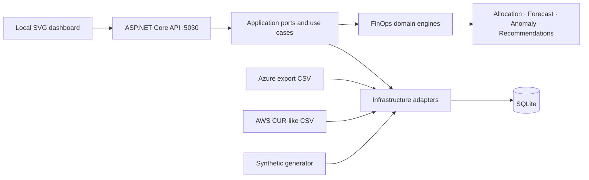
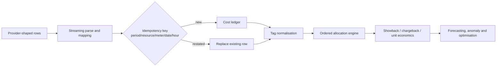
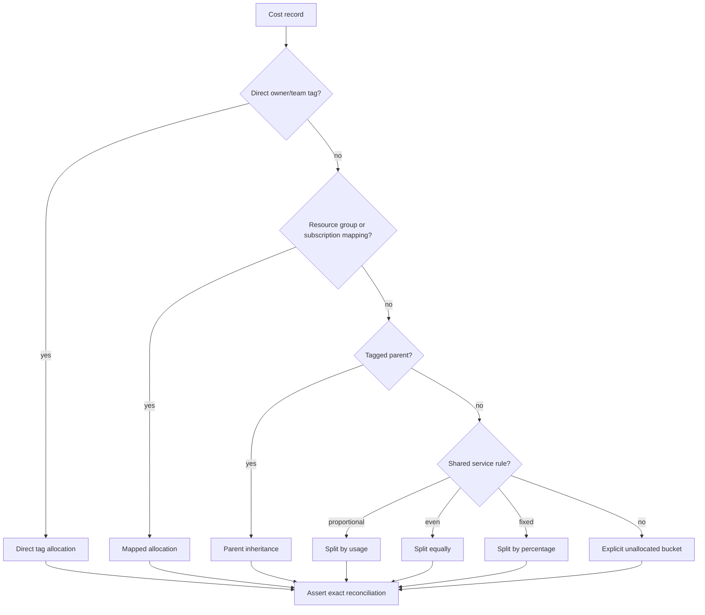
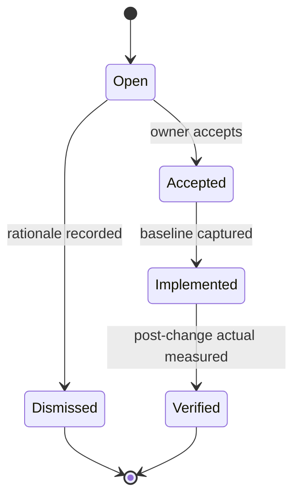

# Northstar Cloud Cost & Observability Platform

## Portfolio Classification
Self-directed engineering case study. This is a fictional, local-only FinOps reference implementation for **Northstar Group (fictional)**. No cloud subscription, provider account, or real customer data is used.

## Executive Summary
The platform turns high-cardinality synthetic cloud billing data into accountable team spend, forecasts, anomaly signals, and auditable optimisation work. Its central correctness property is that every reporting period reconciles exactly: allocated spend plus the explicit unallocated residual equals source spend.

## Business Problem
Cloud invoices are easy to receive but hard to defend. Untagged resources, shared networking, discount mechanics, and late provider restatements make naïve team totals unreliable. Engineering and finance need a repeatable way to explain where every dollar went, identify abnormal behaviour without flagging weekends or batch jobs, and close the loop on savings promises.

## Functional Requirements
- Inventory 400 fictional resources over four subscriptions, nine teams, and production/staging/development, including parent-child resources.
- Stream synthetic, Azure Cost Management export-shaped, and AWS CUR-shaped cost records; correct restatements idempotently.
- Apply ordered allocation rules, budgets, forecasts, anomaly detectors, recommendations, FX conversion, and unit-economics joins.
- Present a lightweight SVG dashboard and secured REST API.

## Non-Functional Requirements
SQLite is the default and only required runtime dependency. Daily cost data exceeds 250,000 rows in the development seed. Queries paginate, costs retain actual and amortised bases, state transitions emit append-only audit records, and request responses carry a correlation ID. The test suite includes a bounded in-memory aggregation over 250,000 rows.

## Architecture
This is a modular monolith: Domain contains money, allocation, forecasting, anomaly, governance, and recommendation rules; Application owns ports and DTOs; Infrastructure owns EF Core/SQLite and provider-shaped adapters; API owns HTTP, JWT, policies, rate limiting, headers, dashboard, and telemetry. No component contacts Azure or AWS.

## Architecture Diagram








## Technology Stack
| Area | Choice |
|---|---|
| Runtime | .NET 10 / ASP.NET Core minimal APIs |
| Persistence | EF Core 10 with SQLite |
| Security | JWT bearer tokens, scope policies, team-scoped filtering |
| Telemetry | OpenTelemetry ASP.NET Core console exporter |
| UI | Dependency-free HTML/JavaScript, hand-rolled SVG |
| Tests | xUnit, WebApplicationFactory, SQLite in-memory |

## Domain Model
`CloudResource` carries provider-style identity, type, region, subscription, resource group, SKU, lifecycle dates, tags, owner, and optional parent. `CostRecord` has daily or hourly usage, rate, actual and amortised cost, credits/discounts, reservation coverage/utilisation, and an import identity. Allocation lines retain both the source charge and the rule explanation. See [database schema](docs/database-schema.md).

## Core Workflows
1. The development seed creates 400 fictional resources and more than 250,000 local cost rows with growth, weekday/weekend seasonality, recurring month-end batches, a step change, a runaway workload, gradual drift, untagged resources, and orphans.
2. A source adapter streams lines and upserts by a stable billing identity. A late provider restatement replaces the old record rather than duplicating it.
3. Ordered allocation assigns direct ownership first, then mappings, parent ownership, shared-cost splits, and finally an explicit residual.
4. Forecast backtesting chooses the smallest measured MAPE. Anomaly candidates are grouped and suppressible. Recommendations only reach `Verified` after a baseline/post-change comparison.

## Security Model
All API resources require JWT authentication and `finops:read`, `finops:manage`, or `finops:admin` scope policies. A non-admin `team` claim overrides query parameters, so a team lead cannot request another team's spend. The development token endpoint is unavailable in Production, and Production refuses the placeholder signing key. CORS has an explicit local allow-list, headers are set by middleware, and API mutation audit records include an actor, action, correlation ID, and before/after hash. See [security review](docs/security/security-review.md).

## Reliability & Failure Handling
Import batches are independently committed so a failed source can be rerun safely; the persisted idempotency key makes replay safe. Unknown inventory references are rejected rather than silently allocated, and a later inventory repair can be re-imported. Allocation never hides unreconciled cost: it emits an `unallocated` line. Budget alerts persist crossed thresholds to prevent repeated alerts. Runbooks cover import failure, breach, recommendation review, and a cost spike.

## Observability
Every response receives `X-Correlation-Id`, structured logging scopes include it, OpenTelemetry instruments ASP.NET Core requests, and `/health/live` plus `/health/ready` expose liveness and SQLite readiness. The dashboard calls documented local APIs and renders spend, forecast range, budgets, breakdowns, anomalies, tag coverage, recommendations, and unit economics with SVG.

## Testing Strategy
The xUnit suite covers 63 meaningful unit/integration tests: ingestion mappings/replay/recovery, FX, all allocation rules and reconciliation, tagging, budgets, measured forecast backtests, anomaly suppression/grouping/evaluation, each recommendation type and lifecycle, unit economics, auth boundaries, API validation, and aggregation of 250,000 rows. Integration tests run against an open SQLite in-memory connection. Results are recorded in [docs/test-results.md](docs/test-results.md).

## Local Development
```powershell
Set-Location C:\Users\rukwaropaul\Downloads\DEV\Projects\30-cloud-cost-observability-platform
dotnet build -c Release
dotnet test -c Release
dotnet run --project src\CloudCostObservability.Api
```
The Development host listens on `http://localhost:5030` and idempotently seeds local SQLite on first start. Remove `src\CloudCostObservability.Api\cloud-cost-observability.db` to recreate the demonstration dataset.

## Running with Docker
Docker configuration created but Docker is unavailable on the build host; the compose stack has not been started or verified. SQLite remains the default volume-backed database if the authored configuration is used elsewhere.

## API Documentation
OpenAPI is available at [`/openapi/v1.json`](http://localhost:5030/openapi/v1.json); a local documentation landing page is at [`/docs`](http://localhost:5030/docs). Secured resources include:

`/api/v1/resources`, `/api/v1/costs`, `/api/v1/allocations` (rules and audit), `/api/v1/budgets` (status), `/api/v1/forecasts`, `/api/v1/anomalies` (ack/suppress), `/api/v1/recommendations` (lifecycle), `/api/v1/tags/coverage`, `/api/v1/unit-economics`, and `/api/v1/imports`.

## Example Usage
```powershell
$token = (Invoke-RestMethod http://localhost:5030/api/v1/auth/token `
  -Method Post -ContentType application/json `
  -Body '{"subject":"local-admin","scope":"finops:read finops:manage finops:admin"}').accessToken
$headers = @{ Authorization = "Bearer $token" }

Invoke-RestMethod "http://localhost:5030/api/v1/costs?groupBy=service&reportingCurrency=KES" -Headers $headers
# { results = { items = ... }; totalActualCost = ...; currency = KES }

Invoke-RestMethod "http://localhost:5030/api/v1/allocations?from=2026-08-01&to=2026-08-31" -Headers $headers
# { lines = { items = ... }; sourceTotal = ...; allocatedTotal = ...; unallocatedTotal = ...; invariantHolds = true }

Invoke-RestMethod http://localhost:5030/api/v1/tags/coverage -Headers $headers
```

## Performance / Load Testing
`Aggregate_250000HighCardinalityCostRows_CompletesWithinTenSeconds` creates and aggregates exactly 250,000 synthetic rows across date/service/resource dimensions, with a ten-second bound. This is a local synthetic test rather than a production throughput claim; database-side rollup/index design is documented in [database-schema.md](docs/database-schema.md).

## Trade-offs
SQLite and client-side decimal aggregation maximise self-contained reproducibility but are not the warehouse architecture for multi-year enterprise CUR data. The CSV parser intentionally implements a narrow RFC-4180-compatible row parser rather than a full provider SDK. Restatements are safe per import identity; real provider identities and invoice reconciliation would be added before production.

## Architecture Decisions
Five concise decisions cover allocation ordering/exactness, measured forecasting selection, robust seasonal anomaly detection, actual versus amortised cost, and adapter-driven provider independence. See [docs/decisions](docs/decisions).

## Known Limitations
- Data, FX rates, owners, business metrics, and anomaly labels are synthetic and fictional.
- The development JWT issuer is intentionally not an enterprise identity provider.
- There is no file upload endpoint; import paths refer to locally controlled CSV files.
- The dashboard is a utilitarian local demo rather than an accessibility-reviewed production UI.
- The Azure integration is designed and mapped but intentionally never provisioned or called.

## Future Improvements
Add Entra ID/OIDC and workload identity, provider export storage event ingestion, a columnar warehouse/read model, recurring calendar suppressions, approval workflows, encrypted export jobs, attribution versions, cost commitment inventory, and a formal data retention policy.

## Portfolio Talking Points
The interesting work is not a spend chart: it is lossless attribution under missing tags, cost-basis clarity, safe provider replay, use of business denominators, and measuring forecast/anomaly quality on a known synthetic ground truth. The system shows how recommendation lifecycle and realised savings prevent projected savings from becoming vanity metrics.

## Upwork Portfolio Description
**Cloud Cost & Observability Platform — self-directed engineering case study**

Problem: cloud billing data requires defensible team allocation, anomaly investigation, and measurable savings follow-through. Built: a .NET 10 FinOps reference implementation with SQLite, provider-shaped imports, exact allocation reconciliation, budget/forecast/anomaly engines, recommendation verification, and unit economics. Engineering focus: idempotent restatements, audited ordered rules, scoped authorization, robust seasonal signals, and high-cardinality aggregation. Verification: 63 local automated tests, including 250,000-row aggregation. This is a self-directed portfolio project, not client work.
