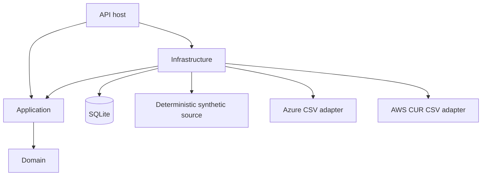
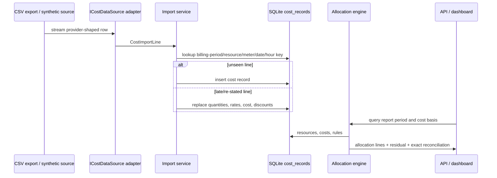

# Architecture — Northstar Cloud Cost & Observability Platform

## Context
The system is a local, self-directed FinOps reference implementation. It deliberately uses a modular monolith and SQLite so build, test, data generation, and demonstration work without Docker, a cloud subscription, or an external database.

## Module boundaries

| Module | Responsibility | Dependencies |
|---|---|---|
| Domain | money, resource/cost models, allocation invariant, tags, budgets, forecast, anomaly, recommendations, unit economics | none |
| Application | ports, request/query contracts, pagination | Domain |
| Infrastructure | EF Core mappings, SQLite, synthetic data, Azure/AWS-shaped CSV adapters | Application |
| API | minimal endpoint groups, JWT policies, middleware, dashboard, OpenAPI | Infrastructure |

## Headline flow: idempotent billing import to accountable report

## Data flow and correctness boundaries
1. The import identity is persisted with a unique index. The import code looks up only a bounded batch and uses domain `RestateFrom` for late values.
2. Tags stay as provider-style JSON on inventory but are normalised before governance reporting. Allocation uses original values only after deterministic lower-casing.
3. The allocation engine works in `decimal` memory and never rounds shares. The final full-split recipient receives the decimal remainder; a partial fixed split creates an explicit residual.
4. API team scope wins over a supplied `team` query. This prevents filter escalation even if a caller changes query text.
5. Expensive reads default to the most recent 31 days and page output. SQLite indexes support selective date/resource/service paths; a production deployment would add daily materialised rollups in a warehouse.

## Synthetic data design
The deterministic generator spans 2024-10-01 through 2026-08-31. It creates 400 resources and daily cost rows plus hourly rows for eight resources over the last 45 days. Drivers include gradual trend, weekday/weekend seasonality, recurring batch behavior, a `res-014` step change, `res-031` runaway pattern, and `res-059` gradual drift. Some resources intentionally lack tags or emulate orphan states for governance and recommendation scenarios.

## Operational characteristics
- Development startup seeds only when no costs exist, so restarts do not duplicate data.
- The Testing environment does not seed; integration tests retain an open in-memory SQLite connection.
- Imports commit bounded batches. A process failure can leave a partial import, but replay is safe because previously committed lines become restatements rather than duplicates.
- Dashboard data is local and requests a development-only token only outside Production.
