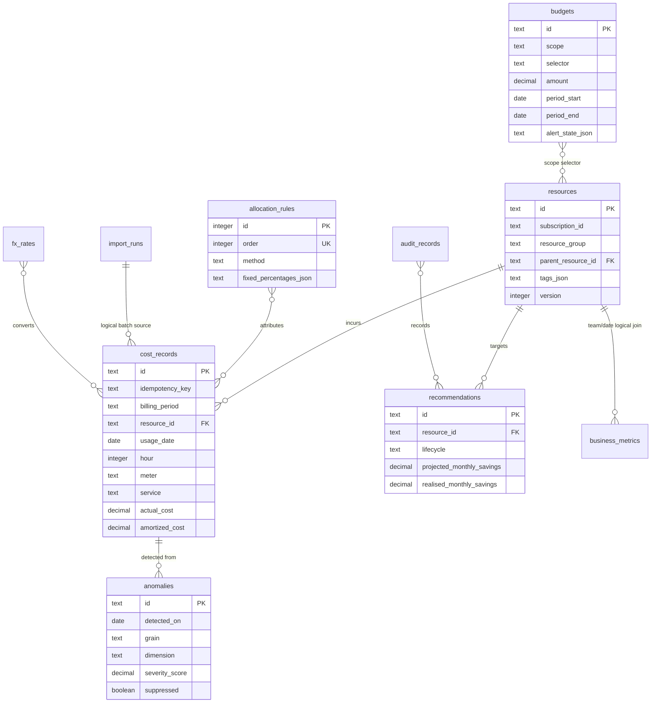

# Database Schema

The default store is a local SQLite file. It is intentionally sufficient for a repeatable portfolio demonstration; a production implementation would retain this write model but publish daily rollups to a warehouse/columnar analytical store.

## Tables and constraints

| Table | Purpose | Keys / integrity |
|---|---|---|
| `resources` | Provider-style inventory and parent relationship | PK `id`; parent ID is a logical self-reference to permit provider imports in any order |
| `cost_records` | Daily/hourly consumption and actual/amortised costs | PK `id`; unique `(billing_period, resource_id, meter, usage_date, hour)` enforces idempotent import/restatement |
| `fx_rates` | USD-to-reporting-currency rate table | PK `id`; unique date/from/to tuple |
| `allocation_rules` | Ordered allocation configuration | PK `id`; unique `order` |
| `budgets` | Scope selector and period/threshold state | PK `id` |
| `anomalies` | Detected, acknowledged and suppressed signals | PK `id`; deterministic grain/dimension/date ID |
| `recommendations` | Evidence, projected savings, lifecycle, realised savings | PK `id` |
| `business_metrics` | Orders, tenants, GB processed by team/day | PK deterministic `id`; unique `(date, team)` |
| `import_runs` | Insert/restate/reject import summary | PK `id` |
| `audit_records` | Append-only mutation evidence | PK `id`; application code does not expose update/delete |

## Indexes for high-cardinality queries

| Index | Query path supported |
|---|---|
| `cost_records(billing_period, resource_id, meter, usage_date, hour)` unique | import replay and restated day correction |
| `cost_records(usage_date, service)` | date/service breakdown |
| `cost_records(resource_id, usage_date)` | resource timelines, parent roll-up, recommendations |
| `cost_records(billing_period)` | invoice-period drill-down |
| `resources(subscription_id, resource_group)` | mapping-rule lookup/inventory filters |
| `resources(parent_resource_id)` | parent-child traversal |
| `anomalies(detected_on, grain, dimension)` and `(suppressed, acknowledged)` | incident feed and triage |
| `recommendations(lifecycle, type)` and `(resource_id)` | backlog and verification |
| `business_metrics(date, team)` unique | unit-economics join |

## Rollup strategy
The reference implementation intentionally aggregates selected rows in memory to preserve exact decimal calculations over SQLite. It defaults APIs to a 31-day range and caps pages. At production scale, write `daily_cost_rollup(date, subscription, team, service, environment, cost_basis, amount)` and `resource_daily_cost_rollup(date, resource_id, amount, usage)` in the same idempotent import transaction, index their group-by keys, and retain the immutable provider-detail ledger for audit. Allocation versions should be stored with each rollup once rule changes must be historically reproducible.

## Numeric representation
Domain calculations use `decimal`; EF maps demonstration decimals through SQLite-compatible storage. The allocation invariant is enforced before response construction and tests use exact decimal equality. A production ledger with stronger accounting requirements would store currency minor units as integers alongside ISO currency metadata.
